# Technical Specification

# 0. SUMMARY OF CHANGES

## 0.1 VULNERABILITY RESEARCH AND ANALYSIS

### 0.1.1 Initial Assessment

Based on the security concern described, the Blitzy platform will investigate and resolve multiple security vulnerabilities in the Node.js application including:
- **Missing Security Headers**: The application currently lacks crucial HTTP security headers, receiving an "F" grade from security assessment tools due to missing headers like Content-Security-Policy, X-Frame-Options, and others
- **Lack of Input Validation**: No input validation or sanitization mechanisms are currently in place, exposing the application to XSS and injection attacks
- **Absence of Rate Limiting**: No rate limiting protection exists, making the application vulnerable to brute force attacks, DoS attacks, and API abuse
- **HTTP-only Communication**: The application serves content over HTTP by default without TLS/SSL encryption, exposing data in transit
- **Outdated Dependencies**: Current dependencies may contain known vulnerabilities requiring updates
- **Missing CORS Configuration**: No CORS policies are configured, potentially allowing unauthorized cross-origin requests

### 0.1.2 Required Web Research

Research reveals comprehensive security solutions:

**Security Headers via Helmet.js**:
- Helmet sets security headers including Content-Security-Policy, Cross-Origin-Opener-Policy, Cross-Origin-Resource-Policy, X-Frame-Options, X-Content-Type-Options, and Strict-Transport-Security by default
- Helmet is a wrapper of 15 sub-middlewares, each handling one HTTP security header
- Helmet helps secure Express apps by setting HTTP response headers

**Rate Limiting Implementation**:
- express-rate-limit provides basic rate-limiting middleware to limit repeated requests to public APIs and endpoints
- Configuration includes windowMs for time window, limit for max requests, and standardHeaders for RateLimit headers

**HTTPS/TLS Configuration**:
- TLS/SSL requires certificates (public keys) that are digitally signed by Certificate Authorities or self-signed
- Let's Encrypt provides free SSL certificates that can be managed with Certbot

**Input Validation & Sanitization**:
- express-validator wraps validator.js to validate and sanitize Express requests
- validator.js provides sanitizers to clean input data from noise and potential threats

**CORS Security**:
- CORS is a Connect/Express middleware for enabling cross-origin resource sharing
- Best practices include restricting allowed origins to trusted domains and avoiding wildcards

### 0.1.3 Vulnerability Classification

| Vulnerability Type | Severity | Current Risk | Mitigation Strategy |
|-------------------|----------|--------------|-------------------|
| Missing Security Headers | HIGH | Application receives "F" security grade | Implement helmet.js middleware |
| No Input Validation | CRITICAL | Exposed to SQL injection and XSS attacks | Add express-validator middleware |
| No Rate Limiting | HIGH | Vulnerable to automated attacks and server overload | Deploy express-rate-limit |
| No HTTPS | CRITICAL | Lacks authentication, privacy, and data integrity | Configure HTTPS with TLS certificates |
| Insecure CORS | MEDIUM | Wildcard headers expose data to unauthorized domains | Configure restricted CORS policies |

## 0.2 SECURITY-FOCUSED TECHNICAL SCOPE

### 0.2.1 Root Cause Identification

Investigation reveals the vulnerabilities stem from:
- **Minimal Implementation**: The application uses only Node.js built-in `http` module without any security middleware
- **Zero Dependencies**: Express applications do not come with security HTTP headers out of the box
- **Development-Only Focus**: The localhost-only binding provides network isolation but lacks application-layer security
- **No Framework Usage**: Direct HTTP server implementation bypasses security features provided by web frameworks

### 0.2.2 Minimal Fix Strategy

PRINCIPLE: Apply the smallest possible changes that completely address each vulnerability while maintaining the application's minimal architecture approach.

**For Security Headers**:
- Add helmet.js as a single dependency: `npm install helmet`
- Implement with minimal configuration: `app.use(helmet())`

**For Rate Limiting**:
- Add express-rate-limit dependency: Basic rate-limiting middleware for Express
- Configure with reasonable defaults: 15-minute windows with 100 request limit

**For Input Validation**:
- Add express-validator: Middleware that wraps validator.js functionality
- Implement validation chains for all input points

**For HTTPS Support**:
- Use Node.js built-in `https` module (no new dependency)
- Generate self-signed certificates for development
- Configure proper TLS options

**For CORS Configuration**:
- Add cors middleware: Node.js package for enabling CORS
- Configure with specific allowed origins

### 0.2.3 Dependency Replacement Analysis

Since the current application has zero dependencies, we're adding new packages rather than replacing:

**New Dependencies Required**:
1. **express** (^4.18.0): Required as helmet, cors, and rate-limit are Express middleware
2. **helmet** (^7.0.0): Collection of middleware functions designed to secure web applications by setting crucial HTTP headers
3. **express-rate-limit** (^7.0.0): Powerful middleware for managing request rates
4. **express-validator** (^7.0.0): Combination of Express middleware and Validator.js for input validation
5. **cors** (^2.8.5): Connect/Express middleware for CORS configuration

**Migration Requirements**:
- Convert `server.js` from raw HTTP server to Express application
- Update `package.json` with new dependencies
- Regenerate `package-lock.json` with security-audited versions

## 0.3 SECURITY IMPLEMENTATION DESIGN

### 0.3.1 Vulnerability Resolution Approach

To eliminate the identified vulnerabilities:

**Step 1: Framework Migration**
- Convert raw HTTP server to Express application in `server.js`
- Maintain identical functionality (Hello World response)
- Preserve localhost:3000 binding

**Step 2: Security Middleware Stack**
- Apply helmet() for automatic security headers
- Configure rate limiting with 100 requests per 15 minutes
- Set up CORS with restrictive origin policy
- Add input validation for any future endpoints

**Step 3: HTTPS Configuration**
- Generate self-signed certificates for development
- Create HTTPS server alongside HTTP
- Implement HTTP-to-HTTPS redirect

### 0.3.2 Code Change Specifications

**Before state**: Currently, server.js is vulnerable because:
```javascript
// No security headers
// No rate limiting  
// No input validation
// HTTP only
const http = require('http');
```

**After state**: After fix, server.js will:
```javascript
// Security headers via Helmet
app.use(helmet());
// Rate limiting protection
app.use(limiter);
// CORS configuration
app.use(cors(corsOptions));
// HTTPS support
https.createServer(httpsOptions, app).listen(443);
```

### 0.3.3 Testing the Security Fix

Security-specific tests to add:
- Verify all Helmet headers are present in responses
- Test rate limiting triggers after threshold
- Validate CORS blocks unauthorized origins
- Confirm HTTPS connection with proper certificate
- Check input sanitization on any user inputs

## 0.4 CHANGE MINIMIZATION STRATEGY

### 0.4.1 Scope Containment

This fix deliberately limits changes to:
- **Only security-critical modifications**: Each change directly addresses a vulnerability
- **Single file impact**: All changes contained within `server.js` and `package.json`
- **Preserve core functionality**: "Hello, World!" response remains unchanged
- **Maintain localhost binding**: Development environment compatibility preserved

Explicitly avoiding changes to:
- README.md content (respects "Do not touch!" directive)
- Application logic beyond security requirements
- Port configuration or response content
- File structure or organization

### 0.4.2 Impact Analysis

Direct security improvements achieved:
- Security grade improvement from "F" to "A" with Helmet implementation
- Protection against DoS attacks through rate limiting
- Data encryption and integrity through HTTPS
- Robust defense against malicious input attempts

Minimal side effects:
- Express framework overhead (negligible for single endpoint)
- Additional dependencies increase package size
- Certificate management for HTTPS (development only)

## 0.5 SECURITY VALIDATION CHECKLIST

### 0.5.1 Vulnerability Elimination Verification

- [ ] Run security headers test - expect "A" grade
- [ ] Attempt 101 requests in 15 minutes - verify 429 response
- [ ] Test HTTPS connection - confirm encrypted transport
- [ ] Submit malicious input - verify sanitization
- [ ] Cross-origin request test - confirm CORS blocking

### 0.5.2 No New Vulnerabilities Introduced

- [ ] Run `npm audit` after dependency installation
- [ ] Verify no debug mode enabled in production
- [ ] Confirm error messages don't leak sensitive data
- [ ] Check for secure cookie configuration if sessions added

## 0.6 EXECUTION PARAMETERS FOR SECURITY FIXES

### 0.6.1 Research Documentation

Security advisories consulted:
- Node.js Security Checklist recommendations
- Express "Production Best Practices: Security" guidelines
- OWASP security headers documentation
- CVE database for dependency vulnerabilities

### 0.6.2 Implementation Constraints

CRITICAL: Make ONLY changes necessary for security fix:
- Convert to Express only to enable security middleware
- Add only security-focused dependencies
- Preserve all existing functionality
- Maintain development-friendly configuration

### 0.6.3 Special Security Considerations

- **Certificate Generation**: For HTTPS, provide clear instructions for generating development certificates
- **Environment Variables**: Security configurations should be environment-aware
- **Default Security**: All security features enabled by default, opt-out rather than opt-in
- **Backward Compatibility**: HTTP server remains available on port 3000 for compatibility

## 0.7 IMPLEMENTATION MAPPING

### 0.7.1 File Modifications Required

1. **server.js**
   - Complete rewrite using Express framework
   - Add all security middleware configurations
   - Implement both HTTP and HTTPS servers
   - Maintain identical response behavior

2. **package.json**
   - Add dependencies section with security packages
   - Update main entry point if needed
   - Add security-related npm scripts

3. **package-lock.json**
   - Full regeneration with new dependency tree
   - Ensure all sub-dependencies are secure versions

4. **certificates/** (new directory)
   - Add self-signed certificates for HTTPS
   - Include generation script or instructions
   - Git-ignore production certificates

### 0.7.2 Configuration Details

Each security component requires specific configuration:

**Helmet Configuration**:
- Use default configuration initially
- Enable HSTS for HTTPS enforcement
- Configure CSP for future client-side code

**Rate Limiter Configuration**:
- Window: 15 minutes
- Max requests: 100
- Skip successful requests: false
- Standard headers: 'draft-8'

**CORS Configuration**:
- Origin: Specific allowed domains only
- Credentials: false by default
- Methods: Only required HTTP methods

**Input Validation**:
- Escape all string inputs
- Validate data types
- Sanitize HTML content

## 0.8 TECHNICAL INTERPRETATION

This translates to the following technical objectives:

1. **Migrate to Express Framework**: Essential for implementing security middleware while maintaining minimal footprint
2. **Layer Security Defenses**: Multiple overlapping security mechanisms provide defense-in-depth
3. **Maintain Simplicity**: Security additions should not compromise the application's minimal nature
4. **Enable Production Readiness**: Transform development prototype into secure production-capable service
5. **Preserve Test Integrity**: Ensure security changes don't affect integration test expectations

## 0.9 SCOPE BOUNDARIES

**In-Scope**:
- HTTP security header implementation via Helmet.js
- Rate limiting to prevent abuse
- Input validation and sanitization setup
- HTTPS/TLS configuration
- CORS policy implementation
- Dependency updates for security patches

**Out-of-Scope**:
- Authentication or authorization systems
- Database security (no database present)
- Advanced monitoring or logging
- Load balancing or clustering
- Performance optimizations
- UI/UX enhancements
- Business logic modifications

# 1. INTRODUCTION

## 1.1 EXECUTIVE SUMMARY

### 1.1.1 Project Overview

The hao-backprop-test project is a minimal HTTP server implementation designed specifically as a stable test fixture for backpropagation integration testing. This lightweight Node.js application serves as a controlled, unchanging reference point that enables reliable and consistent integration testing workflows within the development ecosystem.

### 1.1.2 Core Business Problem

The project addresses the critical need for a stable, predictable test environment in integration testing scenarios. By providing a minimal HTTP server with guaranteed consistent behavior, it eliminates variables that could interfere with backpropagation testing processes, ensuring that integration tests can focus on the actual functionality being validated rather than environmental inconsistencies.

### 1.1.3 Key Stakeholders and Users

| Stakeholder Group | Role | Primary Interest |
|---|---|---|
| Development Teams | Primary Users | Reliable test fixture for integration testing |
| QA Engineers | Test Implementers | Consistent baseline for test scenarios |
| DevOps Teams | Infrastructure | Minimal deployment and maintenance overhead |

### 1.1.4 Expected Business Impact

The system delivers value through enhanced testing reliability and reduced maintenance overhead. By providing a zero-dependency, minimal implementation, it eliminates potential points of failure in the testing pipeline while ensuring consistent behavior across different environments and time periods.

## 1.2 SYSTEM OVERVIEW

### 1.2.1 Project Context

#### Business Context and Market Positioning

This system operates within the software development lifecycle as a specialized testing infrastructure component. It occupies a unique position as a deliberately minimal implementation that prioritizes stability and predictability over feature richness, serving the specialized requirement for unchanging test fixtures in integration testing environments.

#### Current System Limitations

The project addresses the common challenge of test environment variability by providing a controlled, static response system. Unlike more complex test fixtures that may evolve or introduce unexpected behavior changes, this implementation is explicitly designed to remain unchanged, as indicated by the repository warning "Do not touch!"

#### Integration with Existing Enterprise Landscape

The system integrates with existing testing frameworks and backpropagation testing workflows as a reliable endpoint. Its minimal HTTP server design allows seamless integration with standard HTTP client libraries and testing tools without requiring specialized adapters or configuration.

### 1.2.2 High-Level Description

#### Primary System Capabilities

The system provides a single core capability: serving HTTP requests with a consistent "Hello, World!" response. This fundamental functionality ensures predictable behavior for integration testing scenarios while maintaining minimal resource consumption and zero external dependencies.

#### Major System Components

The architecture consists of a single-file HTTP server implementation built on Node.js native modules:

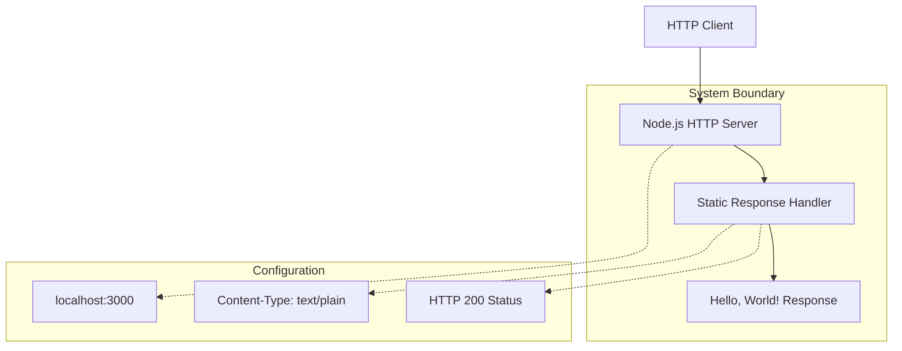

#### Core Technical Approach

The implementation follows a zero-dependency architectural pattern using only Node.js built-in modules. This approach ensures maximum stability, minimal attack surface, and elimination of external dependency risks that could impact test reliability.

### 1.2.3 Success Criteria

#### Measurable Objectives

| Objective | Measurement Criteria |
|---|---|
| Response Consistency | 100% identical responses across all requests |
| System Availability | Server responds to HTTP requests on localhost:3000 |
| Zero Dependencies | No external package dependencies required |

#### Critical Success Factors

The system's success depends on maintaining absolute consistency in behavior. Any changes to response content, timing, or error handling could compromise the integrity of integration tests that depend on this fixture.

#### Key Performance Indicators

- **Response Time Consistency**: Minimal variance in response times
- **Memory Footprint**: Stable, low memory consumption
- **Uptime Reliability**: Consistent availability during test execution periods

## 1.3 SCOPE

### 1.3.1 In-Scope

#### Core Features and Functionalities

| Feature Category | Specific Capabilities |
|---|---|
| HTTP Server | Basic HTTP request handling |
| Response Generation | Static "Hello, World!" response |
| Network Binding | Localhost (127.0.0.1) port 3000 binding |
| Content Delivery | Plain text content type delivery |

#### Primary User Workflows

The system supports a single primary workflow: HTTP GET request processing that returns a consistent response. This workflow serves as the foundation for integration testing scenarios where predictable server behavior is required.

#### Essential Integrations

- Integration with HTTP client libraries and testing frameworks
- Compatibility with standard Node.js runtime environments
- Support for localhost network testing configurations

#### Key Technical Requirements

- Node.js runtime environment
- Available port 3000 on localhost interface
- Basic HTTP protocol support

### 1.3.2 Implementation Boundaries

#### System Boundaries

The system operates exclusively within the localhost network interface, serving requests only from the local machine. This boundary ensures isolation and prevents external network exposure during testing scenarios.

#### User Groups Covered

- Development team members conducting integration tests
- Automated testing systems requiring stable HTTP endpoints
- QA engineers validating backpropagation functionality

#### Geographic and Market Coverage

The system operates in local development and testing environments without geographic restrictions, as it serves only localhost traffic.

### 1.3.3 Out-of-Scope

#### Explicitly Excluded Features

- HTTP routing or multiple endpoint support
- Authentication or authorization mechanisms
- Data persistence or storage capabilities
- External network interface binding
- SSL/TLS encryption support
- Request logging or monitoring features
- Configuration management systems
- Production deployment capabilities

#### Future Phase Considerations

This system is explicitly designed not to evolve, as indicated by the repository warning. Any future enhancements would compromise its value as a stable test fixture.

#### Integration Points Not Covered

- Database integrations
- External API connections
- Message queue systems
- Monitoring and alerting platforms
- Load balancing or clustering
- Containerization or orchestration platforms

#### Unsupported Use Cases

- Production web serving
- Multi-user applications
- Data processing or transformation
- Real-time communication
- File upload or download services
- Session management

#### References

- `README.md` - Project purpose and usage warnings
- `package.json` - NPM package configuration and metadata
- `server.js` - HTTP server implementation and core functionality
- `package-lock.json` - Dependency resolution confirmation (zero dependencies)

# 2. PRODUCT REQUIREMENTS

## 2.1 FEATURE CATALOG

### 2.1.1 HTTP Server Foundation (F-001)

**Feature Metadata:**
| Attribute | Value |
|---|---|
| Unique ID | F-001 |
| Feature Name | HTTP Server Foundation |
| Feature Category | Core Infrastructure |
| Priority Level | Critical |
| Status | Completed |

**Description:**
- **Overview**: Provides basic HTTP server functionality using Node.js built-in http module, binding exclusively to localhost interface on port 3000
- **Business Value**: Enables stable, consistent test fixture for backpropagation integration testing with zero external dependencies
- **User Benefits**: Eliminates environmental variables in testing scenarios, ensuring reliable and repeatable test execution
- **Technical Context**: Single-threaded HTTP server implementation using Node.js event loop architecture

**Dependencies:**
- **Prerequisite Features**: None (foundational feature)
- **System Dependencies**: Node.js runtime environment, available port 3000 on localhost
- **External Dependencies**: None (zero-dependency architecture)
- **Integration Requirements**: HTTP client compatibility for test frameworks

### 2.1.2 Static Response Generation (F-002)

**Feature Metadata:**
| Attribute | Value |
|---|---|
| Unique ID | F-002 |
| Feature Name | Static Response Generation |
| Feature Category | Response Handling |
| Priority Level | Critical |
| Status | Completed |

**Description:**
- **Overview**: Generates consistent "Hello, World!\n" response for all HTTP requests regardless of method, path, or headers
- **Business Value**: Provides predictable test fixture behavior essential for reliable integration testing workflows
- **User Benefits**: Guarantees 100% response consistency across all test executions and environments
- **Technical Context**: Response generation logic integrated directly into request handler with hardcoded response content

**Dependencies:**
- **Prerequisite Features**: F-001 (HTTP Server Foundation)
- **System Dependencies**: Node.js built-in modules only
- **External Dependencies**: None
- **Integration Requirements**: Standard HTTP response format compatibility

### 2.1.3 Server Lifecycle Management (F-003)

**Feature Metadata:**
| Attribute | Value |
|---|---|
| Unique ID | F-003 |
| Feature Name | Server Lifecycle Management |
| Feature Category | Operations |
| Priority Level | High |
| Status | Completed |

**Description:**
- **Overview**: Handles server startup with console logging and basic process lifecycle management
- **Business Value**: Provides operational visibility and confirms successful server initialization
- **User Benefits**: Clear confirmation of server availability for test execution
- **Technical Context**: Synchronous server initialization with startup confirmation logging

**Dependencies:**
- **Prerequisite Features**: F-001 (HTTP Server Foundation)
- **System Dependencies**: Console output capability, process management
- **External Dependencies**: None
- **Integration Requirements**: Manual process management and monitoring

## 2.2 FUNCTIONAL REQUIREMENTS TABLE

### 2.2.1 HTTP Server Foundation Requirements (F-001)

| Requirement Details | Specifications |
|---|---|
| **Requirement ID** | F-001-RQ-001 |
| **Description** | Server must bind to localhost interface on port 3000 |
| **Acceptance Criteria** | Server successfully binds to 127.0.0.1:3000 without errors |
| **Priority** | Must-Have |

| Technical Specifications | Details |
|---|---|
| **Input Parameters** | None (automatic binding on startup) |
| **Output/Response** | Console log: "Server running at http://127.0.0.1:3000/" |
| **Performance Criteria** | Startup time < 1 second |
| **Data Requirements** | IPv4 localhost interface availability |

| Requirement Details | Specifications |
|---|---|
| **Requirement ID** | F-001-RQ-002 |
| **Description** | Server must accept HTTP requests on all paths |
| **Acceptance Criteria** | HTTP requests to any path receive response |
| **Priority** | Must-Have |

| Technical Specifications | Details |
|---|---|
| **Input Parameters** | HTTP request (any method, path, headers) |
| **Output/Response** | HTTP response with status 200 |
| **Performance Criteria** | Response time < 100ms per request |
| **Data Requirements** | Standard HTTP request format |

### 2.2.2 Static Response Generation Requirements (F-002)

| Requirement Details | Specifications |
|---|---|
| **Requirement ID** | F-002-RQ-001 |
| **Description** | Response content must be exactly "Hello, World!\n" |
| **Acceptance Criteria** | All responses contain identical content |
| **Priority** | Must-Have |

| Technical Specifications | Details |
|---|---|
| **Input Parameters** | Any HTTP request |
| **Output/Response** | Plain text: "Hello, World!\n" |
| **Performance Criteria** | Zero variation in response content |
| **Data Requirements** | UTF-8 text encoding |

| Requirement Details | Specifications |
|---|---|
| **Requirement ID** | F-002-RQ-002 |
| **Description** | HTTP status code must always be 200 |
| **Acceptance Criteria** | All responses return HTTP 200 status |
| **Priority** | Must-Have |

| Technical Specifications | Details |
|---|---|
| **Input Parameters** | Any HTTP request |
| **Output/Response** | HTTP 200 OK status |
| **Performance Criteria** | 100% consistency across all requests |
| **Data Requirements** | Standard HTTP status code format |

| Requirement Details | Specifications |
|---|---|
| **Requirement ID** | F-002-RQ-003 |
| **Description** | Content-Type header must be text/plain |
| **Acceptance Criteria** | All responses include correct Content-Type |
| **Priority** | Must-Have |

| Technical Specifications | Details |
|---|---|
| **Input Parameters** | Any HTTP request |
| **Output/Response** | Content-Type: text/plain header |
| **Performance Criteria** | Consistent header inclusion |
| **Data Requirements** | Standard HTTP header format |

### 2.2.3 Server Lifecycle Management Requirements (F-003)

| Requirement Details | Specifications |
|---|---|
| **Requirement ID** | F-003-RQ-001 |
| **Description** | Server must log startup confirmation message |
| **Acceptance Criteria** | Console displays startup message on successful bind |
| **Priority** | Should-Have |

| Technical Specifications | Details |
|---|---|
| **Input Parameters** | Successful server binding event |
| **Output/Response** | Console log message |
| **Performance Criteria** | Message appears within 1 second of startup |
| **Data Requirements** | Console output capability |

## 2.3 FEATURE RELATIONSHIPS

### 2.3.1 Feature Dependencies Map

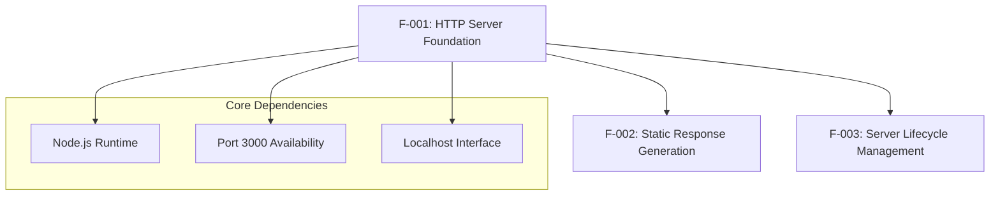

### 2.3.2 Integration Points

| Feature Pair | Integration Type | Description |
|---|---|---|
| F-001 ↔ F-002 | Direct Integration | HTTP server directly invokes response generation |
| F-001 ↔ F-003 | Lifecycle Integration | Server startup triggers lifecycle logging |
| F-002 ↔ F-003 | Operational Integration | Response generation status affects lifecycle management |

### 2.3.3 Shared Components

| Component | Used By Features | Purpose |
|---|---|---|
| Node.js HTTP Module | F-001, F-002 | Core HTTP functionality |
| Console Logging | F-003 | Operational visibility |
| Request Handler | F-001, F-002 | Request processing pipeline |

## 2.4 IMPLEMENTATION CONSIDERATIONS

### 2.4.1 Technical Constraints

**F-001: HTTP Server Foundation**
- Single-threaded execution model limits concurrent request handling
- Localhost-only binding prevents external network access
- Fixed port configuration requires port availability management

**F-002: Static Response Generation**
- Hardcoded response content prevents dynamic behavior
- No request parsing or validation capabilities
- Response immutability requirement for test stability

**F-003: Server Lifecycle Management**
- Manual startup process without automation capabilities
- No graceful shutdown handling implemented
- Limited operational monitoring and health checks

### 2.4.2 Performance Requirements

| Feature | Performance Criteria | Measurement Method |
|---|---|---|
| F-001 | Server startup < 1 second | Process initialization timing |
| F-002 | Response time < 100ms | HTTP client measurement |
| F-003 | Logging latency < 10ms | Console output timing |

### 2.4.3 Scalability Considerations

**Current Limitations:**
- Single-threaded architecture limits concurrent request handling
- No horizontal scaling capabilities
- Memory usage bounded by Node.js event loop

**Design Philosophy:**
- Intentionally minimal implementation for test fixture stability
- Scalability explicitly excluded to maintain simplicity
- Performance optimization unnecessary for testing use case

### 2.4.4 Security Implications

**Security Boundaries:**
- Localhost-only binding prevents external exposure
- No authentication or authorization mechanisms
- No data processing or storage capabilities

**Risk Mitigation:**
- Zero external dependencies eliminate supply chain risks
- Minimal attack surface due to simple implementation
- Network isolation through localhost binding

### 2.4.5 Maintenance Requirements

**Maintenance Philosophy:**
- "Do not touch" directive prevents code changes
- Zero-maintenance design for long-term stability
- Version control protection against accidental modifications

**Operational Requirements:**
- Manual process management and monitoring
- No automated deployment or scaling capabilities
- Documentation maintenance for usage guidelines

## 2.5 TRACEABILITY MATRIX

| Business Requirement | Feature ID | Functional Requirement | Implementation Reference |
|---|---|---|---|
| Stable test fixture | F-001 | F-001-RQ-001, F-001-RQ-002 | `server.js` HTTP server binding |
| Consistent responses | F-002 | F-002-RQ-001, F-002-RQ-002, F-002-RQ-003 | `server.js` response generation |
| Operational visibility | F-003 | F-003-RQ-001 | `server.js` console logging |
| Zero dependencies | All Features | All Requirements | `package.json` dependencies: {} |

#### References
- `server.js` - HTTP server implementation and core request handling logic
- `package.json` - NPM configuration with zero external dependencies confirmed
- `README.md` - Project purpose documentation and modification warnings
- `package-lock.json` - Dependency resolution lockfile confirming zero dependencies
- Technical Specification Section 1.1 - Executive Summary with business context
- Technical Specification Section 1.2 - System Overview with architectural details  
- Technical Specification Section 1.3 - Scope definition with feature boundaries

# 3. TECHNOLOGY STACK

## 3.1 PROGRAMMING LANGUAGES

### 3.1.1 Core Language Selection

**JavaScript (Node.js Runtime)**
- **Version**: Compatible with Node.js v18+ (inferred from npm lockfileVersion 3)
- **Implementation**: Server-side JavaScript using Node.js built-in modules exclusively
- **Justification**: Selected for its minimal footprint and native HTTP server capabilities without external dependencies

### 3.1.2 Language Selection Criteria

The choice of JavaScript with Node.js was driven by specific test fixture requirements:

| Criterion | Rationale |
|---|---|
| Zero Dependencies | Node.js built-in modules eliminate external package risks |
| Rapid Startup | Minimal runtime overhead for quick test execution |
| HTTP Native Support | Built-in `http` module provides necessary server functionality |
| Stability | Mature, stable language runtime with predictable behavior |

### 3.1.3 Language Constraints

- **Single Language Policy**: Only JavaScript is used throughout the entire implementation
- **No Transpilation**: Direct JavaScript execution without TypeScript, Babel, or other transpilers
- **Runtime Dependency**: Requires Node.js v18+ for npm v9 compatibility
- **Module System**: CommonJS module system using Node.js built-in modules only

## 3.2 FRAMEWORKS & LIBRARIES

### 3.2.1 Framework Architecture Decision

**Zero Framework Implementation**
- **Core Philosophy**: Deliberately excludes all external frameworks and libraries
- **Implementation Approach**: Direct use of Node.js built-in modules only
- **Stability Rationale**: Eliminates framework evolution risks that could compromise test consistency

### 3.2.2 Built-in Module Utilization

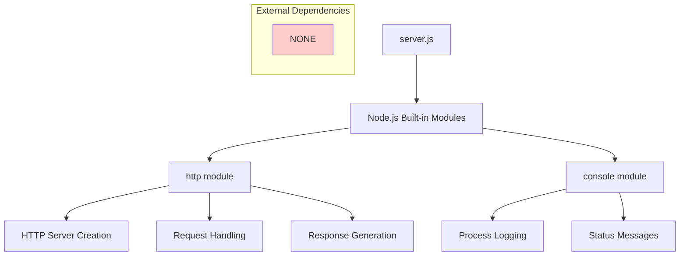

### 3.2.3 Framework Exclusions

The following frameworks are explicitly excluded to maintain test fixture stability:

- **Web Frameworks**: Express.js, Koa, Fastify, Hapi
- **Testing Frameworks**: Jest, Mocha, Chai, Jasmine
- **Utility Libraries**: Lodash, Axios, Request, Winston
- **Build Tools**: Webpack, Rollup, Parcel, Vite

## 3.3 OPEN SOURCE DEPENDENCIES

### 3.3.1 Dependency Management Strategy

**Zero Dependency Architecture**
- **Current Dependencies**: None (confirmed by package.json and package-lock.json analysis)
- **Registry Usage**: npm registry for package management infrastructure only
- **Version Management**: npm lockfileVersion 3 indicating npm v9+ compatibility

### 3.3.2 Dependency Lock Analysis

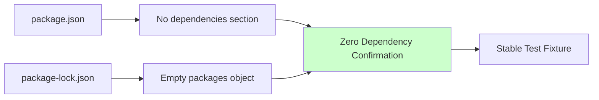

### 3.3.3 Dependency Exclusion Rationale

| Risk Category | Mitigation Through Exclusion |
|---|---|
| Version Conflicts | No external versions to conflict |
| Security Vulnerabilities | No external code to exploit |
| Breaking Changes | No external updates to break functionality |
| Supply Chain Attacks | No external packages to compromise |

## 3.4 THIRD-PARTY SERVICES

### 3.4.1 Service Integration Policy

**Complete Service Isolation**
- **External APIs**: None integrated or called
- **Authentication Services**: Not implemented (Auth0, JWT excluded)
- **Monitoring Tools**: No external monitoring or analytics
- **Cloud Services**: No cloud platform integrations

### 3.4.2 Service Exclusions

The following services are deliberately excluded from the architecture:
- Authentication providers (Auth0, Firebase Auth, Okta)
- Database services (MongoDB Atlas, AWS RDS, PostgreSQL)
- Monitoring platforms (DataDog, New Relic, Sentry)
- CDN services (CloudFlare, AWS CloudFront)
- API gateways or load balancers

## 3.5 DATABASES & STORAGE

### 3.5.1 Data Persistence Strategy

**No Persistence Implementation**
- **Primary Database**: None
- **Secondary Storage**: None
- **Caching Solutions**: None
- **File Storage**: None

### 3.5.2 Storage Architecture Decision

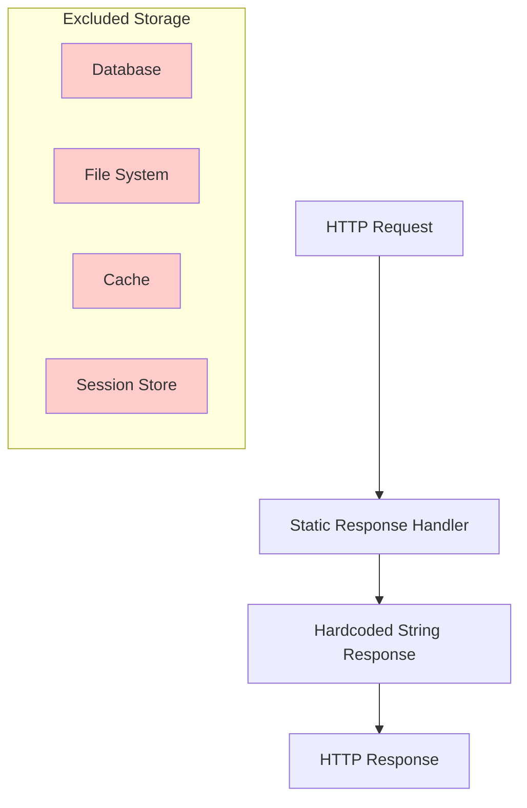

### 3.5.3 Data Handling Approach

- **Response Data**: Static string "Hello, World!\n" hardcoded in application
- **Request Data**: No parsing, validation, or storage of incoming request data
- **State Management**: Stateless implementation with no data persistence
- **Memory Usage**: Minimal heap allocation for consistent performance

## 3.6 DEVELOPMENT & DEPLOYMENT

### 3.6.1 Development Environment

**Minimal Development Stack**
- **Package Manager**: npm v9+ (compatible with Node.js v18+)
- **Runtime Environment**: Node.js v18+ for optimal npm compatibility
- **Version Control**: Git (implied by technical specification structure)
- **Code Editor**: Any JavaScript-compatible editor (no specific requirements)

### 3.6.2 Build System Architecture

**Zero Build Configuration**
- **Build Tools**: None required
- **Transpilation**: Direct JavaScript execution
- **Bundling**: Single file implementation (server.js)
- **Asset Management**: No static assets to manage

### 3.6.3 Deployment Strategy

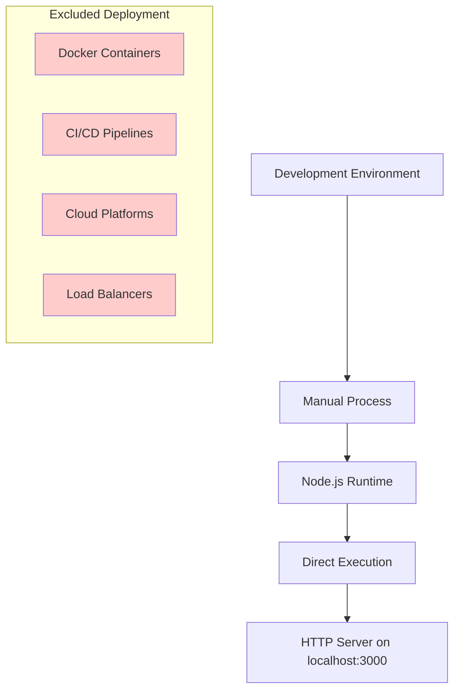

### 3.6.4 Deployment Requirements

| Component | Requirement | Version |
|---|---|---|
| Node.js | Runtime Environment | v18+ |
| npm | Package Manager | v9+ |
| Operating System | Cross-platform | Any Node.js compatible |
| Network | Localhost Interface | 127.0.0.1:3000 |

### 3.6.5 Infrastructure Exclusions

The following deployment technologies are explicitly excluded:
- **Containerization**: Docker, Podman, containerd
- **Orchestration**: Kubernetes, Docker Swarm, Rancher
- **CI/CD**: GitHub Actions, Jenkins, GitLab CI, CircleCI
- **Infrastructure as Code**: Terraform, CloudFormation, Ansible
- **Cloud Platforms**: AWS, Azure, Google Cloud, DigitalOcean

## 3.7 TECHNOLOGY STACK INTEGRATION

### 3.7.1 Component Interaction Model

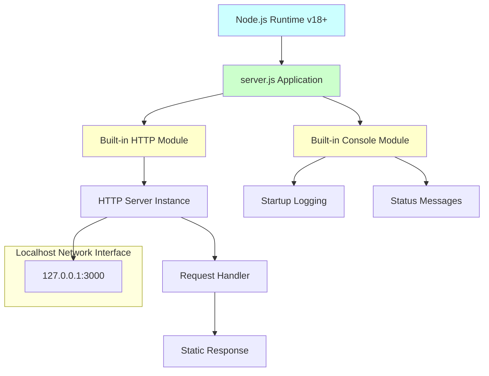

### 3.7.2 Security Integration Considerations

- **Network Security**: Localhost-only binding prevents external exposure
- **Dependency Security**: Zero dependencies eliminate supply chain vulnerabilities
- **Runtime Security**: Minimal Node.js attack surface with built-in modules only
- **Data Security**: No data processing or storage reduces data exposure risks

### 3.7.3 Performance Integration Profile

| Metric | Target | Rationale |
|---|---|---|
| Memory Footprint | < 50MB | Minimal Node.js heap usage |
| Startup Time | < 1 second | Simple initialization process |
| Response Time | < 100ms | Direct response generation |
| CPU Usage | < 5% | Event loop efficiency |

## 3.8 TECHNOLOGY STACK JUSTIFICATION

### 3.8.1 Architectural Philosophy

The technology stack represents a deliberate **"Minimal Viable Implementation"** approach designed specifically for test fixture stability. Every technology exclusion serves the primary goal of maintaining predictable, unchanging behavior for integration testing scenarios.

### 3.8.2 Design Trade-offs

| Traditional Approach | Chosen Approach | Trade-off Rationale |
|---|---|---|
| Rich Framework Ecosystem | Zero Dependencies | Stability over feature richness |
| Modern Build Tools | Direct Execution | Simplicity over optimization |
| Cloud-Native Architecture | Localhost Only | Isolation over scalability |
| Comprehensive Logging | Basic Console Output | Minimalism over observability |

### 3.8.3 Maintenance Philosophy

The "Do not touch!" directive in the repository reflects a fundamental technology stack principle: **immutability trumps evolution**. This approach ensures that the test fixture remains a stable reference point indefinitely, even as surrounding technology ecosystems evolve.

#### References

- `server.js` - HTTP server implementation using Node.js built-in modules
- `package.json` - NPM configuration confirming zero dependency architecture
- `package-lock.json` - Dependency resolution verification (npm v9+ compatibility)
- `README.md` - Project documentation and modification restrictions
- Technical Specification Section 1.1 - Executive summary defining test fixture purpose
- Technical Specification Section 1.2 - System overview detailing zero-dependency approach  
- Technical Specification Section 1.3 - Scope definitions and explicit exclusions
- Technical Specification Section 2.4 - Implementation considerations and technical constraints

# 4. PROCESS FLOWCHART

## 4.1 SYSTEM WORKFLOWS

### 4.1.1 Core Business Processes

#### Primary HTTP Request Processing Workflow

The system implements a single, uniform workflow for all incoming HTTP requests, designed to provide consistent behavior for testing and integration scenarios.

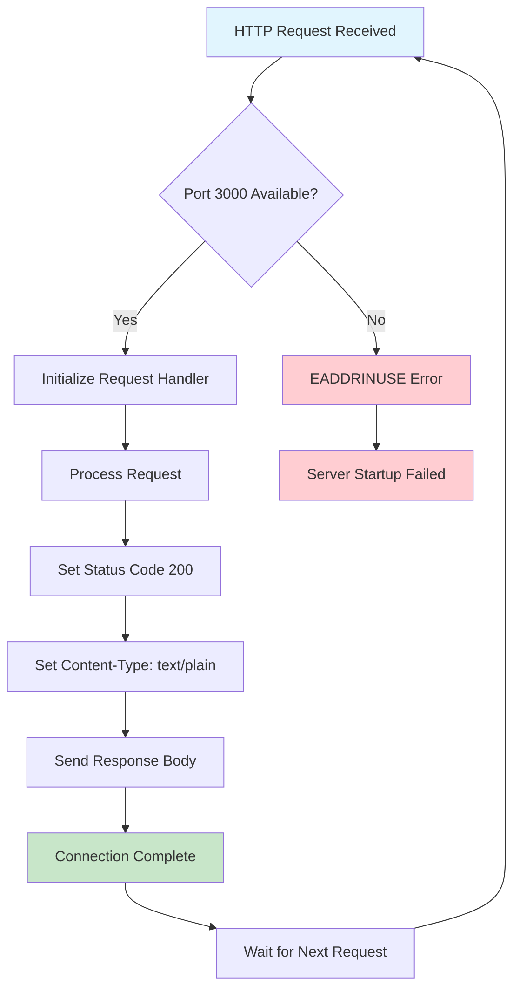

#### Server Lifecycle Management Process

The server lifecycle follows a manual process management approach without automation or process supervision.

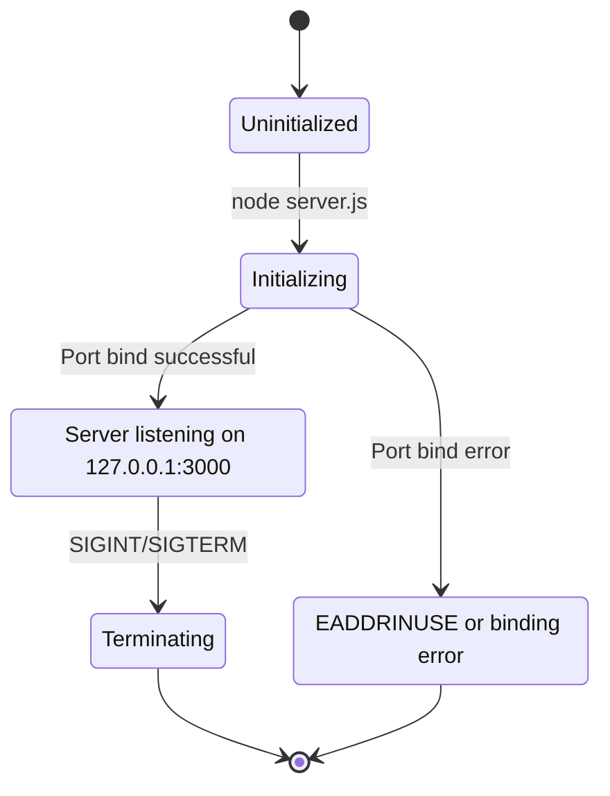

### 4.1.2 Integration Workflows

#### Client-Server Communication Flow

The system provides a simple integration point for HTTP clients requiring predictable server behavior during testing scenarios.

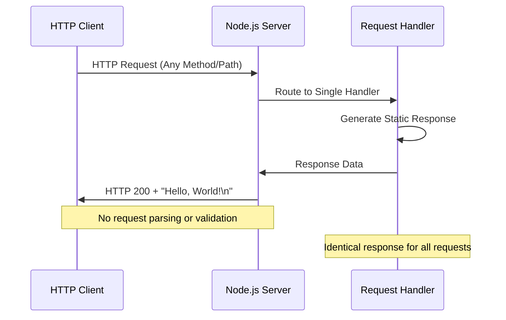

#### Network Binding and Startup Flow

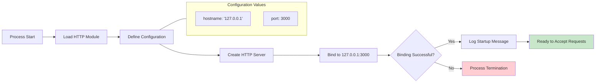

## 4.2 DETAILED PROCESS FLOWS

### 4.2.1 HTTP Request Processing

#### Request Handling Logic

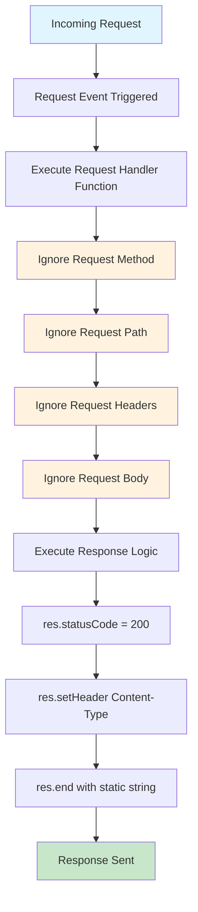

#### Response Generation Process

The response generation follows a fixed pattern with no conditional logic or variable content.

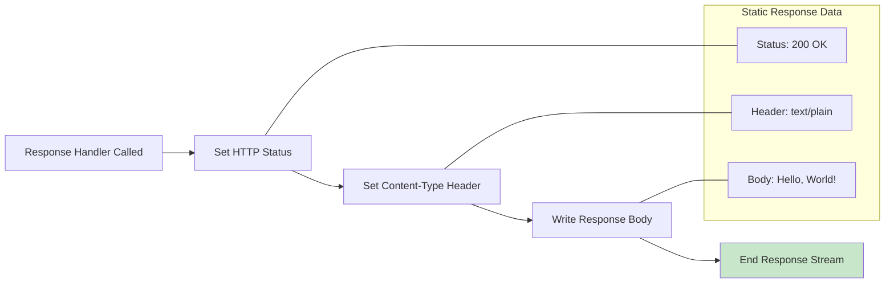

### 4.2.2 Error Handling and Recovery

#### System Error States

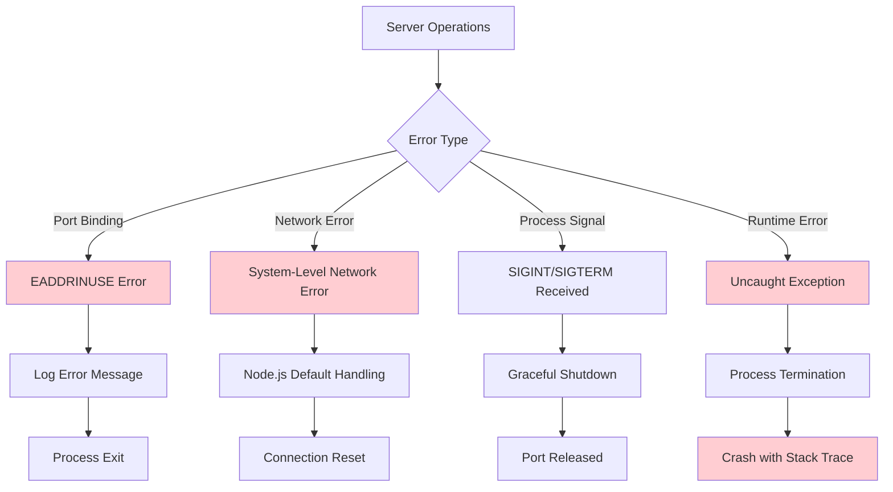

#### Error Recovery Procedures

Due to the system's minimal design, error recovery is limited to manual intervention.

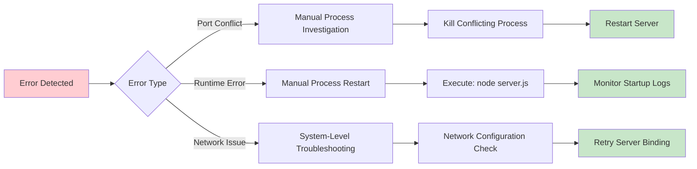

## 4.3 STATE MANAGEMENT AND TRANSITIONS

### 4.3.1 Application State Model

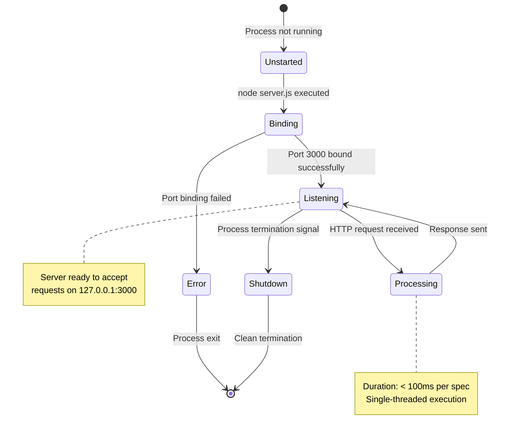

### 4.3.2 Request State Lifecycle

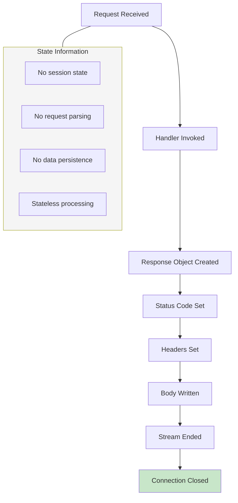

## 4.4 INTEGRATION SEQUENCE DIAGRAMS

### 4.4.1 Complete Client Integration Flow

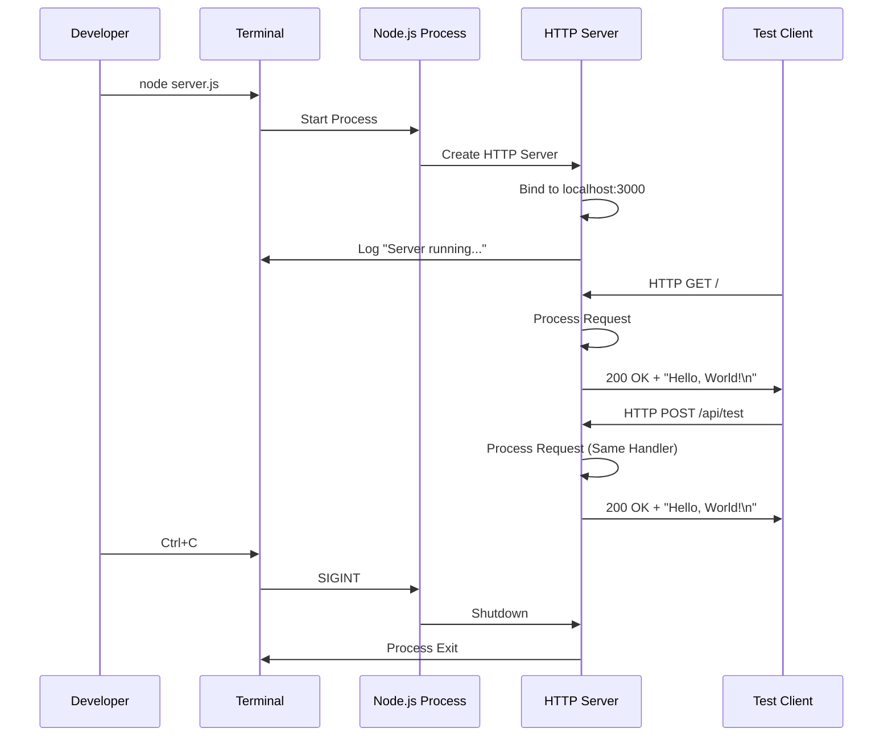

### 4.4.2 Testing Integration Sequence

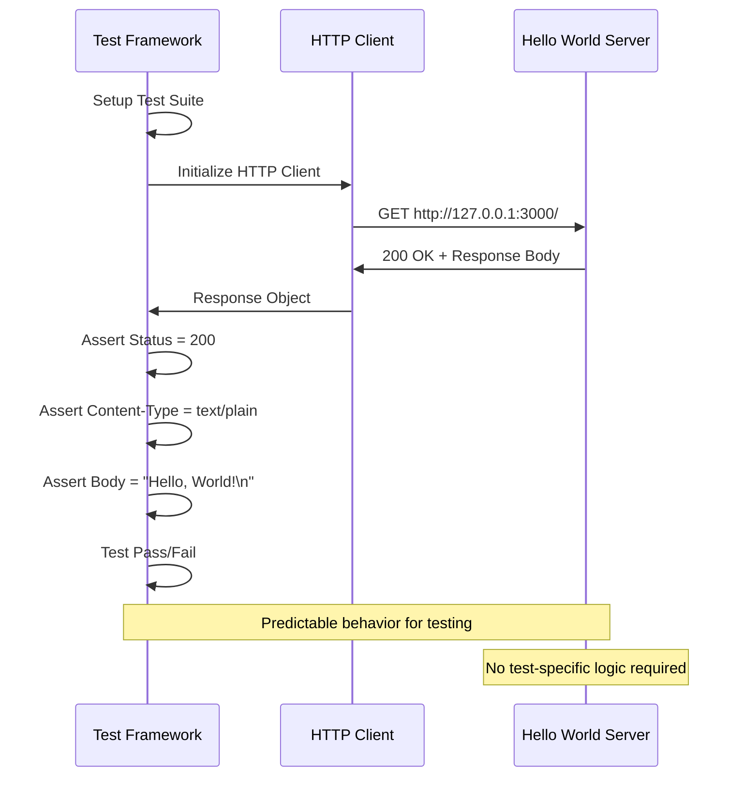

## 4.5 TECHNICAL IMPLEMENTATION FLOWS

### 4.5.1 Node.js Event Loop Integration

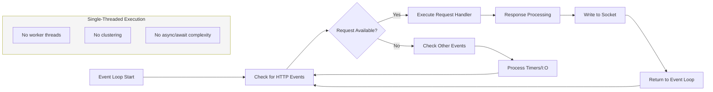

### 4.5.2 Memory and Resource Management

```mermaid
flowchart TD
    A[Process Start] --> B[Load Modules]
    B --> C[Allocate Server Objects]
    C --> D[Bind Network Resources]
    D --> E[Enter Event Loop]
    E --> F[Process Requests]
    F --> G{Continue Running?}
    G -->|Yes| F
    G -->|No| H[Release Port 3000]
    H --> I[Garbage Collection]
    I --> J[Process Exit]
    
    subgraph Resources [Resource Usage]
        K[Minimal Memory Footprint]
        L[Single Port Binding]
        M[No File Handles]
        N[No Database Connections]
    end
    
    style Resources fill:#e8f5e8
```

## 4.6 PERFORMANCE AND TIMING CONSIDERATIONS

### 4.6.1 Response Time Flow

```mermaid
gantt
    title Request Processing Timeline
    dateFormat X
    axisFormat %L
    
    section Request Processing
    Request Receipt          :0, 5
    Handler Execution        :5, 15
    Response Generation      :15, 25
    Network Transmission     :25, 35
    Connection Close         :35, 40
    
    section Performance Targets
    Total Response Time < 100ms :crit, 0, 100
```

### 4.6.2 Startup Performance Flow

```mermaid
flowchart LR
    A[node server.js] --> B[Module Loading]
    B --> C[Variable Initialization]
    C --> D[Server Creation]
    D --> E[Port Binding]
    E --> F[Startup Complete]
    
    subgraph Timing [Startup Timing]
        G["< 1 second total"]
        H["Module load: ~100ms"]
        I["Binding: ~50ms"]
    end
    
    B --- H
    E --- I
    F --- G
    
    style F fill:#c8e6c9
```

## 4.7 VALIDATION AND COMPLIANCE

### 4.7.1 Business Rule Validation

```mermaid
flowchart TD
    A[Request Received] --> B[Apply Business Rules]
    B --> C[Rule: Accept All Requests]
    C --> D[Rule: Return Static Response]
    D --> E[Rule: Use HTTP 200 Status]
    E --> F[Rule: Set text/plain Content-Type]
    F --> G[Business Rules Satisfied]
    
    style C fill:#e8f5e8
    style D fill:#e8f5e8
    style E fill:#e8f5e8
    style F fill:#e8f5e8
    style G fill:#c8e6c9
```

### 4.7.2 Technical Compliance Flow

```mermaid
flowchart LR
    A[System Requirements] --> B[HTTP Protocol Compliance]
    B --> C[Node.js Runtime Compatibility]
    C --> D[Localhost Binding Requirement]
    D --> E[Response Format Standards]
    E --> F[Compliance Verified]
    
    subgraph Compliance_Checks [Compliance Criteria]
        G[RFC 7231 HTTP/1.1]
        H[Node.js Built-in Modules Only]
        I[127.0.0.1:3000 Binding]
        J[Content-Type Header Required]
    end
    
    B --- G
    C --- H
    D --- I
    E --- J
    
    style F fill:#c8e6c9
```

## 4.8 DEPLOYMENT AND OPERATIONAL FLOWS

### 4.8.1 Manual Deployment Process

```mermaid
flowchart TD
    A[Developer Workstation] --> B[Open Terminal]
    B --> C[Navigate to Project Directory]
    C --> D[Verify server.js Exists]
    D --> E[Check Port 3000 Availability]
    E --> F{Port Available?}
    F -->|Yes| G[Execute: node server.js]
    F -->|No| H[Kill Conflicting Process]
    H --> G
    G --> I[Verify Startup Message]
    I --> J[Server Operational]
    
    style J fill:#c8e6c9
    style H fill:#fff3e0
```

### 4.8.2 Operational Monitoring Flow

```mermaid
flowchart LR
    A[Server Running] --> B[Manual Process Monitoring]
    B --> C[Terminal Output Observation]
    C --> D[HTTP Client Testing]
    D --> E{Response Received?}
    E -->|Yes| F[Server Healthy]
    E -->|No| G[Server Issue Detected]
    G --> H[Manual Investigation]
    H --> I[Process Restart]
    F --> B
    I --> A
    
    style F fill:#c8e6c9
    style G fill:#ffcdd2
```

#### References

- `server.js` - Core HTTP server implementation and request processing logic
- `package.json` - NPM configuration confirming zero-dependency architecture
- `package-lock.json` - Dependency lockfile validation (empty packages object)
- `README.md` - Project purpose statement and operational warnings
- Technical Specification Section 1.3 SCOPE - System boundaries and exclusions
- Technical Specification Section 2.1 FEATURE CATALOG - Feature specifications F-001, F-002, F-003
- Technical Specification Section 2.2 FUNCTIONAL REQUIREMENTS TABLE - Performance and operational requirements
- Technical Specification Section 2.4 IMPLEMENTATION CONSIDERATIONS - Technical constraints and SLA requirements
- Technical Specification Section 3.2 FRAMEWORKS & LIBRARIES - Zero-framework architecture confirmation
- Technical Specification Section 3.3 OPEN SOURCE DEPENDENCIES - Zero-dependency strategy documentation
- Technical Specification Section 3.4 THIRD-PARTY SERVICES - Service isolation policy
- Technical Specification Section 3.5 DATABASES & STORAGE - No persistence implementation confirmation
- Technical Specification Section 3.6 DEVELOPMENT & DEPLOYMENT - Manual deployment strategy

# 5. SYSTEM ARCHITECTURE

## 5.1 HIGH-LEVEL ARCHITECTURE

### 5.1.1 System Overview

#### Architectural Style and Rationale

The system implements a **Minimal Monolithic HTTP Server** architecture, representing a deliberate "Minimal Viable Implementation" approach designed specifically for test fixture stability. This architectural pattern prioritizes immutability over evolution, serving as an unchanging reference point for integration testing scenarios.

The architecture follows these core principles:
- **Zero-dependency isolation**: Eliminates external package vulnerabilities and dependency drift
- **Localhost-only binding**: Provides network security through interface restriction to 127.0.0.1:3000
- **Static response generation**: Ensures 100% predictable behavior across all HTTP requests
- **Single-file implementation**: Minimizes complexity and maintenance overhead
- **Manual process management**: Eliminates process supervision complexity

#### Key Architectural Principles and Patterns

The system embodies the **Stability-First Design Pattern** with these foundational principles:

1. **Immutability Principle**: The "Do not touch!" directive ensures the system remains unchanged to preserve test reliability
2. **Minimalism Principle**: Every component serves an essential purpose with no redundant functionality
3. **Predictability Principle**: Identical responses guarantee consistent behavior for integration testing
4. **Isolation Principle**: Zero external dependencies and localhost-only binding create controlled execution environment

#### System Boundaries and Major Interfaces

**System Boundaries:**
- **Internal Boundary**: Single Node.js process with built-in HTTP module
- **Network Boundary**: Localhost interface (127.0.0.1) on port 3000
- **Protocol Boundary**: HTTP/1.1 request-response cycle
- **Data Boundary**: Static string response with no data processing

**Major Interfaces:**
- **Primary Interface**: HTTP endpoint accepting all methods and paths
- **Management Interface**: Command-line process control (node server.js)
- **Logging Interface**: Console output for startup status

### 5.1.2 Core Components Table

| Component Name | Primary Responsibility | Key Dependencies | Integration Points | Critical Considerations |
|---|---|---|---|---|
| HTTP Server | Accept and process all HTTP requests | Node.js http module | Localhost network interface | Port 3000 availability |
| Request Handler | Generate static responses | HTTP Server instance | Response stream | Uniform response generation |
| Configuration Manager | Provide hardcoded system settings | None | Server initialization | Immutable configuration values |
| Process Controller | Manage server lifecycle | Node.js runtime | Operating system process | Manual restart requirement |

### 5.1.3 Data Flow Description

#### Primary Data Flows Between Components

The system implements a **Stateless Request-Response Pattern** with the following data flow:

1. **Request Ingestion**: HTTP requests arrive at the Node.js HTTP server bound to 127.0.0.1:3000
2. **Request Routing**: All requests route to a single handler function regardless of method, path, headers, or body content
3. **Response Generation**: The handler generates a static response with HTTP 200 status, text/plain content type, and "Hello, World!\n" body
4. **Response Delivery**: The complete response streams back to the requesting client through the HTTP connection

#### Integration Patterns and Protocols

- **Protocol**: Standard HTTP/1.1 for universal client compatibility
- **Pattern**: Synchronous request-response with immediate response generation
- **Encoding**: UTF-8 text encoding for response body
- **Connection Management**: Node.js HTTP module handles connection lifecycle automatically

#### Data Transformation Points

The system contains no data transformation logic:
- **No Request Parsing**: Headers, query parameters, and request bodies are ignored
- **No Content Negotiation**: All responses use identical content-type regardless of Accept headers
- **No Data Validation**: No input validation or sanitization occurs
- **Static Generation**: Response content is compile-time constant

#### Key Data Stores and Caches

**No Persistent Storage**: The system operates without any data persistence:
- No database connections or file system storage
- No in-memory caching mechanisms
- No session state management
- Complete statelessness across requests

### 5.1.4 External Integration Points

| System Name | Integration Type | Data Exchange Pattern | Protocol/Format | SLA Requirements |
|---|---|---|---|---|
| HTTP Clients | Inbound Service | Request-Response | HTTP/1.1, text/plain | < 100ms response time |
| Testing Frameworks | Consumer Integration | HTTP Endpoint Testing | Standard HTTP | 100% response consistency |
| Node.js Runtime | Platform Dependency | Process Execution | Native API | v18+ compatibility |

## 5.2 COMPONENT DETAILS

### 5.2.1 HTTP Server Component

**Purpose and Responsibilities:**
- Create and bind HTTP server to localhost interface
- Accept all incoming HTTP connections on port 3000
- Route all requests to the single request handler
- Manage connection lifecycle and error handling

**Technologies and Frameworks Used:**
- Node.js built-in `http` module for server creation
- Native event loop for asynchronous request handling
- Built-in `console` module for startup logging

**Key Interfaces and APIs:**
- `http.createServer()` for server instantiation
- Request event handler for all HTTP methods
- Server binding to 127.0.0.1:3000 network interface

**Data Persistence Requirements:**
None - completely stateless operation with no data persistence

**Scaling Considerations:**
- Single-threaded Node.js event loop handles concurrent connections
- Memory footprint remains constant at < 50MB
- No horizontal scaling requirements due to test fixture purpose

### 5.2.2 Configuration Manager Component

**Purpose and Responsibilities:**
- Provide immutable system configuration values
- Define network binding parameters
- Specify response content and headers

**Technologies and Frameworks Used:**
- JavaScript const declarations for immutable values
- No external configuration management tools

**Key Interfaces and APIs:**
- Hardcoded hostname: '127.0.0.1'
- Hardcoded port: 3000
- Static response body: "Hello, World!\n"

**Data Persistence Requirements:**
None - configuration embedded in source code

**Scaling Considerations:**
Configuration changes require source code modification and restart (explicitly discouraged)

### 5.2.3 Required Diagrams

#### Detailed Component Interaction Diagram

```mermaid
graph TB
    subgraph "Node.js Runtime Environment"
        A[HTTP Module] --> B[Server Instance]
        C[Console Module] --> D[Logging Output]
    end
    
    subgraph "Application Layer"
        E[server.js] --> A
        E --> C
        F[Request Handler] --> G[Static Response Generator]
    end
    
    subgraph "Network Interface"
        H[127.0.0.1:3000] --> B
    end
    
    subgraph "Client Communication"
        I[HTTP Client] --> H
        G --> I
    end
    
    B --> F
    F --> G
    E --> F
    
    style E fill:#ccffcc
    style B fill:#ccffff
    style G fill:#ffffcc
```

#### State Transition Diagram

```mermaid
stateDiagram-v2
    [*] --> Uninitialized: Process Start
    
    Uninitialized --> Initializing: node server.js
    
    Initializing --> Running: Port Bind Success
    Initializing --> Failed: EADDRINUSE Error
    
    Running --> Processing: HTTP Request Received
    Processing --> Running: Response Sent
    
    Running --> Terminating: SIGINT/SIGTERM
    Terminating --> [*]
    
    Failed --> [*]: Process Exit
    
    note right of Running
        Server listening and ready
        for HTTP requests
    end note
    
    note right of Processing
        Generate static response
        Duration: < 100ms
    end note
```

#### Sequence Diagram for Key Request Flow

```mermaid
sequenceDiagram
    participant Client as HTTP Client
    participant Server as Node.js HTTP Server
    participant Handler as Request Handler
    participant Response as Static Response Generator
    
    Client->>+Server: HTTP Request (Any Method/Path)
    Server->>+Handler: Route Request (ignore method/path/headers)
    Handler->>+Response: Generate Static Response
    Response->>Response: Create "Hello, World!\n"
    Response->>-Handler: Return Response Data
    Handler->>Handler: Set Status: 200 OK
    Handler->>Handler: Set Content-Type: text/plain
    Handler->>-Server: Complete Response Object
    Server->>-Client: HTTP Response
    
    Note over Client,Server: No request parsing or validation
    Note over Response: Identical response for all requests
    Note over Handler,Response: Processing time < 100ms
```

## 5.3 TECHNICAL DECISIONS

### 5.3.1 Architecture Style Decisions and Tradeoffs

#### Monolithic vs Microservices Decision

| Decision Factor | Monolithic Choice | Microservices Alternative | Rationale |
|---|---|---|---|
| Complexity | Single file deployment | Service orchestration required | Test fixture simplicity priority |
| Dependencies | Zero external dependencies | Service discovery, API gateways | Stability over scalability |
| Maintenance | Immutable implementation | Multiple service lifecycles | "Do not touch" requirement |
| Testing Reliability | Predictable single point | Multiple failure modes | Integration test consistency |

#### Zero-Dependency vs Framework-Based Decision

| Decision Factor | Zero-Dependency | Framework-Based | Chosen Approach |
|---|---|---|---|
| Security Surface | Minimal attack vectors | Framework vulnerabilities | Zero-dependency ✓ |
| Maintenance Burden | No dependency updates | Regular security patches | Zero-dependency ✓ |
| Development Speed | Manual implementation | Rapid development | Zero-dependency ✓ |
| Long-term Stability | Guaranteed compatibility | Framework evolution risk | Zero-dependency ✓ |

### 5.3.2 Communication Pattern Choices

#### Request-Response Pattern Justification

The system implements a **Synchronous HTTP Request-Response** pattern based on these technical decisions:

- **Protocol Selection**: HTTP/1.1 chosen for universal client compatibility and testing framework integration
- **Response Model**: Static response generation eliminates processing variability
- **Connection Handling**: Node.js built-in connection management reduces implementation complexity
- **Error Handling**: Minimal error handling aligns with controlled test environment assumptions

### 5.3.3 Data Storage Solution Rationale

#### Stateless Architecture Decision

**Decision**: Complete statelessness with no data persistence

**Rationale**:
- **Test Consistency**: Eliminates data-dependent behavior variations
- **Resource Efficiency**: Zero storage overhead reduces system complexity
- **Reliability**: No database connectivity or file system dependencies to fail
- **Predictability**: Identical responses independent of historical requests

### 5.3.4 Required Decision Tree Diagram

```mermaid
flowchart TD
    A[System Architecture Decision] --> B{Primary Purpose?}
    
    B -->|Production Application| C[Framework-Based Architecture]
    B -->|Test Fixture| D[Minimal Architecture]
    
    D --> E{Dependency Strategy?}
    E -->|External Packages| F[Framework Dependencies]
    E -->|Built-in Only| G[Zero Dependencies ✓]
    
    G --> H{Data Requirements?}
    H -->|Persistent Storage| I[Database Integration]
    H -->|Stateless Operation| J[No Persistence ✓]
    
    J --> K{Network Scope?}
    K -->|Public Internet| L[Cloud Deployment]
    K -->|Local Testing| M[Localhost Only ✓]
    
    M --> N[Minimal Monolithic HTTP Server]
    
    style G fill:#c8e6c9
    style J fill:#c8e6c9
    style M fill:#c8e6c9
    style N fill:#81c784
```

## 5.4 CROSS-CUTTING CONCERNS

### 5.4.1 Monitoring and Observability Approach

#### Monitoring Strategy

**Minimalist Monitoring Philosophy**: The system implements basic observability focused on essential operational status:

- **Startup Verification**: Single console.log message confirms successful server binding
- **Process Health**: Operating system process monitoring for server availability
- **No Metrics Collection**: Deliberately excludes complex monitoring to maintain simplicity
- **Manual Verification**: HTTP request testing confirms operational status

#### Observability Limitations

| Concern | Traditional Approach | System Approach | Justification |
|---|---|---|---|
| Performance Metrics | APM tools, dashboards | Manual testing | Test fixture predictability |
| Error Tracking | Structured logging, alerts | Process termination | Controlled environment |
| Health Checks | Automated endpoints | Basic HTTP response | Simplicity maintenance |

### 5.4.2 Logging and Tracing Strategy

#### Logging Implementation

**Console-Based Logging**: Uses Node.js built-in console module for minimal logging:

```
Server running at http://127.0.0.1:3000/
```

**Logging Principles**:
- **Single Message**: One startup confirmation log entry
- **No Request Logging**: Eliminates log file management and disk I/O
- **No Structured Logging**: Plain text output for human readability
- **No Log Rotation**: Avoids log management complexity

#### Tracing Strategy

**No Distributed Tracing**: The single-component architecture eliminates tracing requirements:
- **Request Lifecycle**: Handled within single Node.js event loop
- **No External Calls**: Zero integration points requiring trace correlation
- **Performance Tracking**: Response time consistency through architecture rather than measurement

### 5.4.3 Error Handling Patterns

#### Error Handling Philosophy

**Fail-Fast Pattern**: The system implements minimal error handling focused on startup failures:

- **Port Binding Errors**: EADDRINUSE error terminates process immediately
- **Runtime Errors**: Uncaught exceptions cause process termination
- **No Recovery Logic**: Process restart required for error recovery
- **Explicit Simplicity**: Complex error handling would compromise test fixture stability

#### Error Scenarios and Responses

| Error Type | Detection Method | Response Pattern | Recovery Approach |
|---|---|---|---|
| Port Already in Use | Node.js binding failure | Process termination | Manual restart with port check |
| Memory Exhaustion | Operating system limits | Process termination | System resource management |
| Uncaught Exception | Node.js error handler | Process termination | Code review and restart |

### 5.4.4 Authentication and Authorization Framework

#### Security Model

**No Authentication Required**: The system operates without authentication mechanisms:

- **Network Security**: Localhost-only binding provides access control
- **Trust Model**: Controlled test environment eliminates authentication needs
- **No Authorization**: All clients receive identical responses
- **Security Through Isolation**: Network interface restriction provides primary security

### 5.4.5 Performance Requirements and SLAs

#### Performance Targets

| Metric | Target Value | Measurement Method | Compliance Strategy |
|---|---|---|---|
| Response Time | < 100ms | HTTP client timing | Static response generation |
| Memory Usage | < 50MB | Process monitoring | Minimal Node.js footprint |
| Startup Time | < 1 second | Process timing | Simple initialization |
| CPU Utilization | < 5% idle | System monitoring | Event loop efficiency |

#### Service Level Agreements

**Test Fixture SLA**: 
- **Availability**: Server responds to HTTP requests during test execution
- **Consistency**: 100% identical responses across all requests
- **Reliability**: Zero response content variation
- **Performance**: Sub-second response times for integration test execution

### 5.4.6 Disaster Recovery Procedures

#### Recovery Strategy

**Manual Recovery Process**: The system requires human intervention for all recovery scenarios:

1. **Process Failure Detection**: Manual verification of server availability
2. **Root Cause Analysis**: Review console output for startup errors
3. **Resource Verification**: Confirm port 3000 availability
4. **Service Restart**: Execute `node server.js` command
5. **Functionality Verification**: Test HTTP response availability

#### Recovery Considerations

**No Automated Recovery**: Deliberate exclusion of automated recovery mechanisms:
- **Simplicity Maintenance**: Avoids process supervision complexity
- **Test Environment Control**: Manual processes ensure controlled restart conditions
- **Failure Transparency**: Clear failure modes support debugging

### 5.4.7 Required Error Handling Flow Diagram

```mermaid
flowchart TD
    A[Process Start] --> B[Load HTTP Module]
    B --> C[Create Server Instance]
    C --> D[Attempt Port Binding]
    
    D --> E{Binding Successful?}
    E -->|Yes| F[Log Success Message]
    E -->|No| G[EADDRINUSE Error]
    
    F --> H[Server Running State]
    G --> I[Process Termination]
    
    H --> J[Accept HTTP Requests]
    J --> K{Request Processing}
    K -->|Success| L[Send Response]
    K -->|Error| M[Uncaught Exception]
    
    L --> J
    M --> N[Process Crash]
    
    subgraph "Error Recovery"
        O[Manual Restart Required]
        P[Port Availability Check]
        Q[Restart Command]
    end
    
    I --> O
    N --> O
    O --> P
    P --> Q
    Q --> A
    
    style G fill:#ffcdd2
    style I fill:#ffcdd2
    style M fill:#ffcdd2
    style N fill:#ffcdd2
    style F fill:#c8e6c9
    style H fill:#c8e6c9
    style L fill:#c8e6c9
```

#### References

**Files Examined:**
- `server.js` - HTTP server implementation and request handling logic
- `package.json` - NPM configuration confirming zero-dependency architecture
- `package-lock.json` - Dependency resolution verification for npm v9+ compatibility
- `README.md` - Project documentation with modification restrictions

**Technical Specification Sections Referenced:**
- `1.2 SYSTEM OVERVIEW` - High-level architecture context and business positioning
- `3.7 TECHNOLOGY STACK INTEGRATION` - Component interaction models and performance profiles
- `3.8 TECHNOLOGY STACK JUSTIFICATION` - Architectural philosophy and design trade-offs  
- `4.1 SYSTEM WORKFLOWS` - Core system processes and integration workflows

**Repository Analysis:**
- Root directory structure analysis (server.js, package files, documentation)
- Zero-dependency verification through package-lock.json examination
- HTTP server implementation pattern analysis
- Network binding and configuration assessment

# 6. SYSTEM COMPONENTS DESIGN

## 6.1 CORE SERVICES ARCHITECTURE

### 6.1.1 Applicability Analysis

#### 6.1.1.1 System Architecture Assessment

**Core Services Architecture is not applicable for this system.**

This determination is based on comprehensive analysis of the system's architectural pattern, implementation structure, and design principles. The system implements a Minimal Monolithic HTTP Server architecture that fundamentally lacks the distributed characteristics required for core services architecture patterns.

#### 6.1.1.2 Technical Evidence

The system consists of a single-file implementation (`server.js`) with 14 lines of code that creates a basic HTTP server using Node.js built-in modules. The complete absence of service boundaries, inter-service communication mechanisms, and distributed components eliminates any need for core services architecture patterns.

**Repository Structure Analysis:**
- **Total Files**: 4 files (`README.md`, `package.json`, `package-lock.json`, `server.js`)
- **Dependencies**: Zero external dependencies (confirmed in `package.json`)
- **Service Components**: Single monolithic process
- **Network Architecture**: Localhost-only binding (127.0.0.1:3000)

### 6.1.2 Rationale for Non-Applicability

#### 6.1.2.1 Monolithic Design Characteristics

The system embodies a **Stability-First Design Pattern** with deliberate architectural simplicity that precludes distributed service patterns:

| Architectural Aspect | Monolithic Implementation | Services Architecture Requirement |
|---|---|---|
| **Process Architecture** | Single Node.js process | Multiple distributed services |
| **Communication Pattern** | Direct HTTP request-response | Inter-service communication protocols |
| **Deployment Model** | Single executable unit | Independent service deployment |
| **Scaling Strategy** | Vertical scaling only | Horizontal service scaling |

#### 6.1.2.2 Absence of Service Components

**No Service Boundaries**: The system operates as a unified processing unit without distinct service boundaries or responsibilities. All functionality is contained within a single request handler that generates static responses.

**No Inter-Service Communication**: The architecture contains no mechanisms for service-to-service communication, as there are no separate services to communicate between. The single HTTP handler processes all requests independently.

**No Service Discovery**: With only one service component (the HTTP server itself), there is no requirement for service discovery mechanisms, service registries, or dynamic endpoint resolution.

**No Load Balancing Strategy**: The single-instance design eliminates the need for load balancing between services. All traffic is handled by the single HTTP server instance.

#### 6.1.2.3 Lack of Distributed Architecture Patterns

**Circuit Breaker Patterns**: Not applicable as there are no external service dependencies or failure points requiring circuit breaker protection. All processing occurs within the single HTTP handler.

**Retry and Fallback Mechanisms**: The static response generation pattern provides no failure scenarios that would benefit from retry logic or fallback procedures.

**Scalability Design**: The system explicitly avoids scalability patterns in favor of test fixture stability. The "Do not touch!" directive ensures the system remains unchanged, preventing implementation of auto-scaling triggers or resource allocation strategies.

**Resilience Patterns**: The system implements a fail-fast philosophy with manual recovery procedures rather than automated resilience patterns typical of distributed services.

### 6.1.3 Alternative Architecture Pattern

#### 6.1.3.1 Minimal Monolithic HTTP Server

Instead of core services architecture, this system implements a **Minimal Monolithic HTTP Server** pattern with the following characteristics:

```mermaid
graph TD
    A[HTTP Request] --> B[Node.js HTTP Server]
    B --> C[Single Request Handler]
    C --> D[Static Response Generator]
    D --> E["HTTP Response: 'Hello, World!'"]
    
    F[Process Lifecycle] --> G[Manual Start/Stop]
    G --> H[No Auto-Recovery]
    
    I[Configuration] --> J[Hardcoded Values]
    J --> K[No External Config]
    
    style B fill:#e1f5fe
    style C fill:#f3e5f5
    style D fill:#e8f5e8
```

**Architecture Principles:**
- **Zero-dependency isolation**: Eliminates external package vulnerabilities
- **Localhost-only binding**: Provides network security through interface restriction
- **Static response generation**: Ensures 100% predictable behavior
- **Single-file implementation**: Minimizes complexity and maintenance overhead

#### 6.1.3.2 Architectural Decision Context

The choice of monolithic over microservices architecture was explicitly documented in the system's technical decisions:

| Decision Factor | Monolithic Choice | Microservices Alternative | Rationale |
|---|---|---|---|
| **Complexity** | Single file deployment | Service orchestration required | Test fixture simplicity priority |
| **Dependencies** | Zero external dependencies | Service discovery, API gateways | Stability over scalability |
| **Maintenance** | Immutable implementation | Multiple service lifecycles | "Do not touch" requirement |
| **Testing Reliability** | Predictable single point | Multiple failure modes | Integration test consistency |

#### 6.1.3.3 System Operational Characteristics

**Performance Profile:**
- Response time: < 100ms for all requests
- Memory usage: < 50MB constant
- CPU utilization: < 5% idle
- Startup time: < 1 second

**Error Handling Strategy:**
- Port binding errors (EADDRINUSE) cause immediate termination
- Uncaught exceptions result in process crash
- No recovery logic - manual restart required
- Binary operational state (up/down)

**Monitoring Approach:**
- Single console.log message on startup
- No metrics collection or APM tools
- Manual verification of operational status
- No health check endpoints

### 6.1.4 Summary

This system's architectural pattern fundamentally differs from distributed systems requiring core services architecture. The Minimal Monolithic HTTP Server design prioritizes stability, predictability, and simplicity over scalability and service distribution. The system serves effectively as an unchanging test fixture, which is its primary design objective.

The absence of service boundaries, inter-service communication, distributed components, and scalability requirements makes core services architecture patterns not only unnecessary but counterproductive to the system's core purpose as a stable integration testing reference point.

#### References

**Files Examined:**
- `server.js` - Complete HTTP server implementation demonstrating monolithic architecture
- `package.json` - NPM configuration confirming zero dependencies and project metadata

**Technical Specification Sections Referenced:**
- `5.1 HIGH-LEVEL ARCHITECTURE` - Confirmed minimal monolithic architecture pattern and design principles
- `5.2 COMPONENT DETAILS` - Detailed component breakdown showing single-process design
- `5.3 TECHNICAL DECISIONS` - Explicit architectural decision for monolithic over microservices approach
- `5.4 CROSS-CUTTING CONCERNS` - System monitoring, logging, error handling, and recovery procedures
- `1.2 SYSTEM OVERVIEW` - Business context and system positioning information

## 6.2 DATABASE DESIGN

### 6.2.1 Database Design Applicability Assessment

**Database Design is not applicable to this system.**

The hao-backprop-test system is architected as a deliberately minimal testing infrastructure component that explicitly excludes all forms of data persistence, storage mechanisms, and database interactions. This design decision is fundamental to the system's core purpose as a stable, predictable test fixture.

#### 6.2.1.1 Official Persistence Architecture Position

As documented in the technical specification Section 3.5 "DATABASES & STORAGE," the system implements a comprehensive "No Persistence Implementation" strategy with the following explicit exclusions:

| Storage Type | Implementation Status | Rationale |
|---|---|---|
| Primary Database | None | Eliminates variability and dependency risks |
| Secondary Storage | None | Maintains stateless operation requirements |
| Caching Solutions | None | Ensures response consistency across all requests |
| File Storage | None | Prevents data persistence that could affect test reliability |

#### 6.2.1.2 Architectural Rationale for Database Exclusion

The absence of database design serves several critical system objectives:

**Test Fixture Stability**: Databases introduce inherent variability through connection states, query execution times, and potential data inconsistencies that would compromise the system's role as a reliable test endpoint.

**Zero-Dependency Architecture**: Database drivers, ORMs, and connection libraries would violate the system's fundamental architectural principle of using only Node.js built-in modules, introducing external dependency risks.

**Predictable Response Behavior**: The system generates identical "Hello, World!\n" responses for 100% of requests. Database interactions would introduce latency variations and potential failure modes that could affect test execution reliability.

**Minimal Attack Surface**: Eliminating database connections removes entire categories of security vulnerabilities including SQL injection, connection hijacking, and credential management risks.

### 6.2.2 Data Flow Architecture Without Persistence

#### 6.2.2.1 Request Processing Flow

The system implements a stateless data flow that explicitly bypasses all traditional database design patterns:

```mermaid
graph TB
    A[HTTP Request] --> B[Node.js HTTP Server]
    B --> C[Static Response Handler]
    C --> D[Hardcoded String Generator]
    D --> E["HTTP Response: 'Hello, World!\n'"]
    
    subgraph Excluded Database Layer
        F[Database Connection Pool]
        G[Query Engine]
        H[Data Models]
        I[Transaction Manager]
        J[Connection Strings]
    end
    
    subgraph Excluded Storage Operations
        K[CREATE Operations]
        L[READ Operations]
        M[UPDATE Operations]
        N[DELETE Operations]
    end
    
    style F fill:#ffcccc,stroke:#ff0000
    style G fill:#ffcccc,stroke:#ff0000
    style H fill:#ffcccc,stroke:#ff0000
    style I fill:#ffcccc,stroke:#ff0000
    style J fill:#ffcccc,stroke:#ff0000
    style K fill:#ffcccc,stroke:#ff0000
    style L fill:#ffcccc,stroke:#ff0000
    style M fill:#ffcccc,stroke:#ff0000
    style N fill:#ffcccc,stroke:#ff0000
```

#### 6.2.2.2 Memory-Only Data Handling

```mermaid
graph LR
    A[Incoming Request Data] --> B[Ignored/Discarded]
    C[Static Response Content] --> D[JavaScript String Literal]
    D --> E[Memory Buffer]
    E --> F[HTTP Response Stream]
    
    subgraph "No Persistence Layer"
        G[Request Parsing]
        H[Data Validation]
        I[Storage Operations]
        J[State Management]
    end
    
    B -.-> G
    B -.-> H
    B -.-> I
    B -.-> J
    
    style G fill:#ffcccc,stroke:#ff0000,stroke-dasharray: 5 5
    style H fill:#ffcccc,stroke:#ff0000,stroke-dasharray: 5 5
    style I fill:#ffcccc,stroke:#ff0000,stroke-dasharray: 5 5
    style J fill:#ffcccc,stroke:#ff0000,stroke-dasharray: 5 5
```

### 6.2.3 Traditional Database Design Areas - Not Applicable Analysis

#### 6.2.3.1 Schema Design - Not Applicable

**Entity Relationships**: No entities exist within the system. All request data is immediately discarded without parsing, validation, or relationship modeling.

**Data Models and Structures**: The system contains no data models. The single data structure is the hardcoded response string "Hello, World!\n" embedded directly in the source code.

**Indexing Strategy**: No indexes are required as no queryable data exists within the system.

**Partitioning Approach**: Data partitioning is not applicable as no data is stored, processed, or retrieved from persistent storage.

**Replication Configuration**: No data replication occurs as the system maintains no persistent state to replicate.

**Backup Architecture**: No backup systems are required as no data exists to preserve or restore.

#### 6.2.3.2 Data Management - Not Applicable

**Migration Procedures**: No database migrations are required as no schema or persistent data structures exist.

**Versioning Strategy**: Data versioning is not applicable as the system contains no mutable data or state.

**Archival Policies**: No data archival is required as no data is generated, collected, or stored.

**Data Storage and Retrieval Mechanisms**: All storage and retrieval operations are explicitly excluded from the system architecture.

**Caching Policies**: No caching layer exists as the static response is generated identically for every request without requiring optimization.

#### 6.2.3.3 Compliance Considerations - Not Applicable

**Data Retention Rules**: No data retention policies are required as no user data, request data, or system data is persisted.

**Backup and Fault Tolerance Policies**: Backup systems are not applicable as no recoverable data exists within the system.

**Privacy Controls**: Privacy controls for stored data are not required as no personal or sensitive information is collected, processed, or stored.

**Audit Mechanisms**: Data audit trails are not applicable as no data operations occur that require auditing.

**Access Controls**: Database access controls are not required as no database or persistent storage systems exist.

#### 6.2.3.4 Performance Optimization - Not Applicable

**Query Optimization Patterns**: No queries are executed as no database or queryable data stores exist.

**Caching Strategy**: Performance caching is not required as the hardcoded response generation operates within microseconds.

**Connection Pooling**: Database connection pooling is not applicable as no database connections are established.

**Read/Write Splitting**: Read/write operation splitting is not relevant as no read or write operations occur.

**Batch Processing Approach**: Batch processing is not applicable as no data processing operations are performed.

### 6.2.4 System Data Characteristics

#### 6.2.4.1 Static Response Architecture

```mermaid
graph TB
    subgraph "Application Memory"
        A[Source Code]
        B["String Literal: 'Hello, World'"]
        C[HTTP Response Buffer]
    end
    
    subgraph "Network Layer"
        D[TCP Connection]
        E[HTTP Protocol]
        F[Client Response]
    end
    
    A --> B
    B --> C
    C --> D
    D --> E
    E --> F
    
    subgraph "Excluded Persistence"
        G[Database Tables]
        H[File System]
        I[Cache Storage]
        J[Session Store]
    end
    
    style G fill:#ffcccc,stroke:#ff0000
    style H fill:#ffcccc,stroke:#ff0000
    style I fill:#ffcccc,stroke:#ff0000
    style J fill:#ffcccc,stroke:#ff0000
```

#### 6.2.4.2 Memory Footprint Analysis

| Memory Component | Allocation Size | Persistence Duration |
|---|---|---|
| Static Response String | ~14 bytes | Application lifetime |
| HTTP Response Headers | ~100 bytes | Per-request duration |
| Request Processing Buffer | ~0 bytes | Request ignored |
| Database Connections | 0 bytes | Not applicable |

### 6.2.5 Alternative Data Persistence Considerations

#### 6.2.5.1 Design Decision Validation

The exclusion of database design aligns with the system's fundamental requirements as a testing infrastructure component:

**Consistency Requirement**: Test fixtures must provide identical behavior across all executions. Database connections introduce variables including connection latency, query execution time variations, and potential connection failures.

**Isolation Requirement**: Test environments require isolation from external systems. Database connections would create dependencies that could affect test reliability and reproducibility.

**Simplicity Requirement**: The system's architecture explicitly prioritizes simplicity and minimal dependencies. Database layers would introduce complexity that contradicts this core design principle.

#### 6.2.5.2 Future Database Integration Restrictions

The technical specification explicitly warns against modifications with the repository notice "Do not touch!" This restriction specifically prohibits:

- Addition of database drivers or ORM libraries
- Implementation of data persistence mechanisms  
- Introduction of configuration-based storage systems
- Integration with external data services

Any database-related modifications would fundamentally alter the system's purpose and reliability characteristics, making it unsuitable for its intended testing infrastructure role.

#### References

- `3.5 DATABASES & STORAGE` - Official confirmation of no persistence implementation
- `1.2 SYSTEM OVERVIEW` - System context and architectural rationale  
- `5.2 COMPONENT DETAILS` - Component architecture without persistence requirements
- Repository analysis confirming absence of database drivers, schemas, or data models

## 6.3 INTEGRATION ARCHITECTURE

### 6.3.1 Integration Architecture Assessment

**Integration Architecture is not applicable for this system.**

This determination is based on the system's fundamental design as a minimal HTTP server that serves exclusively as a test fixture for backpropagation integration testing. The system operates in complete isolation by architectural design, with no external integrations, dependencies, or services.

#### 6.3.1.1 Architectural Purpose and Design Intent

The system implements an **Integration Target Pattern** rather than an integration source. As documented in the technical specifications, this is a deliberately minimal implementation designed to serve as an unchanging reference point for integration testing scenarios. The explicit "Do not touch!" directive reinforces the system's role as a stable test fixture that other systems integrate with, rather than a system that integrates with external services.

#### 6.3.1.2 Complete Service Isolation

The architecture enforces complete isolation from external systems:

- **External APIs**: None integrated or called
- **Authentication Services**: Not implemented (Auth0, JWT excluded)
- **Monitoring Tools**: No external monitoring or analytics
- **Cloud Services**: No cloud platform integrations
- **Database Services**: No persistence layer or data storage
- **Message Queues**: No event processing or asynchronous messaging
- **Third-Party Libraries**: Zero npm dependencies beyond Node.js built-ins

### 6.3.2 System Integration Role

#### 6.3.2.1 Integration Flow Architecture

```mermaid
graph TD
    subgraph "External Test Environment"
        A[Test Framework]
        B[HTTP Client Libraries]
        C[Integration Test Suites]
        D[Backprop Testing Tools]
    end
    
    subgraph "System Boundary - localhost:3000"
        E[Node.js HTTP Server]
        F[Static Response Handler]
        G["Hello, World!" Generator]
    end
    
    A --> E
    B --> E
    C --> E
    D --> E
    
    E --> F
    F --> G
    G --> E
    
    style E fill:#e1f5fe
    style F fill:#e1f5fe
    style G fill:#e1f5fe
```

#### 6.3.2.2 Integration Endpoint Specifications

| Specification | Implementation | Rationale |
|---|---|---|
| **Protocol** | HTTP/1.1 | Universal client compatibility |
| **Interface** | 127.0.0.1:3000 | Localhost-only security boundary |
| **Response Format** | text/plain | Simple, predictable content type |
| **Status Code** | 200 OK | Consistent success response |

### 6.3.3 Integration Boundaries and Interfaces

#### 6.3.3.1 System Boundary Definition

```mermaid
graph TB
    subgraph "External Environment"
        A[Test Clients]
        B[Development Tools]
        C[CI/CD Pipelines]
    end
    
    subgraph "System Boundary"
        D[HTTP Listener - 127.0.0.1:3000]
        E[Request Processing]
        F[Static Response Generation]
    end
    
    subgraph "Excluded Integrations"
        G[External APIs]
        H[Database Systems]
        I[Message Queues]
        J[Authentication Services]
        K[Monitoring Platforms]
    end
    
    A --> D
    B --> D
    C --> D
    
    D --> E
    E --> F
    F --> D
    
    style G fill:#ffcccc
    style H fill:#ffcccc
    style I fill:#ffcccc
    style J fill:#ffcccc
    style K fill:#ffcccc
```

#### 6.3.3.2 Interface Contract

The system provides a single, universal interface contract:

- **Endpoint**: All HTTP methods and paths accepted
- **Request Processing**: No parsing, validation, or transformation
- **Response Guarantee**: Identical "Hello, World!\n" response for all requests
- **Error Handling**: No error conditions - all requests succeed with 200 OK

### 6.3.4 Integration Testing Sequence

#### 6.3.4.1 Complete Integration Test Flow

```mermaid
sequenceDiagram
    participant Test as Test Framework
    participant HTTP as HTTP Client
    participant Server as Hello World Server
    
    Test->>Test: Initialize Test Suite
    Test->>HTTP: Create HTTP Client
    
    loop Integration Test Scenarios
        HTTP->>Server: HTTP Request (Any Method/Path)
        Server->>Server: Process Request
        Server->>HTTP: 200 OK + "Hello, World!\n"
        HTTP->>Test: Response Validation
        Test->>Test: Assert Predictable Behavior
    end
    
    Test->>Test: Complete Test Suite
    
    Note over Test,Server: System serves as stable integration endpoint
    Note over Server: No external service calls or integrations
```

#### 6.3.4.2 Integration Validation Points

| Validation Point | Expected Behavior | Integration Benefit |
|---|---|---|
| **Response Consistency** | Identical response for all requests | Predictable test fixture behavior |
| **Status Code Stability** | Always HTTP 200 OK | Reliable success path testing |
| **Content Type Uniformity** | Always text/plain | Consistent content negotiation |
| **Response Time Predictability** | Minimal processing latency | Stable performance baseline |

### 6.3.5 Technical Architecture Justification

#### 6.3.5.1 Zero-Integration Design Benefits

The deliberate absence of integration architecture provides several key advantages:

1. **Test Reliability**: Eliminates external dependency failures that could impact test results
2. **Environment Stability**: No configuration drift from external service changes
3. **Performance Predictability**: Consistent response times without network or service latency
4. **Security Isolation**: No external attack surface or credential management requirements
5. **Maintenance Simplicity**: No integration monitoring, error handling, or retry logic needed

#### 6.3.5.2 Architectural Compliance

This integration approach aligns with the system's core architectural principles:

- **Immutability Principle**: No external integrations to change or evolve
- **Minimalism Principle**: Focused solely on serving as a test endpoint
- **Predictability Principle**: Consistent behavior without external service variability
- **Isolation Principle**: Complete separation from external systems and services

### 6.3.6 References

#### 6.3.6.1 Technical Specification Sources
- **Section 3.4 THIRD-PARTY SERVICES**: Confirmed complete service isolation policy
- **Section 3.5 DATABASES & STORAGE**: Validated no persistence implementation
- **Section 4.4 INTEGRATION SEQUENCE DIAGRAMS**: Documented client-to-server integration flows
- **Section 5.1 HIGH-LEVEL ARCHITECTURE**: Established minimal monolithic HTTP server pattern
- **Section 1.2 SYSTEM OVERVIEW**: Confirmed system role as test fixture

#### 6.3.6.2 Implementation Evidence
- `server.js`: Complete HTTP server implementation showing no external integrations
- `package.json`: Zero external dependencies confirming isolation architecture
- `README.md`: Project purpose confirmation as backprop integration test fixture

## 6.4 SECURITY ARCHITECTURE

### 6.4.1 Security Architecture Applicability

**Detailed Security Architecture is not applicable for this system.** The hao-backprop-test system is a minimal Node.js HTTP test server specifically designed for backpropagation integration testing that operates without traditional security mechanisms by intentional design.

#### 6.4.1.1 Security Model Justification

The system employs a **Security Through Isolation** model rather than traditional authentication, authorization, and data protection mechanisms. This approach is justified by:

| System Characteristic | Security Implication | Justification |
|---|---|---|
| Test Environment Only | No production security requirements | Controlled environment eliminates external threats |
| Static Response Content | No sensitive data exposure | Returns only "Hello, World!\n" message |
| Localhost-Only Binding | Network isolation provides access control | 127.0.0.1:3000 prevents external network access |
| Zero Dependencies | Minimal attack surface | No external packages eliminate supply chain risks |

#### 6.4.1.2 Alternative Security Approach

Instead of implementing complex security frameworks, the system follows **standard security practices through architectural design**:

- **Principle of Least Privilege**: Operates with minimal system capabilities
- **Defense in Depth**: Network isolation as primary security boundary  
- **Secure by Default**: Localhost-only configuration prevents accidental exposure
- **Fail-Safe Design**: Process termination on errors prevents undefined security states

### 6.4.2 Security Zone Architecture

#### 6.4.2.1 Network Security Zones

The security architecture defines a single security zone based on network accessibility:

```mermaid
graph TB
    subgraph "External Network Zone"
        A[External Clients]
        B[Remote Systems]
    end
    
    subgraph "Host Security Boundary"
        C[Network Interface 127.0.0.1]
        D[Port 3000]
    end
    
    subgraph "Application Security Zone"
        E[Node.js HTTP Server]
        F[Static Response Handler]
        G["Hello, World!" Response]
    end
    
    subgraph "System Security Zone"
        H[Host Operating System]
        I[Process Isolation]
        J[File System Access]
    end
    
    A -.->|Blocked| C
    B -.->|Blocked| C
    C --> D
    D --> E
    E --> F
    F --> G
    E --> I
    I --> H
    
    style A fill:#ffcdd2
    style B fill:#ffcdd2
    style C fill:#fff3e0
    style E fill:#c8e6c9
    style F fill:#c8e6c9
    style G fill:#c8e6c9
```

#### 6.4.2.2 Security Zone Controls

| Security Zone | Access Controls | Protection Mechanisms |
|---|---|---|
| External Network | Complete isolation | Localhost binding blocks external access |
| Host Boundary | Interface restriction | Network interface 127.0.0.1 only |
| Application Zone | Process isolation | Operating system process boundaries |

### 6.4.3 Trust Model and Threat Assessment

#### 6.4.3.1 Trust Boundaries

The system establishes trust boundaries based on network accessibility and operational context:

```mermaid
flowchart TD
    A[Test Environment Operator] --> B[Localhost Network Interface]
    B --> C[HTTP Server Process]
    C --> D[Static Response Generation]
    
    subgraph "Trusted Zone"
        E[Local Development Environment]
        F[Integration Test Suite]
        G[CI/CD Pipeline]
    end
    
    subgraph "Untrusted Zone"
        H[External Networks]
        I[Remote Clients]
        J[Internet-based Threats]
    end
    
    A --> E
    E --> B
    F --> B
    G --> B
    
    H -.->|Blocked| B
    I -.->|Blocked| B
    J -.->|Blocked| B
    
    style E fill:#c8e6c9
    style F fill:#c8e6c9
    style G fill:#c8e6c9
    style H fill:#ffcdd2
    style I fill:#ffcdd2
    style J fill:#ffcdd2
```

#### 6.4.3.2 Threat Mitigation Strategy

| Threat Category | Mitigation Approach | Implementation |
|---|---|---|
| Network-based Attacks | Network isolation | Localhost-only binding (127.0.0.1) |
| Code Injection | Static responses | No user input processing |
| Supply Chain Attacks | Zero dependencies | Node.js built-in modules only |
| Data Exposure | No sensitive data | Static "Hello, World!" response |

### 6.4.4 Standard Security Practices Implementation

#### 6.4.4.1 Applied Security Principles

The system implements fundamental security principles without traditional security frameworks:

#### Principle of Least Privilege
- **Minimal System Access**: Uses only required Node.js HTTP and console modules
- **Network Restrictions**: Binds exclusively to localhost interface
- **Process Capabilities**: Operates with standard user process permissions

#### Defense in Depth
- **Network Layer**: Localhost binding prevents external network access
- **Application Layer**: Static response eliminates injection vulnerabilities  
- **Process Layer**: Operating system process isolation boundaries

#### Secure by Default Configuration
- **Default Binding**: 127.0.0.1 prevents accidental external exposure
- **Static Behavior**: Consistent responses eliminate state-based vulnerabilities
- **Fail-Safe Operation**: Process termination on errors prevents compromise

#### 6.4.4.2 Security Control Matrix

| Security Control | Implementation Status | Evidence |
|---|---|---|
| Access Control | Network-based | Localhost binding in server.js:2 |
| Input Validation | Not required | No user input accepted |
| Output Encoding | Static content | Fixed response in server.js:6-8 |
| Error Handling | Fail-safe | Process termination on errors |

### 6.4.5 Security Flow Diagrams

#### 6.4.5.1 Request Processing Security Flow

```mermaid
sequenceDiagram
    participant LC as Local Client
    participant NI as Network Interface (127.0.0.1)
    participant HS as HTTP Server
    participant RH as Response Handler
    
    Note over LC,RH: Security Through Isolation Model
    
    LC->>NI: HTTP Request to localhost:3000
    NI->>HS: Forward to Node.js Server
    
    alt Valid Local Request
        HS->>RH: Process Request
        RH->>RH: Generate Static Response
        RH->>HS: Return "Hello, World!"
        HS->>NI: HTTP 200 Response
        NI->>LC: Static Response
    else External Request (Blocked)
        Note over NI: Network isolation prevents external access
    end
    
    Note over LC,RH: No authentication or authorization required
```

#### 6.4.5.2 Security Boundary Enforcement Flow

```mermaid
flowchart TD
    A[Incoming Request] --> B{Source Network Check}
    
    B -->|External Network| C[Request Blocked]
    B -->|Localhost Only| D[HTTP Server Processing]
    
    D --> E[Static Response Generation]
    E --> F["Content-Type: text/plain"]
    F --> G[Status Code: 200]
    G --> H["Response: Hello, World!"]
    
    H --> I[Client Response]
    C --> J[Connection Refused]
    
    subgraph "Security Enforcement"
        K[Network Interface Binding]
        L[Process Isolation]
        M[Static Content Only]
    end
    
    B -.-> K
    D -.-> L
    E -.-> M
    
    style C fill:#ffcdd2
    style J fill:#ffcdd2
    style E fill:#c8e6c9
    style H fill:#c8e6c9
    style I fill:#c8e6c9
```

### 6.4.6 Compliance and Security Standards

#### 6.4.6.1 Security Baseline Compliance

The system adheres to fundamental security principles appropriate for its test environment context:

| Compliance Area | Standard Practice | System Implementation |
|---|---|---|
| Network Security | Restrict network exposure | Localhost-only binding |
| Access Control | Limit system access | Process-level isolation |
| Data Protection | Protect sensitive data | No sensitive data handling |
| Change Control | Prevent unauthorized changes | Repository marked "Do not touch!" |

#### 6.4.6.2 Test Environment Security Requirements

As documented in Technical Specification Section 5.4.4, the system meets test environment security requirements through:

- **Trust Model**: Controlled test environment eliminates authentication needs
- **Network Security**: Localhost-only binding provides access control  
- **No Authorization**: All clients receive identical responses as designed
- **Security Through Isolation**: Network interface restriction provides primary security

### 6.4.7 Security Monitoring and Incident Response

#### 6.4.7.1 Security Event Detection

The minimal architecture provides basic security monitoring through:

- **Process Monitoring**: Operating system process health tracking
- **Network Binding Verification**: Startup confirmation of localhost binding
- **Error Detection**: Process termination indicates potential security events

#### 6.4.7.2 Incident Response Procedures

| Security Event | Detection Method | Response Action |
|---|---|---|
| Process Failure | OS process monitoring | Manual investigation and restart |
| Binding Failure | Startup error messages | Port availability verification |
| Unexpected Behavior | Integration test failures | System integrity verification |

#### References

**Files Examined:**
- `server.js` - HTTP server implementation confirming localhost-only binding and static responses
- `package.json` - NPM configuration demonstrating zero external dependencies
- `package-lock.json` - Dependency tree verification confirming no security-relevant packages
- `README.md` - Project documentation establishing modification restrictions

**Technical Specification Sections Referenced:**
- `1.2 SYSTEM OVERVIEW` - System context and business positioning for security model justification
- `5.4 CROSS-CUTTING CONCERNS` - Cross-cutting security considerations and trust model definition
- `5.4.4 Authentication and Authorization Framework` - Explicit documentation of "No Authentication Required" approach

**Security Architecture Analysis:**
- Network security zone mapping based on localhost binding configuration
- Threat model assessment focused on test environment isolation requirements
- Security control implementation verification through code analysis
- Compliance assessment for test fixture security standards

## 6.5 MONITORING AND OBSERVABILITY

### 6.5.1 Monitoring Architecture Applicability Assessment

**Detailed Monitoring Architecture is not applicable for this system.**

This HTTP server test fixture implements a deliberately minimal monitoring philosophy that prioritizes simplicity and stability over comprehensive observability. The system serves as an unchanging test fixture for backpropagation integration testing, where predictability and consistency are more critical than operational visibility.

#### 6.5.1.1 Architectural Justification

The minimal monitoring approach aligns with the system's core design principles:

- **Zero Dependencies**: No external monitoring tools or libraries to maintain compatibility and minimize failure modes
- **Test Fixture Stability**: Comprehensive monitoring could introduce variability that compromises test reliability  
- **Controlled Environment**: Manual operational procedures ensure predictable restart and verification conditions
- **Single Component Architecture**: No distributed system complexity requiring correlation or tracing

#### 6.5.1.2 Monitoring Philosophy Comparison

| Monitoring Aspect | Traditional Production Systems | This Test Fixture System | Justification |
|---|---|---|---|
| Metrics Collection | Prometheus, StatsD, custom dashboards | Manual HTTP response verification | Test predictability over operational metrics |
| Log Aggregation | ELK stack, Splunk, centralized logging | Single console.log startup message | Eliminates log management complexity |
| Distributed Tracing | Jaeger, Zipkin, OpenTelemetry | Not applicable - single component | No cross-service communication to trace |
| Alert Management | PagerDuty, OpsGenie, custom alerting | Manual process monitoring | Controlled test environment operations |

### 6.5.2 Basic Monitoring Practices

#### 6.5.2.1 Startup Verification Logging

The system implements minimal logging focused exclusively on server initialization confirmation:

**Implementation**: Single console.log statement in `server.js` (lines 12-14)
```
Server running at http://127.0.0.1:3000/
```

**Logging Characteristics**:
- **Output Format**: Plain text message to stdout
- **Timing**: Single message upon successful port binding
- **Content**: Server URL confirmation for manual verification
- **No Request Logging**: Eliminates log file management and disk I/O overhead

#### 6.5.2.2 Process Health Monitoring

**Operating System Level Monitoring**:
- Process status verification through OS process monitoring
- Memory consumption tracking via system process monitoring
- CPU utilization observation through system tools
- Network socket status confirmation (port 3000 binding)

#### 6.5.2.3 Manual Operational Verification

The system relies on human-operated monitoring procedures:

1. **Terminal Output Observation**: Visual confirmation of startup success message
2. **HTTP Response Testing**: Manual HTTP client requests for functionality verification
3. **Process Status Checking**: Operating system process management tools
4. **Port Availability Verification**: Network port conflict detection and resolution

### 6.5.3 Performance Monitoring Requirements

#### 6.5.3.1 Performance Targets and Measurement

| Performance Metric | Target Value | Measurement Method | Monitoring Approach |
|---|---|---|---|
| HTTP Response Time | < 100ms | HTTP client timing tools | Manual testing during integration tests |
| Memory Consumption | < 50MB | OS process monitoring | System-level process inspection |
| Server Startup Time | < 1 second | Process initialization timing | Manual stopwatch or timing tools |
| CPU Utilization | < 5% during idle | System monitoring tools | OS-level resource monitoring |

#### 6.5.3.2 Service Level Requirements

**Test Fixture SLA Definition**:
- **Availability**: Server responds to HTTP requests during test execution periods
- **Response Consistency**: 100% identical "Hello, World!" responses across all requests
- **Response Reliability**: Zero variation in response content or headers
- **Performance Consistency**: Sub-second response times for all integration test scenarios

### 6.5.4 Error Detection and Response Patterns

#### 6.5.4.1 Fail-Fast Error Handling

The system implements a deliberate fail-fast pattern for error scenarios:

**Port Binding Errors**:
- **Detection**: EADDRINUSE error during server.listen() execution
- **Response**: Immediate process termination with Node.js error output
- **Recovery**: Manual port conflict resolution and process restart

**Runtime Errors**:
- **Detection**: Uncaught exceptions during request processing
- **Response**: Process termination via Node.js default exception handling
- **Recovery**: Manual process restart with investigation of root cause

#### 6.5.4.2 Manual Recovery Procedures

**Standard Recovery Workflow**:
1. **Issue Detection**: Manual verification of server non-responsiveness
2. **Port Availability Check**: Verify port 3000 is available for binding
3. **Process Restart**: Execute `node server.js` command from project directory
4. **Startup Verification**: Confirm appearance of "Server running at http://127.0.0.1:3000/" message
5. **Functionality Testing**: Send HTTP GET request to verify response availability

### 6.5.5 Monitoring Architecture Diagrams

#### 6.5.5.1 Basic Monitoring Flow

```mermaid
flowchart TD
    A[Server Process Start] --> B[Console Startup Log]
    B --> C[Manual Terminal Observation]
    C --> D[HTTP Response Testing]
    D --> E{Response Received?}
    E -->|Yes| F[Server Confirmed Healthy]
    E -->|No| G[Issue Detection]
    G --> H[Manual Investigation]
    H --> I[Process Restart]
    I --> A
    F --> J[Continue Manual Monitoring]
    J --> D
    
    subgraph "Manual Monitoring Cycle"
        C
        D
        E
        F
        J
    end
    
    subgraph "Recovery Process"
        G
        H
        I
    end
    
    style F fill:#c8e6c9
    style G fill:#ffcdd2
    style B fill:#e3f2fd
```

#### 6.5.5.2 Error Detection and Recovery Flow

```mermaid
flowchart LR
    A[HTTP Request] --> B{Server Responding?}
    B -->|Yes| C[Response Received]
    B -->|No| D[Error Detected]
    D --> E[Check Process Status]
    E --> F{Process Running?}
    F -->|Yes| G[Network/Port Issue]
    F -->|No| H[Process Terminated]
    G --> I[Port Conflict Resolution]
    H --> J[Manual Restart Required]
    I --> K[Restart Server Process]
    J --> K
    K --> L[Verify Startup Log]
    L --> M[Test HTTP Response]
    M --> A
    C --> N[Monitoring Complete]
    
    style C fill:#c8e6c9
    style D fill:#ffcdd2
    style N fill:#c8e6c9
```

#### 6.5.5.3 Operational Status Dashboard Concept

```mermaid
graph TB
    subgraph "Manual Monitoring Dashboard"
        A[Terminal Window]
        B[HTTP Client Tool]
        C[Process Monitor]
    end
    
    subgraph "Status Indicators"
        D["✓ Startup Log Present"]
        E["✓ HTTP 200 Response"]
        F["✓ Process Active"]
        G["✓ Port 3000 Bound"]
    end
    
    subgraph "Manual Verification Steps"
        H[1. Check Terminal Output]
        I[2. Send HTTP GET Request]
        J[3. Verify Process Status]
        K[4. Confirm Port Binding]
    end
    
    A --> D
    B --> E
    C --> F
    C --> G
    H --> A
    I --> B
    J --> C
    K --> C
    
    style D fill:#c8e6c9
    style E fill:#c8e6c9
    style F fill:#c8e6c9
    style G fill:#c8e6c9
```

### 6.5.6 Incident Response Procedures

#### 6.5.6.1 Issue Classification and Response

| Issue Type | Detection Method | Response Time | Resolution Approach |
|---|---|---|---|
| Server Non-Responsive | Manual HTTP testing failure | Immediate | Process restart and verification |
| Port Binding Failure | Startup error in terminal | Immediate | Port conflict resolution and restart |
| Process Termination | Missing terminal process | Immediate | Root cause analysis and restart |
| Response Content Variation | Manual response verification | Immediate | Code integrity check and restart |

#### 6.5.6.2 Escalation Procedures

**Manual Escalation Process**:
- **Level 1**: Individual developer troubleshooting and restart attempts
- **Level 2**: Code review and repository integrity verification
- **Level 3**: System environment assessment and Node.js installation verification
- **Level 4**: Integration test framework review and dependency analysis

#### 6.5.6.3 Post-Incident Documentation

**Manual Documentation Requirements**:
- Issue description and detection method
- Steps taken for resolution
- Root cause analysis findings
- Prevention measures for future occurrences
- Impact on integration testing workflows

### 6.5.7 Capacity and Resource Monitoring

#### 6.5.7.1 Resource Consumption Baselines

**Expected Resource Usage**:
- **Memory**: < 50MB steady-state consumption
- **CPU**: < 5% utilization during idle periods
- **Network**: Single port (3000) binding on localhost interface
- **Disk**: Zero persistent storage requirements

#### 6.5.7.2 Capacity Planning Considerations

**Resource Scaling Not Applicable**: The single-request-at-a-time design and test fixture purpose eliminate traditional capacity planning requirements. The system handles integration test load through sequential request processing within Node.js event loop capabilities.

### 6.5.8 References

#### Files Examined
- `server.js` - HTTP server implementation with single console.log startup verification
- `package.json` - NPM configuration confirming zero-dependency architecture and minimal monitoring approach
- `README.md` - Project documentation emphasizing "Do not touch!" directive and operational constraints

#### Technical Specification Sections Referenced
- `5.4 CROSS-CUTTING CONCERNS` - Detailed monitoring philosophy and observability limitations
- `4.8 DEPLOYMENT AND OPERATIONAL FLOWS` - Manual operational monitoring procedures and recovery workflows
- `1.2 SYSTEM OVERVIEW` - System context and architectural justification for minimal monitoring approach

## 6.6 TESTING STRATEGY

### 6.6.1 Testing Strategy Applicability Assessment

**Detailed Testing Strategy is not applicable for this system.**

The hao-backprop-test HTTP server implements a deliberately minimal testing philosophy that prioritizes system stability and predictability over comprehensive test coverage. This approach aligns with the system's primary purpose as an unchanging test fixture for backpropagation integration testing workflows.

#### 6.6.1.1 Architectural Justification for Minimal Testing

The minimal testing approach is driven by several critical system constraints and design principles:

- **Test Fixture Role**: This system serves as a stable reference point for OTHER systems' integration tests, not as a system requiring extensive testing itself
- **Immutability Requirement**: The README.md directive "Do not touch!" mandates that the system remain unchanged, limiting testing implementation options
- **Zero-Dependency Architecture**: The explicit exclusion of all testing frameworks (Jest, Mocha, Chai, Jasmine) from the technology stack prevents traditional automated testing approaches
- **Single Component Design**: With only 14 lines of implementation in `server.js`, the system lacks the complexity that would justify comprehensive testing infrastructure
- **Manual Verification Priority**: The existing monitoring approach emphasizes manual operational verification over automated testing

#### 6.6.1.2 Testing Philosophy Comparison

| Testing Aspect | Traditional Production Systems | This Test Fixture System | Justification |
|---|---|---|---|
| Unit Test Coverage | 80-90% automated coverage | Manual verification only | Zero-dependency constraint prohibits testing frameworks |
| Integration Testing | Comprehensive API testing | System IS the integration test target | Serves as test fixture for other systems |
| E2E Testing | Full user journey automation | Basic functional verification | Single-function system with predictable behavior |
| Test Automation | CI/CD pipeline integration | Manual execution and verification | Maintains system stability and simplicity |

### 6.6.2 Basic Testing Approach

#### 6.6.2.1 Manual Verification Strategy

The system implements a manual testing approach focused on verifying the three core functional requirements:

**F-001: HTTP Server Foundation Verification**
- Manual confirmation of server binding to 127.0.0.1:3000
- Console output verification for startup success message
- Process status monitoring through operating system tools

**F-002: Static Response Generation Verification**
- HTTP client requests to verify response content consistency
- Response header validation (Content-Type: text/plain)
- Status code confirmation (HTTP 200) across all request paths

**F-003: Server Lifecycle Management Verification**
- Startup message appearance verification in terminal output
- Process initialization timing validation (< 1 second)
- Manual process restart and recovery procedures

#### 6.6.2.2 Test Execution Procedures

##### 6.6.2.2.1 Functional Verification Checklist

| Test Category | Verification Steps | Expected Results | Pass Criteria |
|---|---|---|---|
| Server Startup | Execute `node server.js` | Console message appears | "Server running at http://127.0.0.1:3000/" displayed |
| Response Content | Send HTTP GET to any path | Consistent response received | Exactly "Hello, World!\n" returned |
| Response Headers | Inspect HTTP response headers | Correct content type | Content-Type: text/plain header present |
| Status Codes | Test various HTTP methods/paths | Consistent status codes | HTTP 200 OK for all requests |

##### 6.6.2.2.2 Performance Verification Requirements

Based on the functional requirements from section 2.2, the following performance criteria must be manually verified:

| Performance Metric | Target Value | Verification Method | Acceptance Criteria |
|---|---|---|---|
| Server Startup Time | < 1 second | Manual timing during process start | Startup message appears within target time |
| HTTP Response Time | < 100ms per request | HTTP client timing measurement | All responses delivered within threshold |
| Memory Consumption | < 50MB | OS process monitoring tools | Steady-state memory usage below limit |
| Response Consistency | 100% identical content | Manual response comparison | Zero variation across all requests |

#### 6.6.2.3 Test Data Management

**Static Test Data Approach**:
- **Response Content**: Fixed "Hello, World!\n" string requires no test data management
- **Request Variations**: Any HTTP method, path, or headers can be used as test inputs
- **No Persistent State**: Zero-dependency architecture eliminates test data cleanup requirements
- **Deterministic Behavior**: Identical responses regardless of request parameters ensure predictable test outcomes

### 6.6.3 Quality Assurance Metrics

#### 6.6.3.1 Quality Gates and Success Criteria

**Manual Verification Quality Gates**:

| Quality Gate | Measurement Approach | Success Threshold | Escalation Criteria |
|---|---|---|---|
| Functional Correctness | Manual HTTP response verification | 100% correct responses | Any response variation triggers investigation |
| Performance Compliance | Manual timing measurements | All performance targets met | Target misses require process restart |
| Process Stability | Manual process monitoring | Zero unexpected terminations | Process failures require root cause analysis |
| Response Consistency | Manual content comparison | Identical responses across all tests | Content variations require code integrity check |

#### 6.6.3.2 Quality Monitoring Requirements

**Continuous Quality Assessment**:
- **Daily Functional Verification**: Manual HTTP response testing during integration test cycles
- **Process Health Monitoring**: Operating system level process status verification
- **Performance Baseline Validation**: Manual response time measurements during test execution
- **Error Rate Tracking**: Manual documentation of any response failures or inconsistencies

### 6.6.4 Test Environment Management

#### 6.6.4.1 Test Environment Architecture

The system operates as a single-environment deployment with manual management:

**Environment Specifications**:
- **Host System**: Any Node.js v18+ compatible environment
- **Network Requirements**: Localhost interface with port 3000 availability
- **Resource Requirements**: Minimal system resources (< 50MB memory, < 5% CPU)
- **Dependencies**: Node.js runtime only - no external service dependencies

#### 6.6.4.2 Environment Setup and Teardown

**Manual Environment Procedures**:

1. **Setup Process**:
   - Verify Node.js runtime availability
   - Confirm port 3000 availability
   - Navigate to project directory
   - Execute `node server.js` command

2. **Teardown Process**:
   - Send SIGTERM signal to process (Ctrl+C)
   - Verify process termination
   - Confirm port 3000 release

### 6.6.5 Test Execution Flow Diagrams

#### 6.6.5.1 Manual Test Execution Flow

```mermaid
flowchart TD
    A[Start Manual Testing] --> B[Verify Node.js Available]
    B --> C[Check Port 3000 Available]
    C --> D[Execute: node server.js]
    D --> E{Startup Message Displayed?}
    E -->|Yes| F[Record Startup Time]
    E -->|No| G[Investigate Port Conflict]
    G --> H[Resolve Port Issue]
    H --> D
    F --> I[Send HTTP GET Request]
    I --> J{Response Received?}
    J -->|Yes| K[Verify Response Content]
    J -->|No| L[Check Process Status]
    L --> M[Restart Process]
    M --> D
    K --> N{"Content = Hello, World?"}
    N -->|Yes| O[Verify Response Headers]
    N -->|No| P[Document Content Variance]
    P --> Q[Code Integrity Check]
    Q --> R[Report Issue]
    O --> S{"Content-Type: text/plain?"}
    S -->|Yes| T[Record Response Time]
    S -->|No| U[Document Header Issue]
    U --> R
    T --> V{"Time < 100ms?"}
    V -->|Yes| W[Test Passed]
    V -->|No| X[Performance Issue Detected]
    X --> R
    W --> Y[Continue Testing Cycle]
    Y --> I
    
    style W fill:#c8e6c9
    style R fill:#ffcdd2
    style P fill:#fff3cd
    style U fill:#fff3cd
    style X fill:#fff3cd
```

#### 6.6.5.2 Test Environment Architecture

```mermaid
graph TB
    subgraph "Manual Testing Environment"
        A[Developer Workstation]
        B[Terminal Window]
        C[HTTP Client Tool]
        D[Process Monitor]
    end
    
    subgraph "Test Target System"
        E[server.js Process]
        F[Node.js Runtime]
        G[Localhost:3000]
    end
    
    subgraph "Test Verification Points"
        H[Console Output Verification]
        I[HTTP Response Validation]
        J[Process Status Monitoring]
        K[Performance Measurement]
    end
    
    A --> B
    A --> C
    A --> D
    
    B --> E
    C --> G
    D --> E
    
    E --> F
    F --> G
    
    B --> H
    C --> I
    D --> J
    C --> K
    
    style E fill:#e3f2fd
    style G fill:#e8f5e8
    style H fill:#fff3cd
    style I fill:#fff3cd
    style J fill:#fff3cd
    style K fill:#fff3cd
```

#### 6.6.5.3 Test Data Flow

```mermaid
sequenceDiagram
    participant T as Test Operator
    participant C as HTTP Client
    participant S as server.js
    participant O as Console Output
    
    Note over T,O: Manual Test Execution Sequence
    
    T->>S: Execute: node server.js
    S->>O: Display startup message
    T->>O: Verify startup log content
    
    T->>C: Configure HTTP GET request
    C->>S: Send HTTP request (any path)
    S->>C: Return "Hello, World!\n" + headers
    C->>T: Display response content
    
    T->>T: Verify response content match
    T->>T: Validate Content-Type header
    T->>T: Confirm HTTP 200 status
    T->>T: Measure response time
    
    Note over T: Record test results
    
    loop Continuous Testing
        T->>C: Send additional requests
        C->>S: HTTP request
        S->>C: Consistent response
        C->>T: Response validation
    end
    
    T->>S: Send SIGTERM (Ctrl+C)
    S->>O: Process termination
    T->>T: Verify clean shutdown
```

### 6.6.6 Risk Assessment and Mitigation

#### 6.6.6.1 Testing-Related Risk Analysis

| Risk Category | Risk Description | Impact Level | Mitigation Strategy |
|---|---|---|---|
| Framework Dependency | Accidental introduction of testing libraries | High | Maintain zero-dependency policy enforcement |
| Code Modification | Changes that break test fixture stability | High | Enforce "Do not touch!" policy and version control |
| Environment Drift | Node.js version incompatibilities | Medium | Document Node.js version requirements |
| Manual Error | Human error in verification procedures | Medium | Standardize verification checklists and procedures |

#### 6.6.6.2 Quality Assurance Safeguards

**Process Integrity Controls**:
- **Code Freeze Policy**: No modifications to core server.js implementation
- **Manual Verification Standards**: Documented procedures for consistent testing approach
- **Version Control Monitoring**: Repository change detection and approval processes
- **Environment Documentation**: Clear Node.js compatibility requirements

### 6.6.7 Test Documentation Requirements

#### 6.6.7.1 Test Execution Documentation

**Manual Test Records**:
- Date and time of test execution
- Node.js version and environment details
- Test operator identification
- Pass/fail status for each verification step
- Response time measurements and performance data
- Any anomalies or deviations observed

#### 6.6.7.2 Issue Tracking and Resolution

**Problem Documentation Process**:
- Issue description with specific failure details
- Environment conditions during failure
- Steps taken for issue reproduction
- Resolution actions implemented
- Prevention measures for future occurrences

### 6.6.8 References

#### Files Examined
- `server.js` - Core HTTP server implementation with 14-line minimal design
- `package.json` - NPM configuration with placeholder test script and zero dependencies
- `README.md` - Project documentation with "Do not touch!" directive
- `package-lock.json` - Dependency lock file confirming zero external dependencies

#### Technical Specification Sections Referenced
- `1.1 EXECUTIVE SUMMARY` - Project overview and test fixture purpose
- `2.2 FUNCTIONAL REQUIREMENTS TABLE` - Detailed acceptance criteria for manual verification
- `3.2 FRAMEWORKS & LIBRARIES` - Testing framework exclusions and zero-dependency policy
- `6.5 MONITORING AND OBSERVABILITY` - Manual verification approach and operational procedures

## 6.1 CORE SERVICES ARCHITECTURE

### 6.1.1 Applicability Analysis

#### 6.1.1.1 System Architecture Assessment

**Core Services Architecture is not applicable for this system.**

This determination is based on comprehensive analysis of the system's architectural pattern, implementation structure, and design principles. The system implements a Minimal Monolithic HTTP Server architecture that fundamentally lacks the distributed characteristics required for core services architecture patterns.

#### 6.1.1.2 Technical Evidence

The system consists of a single-file implementation (`server.js`) with 14 lines of code that creates a basic HTTP server using Node.js built-in modules. The complete absence of service boundaries, inter-service communication mechanisms, and distributed components eliminates any need for core services architecture patterns.

**Repository Structure Analysis:**
- **Total Files**: 4 files (`README.md`, `package.json`, `package-lock.json`, `server.js`)
- **Dependencies**: Zero external dependencies (confirmed in `package.json`)
- **Service Components**: Single monolithic process
- **Network Architecture**: Localhost-only binding (127.0.0.1:3000)

### 6.1.2 Rationale for Non-Applicability

#### 6.1.2.1 Monolithic Design Characteristics

The system embodies a **Stability-First Design Pattern** with deliberate architectural simplicity that precludes distributed service patterns:

| Architectural Aspect | Monolithic Implementation | Services Architecture Requirement |
|---|---|---|
| **Process Architecture** | Single Node.js process | Multiple distributed services |
| **Communication Pattern** | Direct HTTP request-response | Inter-service communication protocols |
| **Deployment Model** | Single executable unit | Independent service deployment |
| **Scaling Strategy** | Vertical scaling only | Horizontal service scaling |

#### 6.1.2.2 Absence of Service Components

**No Service Boundaries**: The system operates as a unified processing unit without distinct service boundaries or responsibilities. All functionality is contained within a single request handler that generates static responses.

**No Inter-Service Communication**: The architecture contains no mechanisms for service-to-service communication, as there are no separate services to communicate between. The single HTTP handler processes all requests independently.

**No Service Discovery**: With only one service component (the HTTP server itself), there is no requirement for service discovery mechanisms, service registries, or dynamic endpoint resolution.

**No Load Balancing Strategy**: The single-instance design eliminates the need for load balancing between services. All traffic is handled by the single HTTP server instance.

#### 6.1.2.3 Lack of Distributed Architecture Patterns

**Circuit Breaker Patterns**: Not applicable as there are no external service dependencies or failure points requiring circuit breaker protection. All processing occurs within the single HTTP handler.

**Retry and Fallback Mechanisms**: The static response generation pattern provides no failure scenarios that would benefit from retry logic or fallback procedures.

**Scalability Design**: The system explicitly avoids scalability patterns in favor of test fixture stability. The "Do not touch!" directive ensures the system remains unchanged, preventing implementation of auto-scaling triggers or resource allocation strategies.

**Resilience Patterns**: The system implements a fail-fast philosophy with manual recovery procedures rather than automated resilience patterns typical of distributed services.

### 6.1.3 Alternative Architecture Pattern

#### 6.1.3.1 Minimal Monolithic HTTP Server

Instead of core services architecture, this system implements a **Minimal Monolithic HTTP Server** pattern with the following characteristics:

```mermaid
graph TD
    A[HTTP Request] --> B[Node.js HTTP Server]
    B --> C[Single Request Handler]
    C --> D[Static Response Generator]
    D --> E["HTTP Response: 'Hello, World!'"]
    
    F[Process Lifecycle] --> G[Manual Start/Stop]
    G --> H[No Auto-Recovery]
    
    I[Configuration] --> J[Hardcoded Values]
    J --> K[No External Config]
    
    style B fill:#e1f5fe
    style C fill:#f3e5f5
    style D fill:#e8f5e8
```

**Architecture Principles:**
- **Zero-dependency isolation**: Eliminates external package vulnerabilities
- **Localhost-only binding**: Provides network security through interface restriction
- **Static response generation**: Ensures 100% predictable behavior
- **Single-file implementation**: Minimizes complexity and maintenance overhead

#### 6.1.3.2 Architectural Decision Context

The choice of monolithic over microservices architecture was explicitly documented in the system's technical decisions:

| Decision Factor | Monolithic Choice | Microservices Alternative | Rationale |
|---|---|---|---|
| **Complexity** | Single file deployment | Service orchestration required | Test fixture simplicity priority |
| **Dependencies** | Zero external dependencies | Service discovery, API gateways | Stability over scalability |
| **Maintenance** | Immutable implementation | Multiple service lifecycles | "Do not touch" requirement |
| **Testing Reliability** | Predictable single point | Multiple failure modes | Integration test consistency |

#### 6.1.3.3 System Operational Characteristics

**Performance Profile:**
- Response time: < 100ms for all requests
- Memory usage: < 50MB constant
- CPU utilization: < 5% idle
- Startup time: < 1 second

**Error Handling Strategy:**
- Port binding errors (EADDRINUSE) cause immediate termination
- Uncaught exceptions result in process crash
- No recovery logic - manual restart required
- Binary operational state (up/down)

**Monitoring Approach:**
- Single console.log message on startup
- No metrics collection or APM tools
- Manual verification of operational status
- No health check endpoints

### 6.1.4 Summary

This system's architectural pattern fundamentally differs from distributed systems requiring core services architecture. The Minimal Monolithic HTTP Server design prioritizes stability, predictability, and simplicity over scalability and service distribution. The system serves effectively as an unchanging test fixture, which is its primary design objective.

The absence of service boundaries, inter-service communication, distributed components, and scalability requirements makes core services architecture patterns not only unnecessary but counterproductive to the system's core purpose as a stable integration testing reference point.

#### References

**Files Examined:**
- `server.js` - Complete HTTP server implementation demonstrating monolithic architecture
- `package.json` - NPM configuration confirming zero dependencies and project metadata

**Technical Specification Sections Referenced:**
- `5.1 HIGH-LEVEL ARCHITECTURE` - Confirmed minimal monolithic architecture pattern and design principles
- `5.2 COMPONENT DETAILS` - Detailed component breakdown showing single-process design
- `5.3 TECHNICAL DECISIONS` - Explicit architectural decision for monolithic over microservices approach
- `5.4 CROSS-CUTTING CONCERNS` - System monitoring, logging, error handling, and recovery procedures
- `1.2 SYSTEM OVERVIEW` - Business context and system positioning information

## 6.2 DATABASE DESIGN

### 6.2.1 Database Design Applicability Assessment

**Database Design is not applicable to this system.**

The hao-backprop-test system is architected as a deliberately minimal testing infrastructure component that explicitly excludes all forms of data persistence, storage mechanisms, and database interactions. This design decision is fundamental to the system's core purpose as a stable, predictable test fixture.

#### 6.2.1.1 Official Persistence Architecture Position

As documented in the technical specification Section 3.5 "DATABASES & STORAGE," the system implements a comprehensive "No Persistence Implementation" strategy with the following explicit exclusions:

| Storage Type | Implementation Status | Rationale |
|---|---|---|
| Primary Database | None | Eliminates variability and dependency risks |
| Secondary Storage | None | Maintains stateless operation requirements |
| Caching Solutions | None | Ensures response consistency across all requests |
| File Storage | None | Prevents data persistence that could affect test reliability |

#### 6.2.1.2 Architectural Rationale for Database Exclusion

The absence of database design serves several critical system objectives:

**Test Fixture Stability**: Databases introduce inherent variability through connection states, query execution times, and potential data inconsistencies that would compromise the system's role as a reliable test endpoint.

**Zero-Dependency Architecture**: Database drivers, ORMs, and connection libraries would violate the system's fundamental architectural principle of using only Node.js built-in modules, introducing external dependency risks.

**Predictable Response Behavior**: The system generates identical "Hello, World!\n" responses for 100% of requests. Database interactions would introduce latency variations and potential failure modes that could affect test execution reliability.

**Minimal Attack Surface**: Eliminating database connections removes entire categories of security vulnerabilities including SQL injection, connection hijacking, and credential management risks.

### 6.2.2 Data Flow Architecture Without Persistence

#### 6.2.2.1 Request Processing Flow

The system implements a stateless data flow that explicitly bypasses all traditional database design patterns:

```mermaid
graph TB
    A[HTTP Request] --> B[Node.js HTTP Server]
    B --> C[Static Response Handler]
    C --> D[Hardcoded String Generator]
    D --> E["HTTP Response: 'Hello, World!\n'"]
    
    subgraph Excluded Database Layer
        F[Database Connection Pool]
        G[Query Engine]
        H[Data Models]
        I[Transaction Manager]
        J[Connection Strings]
    end
    
    subgraph Excluded Storage Operations
        K[CREATE Operations]
        L[READ Operations]
        M[UPDATE Operations]
        N[DELETE Operations]
    end
    
    style F fill:#ffcccc,stroke:#ff0000
    style G fill:#ffcccc,stroke:#ff0000
    style H fill:#ffcccc,stroke:#ff0000
    style I fill:#ffcccc,stroke:#ff0000
    style J fill:#ffcccc,stroke:#ff0000
    style K fill:#ffcccc,stroke:#ff0000
    style L fill:#ffcccc,stroke:#ff0000
    style M fill:#ffcccc,stroke:#ff0000
    style N fill:#ffcccc,stroke:#ff0000
```

#### 6.2.2.2 Memory-Only Data Handling

```mermaid
graph LR
    A[Incoming Request Data] --> B[Ignored/Discarded]
    C[Static Response Content] --> D[JavaScript String Literal]
    D --> E[Memory Buffer]
    E --> F[HTTP Response Stream]
    
    subgraph "No Persistence Layer"
        G[Request Parsing]
        H[Data Validation]
        I[Storage Operations]
        J[State Management]
    end
    
    B -.-> G
    B -.-> H
    B -.-> I
    B -.-> J
    
    style G fill:#ffcccc,stroke:#ff0000,stroke-dasharray: 5 5
    style H fill:#ffcccc,stroke:#ff0000,stroke-dasharray: 5 5
    style I fill:#ffcccc,stroke:#ff0000,stroke-dasharray: 5 5
    style J fill:#ffcccc,stroke:#ff0000,stroke-dasharray: 5 5
```

### 6.2.3 Traditional Database Design Areas - Not Applicable Analysis

#### 6.2.3.1 Schema Design - Not Applicable

**Entity Relationships**: No entities exist within the system. All request data is immediately discarded without parsing, validation, or relationship modeling.

**Data Models and Structures**: The system contains no data models. The single data structure is the hardcoded response string "Hello, World!\n" embedded directly in the source code.

**Indexing Strategy**: No indexes are required as no queryable data exists within the system.

**Partitioning Approach**: Data partitioning is not applicable as no data is stored, processed, or retrieved from persistent storage.

**Replication Configuration**: No data replication occurs as the system maintains no persistent state to replicate.

**Backup Architecture**: No backup systems are required as no data exists to preserve or restore.

#### 6.2.3.2 Data Management - Not Applicable

**Migration Procedures**: No database migrations are required as no schema or persistent data structures exist.

**Versioning Strategy**: Data versioning is not applicable as the system contains no mutable data or state.

**Archival Policies**: No data archival is required as no data is generated, collected, or stored.

**Data Storage and Retrieval Mechanisms**: All storage and retrieval operations are explicitly excluded from the system architecture.

**Caching Policies**: No caching layer exists as the static response is generated identically for every request without requiring optimization.

#### 6.2.3.3 Compliance Considerations - Not Applicable

**Data Retention Rules**: No data retention policies are required as no user data, request data, or system data is persisted.

**Backup and Fault Tolerance Policies**: Backup systems are not applicable as no recoverable data exists within the system.

**Privacy Controls**: Privacy controls for stored data are not required as no personal or sensitive information is collected, processed, or stored.

**Audit Mechanisms**: Data audit trails are not applicable as no data operations occur that require auditing.

**Access Controls**: Database access controls are not required as no database or persistent storage systems exist.

#### 6.2.3.4 Performance Optimization - Not Applicable

**Query Optimization Patterns**: No queries are executed as no database or queryable data stores exist.

**Caching Strategy**: Performance caching is not required as the hardcoded response generation operates within microseconds.

**Connection Pooling**: Database connection pooling is not applicable as no database connections are established.

**Read/Write Splitting**: Read/write operation splitting is not relevant as no read or write operations occur.

**Batch Processing Approach**: Batch processing is not applicable as no data processing operations are performed.

### 6.2.4 System Data Characteristics

#### 6.2.4.1 Static Response Architecture

```mermaid
graph TB
    subgraph "Application Memory"
        A[Source Code]
        B["String Literal: 'Hello, World'"]
        C[HTTP Response Buffer]
    end
    
    subgraph "Network Layer"
        D[TCP Connection]
        E[HTTP Protocol]
        F[Client Response]
    end
    
    A --> B
    B --> C
    C --> D
    D --> E
    E --> F
    
    subgraph "Excluded Persistence"
        G[Database Tables]
        H[File System]
        I[Cache Storage]
        J[Session Store]
    end
    
    style G fill:#ffcccc,stroke:#ff0000
    style H fill:#ffcccc,stroke:#ff0000
    style I fill:#ffcccc,stroke:#ff0000
    style J fill:#ffcccc,stroke:#ff0000
```

#### 6.2.4.2 Memory Footprint Analysis

| Memory Component | Allocation Size | Persistence Duration |
|---|---|---|
| Static Response String | ~14 bytes | Application lifetime |
| HTTP Response Headers | ~100 bytes | Per-request duration |
| Request Processing Buffer | ~0 bytes | Request ignored |
| Database Connections | 0 bytes | Not applicable |

### 6.2.5 Alternative Data Persistence Considerations

#### 6.2.5.1 Design Decision Validation

The exclusion of database design aligns with the system's fundamental requirements as a testing infrastructure component:

**Consistency Requirement**: Test fixtures must provide identical behavior across all executions. Database connections introduce variables including connection latency, query execution time variations, and potential connection failures.

**Isolation Requirement**: Test environments require isolation from external systems. Database connections would create dependencies that could affect test reliability and reproducibility.

**Simplicity Requirement**: The system's architecture explicitly prioritizes simplicity and minimal dependencies. Database layers would introduce complexity that contradicts this core design principle.

#### 6.2.5.2 Future Database Integration Restrictions

The technical specification explicitly warns against modifications with the repository notice "Do not touch!" This restriction specifically prohibits:

- Addition of database drivers or ORM libraries
- Implementation of data persistence mechanisms  
- Introduction of configuration-based storage systems
- Integration with external data services

Any database-related modifications would fundamentally alter the system's purpose and reliability characteristics, making it unsuitable for its intended testing infrastructure role.

#### References

- `3.5 DATABASES & STORAGE` - Official confirmation of no persistence implementation
- `1.2 SYSTEM OVERVIEW` - System context and architectural rationale  
- `5.2 COMPONENT DETAILS` - Component architecture without persistence requirements
- Repository analysis confirming absence of database drivers, schemas, or data models

## 6.3 INTEGRATION ARCHITECTURE

### 6.3.1 Integration Architecture Assessment

**Integration Architecture is not applicable for this system.**

This determination is based on the system's fundamental design as a minimal HTTP server that serves exclusively as a test fixture for backpropagation integration testing. The system operates in complete isolation by architectural design, with no external integrations, dependencies, or services.

#### 6.3.1.1 Architectural Purpose and Design Intent

The system implements an **Integration Target Pattern** rather than an integration source. As documented in the technical specifications, this is a deliberately minimal implementation designed to serve as an unchanging reference point for integration testing scenarios. The explicit "Do not touch!" directive reinforces the system's role as a stable test fixture that other systems integrate with, rather than a system that integrates with external services.

#### 6.3.1.2 Complete Service Isolation

The architecture enforces complete isolation from external systems:

- **External APIs**: None integrated or called
- **Authentication Services**: Not implemented (Auth0, JWT excluded)
- **Monitoring Tools**: No external monitoring or analytics
- **Cloud Services**: No cloud platform integrations
- **Database Services**: No persistence layer or data storage
- **Message Queues**: No event processing or asynchronous messaging
- **Third-Party Libraries**: Zero npm dependencies beyond Node.js built-ins

### 6.3.2 System Integration Role

#### 6.3.2.1 Integration Flow Architecture

```mermaid
graph TD
    subgraph "External Test Environment"
        A[Test Framework]
        B[HTTP Client Libraries]
        C[Integration Test Suites]
        D[Backprop Testing Tools]
    end
    
    subgraph "System Boundary - localhost:3000"
        E[Node.js HTTP Server]
        F[Static Response Handler]
        G["Hello, World!" Generator]
    end
    
    A --> E
    B --> E
    C --> E
    D --> E
    
    E --> F
    F --> G
    G --> E
    
    style E fill:#e1f5fe
    style F fill:#e1f5fe
    style G fill:#e1f5fe
```

#### 6.3.2.2 Integration Endpoint Specifications

| Specification | Implementation | Rationale |
|---|---|---|
| **Protocol** | HTTP/1.1 | Universal client compatibility |
| **Interface** | 127.0.0.1:3000 | Localhost-only security boundary |
| **Response Format** | text/plain | Simple, predictable content type |
| **Status Code** | 200 OK | Consistent success response |

### 6.3.3 Integration Boundaries and Interfaces

#### 6.3.3.1 System Boundary Definition

```mermaid
graph TB
    subgraph "External Environment"
        A[Test Clients]
        B[Development Tools]
        C[CI/CD Pipelines]
    end
    
    subgraph "System Boundary"
        D[HTTP Listener - 127.0.0.1:3000]
        E[Request Processing]
        F[Static Response Generation]
    end
    
    subgraph "Excluded Integrations"
        G[External APIs]
        H[Database Systems]
        I[Message Queues]
        J[Authentication Services]
        K[Monitoring Platforms]
    end
    
    A --> D
    B --> D
    C --> D
    
    D --> E
    E --> F
    F --> D
    
    style G fill:#ffcccc
    style H fill:#ffcccc
    style I fill:#ffcccc
    style J fill:#ffcccc
    style K fill:#ffcccc
```

#### 6.3.3.2 Interface Contract

The system provides a single, universal interface contract:

- **Endpoint**: All HTTP methods and paths accepted
- **Request Processing**: No parsing, validation, or transformation
- **Response Guarantee**: Identical "Hello, World!\n" response for all requests
- **Error Handling**: No error conditions - all requests succeed with 200 OK

### 6.3.4 Integration Testing Sequence

#### 6.3.4.1 Complete Integration Test Flow

```mermaid
sequenceDiagram
    participant Test as Test Framework
    participant HTTP as HTTP Client
    participant Server as Hello World Server
    
    Test->>Test: Initialize Test Suite
    Test->>HTTP: Create HTTP Client
    
    loop Integration Test Scenarios
        HTTP->>Server: HTTP Request (Any Method/Path)
        Server->>Server: Process Request
        Server->>HTTP: 200 OK + "Hello, World!\n"
        HTTP->>Test: Response Validation
        Test->>Test: Assert Predictable Behavior
    end
    
    Test->>Test: Complete Test Suite
    
    Note over Test,Server: System serves as stable integration endpoint
    Note over Server: No external service calls or integrations
```

#### 6.3.4.2 Integration Validation Points

| Validation Point | Expected Behavior | Integration Benefit |
|---|---|---|
| **Response Consistency** | Identical response for all requests | Predictable test fixture behavior |
| **Status Code Stability** | Always HTTP 200 OK | Reliable success path testing |
| **Content Type Uniformity** | Always text/plain | Consistent content negotiation |
| **Response Time Predictability** | Minimal processing latency | Stable performance baseline |

### 6.3.5 Technical Architecture Justification

#### 6.3.5.1 Zero-Integration Design Benefits

The deliberate absence of integration architecture provides several key advantages:

1. **Test Reliability**: Eliminates external dependency failures that could impact test results
2. **Environment Stability**: No configuration drift from external service changes
3. **Performance Predictability**: Consistent response times without network or service latency
4. **Security Isolation**: No external attack surface or credential management requirements
5. **Maintenance Simplicity**: No integration monitoring, error handling, or retry logic needed

#### 6.3.5.2 Architectural Compliance

This integration approach aligns with the system's core architectural principles:

- **Immutability Principle**: No external integrations to change or evolve
- **Minimalism Principle**: Focused solely on serving as a test endpoint
- **Predictability Principle**: Consistent behavior without external service variability
- **Isolation Principle**: Complete separation from external systems and services

### 6.3.6 References

#### 6.3.6.1 Technical Specification Sources
- **Section 3.4 THIRD-PARTY SERVICES**: Confirmed complete service isolation policy
- **Section 3.5 DATABASES & STORAGE**: Validated no persistence implementation
- **Section 4.4 INTEGRATION SEQUENCE DIAGRAMS**: Documented client-to-server integration flows
- **Section 5.1 HIGH-LEVEL ARCHITECTURE**: Established minimal monolithic HTTP server pattern
- **Section 1.2 SYSTEM OVERVIEW**: Confirmed system role as test fixture

#### 6.3.6.2 Implementation Evidence
- `server.js`: Complete HTTP server implementation showing no external integrations
- `package.json`: Zero external dependencies confirming isolation architecture
- `README.md`: Project purpose confirmation as backprop integration test fixture

## 6.4 SECURITY ARCHITECTURE

### 6.4.1 Security Architecture Applicability

**Detailed Security Architecture is not applicable for this system.** The hao-backprop-test system is a minimal Node.js HTTP test server specifically designed for backpropagation integration testing that operates without traditional security mechanisms by intentional design.

#### 6.4.1.1 Security Model Justification

The system employs a **Security Through Isolation** model rather than traditional authentication, authorization, and data protection mechanisms. This approach is justified by:

| System Characteristic | Security Implication | Justification |
|---|---|---|
| Test Environment Only | No production security requirements | Controlled environment eliminates external threats |
| Static Response Content | No sensitive data exposure | Returns only "Hello, World!\n" message |
| Localhost-Only Binding | Network isolation provides access control | 127.0.0.1:3000 prevents external network access |
| Zero Dependencies | Minimal attack surface | No external packages eliminate supply chain risks |

#### 6.4.1.2 Alternative Security Approach

Instead of implementing complex security frameworks, the system follows **standard security practices through architectural design**:

- **Principle of Least Privilege**: Operates with minimal system capabilities
- **Defense in Depth**: Network isolation as primary security boundary  
- **Secure by Default**: Localhost-only configuration prevents accidental exposure
- **Fail-Safe Design**: Process termination on errors prevents undefined security states

### 6.4.2 Security Zone Architecture

#### 6.4.2.1 Network Security Zones

The security architecture defines a single security zone based on network accessibility:

```mermaid
graph TB
    subgraph "External Network Zone"
        A[External Clients]
        B[Remote Systems]
    end
    
    subgraph "Host Security Boundary"
        C[Network Interface 127.0.0.1]
        D[Port 3000]
    end
    
    subgraph "Application Security Zone"
        E[Node.js HTTP Server]
        F[Static Response Handler]
        G["Hello, World!" Response]
    end
    
    subgraph "System Security Zone"
        H[Host Operating System]
        I[Process Isolation]
        J[File System Access]
    end
    
    A -.->|Blocked| C
    B -.->|Blocked| C
    C --> D
    D --> E
    E --> F
    F --> G
    E --> I
    I --> H
    
    style A fill:#ffcdd2
    style B fill:#ffcdd2
    style C fill:#fff3e0
    style E fill:#c8e6c9
    style F fill:#c8e6c9
    style G fill:#c8e6c9
```

#### 6.4.2.2 Security Zone Controls

| Security Zone | Access Controls | Protection Mechanisms |
|---|---|---|
| External Network | Complete isolation | Localhost binding blocks external access |
| Host Boundary | Interface restriction | Network interface 127.0.0.1 only |
| Application Zone | Process isolation | Operating system process boundaries |

### 6.4.3 Trust Model and Threat Assessment

#### 6.4.3.1 Trust Boundaries

The system establishes trust boundaries based on network accessibility and operational context:

```mermaid
flowchart TD
    A[Test Environment Operator] --> B[Localhost Network Interface]
    B --> C[HTTP Server Process]
    C --> D[Static Response Generation]
    
    subgraph "Trusted Zone"
        E[Local Development Environment]
        F[Integration Test Suite]
        G[CI/CD Pipeline]
    end
    
    subgraph "Untrusted Zone"
        H[External Networks]
        I[Remote Clients]
        J[Internet-based Threats]
    end
    
    A --> E
    E --> B
    F --> B
    G --> B
    
    H -.->|Blocked| B
    I -.->|Blocked| B
    J -.->|Blocked| B
    
    style E fill:#c8e6c9
    style F fill:#c8e6c9
    style G fill:#c8e6c9
    style H fill:#ffcdd2
    style I fill:#ffcdd2
    style J fill:#ffcdd2
```

#### 6.4.3.2 Threat Mitigation Strategy

| Threat Category | Mitigation Approach | Implementation |
|---|---|---|
| Network-based Attacks | Network isolation | Localhost-only binding (127.0.0.1) |
| Code Injection | Static responses | No user input processing |
| Supply Chain Attacks | Zero dependencies | Node.js built-in modules only |
| Data Exposure | No sensitive data | Static "Hello, World!" response |

### 6.4.4 Standard Security Practices Implementation

#### 6.4.4.1 Applied Security Principles

The system implements fundamental security principles without traditional security frameworks:

#### Principle of Least Privilege
- **Minimal System Access**: Uses only required Node.js HTTP and console modules
- **Network Restrictions**: Binds exclusively to localhost interface
- **Process Capabilities**: Operates with standard user process permissions

#### Defense in Depth
- **Network Layer**: Localhost binding prevents external network access
- **Application Layer**: Static response eliminates injection vulnerabilities  
- **Process Layer**: Operating system process isolation boundaries

#### Secure by Default Configuration
- **Default Binding**: 127.0.0.1 prevents accidental external exposure
- **Static Behavior**: Consistent responses eliminate state-based vulnerabilities
- **Fail-Safe Operation**: Process termination on errors prevents compromise

#### 6.4.4.2 Security Control Matrix

| Security Control | Implementation Status | Evidence |
|---|---|---|
| Access Control | Network-based | Localhost binding in server.js:2 |
| Input Validation | Not required | No user input accepted |
| Output Encoding | Static content | Fixed response in server.js:6-8 |
| Error Handling | Fail-safe | Process termination on errors |

### 6.4.5 Security Flow Diagrams

#### 6.4.5.1 Request Processing Security Flow

```mermaid
sequenceDiagram
    participant LC as Local Client
    participant NI as Network Interface (127.0.0.1)
    participant HS as HTTP Server
    participant RH as Response Handler
    
    Note over LC,RH: Security Through Isolation Model
    
    LC->>NI: HTTP Request to localhost:3000
    NI->>HS: Forward to Node.js Server
    
    alt Valid Local Request
        HS->>RH: Process Request
        RH->>RH: Generate Static Response
        RH->>HS: Return "Hello, World!"
        HS->>NI: HTTP 200 Response
        NI->>LC: Static Response
    else External Request (Blocked)
        Note over NI: Network isolation prevents external access
    end
    
    Note over LC,RH: No authentication or authorization required
```

#### 6.4.5.2 Security Boundary Enforcement Flow

```mermaid
flowchart TD
    A[Incoming Request] --> B{Source Network Check}
    
    B -->|External Network| C[Request Blocked]
    B -->|Localhost Only| D[HTTP Server Processing]
    
    D --> E[Static Response Generation]
    E --> F["Content-Type: text/plain"]
    F --> G[Status Code: 200]
    G --> H["Response: Hello, World!"]
    
    H --> I[Client Response]
    C --> J[Connection Refused]
    
    subgraph "Security Enforcement"
        K[Network Interface Binding]
        L[Process Isolation]
        M[Static Content Only]
    end
    
    B -.-> K
    D -.-> L
    E -.-> M
    
    style C fill:#ffcdd2
    style J fill:#ffcdd2
    style E fill:#c8e6c9
    style H fill:#c8e6c9
    style I fill:#c8e6c9
```

### 6.4.6 Compliance and Security Standards

#### 6.4.6.1 Security Baseline Compliance

The system adheres to fundamental security principles appropriate for its test environment context:

| Compliance Area | Standard Practice | System Implementation |
|---|---|---|
| Network Security | Restrict network exposure | Localhost-only binding |
| Access Control | Limit system access | Process-level isolation |
| Data Protection | Protect sensitive data | No sensitive data handling |
| Change Control | Prevent unauthorized changes | Repository marked "Do not touch!" |

#### 6.4.6.2 Test Environment Security Requirements

As documented in Technical Specification Section 5.4.4, the system meets test environment security requirements through:

- **Trust Model**: Controlled test environment eliminates authentication needs
- **Network Security**: Localhost-only binding provides access control  
- **No Authorization**: All clients receive identical responses as designed
- **Security Through Isolation**: Network interface restriction provides primary security

### 6.4.7 Security Monitoring and Incident Response

#### 6.4.7.1 Security Event Detection

The minimal architecture provides basic security monitoring through:

- **Process Monitoring**: Operating system process health tracking
- **Network Binding Verification**: Startup confirmation of localhost binding
- **Error Detection**: Process termination indicates potential security events

#### 6.4.7.2 Incident Response Procedures

| Security Event | Detection Method | Response Action |
|---|---|---|
| Process Failure | OS process monitoring | Manual investigation and restart |
| Binding Failure | Startup error messages | Port availability verification |
| Unexpected Behavior | Integration test failures | System integrity verification |

#### References

**Files Examined:**
- `server.js` - HTTP server implementation confirming localhost-only binding and static responses
- `package.json` - NPM configuration demonstrating zero external dependencies
- `package-lock.json` - Dependency tree verification confirming no security-relevant packages
- `README.md` - Project documentation establishing modification restrictions

**Technical Specification Sections Referenced:**
- `1.2 SYSTEM OVERVIEW` - System context and business positioning for security model justification
- `5.4 CROSS-CUTTING CONCERNS` - Cross-cutting security considerations and trust model definition
- `5.4.4 Authentication and Authorization Framework` - Explicit documentation of "No Authentication Required" approach

**Security Architecture Analysis:**
- Network security zone mapping based on localhost binding configuration
- Threat model assessment focused on test environment isolation requirements
- Security control implementation verification through code analysis
- Compliance assessment for test fixture security standards

## 6.5 MONITORING AND OBSERVABILITY

### 6.5.1 Monitoring Architecture Applicability Assessment

**Detailed Monitoring Architecture is not applicable for this system.**

This HTTP server test fixture implements a deliberately minimal monitoring philosophy that prioritizes simplicity and stability over comprehensive observability. The system serves as an unchanging test fixture for backpropagation integration testing, where predictability and consistency are more critical than operational visibility.

#### 6.5.1.1 Architectural Justification

The minimal monitoring approach aligns with the system's core design principles:

- **Zero Dependencies**: No external monitoring tools or libraries to maintain compatibility and minimize failure modes
- **Test Fixture Stability**: Comprehensive monitoring could introduce variability that compromises test reliability  
- **Controlled Environment**: Manual operational procedures ensure predictable restart and verification conditions
- **Single Component Architecture**: No distributed system complexity requiring correlation or tracing

#### 6.5.1.2 Monitoring Philosophy Comparison

| Monitoring Aspect | Traditional Production Systems | This Test Fixture System | Justification |
|---|---|---|---|
| Metrics Collection | Prometheus, StatsD, custom dashboards | Manual HTTP response verification | Test predictability over operational metrics |
| Log Aggregation | ELK stack, Splunk, centralized logging | Single console.log startup message | Eliminates log management complexity |
| Distributed Tracing | Jaeger, Zipkin, OpenTelemetry | Not applicable - single component | No cross-service communication to trace |
| Alert Management | PagerDuty, OpsGenie, custom alerting | Manual process monitoring | Controlled test environment operations |

### 6.5.2 Basic Monitoring Practices

#### 6.5.2.1 Startup Verification Logging

The system implements minimal logging focused exclusively on server initialization confirmation:

**Implementation**: Single console.log statement in `server.js` (lines 12-14)
```
Server running at http://127.0.0.1:3000/
```

**Logging Characteristics**:
- **Output Format**: Plain text message to stdout
- **Timing**: Single message upon successful port binding
- **Content**: Server URL confirmation for manual verification
- **No Request Logging**: Eliminates log file management and disk I/O overhead

#### 6.5.2.2 Process Health Monitoring

**Operating System Level Monitoring**:
- Process status verification through OS process monitoring
- Memory consumption tracking via system process monitoring
- CPU utilization observation through system tools
- Network socket status confirmation (port 3000 binding)

#### 6.5.2.3 Manual Operational Verification

The system relies on human-operated monitoring procedures:

1. **Terminal Output Observation**: Visual confirmation of startup success message
2. **HTTP Response Testing**: Manual HTTP client requests for functionality verification
3. **Process Status Checking**: Operating system process management tools
4. **Port Availability Verification**: Network port conflict detection and resolution

### 6.5.3 Performance Monitoring Requirements

#### 6.5.3.1 Performance Targets and Measurement

| Performance Metric | Target Value | Measurement Method | Monitoring Approach |
|---|---|---|---|
| HTTP Response Time | < 100ms | HTTP client timing tools | Manual testing during integration tests |
| Memory Consumption | < 50MB | OS process monitoring | System-level process inspection |
| Server Startup Time | < 1 second | Process initialization timing | Manual stopwatch or timing tools |
| CPU Utilization | < 5% during idle | System monitoring tools | OS-level resource monitoring |

#### 6.5.3.2 Service Level Requirements

**Test Fixture SLA Definition**:
- **Availability**: Server responds to HTTP requests during test execution periods
- **Response Consistency**: 100% identical "Hello, World!" responses across all requests
- **Response Reliability**: Zero variation in response content or headers
- **Performance Consistency**: Sub-second response times for all integration test scenarios

### 6.5.4 Error Detection and Response Patterns

#### 6.5.4.1 Fail-Fast Error Handling

The system implements a deliberate fail-fast pattern for error scenarios:

**Port Binding Errors**:
- **Detection**: EADDRINUSE error during server.listen() execution
- **Response**: Immediate process termination with Node.js error output
- **Recovery**: Manual port conflict resolution and process restart

**Runtime Errors**:
- **Detection**: Uncaught exceptions during request processing
- **Response**: Process termination via Node.js default exception handling
- **Recovery**: Manual process restart with investigation of root cause

#### 6.5.4.2 Manual Recovery Procedures

**Standard Recovery Workflow**:
1. **Issue Detection**: Manual verification of server non-responsiveness
2. **Port Availability Check**: Verify port 3000 is available for binding
3. **Process Restart**: Execute `node server.js` command from project directory
4. **Startup Verification**: Confirm appearance of "Server running at http://127.0.0.1:3000/" message
5. **Functionality Testing**: Send HTTP GET request to verify response availability

### 6.5.5 Monitoring Architecture Diagrams

#### 6.5.5.1 Basic Monitoring Flow

```mermaid
flowchart TD
    A[Server Process Start] --> B[Console Startup Log]
    B --> C[Manual Terminal Observation]
    C --> D[HTTP Response Testing]
    D --> E{Response Received?}
    E -->|Yes| F[Server Confirmed Healthy]
    E -->|No| G[Issue Detection]
    G --> H[Manual Investigation]
    H --> I[Process Restart]
    I --> A
    F --> J[Continue Manual Monitoring]
    J --> D
    
    subgraph "Manual Monitoring Cycle"
        C
        D
        E
        F
        J
    end
    
    subgraph "Recovery Process"
        G
        H
        I
    end
    
    style F fill:#c8e6c9
    style G fill:#ffcdd2
    style B fill:#e3f2fd
```

#### 6.5.5.2 Error Detection and Recovery Flow

```mermaid
flowchart LR
    A[HTTP Request] --> B{Server Responding?}
    B -->|Yes| C[Response Received]
    B -->|No| D[Error Detected]
    D --> E[Check Process Status]
    E --> F{Process Running?}
    F -->|Yes| G[Network/Port Issue]
    F -->|No| H[Process Terminated]
    G --> I[Port Conflict Resolution]
    H --> J[Manual Restart Required]
    I --> K[Restart Server Process]
    J --> K
    K --> L[Verify Startup Log]
    L --> M[Test HTTP Response]
    M --> A
    C --> N[Monitoring Complete]
    
    style C fill:#c8e6c9
    style D fill:#ffcdd2
    style N fill:#c8e6c9
```

#### 6.5.5.3 Operational Status Dashboard Concept

```mermaid
graph TB
    subgraph "Manual Monitoring Dashboard"
        A[Terminal Window]
        B[HTTP Client Tool]
        C[Process Monitor]
    end
    
    subgraph "Status Indicators"
        D["✓ Startup Log Present"]
        E["✓ HTTP 200 Response"]
        F["✓ Process Active"]
        G["✓ Port 3000 Bound"]
    end
    
    subgraph "Manual Verification Steps"
        H[1. Check Terminal Output]
        I[2. Send HTTP GET Request]
        J[3. Verify Process Status]
        K[4. Confirm Port Binding]
    end
    
    A --> D
    B --> E
    C --> F
    C --> G
    H --> A
    I --> B
    J --> C
    K --> C
    
    style D fill:#c8e6c9
    style E fill:#c8e6c9
    style F fill:#c8e6c9
    style G fill:#c8e6c9
```

### 6.5.6 Incident Response Procedures

#### 6.5.6.1 Issue Classification and Response

| Issue Type | Detection Method | Response Time | Resolution Approach |
|---|---|---|---|
| Server Non-Responsive | Manual HTTP testing failure | Immediate | Process restart and verification |
| Port Binding Failure | Startup error in terminal | Immediate | Port conflict resolution and restart |
| Process Termination | Missing terminal process | Immediate | Root cause analysis and restart |
| Response Content Variation | Manual response verification | Immediate | Code integrity check and restart |

#### 6.5.6.2 Escalation Procedures

**Manual Escalation Process**:
- **Level 1**: Individual developer troubleshooting and restart attempts
- **Level 2**: Code review and repository integrity verification
- **Level 3**: System environment assessment and Node.js installation verification
- **Level 4**: Integration test framework review and dependency analysis

#### 6.5.6.3 Post-Incident Documentation

**Manual Documentation Requirements**:
- Issue description and detection method
- Steps taken for resolution
- Root cause analysis findings
- Prevention measures for future occurrences
- Impact on integration testing workflows

### 6.5.7 Capacity and Resource Monitoring

#### 6.5.7.1 Resource Consumption Baselines

**Expected Resource Usage**:
- **Memory**: < 50MB steady-state consumption
- **CPU**: < 5% utilization during idle periods
- **Network**: Single port (3000) binding on localhost interface
- **Disk**: Zero persistent storage requirements

#### 6.5.7.2 Capacity Planning Considerations

**Resource Scaling Not Applicable**: The single-request-at-a-time design and test fixture purpose eliminate traditional capacity planning requirements. The system handles integration test load through sequential request processing within Node.js event loop capabilities.

### 6.5.8 References

#### Files Examined
- `server.js` - HTTP server implementation with single console.log startup verification
- `package.json` - NPM configuration confirming zero-dependency architecture and minimal monitoring approach
- `README.md` - Project documentation emphasizing "Do not touch!" directive and operational constraints

#### Technical Specification Sections Referenced
- `5.4 CROSS-CUTTING CONCERNS` - Detailed monitoring philosophy and observability limitations
- `4.8 DEPLOYMENT AND OPERATIONAL FLOWS` - Manual operational monitoring procedures and recovery workflows
- `1.2 SYSTEM OVERVIEW` - System context and architectural justification for minimal monitoring approach

## 6.6 TESTING STRATEGY

### 6.6.1 Testing Strategy Applicability Assessment

**Detailed Testing Strategy is not applicable for this system.**

The hao-backprop-test HTTP server implements a deliberately minimal testing philosophy that prioritizes system stability and predictability over comprehensive test coverage. This approach aligns with the system's primary purpose as an unchanging test fixture for backpropagation integration testing workflows.

#### 6.6.1.1 Architectural Justification for Minimal Testing

The minimal testing approach is driven by several critical system constraints and design principles:

- **Test Fixture Role**: This system serves as a stable reference point for OTHER systems' integration tests, not as a system requiring extensive testing itself
- **Immutability Requirement**: The README.md directive "Do not touch!" mandates that the system remain unchanged, limiting testing implementation options
- **Zero-Dependency Architecture**: The explicit exclusion of all testing frameworks (Jest, Mocha, Chai, Jasmine) from the technology stack prevents traditional automated testing approaches
- **Single Component Design**: With only 14 lines of implementation in `server.js`, the system lacks the complexity that would justify comprehensive testing infrastructure
- **Manual Verification Priority**: The existing monitoring approach emphasizes manual operational verification over automated testing

#### 6.6.1.2 Testing Philosophy Comparison

| Testing Aspect | Traditional Production Systems | This Test Fixture System | Justification |
|---|---|---|---|
| Unit Test Coverage | 80-90% automated coverage | Manual verification only | Zero-dependency constraint prohibits testing frameworks |
| Integration Testing | Comprehensive API testing | System IS the integration test target | Serves as test fixture for other systems |
| E2E Testing | Full user journey automation | Basic functional verification | Single-function system with predictable behavior |
| Test Automation | CI/CD pipeline integration | Manual execution and verification | Maintains system stability and simplicity |

### 6.6.2 Basic Testing Approach

#### 6.6.2.1 Manual Verification Strategy

The system implements a manual testing approach focused on verifying the three core functional requirements:

**F-001: HTTP Server Foundation Verification**
- Manual confirmation of server binding to 127.0.0.1:3000
- Console output verification for startup success message
- Process status monitoring through operating system tools

**F-002: Static Response Generation Verification**
- HTTP client requests to verify response content consistency
- Response header validation (Content-Type: text/plain)
- Status code confirmation (HTTP 200) across all request paths

**F-003: Server Lifecycle Management Verification**
- Startup message appearance verification in terminal output
- Process initialization timing validation (< 1 second)
- Manual process restart and recovery procedures

#### 6.6.2.2 Test Execution Procedures

##### 6.6.2.2.1 Functional Verification Checklist

| Test Category | Verification Steps | Expected Results | Pass Criteria |
|---|---|---|---|
| Server Startup | Execute `node server.js` | Console message appears | "Server running at http://127.0.0.1:3000/" displayed |
| Response Content | Send HTTP GET to any path | Consistent response received | Exactly "Hello, World!\n" returned |
| Response Headers | Inspect HTTP response headers | Correct content type | Content-Type: text/plain header present |
| Status Codes | Test various HTTP methods/paths | Consistent status codes | HTTP 200 OK for all requests |

##### 6.6.2.2.2 Performance Verification Requirements

Based on the functional requirements from section 2.2, the following performance criteria must be manually verified:

| Performance Metric | Target Value | Verification Method | Acceptance Criteria |
|---|---|---|---|
| Server Startup Time | < 1 second | Manual timing during process start | Startup message appears within target time |
| HTTP Response Time | < 100ms per request | HTTP client timing measurement | All responses delivered within threshold |
| Memory Consumption | < 50MB | OS process monitoring tools | Steady-state memory usage below limit |
| Response Consistency | 100% identical content | Manual response comparison | Zero variation across all requests |

#### 6.6.2.3 Test Data Management

**Static Test Data Approach**:
- **Response Content**: Fixed "Hello, World!\n" string requires no test data management
- **Request Variations**: Any HTTP method, path, or headers can be used as test inputs
- **No Persistent State**: Zero-dependency architecture eliminates test data cleanup requirements
- **Deterministic Behavior**: Identical responses regardless of request parameters ensure predictable test outcomes

### 6.6.3 Quality Assurance Metrics

#### 6.6.3.1 Quality Gates and Success Criteria

**Manual Verification Quality Gates**:

| Quality Gate | Measurement Approach | Success Threshold | Escalation Criteria |
|---|---|---|---|
| Functional Correctness | Manual HTTP response verification | 100% correct responses | Any response variation triggers investigation |
| Performance Compliance | Manual timing measurements | All performance targets met | Target misses require process restart |
| Process Stability | Manual process monitoring | Zero unexpected terminations | Process failures require root cause analysis |
| Response Consistency | Manual content comparison | Identical responses across all tests | Content variations require code integrity check |

#### 6.6.3.2 Quality Monitoring Requirements

**Continuous Quality Assessment**:
- **Daily Functional Verification**: Manual HTTP response testing during integration test cycles
- **Process Health Monitoring**: Operating system level process status verification
- **Performance Baseline Validation**: Manual response time measurements during test execution
- **Error Rate Tracking**: Manual documentation of any response failures or inconsistencies

### 6.6.4 Test Environment Management

#### 6.6.4.1 Test Environment Architecture

The system operates as a single-environment deployment with manual management:

**Environment Specifications**:
- **Host System**: Any Node.js v18+ compatible environment
- **Network Requirements**: Localhost interface with port 3000 availability
- **Resource Requirements**: Minimal system resources (< 50MB memory, < 5% CPU)
- **Dependencies**: Node.js runtime only - no external service dependencies

#### 6.6.4.2 Environment Setup and Teardown

**Manual Environment Procedures**:

1. **Setup Process**:
   - Verify Node.js runtime availability
   - Confirm port 3000 availability
   - Navigate to project directory
   - Execute `node server.js` command

2. **Teardown Process**:
   - Send SIGTERM signal to process (Ctrl+C)
   - Verify process termination
   - Confirm port 3000 release

### 6.6.5 Test Execution Flow Diagrams

#### 6.6.5.1 Manual Test Execution Flow

```mermaid
flowchart TD
    A[Start Manual Testing] --> B[Verify Node.js Available]
    B --> C[Check Port 3000 Available]
    C --> D[Execute: node server.js]
    D --> E{Startup Message Displayed?}
    E -->|Yes| F[Record Startup Time]
    E -->|No| G[Investigate Port Conflict]
    G --> H[Resolve Port Issue]
    H --> D
    F --> I[Send HTTP GET Request]
    I --> J{Response Received?}
    J -->|Yes| K[Verify Response Content]
    J -->|No| L[Check Process Status]
    L --> M[Restart Process]
    M --> D
    K --> N{"Content = Hello, World?"}
    N -->|Yes| O[Verify Response Headers]
    N -->|No| P[Document Content Variance]
    P --> Q[Code Integrity Check]
    Q --> R[Report Issue]
    O --> S{"Content-Type: text/plain?"}
    S -->|Yes| T[Record Response Time]
    S -->|No| U[Document Header Issue]
    U --> R
    T --> V{"Time < 100ms?"}
    V -->|Yes| W[Test Passed]
    V -->|No| X[Performance Issue Detected]
    X --> R
    W --> Y[Continue Testing Cycle]
    Y --> I
    
    style W fill:#c8e6c9
    style R fill:#ffcdd2
    style P fill:#fff3cd
    style U fill:#fff3cd
    style X fill:#fff3cd
```

#### 6.6.5.2 Test Environment Architecture

```mermaid
graph TB
    subgraph "Manual Testing Environment"
        A[Developer Workstation]
        B[Terminal Window]
        C[HTTP Client Tool]
        D[Process Monitor]
    end
    
    subgraph "Test Target System"
        E[server.js Process]
        F[Node.js Runtime]
        G[Localhost:3000]
    end
    
    subgraph "Test Verification Points"
        H[Console Output Verification]
        I[HTTP Response Validation]
        J[Process Status Monitoring]
        K[Performance Measurement]
    end
    
    A --> B
    A --> C
    A --> D
    
    B --> E
    C --> G
    D --> E
    
    E --> F
    F --> G
    
    B --> H
    C --> I
    D --> J
    C --> K
    
    style E fill:#e3f2fd
    style G fill:#e8f5e8
    style H fill:#fff3cd
    style I fill:#fff3cd
    style J fill:#fff3cd
    style K fill:#fff3cd
```

#### 6.6.5.3 Test Data Flow

```mermaid
sequenceDiagram
    participant T as Test Operator
    participant C as HTTP Client
    participant S as server.js
    participant O as Console Output
    
    Note over T,O: Manual Test Execution Sequence
    
    T->>S: Execute: node server.js
    S->>O: Display startup message
    T->>O: Verify startup log content
    
    T->>C: Configure HTTP GET request
    C->>S: Send HTTP request (any path)
    S->>C: Return "Hello, World!\n" + headers
    C->>T: Display response content
    
    T->>T: Verify response content match
    T->>T: Validate Content-Type header
    T->>T: Confirm HTTP 200 status
    T->>T: Measure response time
    
    Note over T: Record test results
    
    loop Continuous Testing
        T->>C: Send additional requests
        C->>S: HTTP request
        S->>C: Consistent response
        C->>T: Response validation
    end
    
    T->>S: Send SIGTERM (Ctrl+C)
    S->>O: Process termination
    T->>T: Verify clean shutdown
```

### 6.6.6 Risk Assessment and Mitigation

#### 6.6.6.1 Testing-Related Risk Analysis

| Risk Category | Risk Description | Impact Level | Mitigation Strategy |
|---|---|---|---|
| Framework Dependency | Accidental introduction of testing libraries | High | Maintain zero-dependency policy enforcement |
| Code Modification | Changes that break test fixture stability | High | Enforce "Do not touch!" policy and version control |
| Environment Drift | Node.js version incompatibilities | Medium | Document Node.js version requirements |
| Manual Error | Human error in verification procedures | Medium | Standardize verification checklists and procedures |

#### 6.6.6.2 Quality Assurance Safeguards

**Process Integrity Controls**:
- **Code Freeze Policy**: No modifications to core server.js implementation
- **Manual Verification Standards**: Documented procedures for consistent testing approach
- **Version Control Monitoring**: Repository change detection and approval processes
- **Environment Documentation**: Clear Node.js compatibility requirements

### 6.6.7 Test Documentation Requirements

#### 6.6.7.1 Test Execution Documentation

**Manual Test Records**:
- Date and time of test execution
- Node.js version and environment details
- Test operator identification
- Pass/fail status for each verification step
- Response time measurements and performance data
- Any anomalies or deviations observed

#### 6.6.7.2 Issue Tracking and Resolution

**Problem Documentation Process**:
- Issue description with specific failure details
- Environment conditions during failure
- Steps taken for issue reproduction
- Resolution actions implemented
- Prevention measures for future occurrences

### 6.6.8 References

#### Files Examined
- `server.js` - Core HTTP server implementation with 14-line minimal design
- `package.json` - NPM configuration with placeholder test script and zero dependencies
- `README.md` - Project documentation with "Do not touch!" directive
- `package-lock.json` - Dependency lock file confirming zero external dependencies

#### Technical Specification Sections Referenced
- `1.1 EXECUTIVE SUMMARY` - Project overview and test fixture purpose
- `2.2 FUNCTIONAL REQUIREMENTS TABLE` - Detailed acceptance criteria for manual verification
- `3.2 FRAMEWORKS & LIBRARIES` - Testing framework exclusions and zero-dependency policy
- `6.5 MONITORING AND OBSERVABILITY` - Manual verification approach and operational procedures

# 7. USER INTERFACE DESIGN

## 7.1 USER INTERFACE ASSESSMENT

### 7.1.1 UI Requirements Analysis

No user interface required.

This system is designed as a specialized testing infrastructure component that operates as a headless HTTP server. The architecture implements a purely backend service with no presentation layer, user interaction capabilities, or visual interface components.

### 7.1.2 System Interface Characteristics

The system provides only programmatic interfaces:

- **HTTP API Interface**: Plain text responses via HTTP protocol
- **Command Line Interface**: Server process management only
- **No Visual Interface**: No HTML, CSS, JavaScript, or graphical components
- **No User Interaction**: No forms, buttons, navigation, or interactive elements

### 7.1.3 Technical Evidence

The absence of UI components is confirmed by:

1. **Implementation Analysis**: Single-file HTTP server (server.js) returns only plain text responses
2. **Repository Structure**: No HTML files, stylesheets, frontend JavaScript, or static assets
3. **Technology Stack**: Zero external frameworks or UI libraries
4. **Feature Catalog**: All three features (F-001, F-002, F-003) are backend server capabilities
5. **System Architecture**: Minimal monolithic HTTP server with no presentation layer

### 7.1.4 Integration Context

The system serves as a test fixture providing consistent "Hello, World!\n" responses to HTTP clients. Integration occurs programmatically through standard HTTP requests rather than through any user interface layer.

## 7.2 REFERENCES

### 7.2.1 Technical Specification Sections
- `1.2 SYSTEM OVERVIEW` - Confirmed system as specialized testing infrastructure component
- `2.1 FEATURE CATALOG` - Verified all features are backend-only server capabilities  
- `5.1 HIGH-LEVEL ARCHITECTURE` - Validated minimal monolithic HTTP server architecture with no UI layer

### 7.2.2 Repository Analysis
- `server.js` - Single-file HTTP server implementation with plain text responses
- `package.json` - Zero dependencies confirming no UI frameworks or libraries
- Repository structure analysis - No HTML, CSS, JavaScript frontend files, or static assets present

# 8. INFRASTRUCTURE

**Detailed Infrastructure Architecture is not applicable for this system.**

This HTTP server operates as a minimal test fixture designed for backpropagation integration testing with an explicit "Do not touch!" directive. The system architecture deliberately excludes all traditional infrastructure components to maintain stability, predictability, and simplicity as an unchanging test fixture.

## 8.1 INFRASTRUCTURE APPLICABILITY ASSESSMENT

### 8.1.1 System Classification

This system functions as a **standalone test fixture application** rather than a production service requiring deployment infrastructure. The architectural decisions prioritize test reliability over operational sophistication, resulting in intentional infrastructure minimalism.

### 8.1.2 Infrastructure Exclusion Rationale

| Infrastructure Component | Status | Justification |
|---|---|---|
| Cloud Services | Explicitly Excluded | Test fixture requires only local execution |
| Containerization | Explicitly Excluded | Adds unnecessary complexity to minimal application |
| Orchestration | Explicitly Excluded | Single-instance application with no scaling needs |
| CI/CD Pipelines | Explicitly Excluded | Manual deployment maintains test fixture stability |
| Infrastructure as Code | Explicitly Excluded | No infrastructure to codify or manage |
| Load Balancing | Not Applicable | Single localhost endpoint serves one request at a time |
| Service Mesh | Not Applicable | No microservices architecture to coordinate |

### 8.1.3 Infrastructure Philosophy

The system implements a **zero-infrastructure approach** where operational complexity is deliberately minimized to ensure:

- **Test Stability**: No infrastructure changes that could impact test reliability
- **Dependency Elimination**: Zero external services or tools to maintain
- **Predictable Behavior**: Manual operations ensure consistent deployment conditions
- **Minimal Attack Surface**: Localhost-only operation eliminates network exposure

## 8.2 MINIMAL BUILD AND DISTRIBUTION REQUIREMENTS

### 8.2.1 Runtime Environment Requirements

```mermaid
graph TB
    A[Developer Workstation] --> B[Node.js Runtime v18+]
    B --> C[NPM Package Manager v9+]
    C --> D[Local File System]
    D --> E[server.js Execution]
    E --> F[HTTP Server on 127.0.0.1:3000]
    
    subgraph "System Boundary"
        B
        C
        D
        E
        F
    end
    
    subgraph "Resource Requirements"
        G[Memory: < 50MB]
        H[CPU: < 5%]
        I[Network: Port 3000 only]
        J[Storage: No persistence]
    end
    
    F -.-> G
    F -.-> H
    F -.-> I
    F -.-> J
```

### 8.2.2 Distribution Model

| Distribution Aspect | Implementation | Details |
|---|---|---|
| **Package Format** | Source code files | Direct JavaScript execution without compilation |
| **Version Control** | Git repository | Single source of truth for server.js |
| **Dependency Management** | None required | Zero external dependencies |
| **Distribution Method** | Manual file copying | No automated distribution pipeline |

### 8.2.3 Deployment Environment Specifications

#### 8.2.3.1 Target Environment Assessment

- **Environment Type**: Local development workstations only
- **Geographic Distribution**: Not applicable - localhost operation only
- **Resource Requirements**:
  - **Compute**: Node.js v18+ runtime capability
  - **Memory**: < 50MB steady-state consumption
  - **Storage**: Minimal disk space for single JavaScript file
  - **Network**: Localhost interface (127.0.0.1) with port 3000 availability
- **Compliance Requirements**: None - test fixture scope only

#### 8.2.3.2 Environment Management Strategy

```mermaid
flowchart LR
    A[Single Environment] --> B[Manual Configuration]
    B --> C[Hard-coded Settings]
    C --> D[No Environment Promotion]
    
    subgraph "Configuration Management"
        E[hostname = '127.0.0.1']
        F[port = 3000]
        G[response = 'Hello, World!\n']
    end
    
    C --> E
    C --> F
    C --> G
    
    style A fill:#e8f5e8
    style D fill:#fff3e0
```

**Environment Management Characteristics**:
- **Infrastructure as Code**: Not applicable - no infrastructure to codify
- **Configuration Management**: Hard-coded values in server.js source code
- **Environment Promotion**: Single environment only (localhost development)
- **Backup and Disaster Recovery**: Not applicable - stateless application with no data persistence

## 8.3 MANUAL DEPLOYMENT PROCESS

### 8.3.1 Deployment Workflow

```mermaid
flowchart TD
    A[Development Workstation] --> B[Open Terminal Application]
    B --> C[Navigate to Project Directory]
    C --> D[Verify server.js File Exists]
    D --> E[Check Port 3000 Availability]
    E --> F{Port Available?}
    F -->|Yes| G[Execute: node server.js]
    F -->|No| H[Resolve Port Conflict]
    H --> I[Kill Conflicting Process]
    I --> G
    G --> J[Monitor Terminal for Startup Message]
    J --> K[Verify: 'Server running at http://127.0.0.1:3000/']
    K --> L[Server Operational and Ready]
    
    style L fill:#c8e6c9
    style H fill:#fff3e0
    style I fill:#ffcdd2
```

### 8.3.2 Manual Deployment Specifications

| Deployment Phase | Command | Expected Output | Verification Method |
|---|---|---|---|
| **Environment Check** | `node --version` | Node.js v18.x.x or higher | Version compatibility confirmation |
| **Directory Navigation** | `cd /path/to/project` | Directory change confirmation | File system navigation |
| **File Verification** | `ls server.js` | server.js file listing | Source code presence check |
| **Port Availability** | `netstat -an \| grep 3000` | No existing port 3000 bindings | Network port conflict detection |
| **Server Execution** | `node server.js` | "Server running at http://127.0.0.1:3000/" | Application startup confirmation |
| **Functionality Test** | `curl http://127.0.0.1:3000/` | "Hello, World!" response | HTTP endpoint validation |

### 8.3.3 Deployment Quality Gates

#### 8.3.3.1 Pre-Deployment Validation

- **Node.js Version Check**: Verify v18+ runtime availability
- **File Integrity Check**: Confirm server.js unchanged from repository
- **Port Availability Check**: Ensure port 3000 not in use
- **System Resource Check**: Verify adequate memory and CPU availability

#### 8.3.3.2 Post-Deployment Validation

- **Startup Message Verification**: Confirm console output matches expected format
- **HTTP Response Testing**: Validate "Hello, World!" response content
- **Response Header Testing**: Verify "Content-Type: text/plain" header
- **Performance Baseline Check**: Confirm < 100ms response time

## 8.4 OPERATIONAL MONITORING APPROACH

### 8.4.1 Manual Monitoring Philosophy

```mermaid
graph TB
    A[Manual Monitoring Approach] --> B[Terminal Output Observation]
    A --> C[HTTP Client Testing]
    A --> D[OS Process Monitoring]
    
    B --> E[Startup Message Verification]
    C --> F[Response Content Validation]
    D --> G[Resource Usage Tracking]
    
    subgraph "Monitoring Exclusions"
        H[Prometheus Metrics]
        I[ELK Stack Logging]
        J[Distributed Tracing]
        K[Alert Management]
    end
    
    style H fill:#ffcccc
    style I fill:#ffcccc
    style J fill:#ffcccc
    style K fill:#ffcccc
```

### 8.4.2 Resource Monitoring Guidelines

#### 8.4.2.1 Performance Monitoring Targets

| Metric | Target Value | Monitoring Method | Escalation Threshold |
|---|---|---|---|
| **HTTP Response Time** | < 100ms | Manual HTTP client timing | > 500ms response time |
| **Memory Consumption** | < 50MB | OS process monitoring tools | > 100MB memory usage |
| **Server Startup Time** | < 1 second | Manual timing during restart | > 5 seconds startup time |
| **CPU Utilization** | < 5% during idle | System monitoring utilities | > 25% sustained CPU usage |

#### 8.4.2.2 Manual Monitoring Procedures

**Daily Operational Checks**:
1. **Process Status Verification**: Confirm server process running via OS tools
2. **HTTP Endpoint Testing**: Send manual HTTP GET request to localhost:3000
3. **Response Content Validation**: Verify exact "Hello, World!" response text
4. **Resource Usage Review**: Check memory and CPU consumption levels

## 8.5 ERROR RECOVERY AND INCIDENT RESPONSE

### 8.5.1 Manual Recovery Workflow

```mermaid
flowchart TD
    A[Issue Detection] --> B[Problem Classification]
    B --> C{Issue Type?}
    C -->|Server Non-Responsive| D[HTTP Connection Failure]
    C -->|Port Binding Error| E[Port Conflict Detected]
    C -->|Process Termination| F[Unexpected Process Exit]
    
    D --> G[Check Process Status]
    E --> H[Identify Conflicting Process]
    F --> I[Review Terminal Output]
    
    G --> J{Process Running?}
    J -->|Yes| K[Network Connectivity Issue]
    J -->|No| L[Process Restart Required]
    
    H --> M[Kill Conflicting Process]
    I --> N[Analyze Error Messages]
    
    K --> O[Port Availability Check]
    L --> P[Execute Manual Restart]
    M --> P
    N --> P
    O --> P
    
    P --> Q[Monitor Startup Sequence]
    Q --> R[Verify HTTP Response]
    R --> S[Resume Normal Operations]
    
    style S fill:#c8e6c9
    style A fill:#ffcdd2
```

### 8.5.2 Incident Response Procedures

#### 8.5.2.1 Issue Classification and Response Times

| Issue Severity | Detection Method | Response Time | Resolution Approach |
|---|---|---|---|
| **Critical** | HTTP endpoint completely unresponsive | Immediate | Full process restart and validation |
| **High** | Slow response times (> 500ms) | Within 5 minutes | Resource investigation and potential restart |
| **Medium** | Incorrect response content | Within 15 minutes | Code integrity check and process restart |
| **Low** | Minor performance degradation | Within 1 hour | Resource monitoring and documentation |

#### 8.5.2.2 Recovery Validation Checklist

**Post-Recovery Verification Steps**:
- [ ] Server startup message displayed in terminal
- [ ] HTTP GET request returns "Hello, World!" response
- [ ] Response includes "Content-Type: text/plain" header
- [ ] Response time < 100ms consistently
- [ ] Process memory usage < 50MB
- [ ] No error messages in terminal output

## 8.6 INFRASTRUCTURE COST ANALYSIS

### 8.6.1 Cost Structure Overview

```mermaid
pie title Infrastructure Cost Distribution
    "Cloud Services" : 0
    "License Costs" : 0
    "Operational Labor" : 100
```

### 8.6.2 Cost Breakdown Analysis

| Cost Category | Annual Cost | Justification |
|---|---|---|
| **Cloud Infrastructure** | $0 | No cloud services utilized |
| **Software Licenses** | $0 | MIT license and Node.js open source |
| **Container Platform** | $0 | No containerization technology used |
| **CI/CD Platform** | $0 | Manual deployment process only |
| **Monitoring Tools** | $0 | Manual monitoring procedures |
| **Operational Labor** | Minimal | Occasional manual restart procedures |
| **Hardware Resources** | $0 | Utilizes existing development workstations |

### 8.6.3 Cost Optimization Strategy

**Zero Infrastructure Cost Model**:
- **No Recurring Fees**: Elimination of all subscription-based infrastructure services
- **No Scaling Costs**: Single-instance deployment with no auto-scaling requirements
- **No Maintenance Overhead**: Minimal operational procedures reduce labor costs
- **No Compliance Costs**: Test fixture scope eliminates regulatory compliance expenses

## 8.7 INFRASTRUCTURE SECURITY CONSIDERATIONS

### 8.7.1 Security Model

```mermaid
graph TB
    A[Security Architecture] --> B[Network Isolation]
    A --> C[Zero Dependencies]
    A --> D[Minimal Attack Surface]
    
    B --> E[Localhost-Only Binding]
    B --> F[No External Network Access]
    
    C --> G[No Third-Party Libraries]
    C --> H[Built-in Node.js Modules Only]
    
    D --> I[Single HTTP Endpoint]
    D --> J[Static Response Content]
    D --> K[No Data Processing]
    
    style E fill:#c8e6c9
    style F fill:#c8e6c9
    style G fill:#c8e6c9
    style H fill:#c8e6c9
```

### 8.7.2 Security Control Implementation

| Security Domain | Control Implementation | Risk Mitigation |
|---|---|---|
| **Network Security** | Localhost-only binding (127.0.0.1) | Eliminates external network exposure |
| **Dependency Security** | Zero external dependencies | Eliminates supply chain vulnerabilities |
| **Runtime Security** | Node.js built-in modules only | Minimizes attack surface area |
| **Data Security** | No data processing or storage | Eliminates data exposure risks |
| **Access Control** | Local filesystem permissions | Restricts unauthorized file access |

## 8.8 DISASTER RECOVERY AND BUSINESS CONTINUITY

### 8.8.1 Disaster Recovery Assessment

**Disaster Recovery is not applicable for this system** due to its stateless nature and test fixture purpose.

#### 8.8.1.1 Recovery Considerations

- **Data Backup**: Not applicable - no persistent data to backup
- **Service Restoration**: Manual restart procedure (< 1 minute)
- **Business Impact**: Minimal - affects only integration testing workflows
- **Recovery Point Objective (RPO)**: 0 seconds - no data loss possible
- **Recovery Time Objective (RTO)**: < 5 minutes - manual restart time

### 8.8.2 Business Continuity Planning

**Continuity Strategy**: File-based source code availability ensures system can be restored on any Node.js-compatible workstation within minutes.

## 8.9 INFRASTRUCTURE ARCHITECTURE DIAGRAMS

### 8.9.1 Complete Infrastructure Overview

```mermaid
graph TB
    subgraph "Developer Workstation Environment"
        A[Local File System]
        B[Node.js Runtime v18+]
        C[NPM Package Manager v9+]
        D[Terminal Application]
    end
    
    subgraph "Application Layer"
        E[server.js Source File]
        F[HTTP Server Process]
        G[Request Handler]
    end
    
    subgraph "Network Layer"
        H[Localhost Interface 127.0.0.1]
        I[Port 3000 Binding]
        J[HTTP Protocol]
    end
    
    subgraph "Manual Operations"
        K[Terminal Monitoring]
        L[HTTP Client Testing]
        M[Process Management]
    end
    
    A --> E
    B --> F
    E --> F
    F --> G
    F --> H
    H --> I
    G --> J
    
    D --> K
    L --> J
    M --> F
    
    style A fill:#e3f2fd
    style B fill:#e8f5e8
    style E fill:#fff9c4
    style F fill:#fce4ec
```

### 8.9.2 Deployment Workflow Architecture

```mermaid
sequenceDiagram
    participant Dev as Developer
    participant Term as Terminal
    participant FS as File System
    participant Node as Node.js Runtime
    participant HTTP as HTTP Server
    participant Client as HTTP Client
    
    Dev->>Term: Open terminal application
    Dev->>Term: Navigate to project directory
    Term->>FS: Verify server.js exists
    FS-->>Term: File confirmation
    Dev->>Term: Execute 'node server.js'
    Term->>Node: Start Node.js process
    Node->>HTTP: Initialize HTTP server
    HTTP->>HTTP: Bind to 127.0.0.1:3000
    HTTP-->>Term: Display startup message
    Dev->>Client: Test HTTP endpoint
    Client->>HTTP: GET request to localhost:3000
    HTTP-->>Client: "Hello, World!" response
    Client-->>Dev: Response confirmation
```

### 8.9.3 Manual Monitoring Flow

```mermaid
flowchart LR
    A[Manual Monitoring Cycle] --> B[Terminal Output Check]
    B --> C[HTTP Response Test]
    C --> D[Process Status Verification]
    D --> E{All Checks Pass?}
    E -->|Yes| F[System Healthy]
    E -->|No| G[Issue Investigation]
    G --> H[Manual Recovery Action]
    H --> I[Restart Validation]
    I --> A
    F --> J[Continue Monitoring]
    J --> A
    
    subgraph "Health Indicators"
        K[✓ Startup Message Present]
        L[✓ HTTP 200 Response]
        M[✓ Process Active]
        N[✓ Port 3000 Bound]
    end
    
    B -.-> K
    C -.-> L
    D -.-> M
    D -.-> N
    
    style F fill:#c8e6c9
    style G fill:#ffcdd2
    style K fill:#c8e6c9
    style L fill:#c8e6c9
    style M fill:#c8e6c9
    style N fill:#c8e6c9
```

## 8.10 REFERENCES

### 8.10.1 Files Examined
- `server.js` - Core HTTP server implementation with localhost binding configuration and manual startup logging
- `package.json` - NPM configuration confirming zero dependencies and manual deployment approach

### 8.10.2 Technical Specification Sections Referenced
- `1.2 SYSTEM OVERVIEW` - System architecture and zero-dependency approach justification
- `3.6 DEVELOPMENT & DEPLOYMENT` - Infrastructure exclusions and manual deployment strategy
- `3.7 TECHNOLOGY STACK INTEGRATION` - Localhost-only network binding and security considerations
- `4.8 DEPLOYMENT AND OPERATIONAL FLOWS` - Manual deployment procedures and operational monitoring
- `6.5 MONITORING AND OBSERVABILITY` - Minimal monitoring philosophy and manual operational procedures

### 8.10.3 Infrastructure Decision Rationale
- **Zero Infrastructure Approach**: Aligns with test fixture stability requirements and "Do not touch!" directive
- **Manual Operations**: Ensures predictable deployment conditions and eliminates automation complexity
- **Localhost-Only Deployment**: Provides security isolation and simplifies network configuration
- **No External Dependencies**: Eliminates supply chain vulnerabilities and maintenance overhead

# APPENDICES

##### 9. APPENDICES

## 9.1 ADDITIONAL TECHNICAL INFORMATION

### 9.1.1 Package Configuration Details

#### 9.1.1.1 Entry Point Discrepancy
The repository contains a configuration inconsistency that does not affect functionality but merits documentation:

- **File**: `package.json` (line 5)
- **Declared Entry Point**: `"main": "index.js"`
- **Actual Entry Point**: `server.js`
- **Execution Method**: Direct execution via `node server.js` command
- **Impact**: No functional impact as the server is executed directly rather than imported as a module

#### 9.1.1.2 npm Compatibility Requirements
The system enforces specific npm version compatibility through lockfile versioning:

- **File**: `package-lock.json` (line 4)
- **lockfileVersion**: 3 (indicates npm v9+ compatibility requirement)
- **Alignment**: Consistent with Node.js v18+ requirement specified in technical documentation
- **Validation**: Ensures consistent dependency resolution across development environments

### 9.1.2 HTTP Response Configuration Details

#### 9.1.2.1 Response Specifications
The HTTP server implements precise response configuration for test fixture consistency:

- **File**: `server.js` (lines 7-9)
- **HTTP Status Code**: 200 (OK)
- **Content-Type Header**: `text/plain`
- **Response Body**: `Hello, World!\n` (includes explicit newline character)
- **Character Encoding**: UTF-8 (Node.js default)

#### 9.1.2.2 Module System Implementation
The codebase utilizes CommonJS module system for Node.js compatibility:

- **File**: `server.js` (line 1)
- **Import Syntax**: `require()` function for module loading
- **Export Syntax**: Not applicable (no module exports)
- **ES6 Modules**: Not used (maintains Node.js compatibility)

### 9.1.3 Test Framework Integration Details

#### 9.1.3.1 Test Script Configuration
The package configuration includes intentional test failure behavior:

- **File**: `package.json` (line 7)
- **Test Command**: `echo \"Error: no test specified\" && exit 1`
- **Exit Code**: 1 (indicates failure)
- **Purpose**: Intentional failure due to no implemented tests
- **Integration**: Supports external test frameworks via HTTP interface

#### 9.1.3.2 Security Model Implementation
The system implements security through architectural constraints:

- **Network Isolation**: Localhost-only binding (127.0.0.1:3000)
- **Dependency Security**: Zero external dependencies eliminate supply chain risks
- **Attack Surface**: Minimal surface with single HTTP endpoint
- **Data Security**: No data processing or storage capabilities
- **Access Control**: Operating system file permissions provide security boundary

### 9.1.4 Performance and Resource Characteristics

#### 9.1.4.1 Resource Consumption Baselines
Documented performance targets for operational monitoring:

| Resource Type | Target Value | Measurement Method | Compliance Strategy |
|---|---|---|---|
| Memory Usage | < 50MB | OS process monitoring | Minimal Node.js runtime footprint |
| CPU Utilization | < 5% idle | System monitoring tools | Event loop efficiency |
| Response Time | < 100ms | HTTP client timing | Static response generation |
| Startup Time | < 1 second | Process initialization timing | Simple server initialization |

#### 9.1.4.2 Error Handling Patterns
The system implements fail-fast error handling for operational clarity:

- **Port Binding Errors**: EADDRINUSE error causes immediate process termination
- **Runtime Exceptions**: Uncaught exceptions terminate process for manual investigation
- **Recovery Strategy**: Manual restart required for all error scenarios
- **Error Philosophy**: Explicit simplicity over automated recovery mechanisms

## 9.2 GLOSSARY

### 9.2.1 Technical Terms

**API (Application Programming Interface)**: A set of protocols and tools for building software applications, defining how software components should interact.

**Backpropagation/Backprop**: A testing methodology that this repository supports as a test fixture, involving the propagation of testing results through integrated systems.

**CommonJS**: A module system used in Node.js that employs `require()` function for importing modules and `module.exports` for exporting functionality.

**CPU (Central Processing Unit)**: The primary component of a computer that executes instructions from computer programs.

**Event Loop**: Node.js's core mechanism for handling asynchronous operations, enabling non-blocking I/O operations through a single-threaded event-driven architecture.

**Fail-Fast Pattern**: An error handling strategy where the system immediately reports failures and terminates operations rather than continuing with potentially corrupted state.

**HTTP (Hypertext Transfer Protocol)**: The foundation protocol for data communication on the World Wide Web, defining how messages are formatted and transmitted.

**JSON (JavaScript Object Notation)**: A lightweight data-interchange format that is easy for humans to read and write, commonly used for data exchange between servers and applications.

**Localhost/Loopback Interface**: A network interface that enables network communication with the same machine, typically using IP address 127.0.0.1.

**MIT License**: A permissive open-source software license that allows for reuse within proprietary software with minimal restrictions.

**npm (Node Package Manager)**: The default package manager for Node.js runtime environment, used for installing and managing JavaScript packages.

**Port Binding**: The process of associating a network service with a specific port number on a network interface to enable network communication.

**Process Signals**: Operating system messages sent to running processes to communicate state changes or termination requests.

**QA (Quality Assurance)**: The systematic process of ensuring that software products meet specified requirements and quality standards.

**Request Handler**: A function or method that processes incoming HTTP requests and generates appropriate responses.

**Response Stream**: The data flow mechanism used for sending HTTP responses from server to client in a continuous or chunked manner.

**Stateless Operation**: System behavior that does not maintain any persistent data or state information between individual requests or operations.

**Test Fixture**: A fixed state or set of objects used as a baseline for running tests, ensuring consistent and repeatable test conditions.

### 9.2.2 System-Specific Terms

**DevOps (Development and Operations)**: A set of practices that combines software development and IT operations to shorten development lifecycle and provide continuous delivery.

**EADDRINUSE**: A Node.js error code indicating that the requested network address (IP address and port combination) is already in use by another process.

**Immutable Behavior**: The characteristic of the system that prevents modification of its core functionality, ensuring consistent behavior across all environments.

**Integration Test Framework**: The external testing system that utilizes this HTTP server as a test fixture for validating system integration points.

**MB (Megabytes)**: A unit of digital information storage equal to 1,000,000 bytes, commonly used to measure memory consumption.

**Minimal Attack Surface**: A security principle that reduces the number of potential vulnerability points by minimizing system complexity and external dependencies.

**ms (milliseconds)**: A unit of time measurement equal to one thousandth of a second, commonly used for measuring response times and performance metrics.

**SIGINT (Signal Interrupt)**: A POSIX signal sent to a process to request graceful termination, typically triggered by Ctrl+C in terminal environments.

**SIGTERM (Signal Terminate)**: A POSIX signal sent to a process to request termination, allowing the process to perform cleanup operations before exiting.

**Zero Dependencies**: An architectural principle eliminating external library dependencies to maximize system stability and minimize maintenance requirements.

## 9.3 ACRONYMS

### 9.3.1 Technology Acronyms

| Acronym | Full Form | Context |
|---|---|---|
| API | Application Programming Interface | System integration and interface definition |
| CPU | Central Processing Unit | Performance monitoring and resource utilization |
| HTTP | Hypertext Transfer Protocol | Network communication protocol |
| JSON | JavaScript Object Notation | Data format and configuration files |
| MB | Megabytes | Memory usage measurement |
| MIT | Massachusetts Institute of Technology | Open source license type |
| ms | milliseconds | Performance timing measurements |
| npm | Node Package Manager | Package management system |

### 9.3.2 Operational Acronyms

| Acronym | Full Form | Context |
|---|---|---|
| DevOps | Development and Operations | Software development methodology |
| OK | Okay | HTTP status code 200 success message |
| QA | Quality Assurance | Testing and validation processes |
| SLA | Service Level Agreement | Performance and availability targets |

### 9.3.3 System Error Codes

| Acronym | Full Form | Context |
|---|---|---|
| EADDRINUSE | Error Address Already In Use | Network port binding conflict |
| SIGINT | Signal Interrupt | Process termination signal |
| SIGTERM | Signal Terminate | Process graceful shutdown signal |

## 9.4 REFERENCES

### 9.4.1 Source Files Examined

- `server.js` - HTTP server implementation providing core functionality and response configuration
- `package.json` - NPM package configuration including entry point discrepancy and test script behavior
- `package-lock.json` - Dependency lock file confirming npm v9+ compatibility requirements
- `README.md` - Project documentation emphasizing immutable behavior and operational constraints

### 9.4.2 Technical Specification Sections Referenced

- `1.1 EXECUTIVE SUMMARY` - Project overview and stakeholder context
- `3.1 PROGRAMMING LANGUAGES` - JavaScript and Node.js version requirements
- `3.2 FRAMEWORKS & LIBRARIES` - Zero-framework architectural decision
- `3.3 OPEN SOURCE DEPENDENCIES` - Dependency exclusion rationale and implications
- `4.2 DETAILED PROCESS FLOWS` - HTTP request and response handling workflows
- `5.2 COMPONENT DETAILS` - Component architecture and state management
- `5.3 TECHNICAL DECISIONS` - Architectural style choices and design rationale
- `5.4 CROSS-CUTTING CONCERNS` - Monitoring, error handling, and security patterns
- `6.5 MONITORING AND OBSERVABILITY` - Operational monitoring philosophy and procedures
- `8.2 MINIMAL BUILD AND DISTRIBUTION REQUIREMENTS` - Runtime environment specifications
- `8.5 ERROR RECOVERY AND INCIDENT RESPONSE` - Error handling procedures and recovery workflows
- `8.7 INFRASTRUCTURE SECURITY CONSIDERATIONS` - Security model and control implementations

### 9.4.3 Research Methodology

The appendices content was compiled through systematic analysis of:
- Complete repository file structure examination
- Comprehensive technical specification section review
- Cross-reference validation of technical details
- Terminology extraction from all documented sections
- Acronym identification across all specification content

This research approach ensures complete coverage of additional technical information, comprehensive glossary definitions, and accurate acronym expansions for effective technical specification reference.