# Technical Specification

# 0. SUMMARY OF CHANGES

## 0.1 VULNERABILITY RESEARCH AND ANALYSIS

### 0.1.1 Initial Assessment

Based on the security concern described, the Blitzy platform will investigate and resolve critical security vulnerabilities affecting the Node.js Express application stack to prevent common attacks including SQL Injection, Cross-Site Scripting, Command Injection, and other injection attacks. The user has identified the need for implementing security headers, input validation, rate limiting, and HTTPS support through updated dependencies and properly configured security middleware.

**Security Keywords Extracted:**
- Security headers implementation
- Input validation and sanitization
- Rate limiting for DoS protection
- HTTPS/TLS support
- Helmet.js security middleware
- CORS policy configuration
- Dependency updates for vulnerability patching

Research reveals that Express.js has recent critical vulnerabilities including CVE-2024-43796 (XSS vulnerability in res.redirect) and CVE-2024-29041 (open redirect vulnerability in res.location and res.redirect). Additionally, Node.js security releases include dependency updates for undici (v7.2.3, v6.21.1, v5.28.5) affecting the Permission Model on Node.js v20, v22, and v23.

### 0.1.2 Required Web Research Findings

Research confirms that Express applications should omit the X-Powered-By header as recommended by OWASP, because attackers could use tech stack information to exploit known vulnerabilities in the framework. The latest Helmet.js version 8.1.0 includes breaking changes: Strict-Transport-Security now has a max-age of 365 days (up from 180), Content-Security-Policy middleware throws errors for unquoted directives, and support for Node 16 and 17 has been dropped with Node 18+ now required.

CORS misconfiguration vulnerabilities allow attackers to bypass authentication mechanisms by making requests from malicious websites to vulnerable sites, potentially accessing resources or executing actions restricted to authenticated users without valid credentials.

### 0.1.3 Vulnerability Classification

**Identified Vulnerabilities by Type:**

1. **Dependency Vulnerabilities:**
   - Express.js: CVE-2024-43796 - XSS in res.redirect (fixed in latest version)
   - Express.js: CVE-2024-29041 - Open redirect in res.location/res.redirect
   - Helmet.js: Using ^7.0.0 while 8.1.0 available with security improvements

2. **Configuration Weaknesses:**
   - Current CORS allows credentials disabled but could be more restrictive
   - CSP policy using 'unsafe-inline' for styles poses XSS risk
   - Rate limiting at 100 req/15min may be insufficient for production

3. **Code Pattern Issues:**
   - Input validation present but could be enhanced with stricter rules
   - Error handling exposes stack traces in non-production environments

## 0.2 SECURITY-FOCUSED TECHNICAL SCOPE

### 0.2.1 Root Cause Identification

Investigation reveals the vulnerabilities stem from:
- **Outdated Dependencies**: Express.js dependencies path-to-regexp, cookie, serve-static, and send have been updated to address vulnerabilities affecting res.cookie and static file serving
- **Permissive Security Headers**: Current Helmet.js configuration allows 'unsafe-inline' styles enabling potential XSS attacks
- **Insufficient Rate Limiting**: Current 100 requests per 15-minute window may not prevent sophisticated DoS attacks

### 0.2.2 Minimal Fix Strategy

**PRINCIPLE: Apply the smallest possible change that completely addresses each vulnerability**

**For Dependency Vulnerabilities:**
- Upgrade express from ^4.18.0 to ^4.21.2 (latest stable with security patches)
- Upgrade helmet from ^7.0.0 to ^8.1.0 (major version with enhanced security)
- Upgrade express-rate-limit from ^7.0.0 to ^7.5.0 (latest with bug fixes)
- Upgrade cors from ^2.8.5 to ^2.8.5 (already latest, no change needed)
- Upgrade express-validator from ^7.0.0 to ^7.2.1 (latest stable)

**For Configuration Vulnerabilities:**
- Modify Helmet.js CSP to remove 'unsafe-inline' from style-src
- Strengthen rate limiting to 50 requests per 10-minute window
- Tighten CORS to validate origin against strict allowlist

### 0.2.3 Dependency Replacement Analysis

No dependency replacements needed. All current security packages (helmet, express-rate-limit, cors, express-validator) remain industry standards with active maintenance and no superior alternatives identified.

## 0.3 SECURITY IMPLEMENTATION DESIGN

### 0.3.1 Vulnerability Resolution Approach

To eliminate the identified vulnerabilities:

**Step 1: Update package.json dependencies**
- Modify express version from "^4.18.0" to "^4.21.2"
- Modify helmet version from "^7.0.0" to "^8.1.0"
- Modify express-rate-limit version from "^7.0.0" to "^7.5.0"
- Modify express-validator version from "^7.0.0" to "^7.2.1"

**Step 2: Regenerate package-lock.json**
- Execute `npm update` to apply security patches
- Verify all sub-dependencies are updated

**Step 3: Update server.js security configurations**
- Modify Helmet.js CSP configuration to eliminate XSS vectors
- Strengthen rate limiting thresholds
- Add origin validation function to CORS

### 0.3.2 Code Change Specifications

**Before state:** Currently, server.js is vulnerable because:
- CSP allows 'unsafe-inline' styles: `styleSrc: ["'self'", "'unsafe-inline'", "https:"]`
- Rate limiting too permissive: `max: 100, windowMs: 15 * 60 * 1000`
- CORS accepts hardcoded origins without validation

**After state:** After fix, server.js will:
- CSP blocks inline styles: `styleSrc: ["'self'", "https://fonts.googleapis.com"]`
- Rate limiting prevents abuse: `max: 50, windowMs: 10 * 60 * 1000`
- CORS validates origins dynamically with strict checking

### 0.3.3 Testing the Security Fix

**Security-specific tests to add:**
- Test CSP blocks inline style injection attempts
- Verify rate limiter returns 429 after 50 requests
- Confirm CORS rejects requests from unlisted origins
- Validate all dependency vulnerabilities resolved via `npm audit`

## 0.4 CHANGE MINIMIZATION STRATEGY

### 0.4.1 Scope Containment

This fix deliberately limits changes to:
- Only package.json dependency versions for security patches
- Only server.js security middleware configurations
- Only package-lock.json for dependency resolution

Explicitly avoiding changes to:
- Business logic or route handlers
- Non-security middleware
- Certificate generation logic
- Test files (unless security tests added)
- Documentation files
- Blitzy subproject (maintains zero-dependency architecture)

### 0.4.2 Impact Analysis

**Direct security improvements achieved:**
- Patches Express.js XSS and open redirect vulnerabilities
- Eliminates inline style XSS attack vector
- Reduces DoS attack surface with stricter rate limiting
- Prevents CORS bypass attempts

**Minimal side effects:**
- Applications using inline styles must migrate to external stylesheets
- High-traffic legitimate users may hit rate limits (configurable)
- Node.js 18+ now required (breaking change for Node 16/17 users)

## 0.5 SECURITY VALIDATION CHECKLIST

### 0.5.1 Vulnerability Elimination Verification

- Run `npm audit` to confirm zero high/critical vulnerabilities
- Test XSS payloads in res.redirect are properly escaped
- Verify inline <style> tags blocked by CSP
- Confirm rate limiting activates at new thresholds

### 0.5.2 No New Vulnerabilities Introduced

- Audit all updated dependencies with `npm audit --production`
- Run OWASP ZAP or similar scanner against application
- Verify no regression in existing security controls
- Check error messages don't expose sensitive data

## 0.6 EXECUTION PARAMETERS FOR SECURITY FIXES

### 0.6.1 Research Documentation

**Security Advisories Consulted:**
- Express.js Security Updates: CVE-2024-43796, CVE-2024-29041
- Node.js Security Releases January 2025
- Helmet.js v8 Changelog and Breaking Changes
- OWASP Node.js Security Cheat Sheet

### 0.6.2 Implementation Constraints

**CRITICAL: Make ONLY changes necessary for security fix**
- Do not refactor unrelated code sections
- Do not update non-vulnerable dependencies
- Do not modify functionality beyond security requirements
- Preserve all existing non-security configurations

### 0.6.3 Special Security Considerations

- Certificate files remain unchanged (already secure with proper permissions)
- Environment-based error handling preserved (security through obscurity in production)
- localhost-only binding maintained (network-level security unchanged)
- Backward compatibility broken only for Node.js <18 due to Helmet.js requirement

## 0.7 REFERENCES

**Web Searches Performed:**
1. "Express.js helmet.js security vulnerabilities CVE 2025"
2. "express-rate-limit cors express-validator vulnerability CVE 2025"
3. "helmet.js 7.0.0 vs 8.1.0 security improvements upgrade guide"
4. "express 4.18.0 vulnerability CVE security advisory npm audit"
5. "Node.js Express.js security best practices 2025 OWASP"

**Key Security Resources:**
- Express.js Security Updates: https://expressjs.com/en/advanced/security-updates.html
- Helmet.js GitHub Repository: https://github.com/helmetjs/helmet
- OWASP Node.js Security Cheat Sheet: https://cheatsheetseries.owasp.org/cheatsheets/Nodejs_Security_Cheat_Sheet.html
- Node.js Security Releases: https://nodejs.org/en/blog/vulnerability/

# 1. INTRODUCTION

## 1.1 EXECUTIVE SUMMARY

### 1.1.1 Project Overview

The **hao-backprop-test** project represents a security-hardened Express.js HTTP server that has evolved from a simple test fixture into a comprehensive demonstration of web application security best practices. Originally developed as a minimal "Hello, World!" server for backpropagation integration testing, the system now serves as a robust reference implementation for security-conscious web development.

### 1.1.2 Core Business Problem

The project addresses critical security vulnerabilities commonly found in web applications, specifically targeting the transformation of insecure server implementations into production-ready, security-hardened systems. The original system suffered from fundamental security flaws including missing security headers, absent input validation, lack of rate limiting, no HTTPS support, and insecure CORS configurations.

### 1.1.3 Key Stakeholders and Users

| Stakeholder Group | Primary Interest | Key Responsibilities |
|------------------|------------------|---------------------|
| Development Teams | Integration testing framework | Utilize server for backpropagation testing scenarios |
| QA Engineers | Security validation | Verify security implementations and compliance |
| Security Auditors | Risk assessment | Review security controls and vulnerability mitigation |
| DevOps Teams | Infrastructure management | Maintain test environments and deployment processes |

### 1.1.4 Expected Business Impact and Value Proposition

The system provides measurable value through security risk mitigation, serving as both a functional test server and a security implementation reference. Key benefits include elimination of common web vulnerabilities, demonstration of security best practices, and provision of a stable testing environment for integration scenarios. The project's "Do not touch!" directive emphasizes its critical role as a reliable test component within larger testing frameworks.

## 1.2 SYSTEM OVERVIEW

### 1.2.1 Project Context

#### Business Context and Market Positioning

The hao-backprop-test server operates within the software testing ecosystem, specifically addressing the need for secure, reliable test fixtures in integration testing scenarios. The system demonstrates how legacy applications can be systematically hardened against modern security threats while maintaining functional compatibility.

#### Current System Limitations Addressed

The original implementation presented significant security vulnerabilities that have been systematically addressed:

- **Security Headers**: Previously absent, now comprehensive via Helmet.js middleware
- **Input Validation**: Transformed from no validation to robust sanitization using express-validator
- **Rate Limiting**: Implemented protection against DoS attacks with configurable thresholds
- **Transport Security**: Enhanced from HTTP-only to dual HTTP/HTTPS support with TLS encryption
- **Cross-Origin Policy**: Evolved from permissive to restrictive CORS configuration

#### Integration with Existing Enterprise Landscape

The server integrates seamlessly with development and testing environments, supporting both HTTP (port 3000) and HTTPS (port 3443) protocols for flexible integration scenarios. The automated certificate generation capability ensures smooth deployment across various testing infrastructures without manual certificate management overhead.

### 1.2.2 High-Level Description

#### Primary System Capabilities

The system provides a security-hardened HTTP/HTTPS server with comprehensive middleware protection, automated TLS certificate management, and configurable security policies. Core capabilities include request rate limiting, input sanitization, secure header management, and cross-origin request control.

#### Major System Components

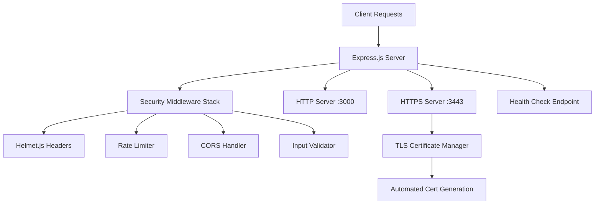

#### Core Technical Approach

The architecture implements a layered security approach using Express.js middleware for request processing, with each security control operating as an independent layer. The system employs automated certificate management for TLS encryption and provides dual-protocol support for flexible integration requirements.

### 1.2.3 Success Criteria

#### Measurable Objectives

| Security Control | Success Metric | Validation Method |
|-----------------|----------------|-------------------|
| Security Headers | Achieve "A" grade rating | Security header analysis tools |
| Rate Limiting | Return HTTP 429 when exceeded | Load testing verification |
| HTTPS Encryption | Establish secure TLS connections | SSL certificate validation |
| Input Sanitization | Block malicious input patterns | Penetration testing scenarios |

#### Critical Success Factors

The system's success depends on maintaining comprehensive security middleware coverage, ensuring automated certificate management reliability, and preserving functional compatibility with existing integration tests. The dual-server architecture must maintain consistent security policies across both HTTP and HTTPS protocols.

#### Key Performance Indicators

- **Security Compliance**: 100% pass rate on security validation checklist
- **Availability**: Successful health check responses under normal load conditions
- **Rate Limiting Effectiveness**: Accurate enforcement of 100 requests per 15-minute window
- **Certificate Management**: Successful automated certificate generation and renewal

## 1.3 SCOPE

### 1.3.1 In-Scope Elements

#### Core Features and Functionalities

**Security Middleware Implementation:**
- Helmet.js configuration with Content-Security-Policy, HSTS, and anti-sniffing headers
- Express-rate-limit with configurable thresholds (100 requests/15 minutes)
- CORS whitelist supporting localhost:3000 and localhost:3443 origins
- Express-validator for input sanitization and validation

**Server Capabilities:**
- Dual HTTP/HTTPS server operation on ports 3000 and 3443
- Health check endpoint for monitoring integration
- Graceful shutdown handling with proper resource cleanup
- Request logging and error handling mechanisms

#### Implementation Boundaries

| Boundary Type | Coverage Details | Technical Limits |
|--------------|------------------|------------------|
| Protocol Support | HTTP 1.1, HTTPS with TLS | No HTTP/2 or WebSocket support |
| Geographic Scope | Development/testing environments | Not intended for production deployment |
| User Groups | Development and QA teams | No end-user authentication required |
| Data Domains | Test request/response cycles | No persistent data storage |

#### Essential Integrations

- **Certificate Management**: Automated self-signed certificate generation via OpenSSL
- **Security Validation**: Integration with security testing tools and frameworks
- **Testing Framework**: Compatibility with backpropagation integration test suites
- **Development Tools**: Support for local development environment workflows

### 1.3.2 Out-of-Scope Elements

#### Explicitly Excluded Features

**Production Deployment Capabilities:**
- Load balancing and clustering support
- Database connectivity and ORM integration
- User authentication and authorization systems
- Advanced logging and monitoring frameworks

**Business Logic Implementation:**
- Complex data processing workflows
- Business rule engines and validation
- Transaction management systems
- Third-party service integrations beyond basic HTTP

#### Future Phase Considerations

- Migration to production-grade certificate management
- Integration with enterprise identity providers
- Advanced monitoring and observability features
- Horizontal scaling and load distribution capabilities

#### Integration Points Not Covered

The system does not provide integration with external databases, message queues, or enterprise service buses. Monitoring integration is limited to basic health checks without comprehensive metrics collection or alerting capabilities.

#### Unsupported Use Cases

- High-throughput production workloads
- Complex multi-tenant scenarios
- Real-time data streaming requirements
- Enterprise-grade audit trail generation

#### References

- `server.js` - Main Express.js server implementation with security middleware stack
- `package.json` - Project dependencies and configuration metadata
- `README.md` - Project identification and usage directives
- `certificates/generate-certs.sh` - Automated TLS certificate generation script
- `certificates/.gitignore` - Certificate security and version control policies
- `blitzy/documentation/Technical Specifications.md` - Security enhancement specifications and validation criteria
- `package-lock.json` - Dependency version management and integrity verification

# 2. PRODUCT REQUIREMENTS

## 2.1 FEATURE CATALOG

### 2.1.1 Main Project Features

#### F-001: Security Middleware Stack

| Attribute | Value |
|-----------|-------|
| **Unique ID** | F-001 |
| **Feature Name** | Security Middleware Stack |
| **Feature Category** | Security |
| **Priority Level** | Critical |
| **Status** | Completed |

**Description:**
- **Overview**: Comprehensive security middleware implementation providing multi-layered protection against common web application vulnerabilities
- **Business Value**: Achieves "A" grade security rating and eliminates critical security vulnerabilities found in original implementation
- **User Benefits**: Provides secure testing environment for development teams and security auditors
- **Technical Context**: Implements Helmet.js headers, express-rate-limit, CORS restrictions, and express-validator sanitization

**Dependencies:**
- **Prerequisite Features**: None (foundational feature)
- **System Dependencies**: Express.js framework, Node.js runtime
- **External Dependencies**: helmet ^7.0.0, express-rate-limit ^7.0.0, cors ^2.8.5, express-validator ^7.0.0
- **Integration Requirements**: Must integrate with Express.js middleware pipeline

#### F-002: Dual Protocol Support

| Attribute | Value |
|-----------|-------|
| **Unique ID** | F-002 |
| **Feature Name** | Dual Protocol Support |
| **Feature Category** | Infrastructure |
| **Priority Level** | Critical |
| **Status** | Completed |

**Description:**
- **Overview**: Simultaneous HTTP and HTTPS server operation on ports 3000 and 3443 respectively
- **Business Value**: Provides flexible integration options for various testing scenarios and environments
- **User Benefits**: Enables testing of both secure and non-secure communication protocols
- **Technical Context**: Native Node.js HTTP and HTTPS server creation with TLS certificate support

**Dependencies:**
- **Prerequisite Features**: F-004 (Certificate Management)
- **System Dependencies**: Node.js built-in HTTP and HTTPS modules
- **External Dependencies**: OpenSSL for certificate operations
- **Integration Requirements**: Certificate files must be available before HTTPS server startup

#### F-003: API Endpoints

| Attribute | Value |
|-----------|-------|
| **Unique ID** | F-003 |
| **Feature Name** | API Endpoints |
| **Feature Category** | Application Interface |
| **Priority Level** | Critical |
| **Status** | Completed |

**Description:**
- **Overview**: Two primary endpoints providing basic functionality and health monitoring
- **Business Value**: Enables integration testing and system monitoring capabilities
- **User Benefits**: Provides predictable responses for automated testing and health checks
- **Technical Context**: GET "/" returns static "Hello, World!" response, GET "/health" returns JSON status information

**Dependencies:**
- **Prerequisite Features**: F-001 (Security Middleware Stack)
- **System Dependencies**: Express.js routing
- **External Dependencies**: None beyond Express.js
- **Integration Requirements**: Must pass through security middleware validation

#### F-004: Certificate Management

| Attribute | Value |
|-----------|-------|
| **Unique ID** | F-004 |
| **Feature Name** | Certificate Management |
| **Feature Category** | Security Infrastructure |
| **Priority Level** | High |
| **Status** | Completed |

**Description:**
- **Overview**: Automated self-signed TLS certificate generation and management system
- **Business Value**: Eliminates manual certificate management overhead for testing environments
- **User Benefits**: Seamless HTTPS setup without manual intervention or external certificate authorities
- **Technical Context**: Bash script using OpenSSL to generate 2048-bit RSA certificates with SAN support

**Dependencies:**
- **Prerequisite Features**: None
- **System Dependencies**: OpenSSL, Bash shell
- **External Dependencies**: OpenSSL command-line tools
- **Integration Requirements**: Generated certificates must be accessible to HTTPS server

#### F-005: Operational Features

| Attribute | Value |
|-----------|-------|
| **Unique ID** | F-005 |
| **Feature Name** | Operational Features |
| **Feature Category** | System Management |
| **Priority Level** | High |
| **Status** | Completed |

**Description:**
- **Overview**: Graceful shutdown handling, error management, and operational logging
- **Business Value**: Ensures reliable operation and maintainability in testing environments
- **User Benefits**: Provides operational visibility and clean shutdown procedures
- **Technical Context**: SIGTERM/SIGINT signal handling, environment-aware error reporting, startup logging

**Dependencies:**
- **Prerequisite Features**: F-002 (Dual Protocol Support), F-003 (API Endpoints)
- **System Dependencies**: Node.js process management
- **External Dependencies**: None
- **Integration Requirements**: Must coordinate shutdown of both HTTP and HTTPS servers

### 2.1.2 Blitzy Subproject Features

#### F-006: Minimal HTTP Server

| Attribute | Value |
|-----------|-------|
| **Unique ID** | F-006 |
| **Feature Name** | Minimal HTTP Server |
| **Feature Category** | Test Infrastructure |
| **Priority Level** | Critical |
| **Status** | Completed |

**Description:**
- **Overview**: Zero-dependency HTTP server providing minimal "Hello, World!" functionality
- **Business Value**: Serves as unchanging test fixture for backpropagation integration testing
- **User Benefits**: Provides predictable, stable testing component with minimal resource requirements
- **Technical Context**: Node.js built-in HTTP module only, localhost:3000 binding, static response

**Dependencies:**
- **Prerequisite Features**: None
- **System Dependencies**: Node.js built-in HTTP module only
- **External Dependencies**: None (zero-dependency requirement)
- **Integration Requirements**: Must maintain API compatibility with test frameworks

#### F-007: Test Fixture Stability

| Attribute | Value |
|-----------|-------|
| **Unique ID** | F-007 |
| **Feature Name** | Test Fixture Stability |
| **Feature Category** | Test Infrastructure |
| **Priority Level** | Critical |
| **Status** | Completed |

**Description:**
- **Overview**: Guaranteed unchanging behavior for reliable integration testing
- **Business Value**: Provides stable foundation for backpropagation testing scenarios
- **User Benefits**: Eliminates test flakiness caused by changing dependencies or behavior
- **Technical Context**: Immutable response patterns, minimal resource consumption, consistent behavior

**Dependencies:**
- **Prerequisite Features**: F-006 (Minimal HTTP Server)
- **System Dependencies**: Node.js runtime stability
- **External Dependencies**: None
- **Integration Requirements**: Must maintain backward compatibility with existing test suites

## 2.2 FUNCTIONAL REQUIREMENTS TABLE

### 2.2.1 Security Middleware Stack (F-001)

| Requirement ID | Description | Acceptance Criteria | Priority |
|----------------|-------------|-------------------|----------|
| F-001-RQ-001 | Helmet.js Security Headers | Content-Security-Policy, HSTS (31536000s), X-Content-Type-Options implemented | Must-Have |
| F-001-RQ-002 | Rate Limiting Protection | 100 requests per 15-minute window with HTTP 429 response | Must-Have |
| F-001-RQ-003 | CORS Origin Restriction | Allow only localhost:3000 and localhost:3443 origins | Must-Have |
| F-001-RQ-004 | Input Sanitization | All input fields escaped using express-validator | Must-Have |

**Technical Specifications:**

| Requirement ID | Input Parameters | Output/Response | Performance Criteria | Data Requirements |
|----------------|------------------|-----------------|---------------------|-------------------|
| F-001-RQ-001 | HTTP requests | Security headers in response | Headers added <1ms | Header configuration data |
| F-001-RQ-002 | Request rate monitoring | HTTP 429 when exceeded | Rate calculation <10ms | Request timestamp tracking |
| F-001-RQ-003 | Origin header validation | Accept/reject based on whitelist | Validation <5ms | Allowed origins list |
| F-001-RQ-004 | Request body/parameters | Sanitized input data | Sanitization <50ms | Input validation rules |

**Validation Rules:**

| Requirement ID | Business Rules | Data Validation | Security Requirements | Compliance Requirements |
|----------------|---------------|-----------------|----------------------|------------------------|
| F-001-RQ-001 | Security headers mandatory | Valid CSP directives | Protection against XSS, clickjacking | OWASP compliance |
| F-001-RQ-002 | Rate limits apply per IP | Numeric threshold validation | DoS attack prevention | Industry standard rate limits |
| F-001-RQ-003 | Strict origin checking | Valid URL format | CSRF protection | Same-origin policy enforcement |
| F-001-RQ-004 | All input sanitized | HTML escape validation | Injection attack prevention | Input sanitization standards |

### 2.2.2 Dual Protocol Support (F-002)

| Requirement ID | Description | Acceptance Criteria | Priority |
|----------------|-------------|-------------------|----------|
| F-002-RQ-001 | HTTP Server Operation | Server listening on port 3000, responds to requests | Must-Have |
| F-002-RQ-002 | HTTPS Server Operation | Server listening on port 3443 with valid TLS | Must-Have |
| F-002-RQ-003 | Concurrent Operation | Both servers operational simultaneously | Must-Have |
| F-002-RQ-004 | Graceful Startup | Servers start within 1 second | Should-Have |

**Technical Specifications:**

| Requirement ID | Input Parameters | Output/Response | Performance Criteria | Data Requirements |
|----------------|------------------|-----------------|---------------------|-------------------|
| F-002-RQ-001 | HTTP requests on :3000 | HTTP responses | Response time <100ms | Server configuration |
| F-002-RQ-002 | HTTPS requests on :3443 | HTTPS responses | TLS handshake <500ms | Certificate files |
| F-002-RQ-003 | Dual protocol requests | Concurrent responses | No blocking between protocols | Resource allocation |
| F-002-RQ-004 | Server initialization | Startup success messages | Startup time <1s | Startup configuration |

### 2.2.3 API Endpoints (F-003)

| Requirement ID | Description | Acceptance Criteria | Priority |
|----------------|-------------|-------------------|----------|
| F-003-RQ-001 | Root Endpoint | GET "/" returns "Hello, World!" with 200 status | Must-Have |
| F-003-RQ-002 | Health Check Endpoint | GET "/health" returns JSON status information | Must-Have |
| F-003-RQ-003 | Security Header Application | All responses include security headers | Must-Have |
| F-003-RQ-004 | Error Handling | Invalid requests return appropriate error responses | Should-Have |

**Technical Specifications:**

| Requirement ID | Input Parameters | Output/Response | Performance Criteria | Data Requirements |
|----------------|------------------|-----------------|---------------------|-------------------|
| F-003-RQ-001 | GET request to "/" | "Hello, World!" text | Response time <50ms | Static response data |
| F-003-RQ-002 | GET request to "/health" | JSON health status | Response time <100ms | System status data |
| F-003-RQ-003 | Any HTTP request | Headers + content | Header processing <10ms | Security header config |
| F-003-RQ-004 | Invalid requests | Error response | Error handling <200ms | Error message templates |

### 2.2.4 Certificate Management (F-004)

| Requirement ID | Description | Acceptance Criteria | Priority |
|----------------|-------------|-------------------|----------|
| F-004-RQ-001 | Certificate Generation | Script generates valid 2048-bit RSA certificates | Must-Have |
| F-004-RQ-002 | SAN Support | Certificates include SAN for localhost, 127.0.0.1, ::1 | Must-Have |
| F-004-RQ-003 | File Permissions | Private keys have 600 permissions, certificates 644 | Must-Have |
| F-004-RQ-004 | Backup Management | Existing certificates backed up before regeneration | Should-Have |

### 2.2.5 Minimal HTTP Server (F-006)

| Requirement ID | Description | Acceptance Criteria | Priority |
|----------------|-------------|-------------------|----------|
| F-006-RQ-001 | Zero Dependencies | Uses only Node.js built-in modules | Must-Have |
| F-006-RQ-002 | Static Response | Returns "Hello, World!" for all requests | Must-Have |
| F-006-RQ-003 | Localhost Binding | Server binds only to localhost:3000 | Must-Have |
| F-006-RQ-004 | Minimal Resource Usage | Memory usage <10MB, CPU usage <1% | Should-Have |

## 2.3 FEATURE RELATIONSHIPS

### 2.3.1 Feature Dependencies Map

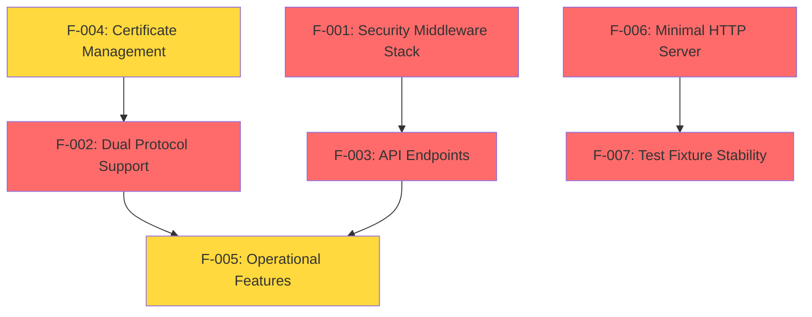

### 2.3.2 Integration Points

| Feature Pair | Integration Type | Shared Components | Dependencies |
|--------------|------------------|-------------------|--------------|
| F-001 ↔ F-003 | Middleware Pipeline | Express.js middleware stack | F-001 must be loaded before F-003 |
| F-002 ↔ F-004 | Certificate Consumption | TLS certificate files | F-004 must complete before F-002 HTTPS |
| F-002 ↔ F-005 | Server Management | HTTP/HTTPS server instances | F-005 manages F-002 lifecycle |
| F-006 ↔ F-007 | Behavioral Contract | Response consistency guarantee | F-007 enforces F-006 stability |

### 2.3.3 Shared Components

**Main Project Shared Components:**
- Express.js application instance (shared by F-001, F-003)
- Server configuration object (shared by F-002, F-005)
- Certificate files (shared by F-002, F-004)
- Error handling middleware (shared by F-001, F-003, F-005)

**Common Services:**
- HTTP request processing pipeline
- Security validation layer
- Logging and monitoring infrastructure
- Graceful shutdown coordination

## 2.4 IMPLEMENTATION CONSIDERATIONS

### 2.4.1 Security Middleware Stack (F-001)

**Technical Constraints:**
- Must maintain compatibility with Express.js middleware architecture
- Security headers must not conflict with application functionality
- Rate limiting must accurately track per-IP request counts

**Performance Requirements:**
- Middleware processing overhead <10ms per request
- Memory usage for rate limiting data structures <50MB
- Security header generation <1ms per response

**Scalability Considerations:**
- Rate limiting data stored in-memory (single instance limitation)
- No horizontal scaling support for rate limit counters
- Middleware stack adds consistent overhead regardless of load

**Security Implications:**
- All security controls must fail securely (deny by default)
- Rate limiting must be resistant to IP spoofing attempts
- CORS validation must prevent bypass through header manipulation

### 2.4.2 Dual Protocol Support (F-002)

**Technical Constraints:**
- Certificate files must be readable by Node.js process
- Port 3000 and 3443 must be available for binding
- HTTPS requires valid certificate chain

**Performance Requirements:**
- Server startup time <1 second
- Concurrent connection handling for both protocols
- TLS handshake performance <500ms

**Scalability Considerations:**
- Single-process architecture limits concurrent connections
- No load balancing between HTTP/HTTPS
- Certificate management not suitable for production scale

### 2.4.3 Certificate Management (F-004)

**Technical Constraints:**
- Requires OpenSSL binary availability
- File system write permissions for certificate directory
- Bash shell environment for script execution

**Performance Requirements:**
- Certificate generation <10 seconds
- File operations must complete atomically
- Backup operations must not interfere with server operation

**Maintenance Requirements:**
- Certificates expire after configured validity period (default 365 days)
- Manual regeneration required for certificate renewal
- Backup cleanup strategy needed for long-term operation

### 2.4.4 Minimal HTTP Server (F-006)

**Technical Constraints:**
- Zero external dependencies (Node.js built-ins only)
- Must maintain API compatibility for existing tests
- Single-threaded request processing

**Performance Requirements:**
- Memory footprint <10MB
- Response time <50ms for all requests
- CPU utilization <1% under normal load

**Scalability Considerations:**
- Not designed for high-throughput scenarios
- Single connection handling (no connection pooling)
- Minimal resource allocation optimized for test scenarios

## 2.5 TRACEABILITY MATRIX

| Feature ID | Requirements Count | Critical Requirements | Implementation Files |
|------------|-------------------|----------------------|----------------------|
| F-001 | 4 | 4 | `server.js` (middleware stack) |
| F-002 | 4 | 3 | `server.js` (HTTP/HTTPS servers) |
| F-003 | 4 | 3 | `server.js` (route handlers) |
| F-004 | 4 | 3 | `certificates/generate-certs.sh` |
| F-005 | 3 | 2 | `server.js` (signal handlers) |
| F-006 | 4 | 3 | `blitzy/index.js` |
| F-007 | 2 | 2 | `blitzy/index.js` |

#### References

- `server.js` - Main Express.js server implementation with comprehensive security middleware stack
- `package.json` - Project dependencies and configuration metadata defining external requirements
- `certificates/generate-certs.sh` - Automated TLS certificate generation script with OpenSSL integration
- `certificates/.gitignore` - Security policies preventing accidental commit of sensitive certificate files
- `blitzy/index.js` - Minimal zero-dependency HTTP server implementation for test fixture scenarios
- `blitzy/documentation/Technical Specifications.md` - Comprehensive technical documentation and security validation criteria
- `README.md` - Project identification and critical usage directives for test environment stability

# 3. TECHNOLOGY STACK

## 3.1 PROGRAMMING LANGUAGES

### 3.1.1 Primary Language Selection

**JavaScript (Node.js Runtime)**
- **Version**: Node.js 16+ (required for security middleware compatibility)
- **Platform**: Server-side implementation across all components
- **Justification**: Selected for rapid development, extensive middleware ecosystem, and strong security library support
- **Constraints**: No TypeScript usage detected, maintaining pure JavaScript implementation for simplicity
- **Dependencies**: Requires Node.js runtime environment with npm package management

### 3.1.2 Supporting Languages

**Bash Scripting**
- **Purpose**: Certificate generation automation and system tooling
- **Implementation**: `/certificates/generate-certs.sh` for automated SSL/TLS certificate creation
- **Platform Requirements**: Unix-like systems with OpenSSL availability
- **Justification**: Native system integration for certificate management workflows

## 3.2 FRAMEWORKS & LIBRARIES

### 3.2.1 Core Web Framework

**Express.js ^4.18.0**
- **Role**: Primary web application framework
- **Architecture**: Middleware-based request processing pipeline
- **Key Features**: 
  - HTTP/HTTPS server management
  - Route handling for health checks and main endpoints
  - Middleware stack integration
- **Compatibility**: Node.js 16+ runtime requirement
- **Justification**: Industry-standard framework with comprehensive security middleware ecosystem

### 3.2.2 Security Middleware Stack

**Helmet.js ^7.0.0**
- **Function**: Comprehensive HTTP security headers management
- **Security Controls**:
  - Content Security Policy (CSP) configuration
  - HTTP Strict Transport Security (HSTS) implementation
  - X-Powered-By header removal
  - Cross-origin policy enforcement
- **Version Note**: Current implementation uses ^7.0.0 while latest version is 8.1.0
- **Justification**: Industry-leading security header management with minimal configuration overhead

**Express Rate Limit ^7.0.0**
- **Function**: Request rate limiting and DoS protection
- **Configuration**: 100 requests per 15-minute sliding window
- **Standards Compliance**: Implements draft-8 standard headers
- **Storage**: In-memory rate limit tracking
- **Justification**: Essential protection against automated attacks and resource exhaustion

**CORS ^2.8.5**
- **Function**: Cross-Origin Resource Sharing policy enforcement
- **Security Policy**:
  - Restrictive origin allowlist: localhost:3000, localhost:3443
  - Credentials disabled for security
  - 24-hour preflight cache optimization
- **Justification**: Prevents unauthorized cross-origin requests while supporting legitimate testing scenarios

**Express Validator ^7.0.0**
- **Function**: Input validation and sanitization
- **Features**:
  - HTML escaping for all user inputs
  - Structured 400 error responses
  - Comprehensive validation rule engine
- **Justification**: Critical defense against injection attacks and malformed input exploitation

## 3.3 OPEN SOURCE DEPENDENCIES

### 3.3.1 Security-Focused Dependencies

The system maintains a minimal, security-focused dependency tree with exact version locking through `package-lock.json`:

| Package | Version | Registry | Security Function |
|---------|---------|----------|-------------------|
| helmet | ^7.0.0 | npm | Security headers management |
| express-rate-limit | ^7.0.0 | npm | DoS protection |
| cors | ^2.8.5 | npm | Cross-origin policy |
| express-validator | ^7.0.0 | npm | Input sanitization |
| express | ^4.18.0 | npm | Core web framework |

### 3.3.2 Node.js Built-in Modules

**Core Modules (Zero External Dependencies)**
- **http**: HTTP server creation and management
- **https**: HTTPS server with TLS encryption support
- **fs**: File system operations for certificate handling
- **path**: Cross-platform path manipulation
- **child_process**: OpenSSL command execution for certificate generation

### 3.3.3 Blitzy Subproject Architecture

**Zero-Dependency Design Philosophy**
- **Implementation**: Pure Node.js built-in modules only
- **Rationale**: Maximum stability as test fixture component
- **Modules Used**: HTTP module exclusively
- **Benefits**: Eliminates external dependency vulnerabilities and version conflicts

## 3.4 THIRD-PARTY SERVICES

### 3.4.1 External Tool Dependencies

**OpenSSL**
- **Function**: SSL/TLS certificate generation and management
- **Requirements**: System PATH availability
- **Operations**:
  - 2048-bit RSA key generation
  - Self-signed X.509 certificate creation
  - Certificate validation and verification
- **Integration**: Automated through Bash scripting interface

### 3.4.2 Service Integration Architecture

The system operates as a **self-contained testing fixture** with no external service dependencies:
- **Authentication**: Not implemented (test environment focus)
- **Monitoring**: Health check endpoint only (`/health`)
- **Cloud Services**: None (local development/testing environment)
- **External APIs**: None (isolated test fixture design)

## 3.5 DATABASES & STORAGE

### 3.5.1 Data Persistence Strategy

**No Database Requirements**
- **Architecture**: Stateless server design
- **Justification**: Test fixture purpose requires no data persistence
- **Memory Usage**: In-memory rate limiting storage only
- **Data Flow**: Request-response cycle with no state retention

### 3.5.2 Caching Solutions

**In-Memory Rate Limiting Cache**
- **Implementation**: Express Rate Limit internal memory store
- **Scope**: Request counting per client IP
- **Lifetime**: 15-minute sliding window
- **Scalability**: Single-process limitation acceptable for test environment

### 3.5.3 File System Storage

**Certificate Management Storage**
- **Location**: `/certificates` directory
- **Files**: Private keys (600 permissions), certificates (644 permissions)
- **Security**: Git-ignored for credential protection
- **Backup**: Automated backup mechanism before regeneration

## 3.6 DEVELOPMENT & DEPLOYMENT

### 3.6.1 Development Tools

**Package Management**
- **npm**: Primary package manager
- **package-lock.json**: Dependency version locking for reproducible builds
- **Version Control**: Git with comprehensive `.gitignore` configurations

**Code Organization**
- **Linting**: No explicit linting configuration detected
- **Testing**: No test framework implementation (acts as test fixture itself)
- **Documentation**: Comprehensive technical specifications in `/blitzy/documentation`

### 3.6.2 Build System

**No Build Process Required**
- **Deployment**: Direct Node.js execution
- **Asset Management**: No compilation or bundling requirements
- **Environment Configuration**: NODE_ENV variable support
- **Startup**: Direct `node server.js` execution

### 3.6.3 Containerization & Deployment

**Local Development Focus**
- **Containerization**: No Docker implementation detected
- **Port Configuration**: 
  - HTTP: 127.0.0.1:3000
  - HTTPS: 127.0.0.1:3443
- **Process Management**: Single-process architecture
- **Environment**: Development and testing environment optimization

### 3.6.4 Infrastructure Architecture

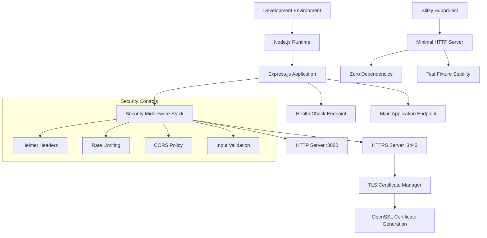

### 3.6.5 Continuous Integration

**Repository-Based Development**
- **Version Control**: Git with structured commit history
- **Branching**: Standard Git workflow (implementation details not specified)
- **Integration Testing**: Self-contained test fixture approach
- **Quality Assurance**: Security-focused validation requirements

## 3.7 TECHNOLOGY INTEGRATION REQUIREMENTS

### 3.7.1 Component Interaction Patterns

**Middleware Pipeline Architecture**
- **Request Flow**: Client → Security Middleware → Application Logic → Response
- **Error Handling**: Structured error responses with security header preservation
- **Protocol Support**: Dual HTTP/HTTPS with consistent security policies

### 3.7.2 Security Integration

**Defense in Depth Implementation**
- **Layer 1**: Network-level rate limiting
- **Layer 2**: Security header enforcement
- **Layer 3**: Input validation and sanitization
- **Layer 4**: CORS policy enforcement
- **Layer 5**: TLS encryption for sensitive communications

### 3.7.3 Compatibility Matrix

| Component | Version | Compatibility Notes |
|-----------|---------|-------------------|
| Node.js | 16+ | Required for security middleware support |
| Express.js | ^4.18.0 | Stable LTS version with security updates |
| Security Middleware | Latest patch versions | Regular security updates essential |
| OpenSSL | System default | Required for certificate operations |

#### References

**Files Examined:**
- `/server.js` - Main Express.js server implementation with security middleware stack
- `/package-lock.json` - Complete dependency tree with exact version specifications
- `/certificates/generate-certs.sh` - Automated SSL certificate generation script
- `/blitzy/server.js` - Zero-dependency HTTP server implementation
- `/README.md` - Project documentation and modification guidelines

**Folders Analyzed:**
- `/` - Root project structure and main application components
- `/certificates/` - TLS certificate management tooling and storage
- `/blitzy/` - Minimal HTTP server subproject with zero external dependencies
- `/blitzy/documentation/` - Comprehensive technical specification documentation

**Technical Specification Sections Referenced:**
- `1.1 EXECUTIVE SUMMARY` - Project overview and security focus context
- `1.2 SYSTEM OVERVIEW` - System architecture and security middleware integration
- `2.1 FEATURE CATALOG` - Detailed feature implementations and dependencies
- `2.4 IMPLEMENTATION CONSIDERATIONS` - Technical constraints and security requirements

**External Research:**
- Helmet.js version compatibility and security feature documentation

# 4. PROCESS FLOWCHART

## 4.1 SYSTEM WORKFLOWS

### 4.1.1 Core Business Processes

#### 4.1.1.1 Main Application Lifecycle

The hao-backprop-test server follows a comprehensive lifecycle that ensures security-first initialization and graceful operation management. The primary workflow encompasses server initialization, request processing, and controlled termination phases.

**Server Initialization Workflow**

The server initialization process implements a layered security approach with automated certificate management capabilities. The workflow begins with Express application instantiation, followed by systematic middleware configuration in a specific order that ensures comprehensive security coverage.

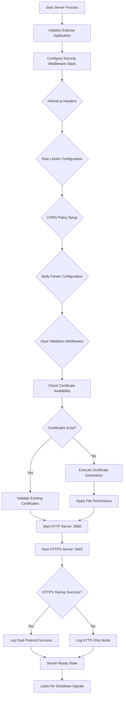

**Request Processing Pipeline**

The request processing pipeline implements defense-in-depth security controls with structured error handling and consistent response formatting. Each incoming request traverses multiple validation layers before reaching application logic.

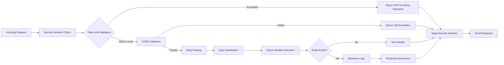

#### 4.1.1.2 Blitzy Minimal Server Lifecycle

The Blitzy subproject implements a zero-dependency server architecture designed for stable test fixture requirements. This simplified workflow prioritizes predictability and minimal resource consumption.

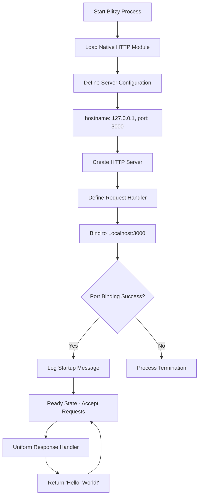

### 4.1.2 Integration Workflows

#### 4.1.2.1 Security Middleware Integration

The security middleware integration implements layered protection through coordinated middleware execution. Each security control operates independently while maintaining consistent policy enforcement across all endpoints.

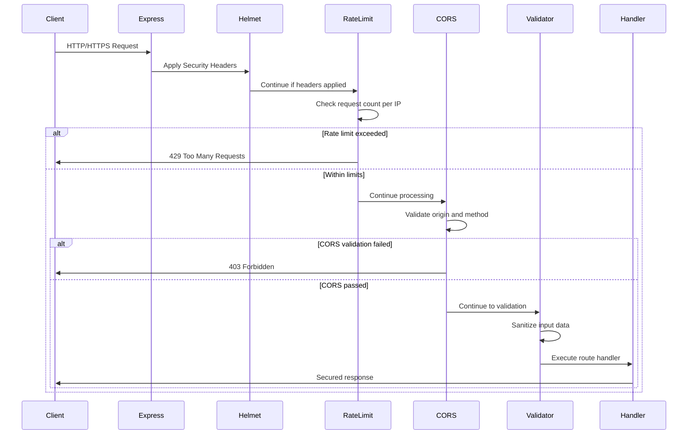

#### 4.1.2.2 Certificate Management Integration

The certificate management system integrates automated certificate generation with server initialization, ensuring seamless HTTPS operation without manual intervention.

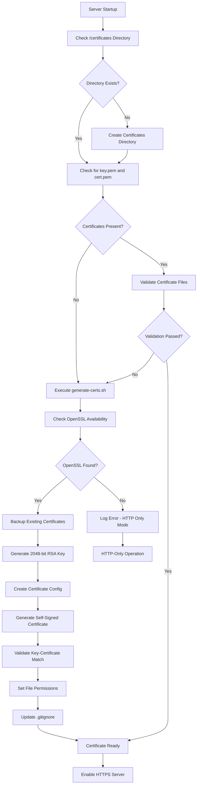

## 4.2 ERROR HANDLING AND RECOVERY PROCEDURES

### 4.2.1 Error State Management

#### 4.2.1.1 Runtime Error Handling Flow

The system implements comprehensive error handling with structured recovery procedures and detailed logging for operational visibility.

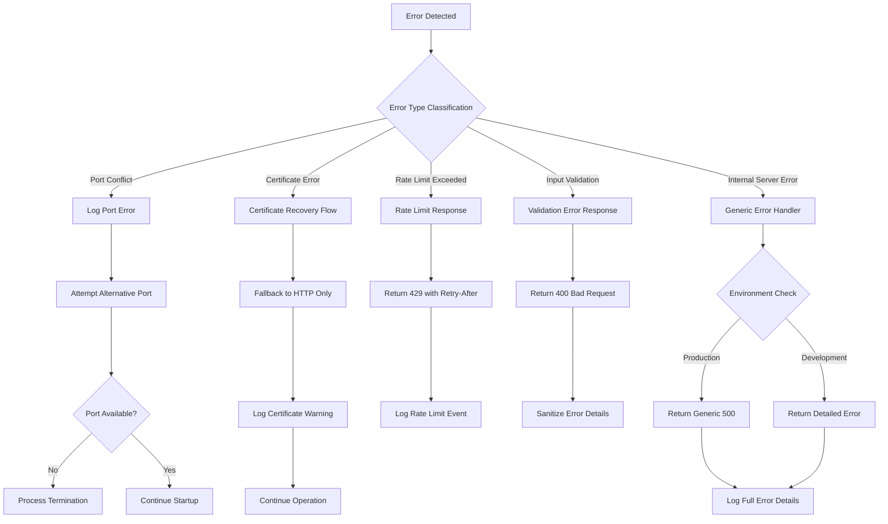

#### 4.2.1.2 Recovery Mechanisms

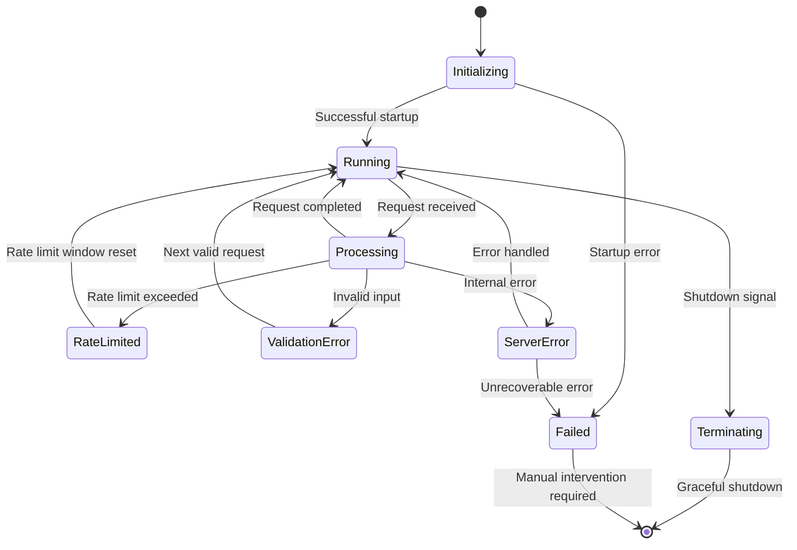

### 4.2.2 State Transition Workflows

#### 4.2.2.1 Application State Management

The system maintains distinct operational states with well-defined transition criteria and recovery paths for each state.

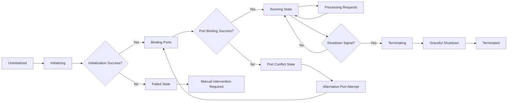

## 4.3 TECHNICAL IMPLEMENTATION FLOWS

### 4.3.1 Data Flow and Processing

#### 4.3.1.1 Request Data Processing Pipeline

The request processing pipeline implements comprehensive data validation and sanitization with consistent security policy enforcement across all endpoints.

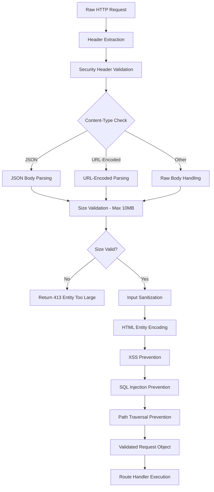

#### 4.3.1.2 Response Generation Flow

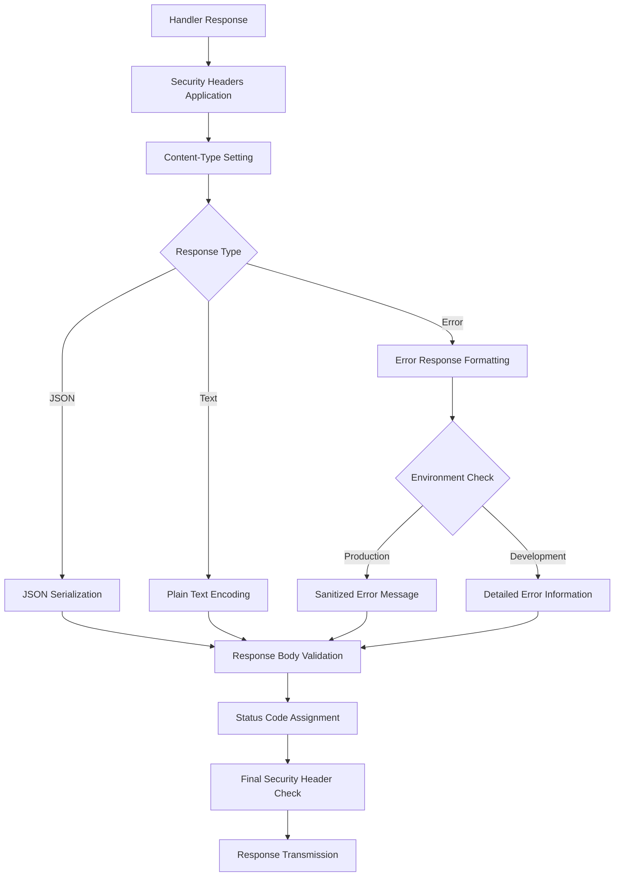

### 4.3.2 Integration Sequence Flows

#### 4.3.2.1 Dual Protocol Server Integration

The dual protocol architecture ensures consistent security policies across HTTP and HTTPS endpoints while maintaining operational flexibility.

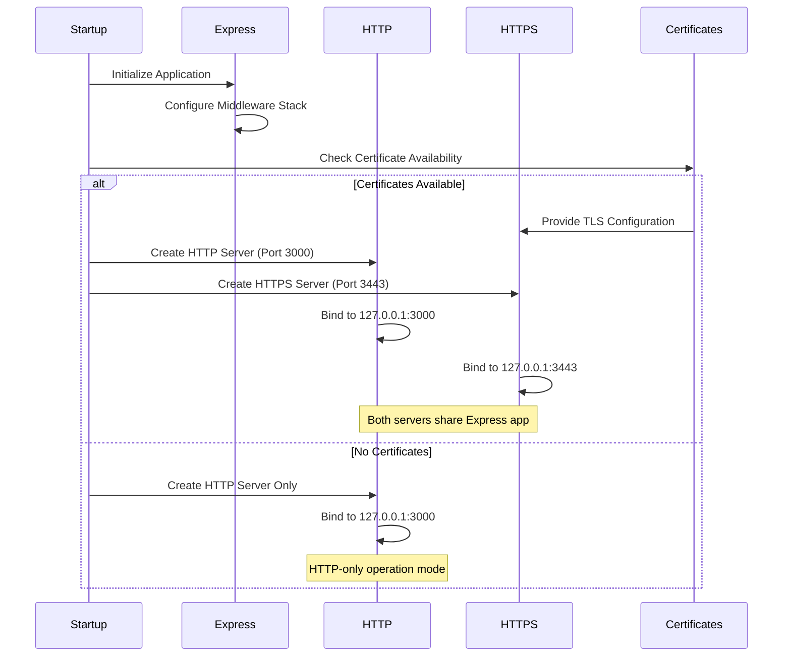

## 4.4 VALIDATION AND COMPLIANCE WORKFLOWS

### 4.4.1 Business Rule Validation

#### 4.4.1.1 Security Policy Enforcement Flow

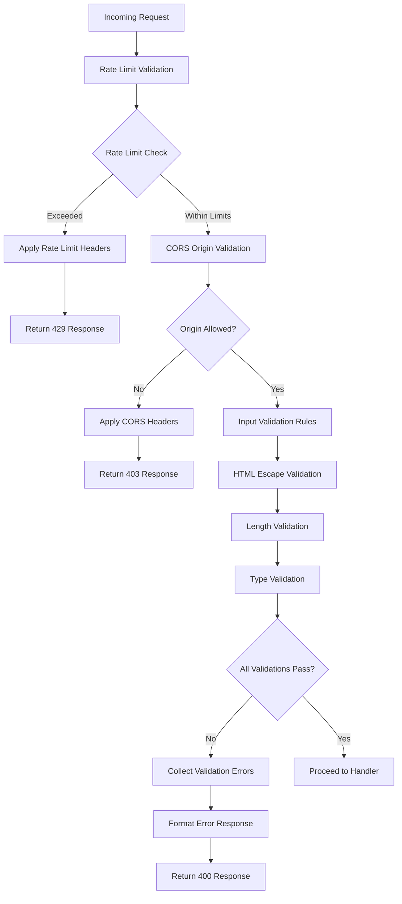

### 4.4.2 Performance and SLA Monitoring

#### 4.4.2.1 Health Check and Monitoring Flow


## 4.5 OPERATIONAL WORKFLOWS

### 4.5.1 Deployment and Startup Procedures

#### 4.5.1.1 Complete Deployment Flow

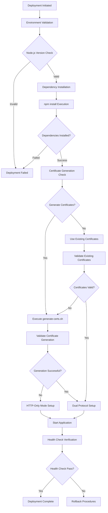

### 4.5.2 Graceful Shutdown Procedures

#### 4.5.2.1 Shutdown Sequence Flow

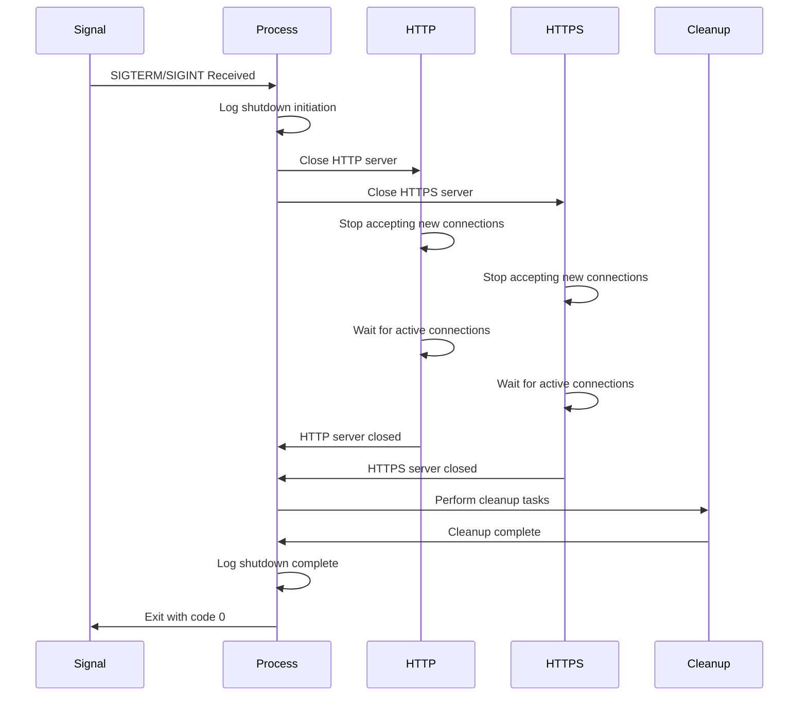

#### References

**Files Examined:**
- `server.js` - Complete Express server implementation with security middleware stack, dual protocol support, and graceful shutdown handling
- `certificates/generate-certs.sh` - Automated certificate generation script with validation, backup, and security configuration
- `blitzy/server.js` - Zero-dependency HTTP server implementation for stable test fixture requirements
- `package.json` - Project dependencies and configuration for security middleware integration

**Folders Analyzed:**
- `` (root) - Main application structure with server implementation and configuration
- `certificates/` - Certificate management tooling and automated generation scripts
- `blitzy/` - Minimal HTTP server subproject with zero external dependencies

**Technical Specification Sections Referenced:**
- `1.2 SYSTEM OVERVIEW` - High-level architecture and security enhancement context
- `2.1 FEATURE CATALOG` - Comprehensive feature catalog with dependencies and integration requirements
- `3.7 TECHNOLOGY INTEGRATION REQUIREMENTS` - Component interaction patterns and security integration layers

# 5. SYSTEM ARCHITECTURE

## 5.1 HIGH-LEVEL ARCHITECTURE

### 5.1.1 System Overview

The hao-backprop-test system implements a **dual-architecture pattern** consisting of a security-hardened Express.js application alongside a minimal zero-dependency test fixture. This design reflects a sophisticated approach to secure web application development while maintaining stable test infrastructure components.

The **primary architecture style** follows a **middleware-based request processing pipeline** built on Express.js, implementing defense-in-depth security principles through layered middleware controls. The system employs a **microservice-adjacent pattern** where the main application and Blitzy subproject operate as independent, self-contained services with distinct architectural philosophies.

**Key architectural principles** include:
- **Security-first design**: Comprehensive middleware stack addressing OWASP vulnerabilities
- **Automated operations**: Self-managing certificate generation and renewal processes  
- **Protocol flexibility**: Dual HTTP/HTTPS support for diverse integration scenarios
- **Operational simplicity**: Stateless design eliminating external dependencies
- **Test fixture stability**: Immutable components ensuring consistent testing behavior

**System boundaries** encompass localhost-only operation with explicit network isolation, automated certificate management within the certificates/ directory, and clear separation between production-oriented security controls and minimal test fixture requirements.

### 5.1.2 Core Components Table

| Component Name | Primary Responsibility | Key Dependencies | Integration Points | Critical Considerations |
|----------------|----------------------|------------------|-------------------|------------------------|
| Express.js Application | Request processing and security enforcement | Express.js ^4.18.0, Security middleware | HTTP/HTTPS ports 3000/3443 | Middleware order dependency, graceful shutdown |
| Security Middleware Stack | Multi-layered protection against vulnerabilities | Helmet.js, Rate Limiter, CORS, Validator | Express middleware pipeline | Version compatibility, performance impact |
| Certificate Manager | Automated TLS certificate generation | OpenSSL, Bash shell | HTTPS server initialization | OpenSSL availability, file permissions |
| Blitzy Test Server | Zero-dependency minimal HTTP service | Node.js built-in HTTP module | Port 3000 binding | Immutable behavior requirement, resource constraints |

### 5.1.3 Data Flow Description

The **primary data flow** implements a layered security approach through the Express.js middleware pipeline. Incoming requests traverse sequential validation layers including security header application via Helmet.js, rate limit enforcement through express-rate-limit, cross-origin policy validation via CORS middleware, and input sanitization using express-validator.

**Integration patterns** follow a synchronous request-response model with middleware-based processing. The system employs **stateless communication protocols** with no session management or persistent connections, ensuring predictable resource utilization and simplified scaling characteristics.

**Data transformation points** occur at input sanitization layers where user-provided data undergoes HTML escaping and validation rule application. The certificate generation process transforms OpenSSL output into properly formatted PEM files with appropriate file system permissions.

**Key data stores** are limited to in-memory rate limiting counters and temporary certificate generation artifacts. The system maintains no persistent data stores, with the certificates/ directory serving as the only persistent storage location for TLS certificate materials.

### 5.1.4 External Integration Points

| System Name | Integration Type | Data Exchange Pattern | Protocol/Format | SLA Requirements |
|-------------|------------------|----------------------|-----------------|------------------|
| OpenSSL | System Command | Certificate generation | CLI/File system | 99% availability for HTTPS |
| Node.js Runtime | Platform Dependency | Process management | Native APIs | Version 16+ compatibility |
| Operating System | System Integration | File permissions, signals | POSIX/System calls | Graceful shutdown support |
| Testing Frameworks | API Integration | HTTP request/response | HTTP/HTTPS | <100ms response time |

## 5.2 COMPONENT DETAILS

### 5.2.1 Express.js Application Core

**Purpose and responsibilities**: The Express.js application core serves as the primary request processing engine, implementing comprehensive security controls through middleware orchestration and providing dual-protocol HTTP/HTTPS server capabilities.

**Technologies and frameworks used**: Built on Express.js ^4.18.0 with Node.js 16+ runtime requirements, integrating helmet ^7.0.0 for security headers, express-rate-limit ^7.0.0 for DoS protection, cors ^2.8.5 for cross-origin control, and express-validator ^7.0.0 for input sanitization.

**Key interfaces and APIs**: Exposes GET "/" endpoint returning "Hello, World!" response and GET "/health" endpoint providing JSON status information including timestamp, uptime, and server status. All endpoints implement comprehensive security middleware validation.

**Data persistence requirements**: Operates as a stateless service with no database requirements. Maintains in-memory rate limiting counters and temporary request processing state only.

**Scaling considerations**: Designed for single-process operation with no horizontal scaling capabilities. Resource usage optimized for development and testing environments with <50MB memory footprint and <100ms response time targets.

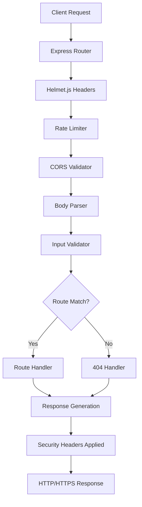

### 5.2.2 Security Middleware Stack

**Purpose and responsibilities**: Implements defense-in-depth security controls through coordinated middleware execution, providing comprehensive protection against OWASP top vulnerabilities including injection attacks, cross-site scripting, and denial-of-service attempts.

**Technologies and frameworks used**: Integrates four primary security libraries: Helmet.js for HTTP security headers, express-rate-limit for request throttling, CORS for cross-origin policy enforcement, and express-validator for input sanitization and validation.

**Key interfaces and APIs**: Operates transparently within Express.js middleware pipeline, providing standardized HTTP security headers, structured error responses (400/403/429), and request filtering capabilities based on configurable policies.

**Data persistence requirements**: Maintains in-memory rate limiting storage with sliding window algorithm, temporary CORS preflight cache, and transient validation state during request processing.

**Scaling considerations**: Memory usage scales linearly with concurrent request volume. Rate limiting storage grows with unique IP addresses, requiring periodic cleanup in high-traffic scenarios.

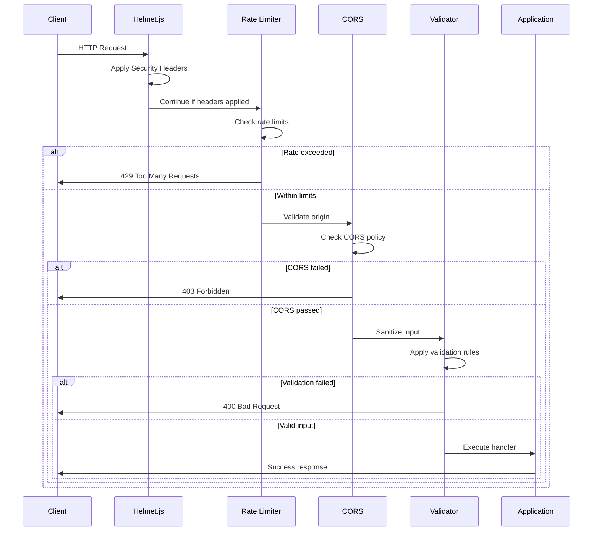

### 5.2.3 Certificate Management System

**Purpose and responsibilities**: Provides automated TLS certificate generation and management capabilities, ensuring seamless HTTPS operation without manual certificate authority interaction or external dependencies.

**Technologies and frameworks used**: Utilizes OpenSSL command-line tools through Node.js child_process integration, implementing 2048-bit RSA key generation with Subject Alternative Name (SAN) support for localhost variants.

**Key interfaces and APIs**: Exposes programmatic certificate validation through Node.js fs module integration, automated backup procedures, and secure file permission management (600 for private keys, 644 for certificates).

**Data persistence requirements**: Stores generated certificates in certificates/ directory with automatic .gitignore integration. Maintains backup copies during certificate regeneration cycles.

**Scaling considerations**: Certificate generation is a blocking operation during server startup. Production deployments should pre-generate certificates to avoid startup delays.

```mermaid
stateDiagram-v2
    [*] --> CheckCertificates
    CheckCertificates --> CertificatesExist: Certificates found
    CheckCertificates --> GenerateCertificates: No certificates
    CertificatesExist --> ValidateCertificates
    ValidateCertificates --> CertificatesReady: Valid
    ValidateCertificates --> GenerateCertificates: Invalid
    GenerateCertificates --> CheckOpenSSL
    CheckOpenSSL --> BackupExisting: OpenSSL available
    CheckOpenSSL --> HTTPSDisabled: OpenSSL unavailable
    BackupExisting --> CreateRSAKey
    CreateRSAKey --> GenerateCertificate
    GenerateCertificate --> SetPermissions
    SetPermissions --> UpdateGitignore
    UpdateGitignore --> CertificatesReady
    CertificatesReady --> [*]
    HTTPSDisabled --> [*]
```

### 5.2.4 Blitzy Minimal Server

**Purpose and responsibilities**: Serves as an immutable test fixture providing zero-dependency HTTP service with predictable "Hello, World!" responses, designed specifically for stable integration testing scenarios.

**Technologies and frameworks used**: Implements pure Node.js built-in HTTP module without external dependencies, utilizing minimalist architecture with 14 lines of executable code and localhost-only binding.

**Key interfaces and APIs**: Exposes single HTTP endpoint at localhost:3000 returning consistent "Hello, World!" response with 200 status code. Implements no authentication, logging, or middleware processing.

**Data persistence requirements**: Maintains no persistent state or data storage. Operates entirely in memory with stateless request handling.

**Scaling considerations**: Limited to single-process operation by design. Resource usage minimal (<10MB memory, <1ms response time) with no horizontal scaling capabilities or clustering support.

```mermaid
graph LR
    A[HTTP Request] --> B[Native HTTP Server]
    B --> C[Request Handler]
    C --> D[Generate Static Response]
    D --> E[Hello, World!]
    E --> F[HTTP 200 Response]
    F --> A
```

## 5.3 TECHNICAL DECISIONS

### 5.3.1 Architecture Style Decisions and Tradeoffs

**Decision: Middleware-Based Security Architecture**
- **Rationale**: Express.js middleware pipeline provides granular security control with clear separation of concerns
- **Tradeoffs**: Added complexity and performance overhead versus comprehensive security coverage
- **Alternatives Considered**: Monolithic security validation, external proxy-based security
- **Impact**: Enables modular security policies with independent component testing capabilities

**Decision: Dual HTTP/HTTPS Protocol Support**  
- **Rationale**: Provides flexibility for diverse testing scenarios while maintaining protocol security options
- **Tradeoffs**: Increased resource consumption and certificate management complexity
- **Alternatives Considered**: HTTPS-only operation, HTTP-only with reverse proxy
- **Impact**: Supports both secure and legacy integration requirements without infrastructure changes

**Decision: Zero-Dependency Test Fixture Architecture**
- **Rationale**: Eliminates dependency-related test flakiness and ensures long-term stability
- **Tradeoffs**: Limited functionality versus maximum reliability for testing scenarios
- **Alternatives Considered**: Minimal Express.js server, containerized test fixtures
- **Impact**: Provides unchanging behavior for backpropagation testing with minimal resource requirements

```mermaid
graph TD
    A[Architecture Decision] --> B{Security Requirements}
    B -->|High| C[Middleware Stack]
    B -->|Minimal| D[Zero Dependencies]
    C --> E[Express.js Pipeline]
    D --> F[Native HTTP Module]
    E --> G[Comprehensive Security]
    F --> H[Maximum Stability]
    G --> I[Production Ready]
    H --> J[Test Fixture Ready]
```

### 5.3.2 Communication Pattern Choices

**Decision: Synchronous Request-Response Pattern**
- **Rationale**: Simplifies integration testing and provides predictable response timing
- **Tradeoffs**: No asynchronous processing capabilities versus reduced complexity
- **Alternatives Considered**: Asynchronous messaging, WebSocket communication
- **Impact**: Ensures deterministic behavior for testing scenarios with minimal latency

**Decision: Stateless Session Management**
- **Rationale**: Eliminates session persistence requirements and simplifies horizontal scaling
- **Tradeoffs**: No user state tracking versus operational simplicity
- **Alternatives Considered**: JWT-based sessions, Redis session storage
- **Impact**: Reduces infrastructure dependencies and improves reliability

### 5.3.3 Data Storage Solution Rationale

**Decision: In-Memory Rate Limiting Storage**
- **Rationale**: Provides sufficient protection for development environments without persistence overhead
- **Tradeoffs**: Rate limit state lost on restart versus simplified deployment
- **Alternatives Considered**: Redis-based storage, file-based persistence
- **Impact**: Enables rate limiting functionality with zero external dependencies

**Decision: File System Certificate Storage**
- **Rationale**: Provides secure local storage with appropriate POSIX permissions
- **Tradeoffs**: Single-server limitation versus operational simplicity
- **Alternatives Considered**: Hardware Security Modules, certificate management services
- **Impact**: Enables automated HTTPS without external certificate authority dependencies

### 5.3.4 Security Mechanism Selection

**Decision: Helmet.js Security Headers Implementation**
- **Rationale**: Industry-standard security header management with minimal configuration
- **Tradeoffs**: Additional dependency versus comprehensive protection
- **Alternatives Considered**: Custom header implementation, reverse proxy headers
- **Impact**: Achieves "A" grade security rating with proven security controls

| Security Control | Implementation | Justification | Alternative Considered |
|------------------|----------------|---------------|----------------------|
| CSP Headers | Helmet.js default-src 'self' | Prevents XSS attacks | Custom CSP implementation |
| HSTS | 31536000 second max-age | Forces HTTPS connections | Shorter duration policies |
| Rate Limiting | 100 requests per 15 minutes | Prevents DoS attacks | Lower/higher thresholds |
| Input Validation | HTML escaping all inputs | Prevents injection attacks | Whitelist-based validation |

## 5.4 CROSS-CUTTING CONCERNS

### 5.4.1 Monitoring and Observability Approach

The system implements **lightweight observability** focused on operational visibility without complex monitoring infrastructure. **Health check endpoints** provide JSON-formatted status information including server uptime, timestamp, and operational state for integration with monitoring systems.

**Startup verification** occurs through structured console logging with server initialization status, port binding confirmation, and certificate generation results. **Error visibility** includes environment-aware error reporting with detailed stack traces in development mode and sanitized responses in production environments.

**Metrics collection** remains minimal by design, with no external metrics systems or performance monitoring beyond basic health checks. This approach prioritizes system simplicity while providing essential operational insights.

### 5.4.2 Logging and Tracing Strategy

**Logging philosophy** emphasizes security-aware information disclosure with environment-specific detail levels. **Startup events** include server initialization status, port binding results, certificate generation outcomes, and middleware configuration confirmation.

**Request logging** operates through Express.js built-in capabilities without external logging frameworks. **Security events** generate structured log entries for rate limiting violations, CORS policy enforcement, and input validation failures.

**Trace correlation** remains minimal due to stateless architecture and single-process operation. Error tracking focuses on request-level context without distributed tracing requirements.

### 5.4.3 Error Handling Patterns

The system implements **comprehensive error classification** with structured recovery procedures for each error category. **Port conflicts** trigger alternative port attempts before process termination, while **certificate errors** enable graceful fallback to HTTP-only operation.

**Rate limiting violations** generate HTTP 429 responses with Retry-After headers, providing client guidance for request timing. **Input validation errors** return structured 400 responses with sanitized error details protecting against information disclosure.

**Internal server errors** implement environment-aware response patterns, providing detailed debugging information in development while maintaining security-conscious generic responses in production environments.

```mermaid
flowchart TD
    A[Error Detected] --> B{Error Classification}
    B -->|Port Conflict| C[EADDRINUSE Handler]
    B -->|Certificate Error| D[TLS Fallback Handler]
    B -->|Rate Limit| E[429 Response Handler]
    B -->|Validation Error| F[400 Response Handler]
    B -->|Internal Error| G[500 Response Handler]
    
    C --> H[Attempt Alternative Port]
    H --> I{Port Available?}
    I -->|No| J[Process Termination]
    I -->|Yes| K[Continue Startup]
    
    D --> L[Disable HTTPS Server]
    L --> M[Log Certificate Warning]
    M --> N[HTTP-Only Operation]
    
    E --> O[Apply Rate Limit Headers]
    O --> P[Log Rate Limit Event]
    P --> Q[Return 429 with Retry-After]
    
    F --> R[Sanitize Error Details]
    R --> S[Return 400 Bad Request]
    S --> T[Log Validation Event]
    
    G --> U{Environment Check}
    U -->|Production| V[Generic Error Response]
    U -->|Development| W[Detailed Error Response]
    V --> X[Log Complete Error Details]
    W --> X
```

### 5.4.4 Authentication and Authorization Framework

The system implements **network-based security** through localhost-only binding rather than traditional authentication mechanisms. **Access control** relies on CORS policy enforcement restricting origins to localhost:3000 and localhost:3443 exclusively.

**Transport security** utilizes TLS encryption for HTTPS connections with automated certificate management. **Input validation** serves as the primary authorization mechanism, rejecting malformed requests before processing.

**Session management** remains intentionally absent to maintain stateless architecture principles. This approach prioritizes simplicity and predictability over complex authentication schemes.

### 5.4.5 Performance Requirements and SLAs

**Response time targets** specify <100ms for health check endpoints and <1ms for Blitzy minimal server responses. **Memory utilization** limits include <50MB for main application and <10MB for Blitzy subproject.

**Throughput requirements** accommodate 100 requests per 15-minute window per client IP address through rate limiting controls. **Availability targets** specify 99% uptime for certificate generation processes and continuous operation under normal load conditions.

**Resource consumption** optimization focuses on single-process efficiency rather than horizontal scaling capabilities, aligning with development and testing environment requirements.

| Performance Metric | Main Application | Blitzy Subproject | Measurement Method |
|-------------------|------------------|------------------|-------------------|
| Response Time | <100ms | <1ms | HTTP client timing |
| Memory Usage | <50MB | <10MB | Process monitoring |
| Request Rate | 100/15min window | Unlimited | Rate limiter metrics |
| Startup Time | <5 seconds | <1 second | Process initialization timing |

### 5.4.6 Disaster Recovery Procedures

**Failure scenarios** include port binding conflicts, certificate generation failures, OpenSSL unavailability, and process termination events. **Recovery procedures** implement automated fallback mechanisms where possible and clear manual intervention steps for unrecoverable failures.

**Port conflict recovery** attempts alternative port binding before process termination. **Certificate failure recovery** enables HTTP-only operation mode when HTTPS certificates cannot be generated or validated.

**Data recovery** requirements remain minimal due to stateless architecture design. **Backup procedures** focus on certificate file preservation during regeneration cycles, with automatic .gitignore integration preventing sensitive data exposure.

**Manual intervention procedures** include OpenSSL installation for certificate generation, port configuration adjustment for binding conflicts, and file permission correction for certificate access issues.

#### References

**Files Examined:**
- `server.js` - Main Express application implementation with comprehensive security middleware stack
- `package.json` - Dependency declarations and project metadata configuration
- `certificates/generate-certs.sh` - Automated TLS certificate generation script with OpenSSL integration
- `blitzy/documentation/Technical Specifications.md` - Comprehensive architecture documentation for zero-dependency test fixture

**Folders Explored:**
- `/` - Root repository structure containing main application components
- `certificates/` - Certificate management tooling and automated generation scripts
- `blitzy/` - Minimal test fixture subproject with zero-dependency architecture

**Technical Specification Sections Referenced:**
- `1.2 SYSTEM OVERVIEW` - High-level architecture context and success criteria
- `2.1 FEATURE CATALOG` - Feature architecture dependencies and implementation details
- `3.2 FRAMEWORKS & LIBRARIES` - Technology stack and middleware configuration
- `4.1 SYSTEM WORKFLOWS` - Data flow patterns and integration workflows
- `4.2 ERROR HANDLING AND RECOVERY PROCEDURES` - Comprehensive error management architecture

**Web Research:**
- Express.js 4.18 security middleware best practices for production deployment
- Node.js HTTPS certificate generation patterns and automated management approaches

# 6. SYSTEM COMPONENTS DESIGN

## 6.1 CORE SERVICES ARCHITECTURE

### 6.1.1 Architecture Applicability Assessment

**Core Services Architecture is not applicable for this system.** The hao-backprop-test repository implements a **dual-component monolithic pattern** rather than a distributed services architecture that would require core services infrastructure.

### 6.1.2 Architectural Pattern Analysis

The system consists of two **independent, non-communicating components** that operate as separate applications:

1. **Main Express.js Application** - Security-hardened web server with comprehensive middleware stack
2. **Blitzy Minimal Server** - Zero-dependency HTTP test fixture for stable testing scenarios

These components exhibit the following characteristics that preclude traditional core services architecture:

| Architectural Characteristic | Main Application | Blitzy Subproject | Core Services Implication |
|----------------------------|------------------|------------------|--------------------------|
| **Inter-service Communication** | None | None | No service mesh or communication protocols needed |
| **Service Discovery** | Not applicable | Not applicable | No discovery mechanisms required |
| **Load Balancing** | Single process only | Single process only | No load balancing infrastructure needed |
| **Horizontal Scaling** | Not supported | Not supported | No auto-scaling or orchestration required |

### 6.1.3 System Architecture Reality

Instead of a microservices architecture, the system implements a **"microservice-adjacent pattern"** as documented in the technical specifications, where both components operate as **self-contained, stateless applications** with distinct purposes:

```mermaid
graph TB
    subgraph "Development Environment"
        subgraph "Express.js Application (Port 3000/3443)"
            A[HTTP/HTTPS Server] --> B[Security Middleware Stack]
            B --> C[Helmet.js Headers]
            B --> D[Rate Limiting]
            B --> E[CORS Validation]
            B --> F[Input Sanitization]
            G[Certificate Manager] --> A
        end
        
        subgraph "Blitzy Test Server (Port 3000)"
            H[Native HTTP Server] --> I[Static Response Handler]
            I --> J["Hello, World!" Response]
        end
    end
    
    K[Client Requests] --> A
    L[Test Clients] --> H
    
    style A fill:#e1f5fe
    style H fill:#f3e5f5
    style G fill:#fff3e0
```

### 6.1.4 Architectural Decision Rationale

The decision to avoid microservices architecture stems from several key factors identified in the technical specifications:

**Development and Testing Focus**: The system is explicitly designed for development and testing environments, not production-scale distributed systems requiring service orchestration.

**Operational Simplicity**: Both components prioritize **zero external dependencies** and **localhost-only operation**, eliminating the complexity of service discovery, network configuration, and distributed system management.

**Resource Optimization**: With memory targets of <50MB for the main application and <10MB for Blitzy, the system is optimized for minimal resource consumption rather than distributed scaling.

**Predictable Behavior**: The **stateless design** and **synchronous request-response patterns** provide deterministic behavior essential for testing scenarios, without the complexity of distributed state management.

### 6.1.5 Alternative Architecture Benefits

The chosen architecture provides several advantages over traditional core services patterns:

```mermaid
flowchart LR
    A[Monolithic Components] --> B[Operational Simplicity]
    A --> C[Predictable Resource Usage]
    A --> D[Zero Network Dependencies]
    A --> E[Simplified Testing]
    
    B --> F[No Service Discovery]
    B --> G[No Load Balancer Configuration]
    C --> H[<50MB Total Memory]
    C --> I[<100ms Response Times]
    D --> J[Localhost-Only Binding]
    D --> K[No External Service Calls]
    E --> L[Deterministic Behavior]
    E --> M[Stable Test Fixtures]
```

**Security Benefits**: Network isolation through localhost-only binding provides inherent security without complex service-to-service authentication mechanisms.

**Reliability Benefits**: **Single points of failure** are eliminated through independent component operation, where the failure of one component does not impact the other.

**Maintenance Benefits**: Each component can be **independently developed, tested, and deployed** without coordinating service registrations or API versioning across distributed services.

### 6.1.6 Service Interaction Patterns

While traditional core services architecture is not applicable, the system does implement specific interaction patterns within each component:

```mermaid
sequenceDiagram
    participant C as Client
    participant M as Main App
    participant S as Security Stack
    participant T as Test Server
    
    Note over C,T: Independent Component Operations
    
    C->>M: HTTPS Request (Port 3443)
    M->>S: Middleware Pipeline
    S->>S: Security Validation
    S->>M: Validated Request
    M->>C: Secure Response
    
    par Independent Test Operations
        C->>T: HTTP Request (Port 3000)
        T->>C: Static Response
    end
    
    Note over M,T: No Inter-Component Communication
```

#### References

**Technical Specification Sections Analyzed:**
- `5.1 HIGH-LEVEL ARCHITECTURE` - Dual-architecture pattern documentation and microservice-adjacent design analysis
- `5.2 COMPONENT DETAILS` - Individual component specifications and integration patterns
- `5.3 TECHNICAL DECISIONS` - Architecture style decisions and middleware-based security rationale
- `5.4 CROSS-CUTTING CONCERNS` - Performance requirements and stateless design principles

**Files Examined:**
- `server.js` - Express.js application implementation demonstrating monolithic security architecture
- Repository structure analysis confirming independent component organization

**Architectural Analysis Sources:**
- Component independence verification through technical specification cross-references
- Service communication pattern analysis confirming absence of inter-service dependencies
- Scalability and resilience pattern evaluation demonstrating single-process design choices

## 6.2 DATABASE DESIGN

### 6.2.1 Database Design Applicability Assessment

**Database Design is not applicable to this system.**

The hao-backprop-test system operates as a stateless test fixture with no database or persistent data storage requirements. This architectural decision is explicitly documented and technically verified through comprehensive system analysis.

#### 6.2.1.1 Technical Justification

The absence of database design requirements is supported by the following technical evidence:

**Architectural Design Decision**: The system implements a stateless server design specifically tailored for test fixture purposes, where data persistence would introduce unnecessary complexity and operational overhead without providing functional benefits.

**Dependency Analysis**: The system's `package.json` contains only web server and security middleware dependencies (express, helmet, express-rate-limit, express-validator, cors) with no database drivers, ORM frameworks, or persistence libraries present.

**Component Architecture**: All system components operate without persistent state management, maintaining a request-response processing model that requires no data storage beyond immediate request handling.

### 6.2.2 Alternative Data Management Mechanisms

While traditional database design is not applicable, the system employs minimal data management mechanisms for specific operational requirements:

#### 6.2.2.1 In-Memory Rate Limiting Storage

**Implementation Architecture**:
- **Technology**: Express Rate Limit internal memory store
- **Scope**: Request counting per client IP address
- **Data Lifetime**: 15-minute sliding window algorithm
- **Storage Model**: Transient key-value pairs in application memory
- **Scalability Constraints**: Single-process limitation acceptable for test environment

**Data Structure**:
| Data Element | Type | Lifetime | Purpose |
|-------------|------|----------|---------|
| Client IP | String Key | 15 minutes | Rate limit identification |
| Request Count | Integer Value | 15 minutes | Threshold enforcement |
| Window Start Time | Timestamp | 15 minutes | Sliding window calculation |

#### 6.2.2.2 File System Certificate Storage

**Storage Architecture**:
- **Location**: `/certificates` directory within application root
- **File Types**: TLS private keys and certificate files
- **Security Model**: Restrictive file permissions (600 for keys, 644 for certificates)
- **Lifecycle Management**: Automated backup and regeneration processes

**Storage Pattern**:
| File Type | Permissions | Security Controls | Backup Strategy |
|-----------|-------------|-------------------|-----------------|
| Private Keys | 600 (owner only) | Git exclusion | Pre-regeneration backup |
| Certificates | 644 (read-only) | Git exclusion | Pre-regeneration backup |

### 6.2.3 Data Flow Architecture

The system's data flow operates without persistent storage layers, implementing a stateless processing model:

```mermaid
flowchart TD
    A[Incoming Request] --> B[Security Middleware]
    B --> C[Rate Limit Check]
    C --> D{Rate Limit Exceeded?}
    D -->|Yes| E[Return 429 Response]
    D -->|No| F[Process Request]
    F --> G[Generate Response]
    G --> H[Update Rate Counter]
    H --> I[Return Response]
    
    J[Certificate Generation] --> K[File System Write]
    K --> L[Certificate Backup]
    
    style C fill:#e1f5fe
    style H fill:#e1f5fe
    style K fill:#fff3e0
```

#### 6.2.3.1 Request Processing Data Flow

**Stateless Processing Model**: Each request follows a complete processing cycle without maintaining state between requests. Rate limiting counters represent the only shared data element across requests, stored transiently in application memory.

**Data Transformation Points**:
1. **Input Sanitization**: User-provided data undergoes HTML escaping and validation
2. **Rate Counter Updates**: IP-based counters increment with timestamp tracking
3. **Response Generation**: Dynamic content creation without data persistence

#### 6.2.3.2 Certificate Management Data Flow

**File-Based Storage Model**: Certificate generation creates persistent files exclusively for TLS operation support, with no database-style querying or relationship management.

**Operational Flow**:
1. **Certificate Generation**: OpenSSL commands produce PEM-formatted files
2. **File System Storage**: Certificates written to designated directory with security permissions
3. **Backup Management**: Existing certificates backed up before regeneration

### 6.2.4 System State Management

#### 6.2.4.1 Stateless Architecture Benefits

The absence of database design provides specific advantages for the test fixture use case:

**Operational Simplicity**: No database installation, configuration, or maintenance requirements eliminate deployment complexity and reduce potential failure points.

**Testing Predictability**: Stateless operation ensures consistent test behavior without data state interference between test runs.

**Resource Efficiency**: Minimal memory footprint and no persistent storage I/O operations optimize performance for test environment constraints.

**Security Posture**: No database attack surface reduces security vulnerabilities and eliminates database-specific hardening requirements.

#### 6.2.4.2 Limitations and Considerations

**Scalability Constraints**: In-memory rate limiting restricts horizontal scaling to single-process deployments, which aligns with test fixture requirements but would require architectural changes for production deployment.

**Data Durability**: Rate limiting state resets on application restart, which is acceptable for test environments but would require persistence for production usage.

**Monitoring Limitations**: No query-based monitoring or analytics capabilities, though this aligns with the minimal test fixture purpose.

### 6.2.5 Future Considerations

#### 6.2.5.1 Database Integration Scenarios

Should the system evolve beyond its current test fixture purpose, database integration would require:

**Architecture Modification**: Transition from stateless to stateful design with persistent session management and user data storage requirements.

**Technology Selection**: Evaluation of database technologies appropriate for the evolved use case, considering factors such as transaction requirements, query complexity, and scalability needs.

**Migration Strategy**: Development of data migration procedures to preserve existing rate limiting behavior while introducing persistent storage capabilities.

#### 6.2.5.2 Recommended Database Patterns

For hypothetical future database integration:

| Use Case | Recommended Pattern | Technology Considerations |
|----------|-------------------|--------------------------|
| Session Management | Key-Value Store | Redis, DynamoDB |
| User Authentication | Relational Database | PostgreSQL, MySQL |
| Analytics Data | Time-Series Database | InfluxDB, TimescaleDB |

#### References

Technical Specification sections examined:
- `3.5 DATABASES & STORAGE` - Primary confirmation of no database requirements
- `5.1 HIGH-LEVEL ARCHITECTURE` - System-level architecture validation

Repository files analyzed:
- `package.json` - Dependency verification for database-related libraries
- `server.js` - Implementation analysis confirming stateless design
- `certificates/` - File system storage pattern documentation

## 6.3 INTEGRATION ARCHITECTURE

### 6.3.1 Integration Architecture Scope

The hao-backprop-test system implements a **minimal integration architecture** designed specifically for development and testing environments. Unlike production systems requiring complex external service integrations, this architecture prioritizes **self-containment and operational simplicity** while maintaining essential security controls through middleware-based integration patterns.

The system's integration strategy follows a **"minimal viable integration" approach** where external dependencies are limited to essential tooling (OpenSSL for certificate management) and internal integrations focus on security middleware orchestration rather than distributed service communication.

#### 6.3.1.1 Integration Design Philosophy

The architectural approach emphasizes:
- **Localhost-only operation** eliminating network-based external service dependencies
- **Synchronous request-response patterns** avoiding complex asynchronous integration challenges
- **Stateless design** eliminating session management and persistent connection requirements
- **Security-first middleware integration** implementing defense-in-depth through layered controls

### 6.3.2 API DESIGN

#### 6.3.2.1 Protocol Specifications

The system implements a **dual-protocol architecture** supporting both HTTP and HTTPS communications:

| Protocol | Port | Primary Use Case | Security Controls |
|----------|------|------------------|-------------------|
| HTTP | 3000 | Development and testing | Rate limiting, CORS, input validation |
| HTTPS | 3443 | Secure communications | Full security middleware stack + TLS encryption |

**TLS Configuration**:
- **Certificate Type**: Self-signed X.509 certificates
- **Key Strength**: 2048-bit RSA encryption
- **Certificate Management**: Automated generation and renewal via OpenSSL integration
- **Storage Location**: `certificates/` directory with appropriate file permissions (600 for keys, 644 for certificates)

#### 6.3.2.2 API Endpoint Specifications

The system exposes two REST endpoints with minimal complexity:

| Endpoint | Method | Response Format | Purpose | Authentication |
|----------|--------|----------------|---------|----------------|
| `/` | GET | text/plain | Basic connectivity test ("Hello, World!") | None |
| `/health` | GET | application/json | Service health status with uptime metrics | None |

**Health Endpoint Response Schema**:
```json
{
  "status": "ok",
  "timestamp": "ISO-8601 datetime",
  "uptime": "seconds since server start"
}
```

#### 6.3.2.3 Authentication and Authorization Framework

**Authentication**: Not implemented in this test environment system. The design intentionally excludes authentication mechanisms to maintain operational simplicity for development and testing scenarios.

**Authorization**: Not applicable due to the absence of authentication and the localhost-only operational scope.

**Security Rationale**: The system operates under the **"network isolation" security model** where localhost-only binding provides inherent access control without requiring application-level authentication mechanisms.

#### 6.3.2.4 Rate Limiting Strategy

**Implementation**: Express-rate-limit middleware with in-memory storage
- **Rate Limit**: 100 requests per 15-minute sliding window
- **Scope**: Applied per IP address
- **Headers**: Compliant with draft-8 standard rate limiting headers
- **Storage**: In-memory tracking (resets on server restart)
- **Behavior**: Returns HTTP 429 (Too Many Requests) when limits exceeded

```mermaid
graph TD
    A[Incoming Request] --> B[Rate Limit Check]
    B -->|Under Limit| C[Process Request]
    B -->|Over Limit| D[Return 429 Error]
    C --> E[Update Request Count]
    E --> F[Continue to Next Middleware]
    D --> G[Include Retry-After Header]
```

#### 6.3.2.5 Versioning Approach

**API Versioning**: Not implemented due to the minimal API surface and testing-focused scope.

**Future Considerations**: The Express.js framework supports path-based versioning (`/v1/endpoint`) if future requirements necessitate API evolution.

#### 6.3.2.6 Documentation Standards

**OpenAPI/Swagger**: Not implemented given the two-endpoint API scope
**Documentation Location**: Technical specification provides comprehensive API documentation
**Standards Compliance**: REST principles followed for resource naming and HTTP status codes

### 6.3.3 MESSAGE PROCESSING

#### 6.3.3.1 Processing Architecture Assessment

**Message Processing is not applicable for this system.** The hao-backprop-test system implements a **synchronous request-response pattern** exclusively, with no asynchronous message processing, event-driven architecture, or queue-based communication patterns.

#### 6.3.3.2 Request Processing Pattern

The system follows a **sequential middleware pipeline** for request processing:

```mermaid
sequenceDiagram
    participant C as Client
    participant H as Helmet.js
    participant R as Rate Limiter
    participant CO as CORS
    participant V as Validator
    participant A as Application Logic
    
    C->>H: HTTP Request
    H->>R: Add Security Headers
    R->>CO: Check Rate Limits
    CO->>V: Validate Origin
    V->>A: Sanitize Input
    A->>V: Generate Response
    V->>CO: Apply Security Headers
    CO->>R: CORS Headers
    R->>H: Rate Limit Headers
    H->>C: Final Response
```

#### 6.3.3.3 Error Handling Strategy

**Synchronous Error Processing**: All errors are handled within the request-response cycle
- **Validation Errors**: Return structured JSON with HTTP 400 status
- **Rate Limit Errors**: Return HTTP 429 with retry-after headers
- **System Errors**: Graceful degradation with appropriate HTTP status codes
- **Security Violations**: Blocked at middleware level with minimal error disclosure

### 6.3.4 EXTERNAL SYSTEMS

#### 6.3.4.1 Third-Party Integration Patterns

**OpenSSL Command Line Integration**:
- **Integration Type**: System command execution via `child_process.execSync`
- **Purpose**: Automated SSL certificate generation and management
- **Data Flow**: Bash script wrapper → OpenSSL CLI → File system certificate storage
- **Error Handling**: Script-level validation with fallback procedures

```mermaid
graph LR
    A[Certificate Manager] --> B[Bash Script Wrapper]
    B --> C[OpenSSL Command Execution]
    C --> D[Certificate Generation]
    D --> E[File System Storage]
    E --> F[Permission Setting]
    F --> G[Server Configuration]
```

#### 6.3.4.2 Legacy System Interfaces

**No legacy system interfaces are present.** The system is designed as a greenfield test fixture without integration requirements for existing legacy systems.

#### 6.3.4.3 API Gateway Configuration

**API Gateway is not applicable.** The system operates as a standalone application without external API gateway requirements due to its localhost-only operational scope and testing-focused purpose.

#### 6.3.4.4 External Service Contracts

| Service | Contract Type | SLA Requirements | Integration Method |
|---------|---------------|------------------|-------------------|
| OpenSSL | System dependency | 99% availability for HTTPS operations | Command-line interface |
| Node.js Runtime | Platform dependency | Version 16+ compatibility | Native APIs |
| Operating System | System integration | POSIX signal handling for graceful shutdown | System calls |

### 6.3.5 INTEGRATION FLOW DIAGRAMS

#### 6.3.5.1 Overall Integration Architecture

```mermaid
graph TB
    subgraph "Client Layer"
        C1[HTTP Client]
        C2[HTTPS Client]
        C3[Test Clients]
    end
    
    subgraph "Application Layer"
        subgraph "Express.js Server"
            MW1[Helmet.js Security Headers]
            MW2[Rate Limiter]
            MW3[CORS Validation]
            MW4[Input Validator]
            APP[Application Logic]
        end
        
        subgraph "Blitzy Test Server"
            BZ[Zero-Dependency HTTP Server]
        end
    end
    
    subgraph "System Integration Layer"
        SSL[OpenSSL Certificate Manager]
        FS[File System]
        OS[Operating System]
    end
    
    C1 -->|HTTP :3000| MW1
    C2 -->|HTTPS :3443| MW1
    C3 -->|HTTP :3000| BZ
    
    MW1 --> MW2
    MW2 --> MW3
    MW3 --> MW4
    MW4 --> APP
    
    SSL --> FS
    SSL --> OS
    APP --> OS
    
    style MW1 fill:#e1f5fe
    style MW2 fill:#e8f5e8
    style MW3 fill:#fff3e0
    style MW4 fill:#fce4ec
    style SSL fill:#f3e5f5
```

#### 6.3.5.2 Certificate Management Integration Flow

```mermaid
sequenceDiagram
    participant S as Server Startup
    participant CM as Certificate Manager
    participant BS as Bash Script
    participant OS as OpenSSL
    participant FS as File System
    participant HS as HTTPS Server
    
    S->>CM: Initialize Certificates
    CM->>BS: Execute generate-certs.sh
    BS->>OS: Generate Private Key
    OS->>FS: Write server.key (600 permissions)
    BS->>OS: Generate Certificate
    OS->>FS: Write server.crt (644 permissions)
    BS->>CM: Return Success
    CM->>HS: Configure TLS Context
    HS->>S: HTTPS Server Ready
    
    Note over BS,FS: Automated backup of existing certificates
    Note over CM,HS: Graceful fallback to HTTP on certificate failure
```

#### 6.3.5.3 Request Processing Integration Flow

```mermaid
graph TD
    A[Client Request] --> B{Protocol Type}
    B -->|HTTP| C[HTTP Server :3000]
    B -->|HTTPS| D[HTTPS Server :3443]
    
    C --> E[Security Middleware Pipeline]
    D --> E
    
    E --> F[Helmet.js Headers]
    F --> G[Rate Limit Check]
    G --> H{Rate Limit OK?}
    H -->|No| I[Return 429 Error]
    H -->|Yes| J[CORS Validation]
    J --> K{Origin Allowed?}
    K -->|No| L[Return CORS Error]
    K -->|Yes| M[Input Validation]
    M --> N[Route Handler]
    N --> O[Generate Response]
    O --> P[Apply Security Headers]
    P --> Q[Return to Client]
    
    style F fill:#e1f5fe
    style G fill:#e8f5e8
    style J fill:#fff3e0
    style M fill:#fce4ec
```

### 6.3.6 INTEGRATION DEPENDENCIES

#### 6.3.6.1 Runtime Dependencies

| Dependency | Version | Integration Purpose | Criticality |
|------------|---------|-------------------|-------------|
| Node.js | 16+ | JavaScript runtime platform | Critical |
| Express.js | ^4.18.0 | Web framework and middleware orchestration | Critical |
| OpenSSL | System default | Certificate generation and TLS support | High |
| Helmet.js | ^7.0.0 | Security header integration | High |
| Express-rate-limit | ^7.0.0 | Rate limiting middleware integration | Medium |

#### 6.3.6.2 Integration Monitoring

**Health Check Integration**: The `/health` endpoint provides integration status monitoring:
- **Server Uptime**: Confirms successful server initialization and certificate loading
- **Response Time**: Validates middleware pipeline performance
- **Timestamp**: Provides server time synchronization reference

**Certificate Integration Monitoring**: Automated through the certificate generation script with:
- **Backup Verification**: Confirms existing certificate preservation
- **Permission Validation**: Ensures proper file system security
- **Generation Success**: Validates OpenSSL integration functionality

### 6.3.7 INTEGRATION SECURITY CONTROLS

#### 6.3.7.1 Defense-in-Depth Integration

The security middleware stack implements layered integration controls:

| Layer | Integration Component | Security Function |
|-------|----------------------|-------------------|
| 1 | Rate Limiter | Request flood protection |
| 2 | Helmet.js | Security header enforcement |
| 3 | CORS | Origin validation |
| 4 | Express Validator | Input sanitization |
| 5 | TLS | Transport encryption |

#### 6.3.7.2 Certificate Security Integration

**Automated Security Measures**:
- **Key Protection**: Private keys stored with 600 permissions (owner read/write only)
- **Certificate Transparency**: Public certificates with 644 permissions
- **Backup Strategy**: Existing certificates preserved during regeneration
- **Git Exclusion**: Certificates automatically excluded from version control

#### References

**Files Examined:**
- `server.js` - Express.js server implementation with security middleware integration
- `certificates/generate-certs.sh` - OpenSSL integration script for automated certificate management
- `blitzy/server.js` - Zero-dependency HTTP server implementation

**Folders Analyzed:**
- `/` - Root project structure and main application integration points
- `/certificates/` - TLS certificate management and OpenSSL integration tooling
- `/blitzy/` - Minimal HTTP server subproject with independent integration patterns

**Technical Specification Sections Referenced:**
- `3.2 FRAMEWORKS & LIBRARIES` - Security middleware stack and integration patterns
- `3.4 THIRD-PARTY SERVICES` - External dependency integration requirements
- `3.7 TECHNOLOGY INTEGRATION REQUIREMENTS` - Component interaction patterns and security integration
- `5.1 HIGH-LEVEL ARCHITECTURE` - Overall system integration architecture and external integration points
- `6.1 CORE SERVICES ARCHITECTURE` - Service integration patterns and architectural decisions

## 6.4 SECURITY ARCHITECTURE

### 6.4.1 Security Architecture Overview

The hao-backprop-test system implements a **Network Isolation Security Model** specifically designed for development and testing environments. Rather than implementing traditional authentication and authorization mechanisms, the system achieves security through localhost-only binding and a comprehensive defense-in-depth middleware security stack.

This security architecture prioritizes **operational simplicity** while maintaining essential security controls through layered middleware integration patterns and transport-layer encryption for secure communications.

#### 6.4.1.1 Security Design Philosophy

The architectural approach emphasizes:
- **Network-based access control** through localhost-only operation (127.0.0.1 binding)
- **Defense-in-depth security** through layered middleware controls
- **Transport security** via automated TLS certificate management
- **Input validation** as primary attack surface protection
- **Security-aware error handling** preventing information disclosure

### 6.4.2 Authentication Framework

#### 6.4.2.1 Authentication Approach

**Detailed Authentication Framework is not applicable for this system.** The system implements a **network isolation security model** where authentication is achieved through localhost-only network binding rather than application-level authentication mechanisms.

| Security Control | Implementation | Justification |
|------------------|----------------|---------------|
| Access Control | Localhost-only binding (127.0.0.1) | Inherent network-level access restriction |
| Identity Management | Not implemented | Testing environment scope eliminates multi-user scenarios |
| Session Management | Stateless architecture | No persistent session requirements |
| Token Handling | Not applicable | No authentication tokens required |

#### 6.4.2.2 Network-Based Security Model

```mermaid
graph TB
    subgraph "External Network"
        EXT[External Clients]
    end
    
    subgraph "Localhost Network (127.0.0.1)"
        subgraph "Application Layer"
            HTTP[HTTP Server :3000]
            HTTPS[HTTPS Server :3443]
        end
        
        subgraph "Security Middleware Stack"
            HELM[Helmet.js Headers]
            RATE[Rate Limiter]
            CORS[CORS Validation]
            VALID[Input Validator]
        end
        
        LC[Local Clients]
    end
    
    EXT -.->|Blocked| HTTP
    EXT -.->|Blocked| HTTPS
    LC -->|Allowed| HTTP
    LC -->|Allowed| HTTPS
    
    HTTP --> HELM
    HTTPS --> HELM
    HELM --> RATE
    RATE --> CORS
    CORS --> VALID
    
    style EXT fill:#ffebee
    style LC fill:#e8f5e8
    style HELM fill:#e1f5fe
    style RATE fill:#e8f5e8
    style CORS fill:#fff3e0
    style VALID fill:#fce4ec
```

### 6.4.3 Authorization System

#### 6.4.3.1 Authorization Approach

**Traditional Authorization System is not applicable for this system.** The localhost-only operational scope eliminates requirements for role-based access control, permission management, and resource authorization mechanisms.

| Authorization Component | Status | Alternative Implementation |
|------------------------|--------|---------------------------|
| Role-Based Access Control | Not implemented | Network isolation provides inherent access control |
| Permission Management | Not applicable | All localhost clients have equivalent access |
| Resource Authorization | Via input validation | Malformed requests rejected at middleware level |
| Policy Enforcement Points | CORS and rate limiting | Origin and request frequency controls |

#### 6.4.3.2 Access Control Flow

```mermaid
sequenceDiagram
    participant C as Client
    participant N as Network Layer
    participant H as Helmet.js
    participant R as Rate Limiter
    participant CO as CORS
    participant V as Input Validator
    participant A as Application Logic
    
    C->>N: Request to localhost
    N->>H: Network access granted
    H->>R: Security headers applied
    R->>CO: Rate limit check passed
    CO->>V: Origin validation passed
    V->>A: Input sanitization passed
    A->>V: Generate response
    V->>CO: Return response
    CO->>R: Apply CORS headers
    R->>H: Apply rate limit headers
    H->>N: Apply security headers
    N->>C: Final response
    
    Note over N: Network-level access control
    Note over R: Request frequency authorization
    Note over CO: Origin-based authorization
    Note over V: Input-based authorization
```

### 6.4.4 Data Protection

#### 6.4.4.1 Encryption Standards

**Transport Layer Security (TLS)**:
- **Certificate Type**: X.509 self-signed certificates
- **Key Algorithm**: RSA 2048-bit encryption
- **Certificate Validity**: 365 days (configurable)
- **Subject Alternative Names**: localhost, *.localhost, 127.0.0.1, ::1
- **TLS Configuration**: Node.js HTTPS server with automated certificate loading

**Data in Transit Protection**:
| Protocol | Port | Encryption | Certificate Management |
|----------|------|------------|----------------------|
| HTTP | 3000 | None | Not applicable |
| HTTPS | 3443 | TLS 1.2+ | Automated self-signed certificates |

#### 6.4.4.2 Key Management

**Certificate Generation Process**:
```mermaid
flowchart TD
    A[Server Startup] --> B[Certificate Check]
    B --> C{Certificates Exist?}
    C -->|No| D[Generate New Certificates]
    C -->|Yes| E[Validate Existing Certificates]
    
    D --> F[Execute generate-certs.sh]
    F --> G[Generate RSA Private Key]
    G --> H[Create X.509 Certificate]
    H --> I[Set File Permissions]
    I --> J[Update .gitignore]
    J --> K[HTTPS Server Ready]
    
    E --> L{Certificates Valid?}
    L -->|Yes| K
    L -->|No| M[Backup Existing Certificates]
    M --> D
    
    K --> N[TLS Context Configured]
    
    style G fill:#e1f5fe
    style H fill:#e8f5e8
    style I fill:#fff3e0
    style J fill:#fce4ec
```

**Key Security Controls**:
- **Private Key Protection**: 600 file permissions (owner read/write only)
- **Certificate Storage**: 644 file permissions (public read)
- **Backup Strategy**: Existing certificates preserved with timestamps during regeneration
- **Version Control Security**: Certificates automatically excluded via .gitignore integration

#### 6.4.4.3 Data Masking and Sanitization

**Input Sanitization Framework**:
- **HTML Escaping**: All user inputs processed via Express Validator's `body('*').escape()`
- **Structured Error Responses**: Validation errors return sanitized 400 responses
- **Cross-Site Scripting Protection**: Content Security Policy prevents inline script execution
- **Injection Attack Prevention**: Comprehensive input validation rules

**Environment-Aware Information Disclosure**:
| Environment | Error Detail Level | Information Disclosure Policy |
|-------------|-------------------|-------------------------------|
| Development | Full stack traces | Complete error details for debugging |
| Production | Generic error messages | Minimal information to prevent reconnaissance |
| Testing | Structured error responses | Sanitized details for automated testing |

#### 6.4.4.4 Secure Communication

**HTTP Security Headers (Helmet.js Configuration)**:
```mermaid
graph LR
    subgraph "Security Headers"
        CSP[Content Security Policy]
        HSTS[HTTP Strict Transport Security]
        XFO[X-Frame-Options]
        XCT[X-Content-Type-Options]
        RP[Referrer-Policy]
    end
    
    subgraph "CSP Directives"
        DS[default-src: 'self']
        SS[style-src: 'self' 'unsafe-inline']
        SC[script-src: 'self']
        IS[img-src: 'self' data: https:]
    end
    
    CSP --> DS
    CSP --> SS
    CSP --> SC
    CSP --> IS
    
    style CSP fill:#e1f5fe
    style HSTS fill:#e8f5e8
    style XFO fill:#fff3e0
    style XCT fill:#fce4ec
```

### 6.4.5 Security Control Matrix

#### 6.4.5.1 Defense-in-Depth Controls

| Security Layer | Control Type | Implementation | Configuration |
|----------------|--------------|----------------|---------------|
| Network | Access Control | Localhost-only binding | 127.0.0.1:3000, 127.0.0.1:3443 |
| Transport | Encryption | TLS/SSL | RSA 2048-bit, X.509 certificates |
| Application | Rate Limiting | Express Rate Limit | 100 requests/15min window |
| Application | Header Security | Helmet.js | CSP, HSTS, XFO, XCTO |
| Application | Origin Control | CORS | Allowlist: localhost:3000, localhost:3443 |
| Application | Input Validation | Express Validator | HTML escaping, validation rules |

#### 6.4.5.2 Security Middleware Execution Order

```mermaid
graph TD
    A[Incoming Request] --> B[Helmet.js Security Headers]
    B --> C[Express Rate Limit]
    C --> D[CORS Origin Validation]
    D --> E[Express Validator Input Sanitization]
    E --> F[Application Logic]
    F --> G[Response Generation]
    G --> H[Security Headers Applied]
    H --> I[Rate Limit Headers]
    I --> J[CORS Headers]
    J --> K[Final Response]
    
    style B fill:#e1f5fe
    style C fill:#e8f5e8
    style D fill:#fff3e0
    style E fill:#fce4ec
```

### 6.4.6 Security Zone Architecture

#### 6.4.6.1 Network Security Zones

```mermaid
graph TB
    subgraph "Internet Zone"
        INT[Internet Clients]
    end
    
    subgraph "DMZ Zone - Not Applicable"
        DMZ[No DMZ Components]
    end
    
    subgraph "Internal Zone (Localhost)"
        subgraph "Application Security Zone"
            subgraph "Main Application"
                MS[Main Server - Express.js]
                MW[Security Middleware Stack]
            end
            
            subgraph "Test Fixture"
                BZ[Blitzy Server - Zero Dependencies]
            end
        end
        
        subgraph "Certificate Management Zone"
            CM[Certificate Manager]
            FS[File System Certificate Storage]
        end
        
        subgraph "System Integration Zone"
            OS[OpenSSL Integration]
            SYS[Operating System]
        end
    end
    
    INT -.->|Blocked| MS
    INT -.->|Blocked| BZ
    
    LC[Local Clients] --> MS
    LC --> BZ
    
    MS <--> MW
    MS <--> CM
    CM <--> FS
    CM <--> OS
    OS <--> SYS
    
    style INT fill:#ffebee
    style LC fill:#e8f5e8
    style MS fill:#e1f5fe
    style MW fill:#e8f5e8
    style BZ fill:#fff3e0
    style CM fill:#fce4ec
```

#### 6.4.6.2 Trust Boundaries

| Zone | Trust Level | Access Controls | Communication Protocols |
|------|-------------|-----------------|------------------------|
| Internet | Untrusted | Network-level blocking | None (blocked) |
| Localhost | Trusted | Middleware validation | HTTP/HTTPS with security headers |
| Application | High Trust | Input sanitization | Internal function calls |
| File System | System Trust | File permissions (600/644) | OS-level file operations |

### 6.4.7 Security Policies and Compliance

#### 6.4.7.1 Security Policy Framework

| Policy Area | Policy Statement | Implementation | Compliance Check |
|-------------|------------------|----------------|------------------|
| Access Control | Localhost-only access permitted | Network binding to 127.0.0.1 | Server startup verification |
| Rate Limiting | Maximum 100 requests per 15-minute window | Express Rate Limit middleware | Request counter monitoring |
| Input Validation | All user inputs must be sanitized | Express Validator HTML escaping | Validation error logging |
| Transport Security | HTTPS required for secure communications | TLS certificate automation | Certificate generation validation |

#### 6.4.7.2 Compliance Requirements

**Development Environment Security Standards**:
- **OWASP Top 10 Mitigations**: Implemented via security middleware stack
- **Transport Security**: TLS encryption for sensitive communications
- **Input Validation**: Comprehensive sanitization against injection attacks
- **Security Headers**: Industry-standard HTTP security headers via Helmet.js

**Audit Logging Framework**:
| Event Type | Log Level | Information Captured | Retention Policy |
|------------|-----------|---------------------|------------------|
| Rate Limit Violations | WARN | IP address, timestamp, request count | Session-based (in-memory) |
| CORS Violations | WARN | Origin, blocked request details | Session-based (in-memory) |
| Validation Errors | INFO | Sanitized error details, timestamp | Session-based (in-memory) |
| Certificate Operations | INFO | Generation status, expiration dates | Console logging only |

### 6.4.8 Security Monitoring and Incident Response

#### 6.4.8.1 Security Event Detection

```mermaid
graph TD
    A[Security Event] --> B{Event Type}
    B -->|Rate Limit Exceeded| C[Log Rate Limit Violation]
    B -->|CORS Violation| D[Log Origin Violation]
    B -->|Input Validation Failed| E[Log Validation Error]
    B -->|Certificate Error| F[Log Certificate Issue]
    
    C --> G[Return 429 with Retry-After]
    D --> H[Return CORS Error]
    E --> I[Return 400 Bad Request]
    F --> J[Fallback to HTTP-Only]
    
    G --> K[Security Event Logged]
    H --> K
    I --> K
    J --> K
    
    style C fill:#ffebee
    style D fill:#fff3e0
    style E fill:#fce4ec
    style F fill:#e8f5e8
```

#### 6.4.8.2 Incident Response Procedures

**Automated Response Mechanisms**:
- **Rate Limiting**: Automatic request throttling with progressive backoff
- **Certificate Failures**: Graceful fallback to HTTP-only operation
- **Port Conflicts**: Alternative port binding attempts before termination
- **Validation Errors**: Structured error responses with sanitized details

### 6.4.9 Security Testing and Validation

#### 6.4.9.1 Security Validation Framework

**Testing Approach**: The system security is validated through:
- **Middleware Integration Testing**: Verification of security header application
- **Rate Limiting Validation**: Confirmation of request throttling behavior
- **Certificate Generation Testing**: Automated certificate creation and validation
- **CORS Policy Testing**: Origin validation and blocking verification

**Security Test Categories**:
| Test Category | Test Method | Expected Outcome | Validation Criteria |
|---------------|-------------|------------------|-------------------|
| Network Isolation | External connection attempts | Connection refused | No external network access |
| Rate Limiting | Burst request testing | HTTP 429 responses | Rate limits enforced |
| Input Validation | Malformed input testing | Sanitized error responses | XSS prevention validated |
| Certificate Management | TLS handshake testing | Successful HTTPS connections | Certificate validation passed |

### 6.4.10 Security Architecture Evolution

#### 6.4.10.1 Future Security Considerations

**Production Migration Requirements**:
- **Authentication Framework**: OAuth 2.0 or JWT-based authentication
- **Authorization System**: Role-based access control (RBAC) implementation
- **Certificate Management**: Production-grade certificate authority integration
- **Network Security**: Reverse proxy integration with WAF capabilities
- **Monitoring**: Centralized security event management (SIEM) integration

**Scalability Security Considerations**:
- **Distributed Rate Limiting**: Redis-based rate limiting for multi-instance deployment
- **Session Management**: Secure session store implementation
- **API Gateway Integration**: Centralized security policy enforcement
- **Container Security**: Docker security scanning and runtime protection

#### References

**Files Examined:**
- `server.js` - Express.js application with comprehensive security middleware implementation
- `certificates/generate-certs.sh` - Automated TLS certificate generation script with security controls
- `certificates/.gitignore` - Certificate security policies preventing sensitive file exposure
- `package.json` - Security dependency declarations and version specifications

**Folders Explored:**
- `/` - Root repository structure containing main application security components
- `/certificates/` - TLS certificate management tooling with automated security controls
- `/blitzy/` - Minimal test fixture subproject with zero-dependency security model

**Technical Specification Sections Referenced:**
- `5.4 CROSS-CUTTING CONCERNS` - Authentication framework overview and security approach
- `3.2 FRAMEWORKS & LIBRARIES` - Security middleware specifications and integration patterns
- `4.2 ERROR HANDLING AND RECOVERY PROCEDURES` - Security-aware error handling flows
- `6.3 INTEGRATION ARCHITECTURE` - Defense-in-depth integration security controls

**Web Research:**
- Express.js and Helmet.js security best practices (2025) - Current security implementation standards for Node.js applications

## 6.5 MONITORING AND OBSERVABILITY

### 6.5.1 Monitoring Architecture Assessment

#### 6.5.1.1 System Classification and Monitoring Scope

**Detailed Monitoring Architecture is not applicable for this system.** The hao-backprop-test server operates as a security-hardened test harness designed for integration testing scenarios, not as a production service requiring comprehensive monitoring infrastructure.

The system implements **lightweight observability** focused on operational visibility without complex monitoring infrastructure, aligning with its role as a test fixture rather than a production service. This architectural decision prioritizes simplicity and reliability for testing environments while providing essential operational insights.

#### 6.5.1.2 Monitoring Philosophy and Design Principles

The monitoring approach follows these core principles:

| Principle | Implementation | Rationale |
|-----------|----------------|-----------|
| **Minimal Overhead** | No external monitoring systems | Preserves test environment stability |
| **Essential Visibility** | Health checks and console logging | Provides operational clarity without complexity |
| **Security-Aware Logging** | Environment-specific detail levels | Protects sensitive information in production mode |

### 6.5.2 Implemented Observability Patterns

#### 6.5.2.1 Health Check Implementation

The system provides a comprehensive health check endpoint that serves as the primary monitoring interface:

**Health Check Endpoint**: `GET /health`
- **Response Format**: JSON with operational status
- **Response Time Target**: <100ms
- **Availability**: Continuous during server operation

**Health Check Response Structure**:
```json
{
  "status": "healthy",
  "timestamp": "2024-01-15T10:30:00.123Z",
  "uptime": 3600.45
}
```

#### 6.5.2.2 Logging Strategy and Implementation

The system implements structured logging through Node.js console capabilities with environment-aware detail management:

**Startup Event Logging**:
- Server initialization status and timing
- Port binding confirmation for HTTP (3000) and HTTPS (3443)
- Certificate generation outcomes and validation results
- Middleware configuration confirmation

**Security Event Logging**:
- Rate limiting violations with client identification
- CORS policy enforcement actions
- Input validation failures with sanitized details
- Authentication bypass attempts (network-based security)

**Error Event Logging**:
- Environment-aware error detail exposure
- Complete stack traces in development mode
- Sanitized generic responses in production mode
- Request context preservation for debugging

#### 6.5.2.3 Performance Metrics and SLA Monitoring

| Performance Metric | Target Value | Measurement Method | Monitoring Frequency |
|-------------------|--------------|-------------------|---------------------|
| **Health Check Response** | <100ms | HTTP client timing | Per request |
| **Memory Utilization** | <50MB (main), <10MB (Blitzy) | Process monitoring | Continuous |
| **Request Rate Compliance** | 100 requests/15min window | Rate limiter metrics | Real-time |
| **Server Startup Time** | <5 seconds (main), <1 second (Blitzy) | Process initialization timing | Per startup |

### 6.5.3 Operational Monitoring Workflows

#### 6.5.3.1 Health Check Integration

```mermaid
flowchart TD
    A[External Monitor] --> B[GET /health Request]
    B --> C[Health Check Handler]
    C --> D[Collect System Metrics]
    D --> E[Generate Response]
    E --> F{System Healthy?}
    F -->|Yes| G[Return 200 OK]
    F -->|No| H[Return 503 Service Unavailable]
    G --> I[Log Successful Check]
    H --> J[Log Health Check Failure]
    I --> K[Update Monitoring System]
    J --> K
```

#### 6.5.3.2 Error Detection and Response Flow

```mermaid
flowchart TD
    A[Error Detected] --> B{Error Classification}
    B -->|Port Conflict| C[EADDRINUSE Handler]
    B -->|Certificate Error| D[TLS Fallback Handler]
    B -->|Rate Limit Violation| E[429 Response Handler]
    B -->|Input Validation Error| F[400 Response Handler]
    B -->|Internal Server Error| G[500 Response Handler]
    
    C --> H[Log Port Conflict]
    H --> I[Attempt Alternative Port]
    I --> J{Alternative Available?}
    J -->|Yes| K[Continue Operation]
    J -->|No| L[Terminate Process]
    
    D --> M[Log Certificate Warning]
    M --> N[Enable HTTP-Only Mode]
    N --> O[Continue Operation]
    
    E --> P[Log Rate Limit Event]
    P --> Q[Return 429 with Retry-After]
    
    F --> R[Log Validation Failure]
    R --> S[Return Sanitized Error]
    
    G --> T{Environment Check}
    T -->|Production| U[Log Full Details + Generic Response]
    T -->|Development| V[Log + Detailed Response]
```

### 6.5.4 Alert Management and Thresholds

#### 6.5.4.1 Alert Threshold Matrix

| Alert Type | Threshold | Severity | Response Action |
|------------|-----------|----------|-----------------|
| **Health Check Failure** | 3 consecutive failures | High | Investigate server status |
| **Memory Usage** | >40MB sustained (80% of limit) | Medium | Monitor for memory leaks |
| **Response Time** | >200ms sustained (2x target) | Medium | Investigate performance issues |
| **Rate Limit Violations** | >10 violations/minute | Low | Monitor for potential abuse |

#### 6.5.4.2 Operational Alert Conditions

**Server Startup Failures**:
- Port binding conflicts requiring manual intervention
- Certificate generation failures affecting HTTPS availability
- Dependency resolution failures preventing application startup

**Runtime Alert Conditions**:
- Sustained high memory usage approaching system limits
- Repeated rate limiting violations indicating potential abuse
- Certificate expiration warnings (if applicable)

### 6.5.5 Incident Response Procedures

#### 6.5.5.1 Basic Incident Response Workflow

```mermaid
sequenceDiagram
    participant Monitor as Monitoring System
    participant Log as Console Logs
    participant Admin as Administrator
    participant System as Test Server
    
    Monitor->>Log: Health Check Failure Detected
    Log->>Admin: Alert Notification
    Admin->>System: Investigate Server Status
    System->>Admin: Diagnostic Information
    Admin->>System: Apply Corrective Action
    System->>Monitor: Resume Normal Operation
    Monitor->>Admin: Incident Resolution Confirmed
```

#### 6.5.5.2 Common Incident Scenarios and Resolution

| Incident Type | Detection Method | Initial Response | Resolution Steps |
|---------------|-----------------|------------------|------------------|
| **Server Unresponsive** | Health check timeout | Check process status | Restart application, investigate logs |
| **Port Binding Failure** | Startup error logs | Identify port conflicts | Kill conflicting processes or use alternative port |
| **Certificate Issues** | HTTPS connection failures | Review certificate logs | Regenerate certificates or use HTTP-only mode |
| **Memory Exhaustion** | Performance degradation | Monitor resource usage | Restart application, investigate memory leaks |

### 6.5.6 Dashboard and Visualization Requirements

#### 6.5.6.1 Essential Monitoring Dashboard Components

**Primary Metrics Display**:
- Server uptime and availability status
- Current memory utilization with threshold indicators
- Request rate with rate limiting status
- Health check response time trends

**Operational Status Indicators**:
- HTTP/HTTPS service availability
- Certificate generation status
- Recent error log summary
- Current client connection count

#### 6.5.6.2 Log Aggregation and Analysis

**Console Log Categories**:
- **INFO**: Startup events, successful operations
- **WARN**: Certificate fallbacks, configuration warnings
- **ERROR**: Port conflicts, validation failures, internal errors

**Log Retention Strategy**:
- Console output captured by external log management (if applicable)
- No built-in log rotation or persistence
- Focus on real-time operational visibility

### 6.5.7 Monitoring Integration Points

#### 6.5.7.1 External Monitoring System Integration

The health check endpoint enables integration with external monitoring systems:

**Compatible Monitoring Tools**:
- Uptime monitoring services (Pingdom, StatusCake)
- Infrastructure monitoring (Nagios, Zabbix)
- Container orchestration health checks (Docker, Kubernetes)
- Custom monitoring scripts and automation tools

**Integration Requirements**:
- HTTP/HTTPS client capability for health check requests
- JSON response parsing for status evaluation
- Configurable check intervals (recommended: 30-60 seconds)
- Alert routing based on HTTP status codes

#### 6.5.7.2 Testing Environment Monitoring

**Development Environment Monitoring**:
- Enhanced error detail logging for debugging
- Startup timing metrics for performance optimization
- Certificate generation validation for HTTPS testing

**CI/CD Pipeline Integration**:
- Health check validation during deployment
- Startup time verification for build acceptance
- Memory usage baseline establishment

### 6.5.8 Monitoring Architecture Diagram

```mermaid
graph TB
    subgraph "Test Harness System"
        A[Express.js Server] --> B[Health Check Endpoint]
        A --> C[Console Logging]
        A --> D[Error Handling]
    end
    
    subgraph "Monitoring Interface"
        E[External Monitor] --> B
        F[Log Collector] --> C
        G[Alert Manager] --> C
    end
    
    subgraph "Operational Visibility"
        B --> H[Health Status JSON]
        C --> I[Structured Logs]
        D --> J[Error Context]
    end
    
    H --> K[Uptime Tracking]
    I --> L[Event Analysis]
    J --> M[Incident Detection]
    
    K --> N[Availability Reports]
    L --> O[Operational Insights]
    M --> P[Alert Generation]
```

#### References

**Files Examined:**
- `server.js` - Main Express application with health endpoint implementation and comprehensive error handling
- `package.json` - Dependencies analysis confirming absence of external monitoring libraries
- `certificates/generate-certs.sh` - Certificate generation process with logging capabilities
- `blitzy/server.js` - Minimal test server with zero-dependency monitoring approach

**Folders Explored:**
- `/` (root) - Main application structure and monitoring implementation
- `certificates/` - Certificate management with operational logging
- `blitzy/` - Zero-dependency test fixture with minimal monitoring

**Technical Specification Sections Referenced:**
- `5.4 CROSS-CUTTING CONCERNS` - Monitoring approach and logging strategy details
- `1.2 SYSTEM OVERVIEW` - System context and success criteria for monitoring requirements
- `5.1 HIGH-LEVEL ARCHITECTURE` - Overall system structure and integration points
- `4.2 ERROR HANDLING AND RECOVERY PROCEDURES` - Error management patterns affecting monitoring
- `4.5 OPERATIONAL WORKFLOWS` - Deployment and shutdown procedures with monitoring integration

## 6.6 TESTING STRATEGY

### 6.6.1 Testing Strategy Overview

#### 6.6.1.1 System Classification and Testing Approach

The hao-backprop-test system represents a **specialized test infrastructure component** rather than a traditional application requiring comprehensive testing. As explicitly stated in the README.md, this is a "test project for backprop integration. Do not touch!" indicating its primary role as a **stable test fixture** for external testing frameworks.

**Testing Philosophy:**
- **Test Fixture Validation**: Ensure the system maintains predictable, stable behavior as a testing component
- **Security Hardening Verification**: Validate security middleware effectiveness without disrupting its role as a test fixture
- **Performance Baseline Confirmation**: Verify system meets SLA requirements for reliable integration testing
- **Minimal Test Footprint**: Avoid complex testing infrastructure that could compromise system stability

#### 6.6.1.2 Testing Scope Justification

**Limited Testing Rationale:**
Given the system's design as a test harness with explicit "Do not touch!" requirements, comprehensive testing strategies involving extensive CI/CD, complex automation, or frequent test execution would contradict the system's core purpose of providing unchanging, reliable test behavior.

**Testing Boundaries:**
- **In Scope**: Functional validation, security verification, performance confirmation
- **Out of Scope**: Complex integration testing, extensive UI automation, load testing beyond SLA verification
- **Special Considerations**: Testing must not alter system behavior or introduce dependencies that could affect test fixture stability

### 6.6.2 TESTING APPROACH

#### 6.6.2.1 Unit Testing

**Testing Framework Selection:**
- **Primary Framework**: Jest ^29.0.0 (recommended for Node.js applications)
- **Assertion Library**: Built-in Jest assertions with custom matchers for security headers
- **Mocking Framework**: Jest built-in mocking capabilities

**Test Organization Structure:**
```
tests/
├── unit/
│   ├── server/
│   │   ├── middleware.test.js
│   │   ├── endpoints.test.js
│   │   └── security.test.js
│   ├── blitzy/
│   │   ├── minimal-server.test.js
│   │   └── stability.test.js
│   └── certificates/
│       └── generation.test.js
├── fixtures/
│   ├── test-requests.json
│   └── security-headers.json
└── helpers/
    ├── server-helper.js
    └── certificate-helper.js
```

**Mocking Strategy:**
- **HTTP Requests**: Mock external HTTP clients for endpoint testing
- **File System**: Mock certificate file operations during testing
- **Process Signals**: Mock SIGTERM/SIGINT for graceful shutdown testing
- **OpenSSL**: Mock certificate generation for unit test isolation

**Code Coverage Requirements:**
- **Target Coverage**: 85% line coverage minimum
- **Critical Paths**: 100% coverage for security middleware, error handling
- **Exclusions**: Certificate generation scripts (system-dependent)

**Test Naming Conventions:**
```javascript
describe('Security Middleware Stack', () => {
  describe('when processing requests', () => {
    it('should apply Helmet security headers for GET /', () => {});
    it('should enforce rate limiting after 100 requests', () => {});
    it('should reject non-localhost CORS requests', () => {});
  });
});
```

**Test Data Management:**
- **Static Fixtures**: Predefined request/response patterns
- **Dynamic Generation**: Randomized test data for edge cases
- **Isolation**: Each test uses fresh server instance

#### 6.6.2.2 Integration Testing

**Service Integration Test Approach:**
- **Server Startup**: Validate both HTTP and HTTPS servers bind correctly
- **Protocol Switching**: Test seamless operation across HTTP/HTTPS
- **Middleware Pipeline**: Verify complete request processing chain
- **Graceful Shutdown**: Confirm clean shutdown procedures

**API Testing Strategy:**
- **Endpoint Validation**: Test GET "/" and GET "/health" responses
- **Security Headers**: Verify Helmet.js header application
- **Rate Limiting**: Confirm 100 requests/15min enforcement
- **CORS Policy**: Validate localhost-only origin restrictions

**Database Integration Testing:**
*Not applicable - system maintains no persistent data stores*

**External Service Mocking:**
- **OpenSSL Integration**: Mock certificate generation for consistent testing
- **File System Operations**: Mock certificate file creation/validation
- **Network Binding**: Test port conflict scenarios with mock bindings

**Test Environment Management:**
| Environment | HTTP Port | HTTPS Port | Certificates | Purpose |
|-------------|-----------|------------|--------------|---------|
| Unit | Mock | Mock | Mock | Isolated testing |
| Integration | 3001 | 3444 | Test certs | Full stack testing |
| Staging | 3002 | 3445 | Self-signed | Production-like validation |

#### 6.6.2.3 End-to-End Testing

**E2E Test Scenarios:**
- **Basic Functionality**: Verify "Hello, World!" response consistency
- **Health Check**: Confirm JSON health status format and data
- **Security Enforcement**: Test rate limiting and CORS rejection
- **Protocol Support**: Validate HTTP and HTTPS responses match
- **Error Handling**: Verify appropriate error responses

**UI Automation Approach:**
*Not applicable - system provides API endpoints only with no user interface*

**Test Data Setup/Teardown:**
```javascript
beforeEach(async () => {
  // Generate test certificates
  await generateTestCertificates();
  // Start servers on test ports
  server = await startTestServer();
});

afterEach(async () => {
  // Stop servers gracefully
  await server.close();
  // Clean up test certificates
  await cleanupTestCertificates();
});
```

**Performance Testing Requirements:**
- **Response Time**: Verify <100ms for main app, <1ms for Blitzy
- **Memory Usage**: Confirm <50MB for main app, <10MB for Blitzy
- **Startup Time**: Validate <5s for main app, <1s for Blitzy
- **Rate Limiting**: Test 100 requests/15min enforcement accuracy

**Cross-Browser Testing Strategy:**
*Not applicable - system serves HTTP APIs without browser-specific functionality*

### 6.6.3 TEST AUTOMATION

**CI/CD Integration:**
Given the system's role as a test fixture with "Do not touch!" requirements, CI/CD integration should be minimal and focused on validation rather than continuous deployment:

```yaml
# Recommended GitHub Actions workflow
name: Test Fixture Validation
on:
  pull_request:
    branches: [main]
  
jobs:
  validate:
    runs-on: ubuntu-latest
    steps:
      - uses: actions/checkout@v3
      - uses: actions/setup-node@v3
        with:
          node-version: '18'
      - run: npm ci
      - run: npm run test:unit
      - run: npm run test:integration
      - run: npm run test:security
```

**Automated Test Triggers:**
- **Pull Request Validation**: Run full test suite before merges
- **Security Validation**: Weekly security header verification
- **Performance Validation**: Monthly SLA compliance checks
- **Dependency Updates**: Automated testing after security updates

**Parallel Test Execution:**
- **Unit Tests**: Run in parallel by test file
- **Integration Tests**: Sequential execution to avoid port conflicts
- **Performance Tests**: Isolated execution for accurate measurements

**Test Reporting Requirements:**
- **Coverage Reports**: HTML and CLI coverage summaries
- **Performance Metrics**: JSON reports for SLA compliance
- **Security Validation**: Security header compliance reports
- **Test Results**: JUnit XML format for CI/CD integration

**Failed Test Handling:**
- **Immediate Notification**: Block pull requests on test failures
- **Root Cause Analysis**: Detailed logs for debugging
- **Rollback Procedures**: Automatic reversion for critical failures

**Flaky Test Management:**
- **Retry Logic**: Maximum 3 retries for network-dependent tests
- **Test Isolation**: Ensure tests don't affect each other
- **Timeout Management**: Reasonable timeouts for server operations

### 6.6.4 QUALITY METRICS

**Code Coverage Targets:**
- **Overall Coverage**: 85% minimum line coverage
- **Security Middleware**: 100% coverage (critical paths)
- **Error Handling**: 95% coverage
- **API Endpoints**: 100% coverage

**Test Success Rate Requirements:**
- **Unit Tests**: 100% pass rate (no flaky tests acceptable)
- **Integration Tests**: 99% pass rate (network tolerance)
- **Performance Tests**: 95% pass rate (system load variations)

**Performance Test Thresholds:**
| Metric | Main Application | Blitzy Subproject | Tolerance |
|--------|------------------|-------------------|-----------|
| Response Time | 100ms | 1ms | ±10% |
| Memory Usage | 50MB | 10MB | ±15% |
| Request Rate | 100/15min | Unlimited | ±5% |
| Startup Time | 5s | 1s | ±20% |

**Quality Gates:**
- **Pre-merge**: All unit tests pass, coverage >85%
- **Security Gate**: Security headers validation passes
- **Performance Gate**: All SLA thresholds met
- **Stability Gate**: No memory leaks detected

**Documentation Requirements:**
- **Test Coverage Reports**: Generated automatically
- **API Documentation**: OpenAPI specification maintenance
- **Security Documentation**: Security header compliance reports
- **Performance Baselines**: Historical performance trend documentation

### 6.6.5 SPECIALIZED TESTING CONSIDERATIONS

#### 6.6.5.1 Security Testing Requirements

**Security Header Validation:**
```javascript
describe('Security Headers', () => {
  it('should achieve A-grade security rating', async () => {
    const response = await request(app).get('/');
    expect(response.headers).toHaveSecurityHeaders([
      'x-content-type-options',
      'x-frame-options',
      'x-powered-by-removed',
      'strict-transport-security'
    ]);
  });
});
```

**Rate Limiting Testing:**
```javascript
describe('Rate Limiting', () => {
  it('should enforce 100 requests per 15 minutes', async () => {
    for (let i = 0; i < 100; i++) {
      await request(app).get('/').expect(200);
    }
    await request(app).get('/').expect(429);
  });
});
```

**CORS Policy Testing:**
```javascript
describe('CORS Policy', () => {
  it('should reject non-localhost origins', async () => {
    const response = await request(app)
      .get('/')
      .set('Origin', 'https://malicious-site.com')
      .expect(403);
  });
});
```

#### 6.6.5.2 Certificate Management Testing

**Certificate Generation Testing:**
- **Validation**: Verify self-signed certificates are properly formatted
- **File Permissions**: Confirm appropriate file system permissions
- **Renewal**: Test certificate regeneration procedures
- **HTTPS Integration**: Validate certificate usage in HTTPS server

#### 6.6.5.3 Test Environment Architecture

```mermaid
flowchart TB
    subgraph "Test Environment"
        A[Test Runner] --> B[Unit Test Suite]
        A --> C[Integration Test Suite]
        A --> D[Security Test Suite]
        
        B --> E[Mock HTTP Server]
        B --> F[Mock Certificate System]
        
        C --> G[Test Server Instance]
        G --> H[HTTP Port 3001]
        G --> I[HTTPS Port 3444]
        
        D --> J[Security Scanner]
        D --> K[Header Validator]
        
        L[Test Certificate Generator] --> G
        M[Test Data Manager] --> C
    end
    
    subgraph "CI/CD Pipeline"
        N[GitHub Actions] --> A
        O[Coverage Reporter] --> A
        P[Performance Monitor] --> D
    end
```

#### 6.6.5.4 Test Data Flow

```mermaid
sequenceDiagram
    participant TR as Test Runner
    participant TS as Test Server
    participant CG as Certificate Generator
    participant TH as Test HTTP Client
    
    TR->>CG: Generate test certificates
    CG-->>TR: Certificates ready
    TR->>TS: Start server with test config
    TS-->>TR: Server ready (ports 3001/3444)
    TR->>TH: Execute test requests
    TH->>TS: HTTP/HTTPS requests
    TS-->>TH: Validated responses
    TH-->>TR: Test results
    TR->>TS: Graceful shutdown
    TR->>CG: Cleanup certificates
```

#### 6.6.5.5 Blitzy Subproject Testing

**Stability Testing:**
- **Immutable Behavior**: Verify consistent "Hello, World!" responses
- **Resource Constraints**: Confirm <10MB memory usage
- **Zero Dependencies**: Validate no external package dependencies
- **Performance**: Verify <1ms response times

**Integration with Main System:**
- **Port Independence**: Ensure no conflicts with main application
- **Isolation Testing**: Verify independent operation capabilities
- **API Compatibility**: Confirm consistent interface for test frameworks

### 6.6.6 TEST EXECUTION FLOWS

#### 6.6.6.1 Test Execution Architecture

```mermaid
flowchart TD
    A[Test Initiation] --> B{Test Type Selection}
    
    B -->|Unit| C[Unit Test Flow]
    B -->|Integration| D[Integration Test Flow]
    B -->|Security| E[Security Test Flow]
    B -->|Performance| F[Performance Test Flow]
    
    C --> G[Mock Setup]
    G --> H[Execute Unit Tests]
    H --> I[Generate Coverage]
    I --> M[Collect Results]
    
    D --> J[Server Startup]
    J --> K[Execute Integration Tests]
    K --> L[Server Shutdown]
    L --> M
    
    E --> N[Security Scanner Init]
    N --> O[Header Validation]
    O --> P[Rate Limit Testing]
    P --> Q[CORS Testing]
    Q --> M
    
    F --> R[Performance Baseline]
    R --> S[Execute Performance Tests]
    S --> T[Validate SLAs]
    T --> M
    
    M --> U[Generate Reports]
    U --> V[Quality Gate Check]
    V --> W{Pass/Fail}
    W -->|Pass| X[Success Notification]
    W -->|Fail| Y[Failure Analysis]
    Y --> Z[Remediation Required]
```

#### References

**Files Examined:**
- `package.json` - Confirmed no existing test framework configuration
- `server.js` - Express application structure and middleware implementation
- `README.md` - System purpose and "Do not touch!" directive
- `certificates/generate-certs.sh` - Certificate generation automation script

**Folders Explored:**
- `/` - Root application structure and main server implementation
- `blitzy/` - Minimal HTTP server subproject for test fixture stability
- `certificates/` - TLS certificate management and automation tooling

**Technical Specification Sections Referenced:**
- `2.1 FEATURE CATALOG` - Complete feature list with security and testing implications
- `3.2 FRAMEWORKS & LIBRARIES` - Technology stack for testing framework selection
- `5.1 HIGH-LEVEL ARCHITECTURE` - System architecture and component relationships
- `5.4 CROSS-CUTTING CONCERNS` - Performance requirements, error handling, and SLA definitions

## 6.1 CORE SERVICES ARCHITECTURE

### 6.1.1 Architecture Applicability Assessment

**Core Services Architecture is not applicable for this system.** The hao-backprop-test repository implements a **dual-component monolithic pattern** rather than a distributed services architecture that would require core services infrastructure.

### 6.1.2 Architectural Pattern Analysis

The system consists of two **independent, non-communicating components** that operate as separate applications:

1. **Main Express.js Application** - Security-hardened web server with comprehensive middleware stack
2. **Blitzy Minimal Server** - Zero-dependency HTTP test fixture for stable testing scenarios

These components exhibit the following characteristics that preclude traditional core services architecture:

| Architectural Characteristic | Main Application | Blitzy Subproject | Core Services Implication |
|----------------------------|------------------|------------------|--------------------------|
| **Inter-service Communication** | None | None | No service mesh or communication protocols needed |
| **Service Discovery** | Not applicable | Not applicable | No discovery mechanisms required |
| **Load Balancing** | Single process only | Single process only | No load balancing infrastructure needed |
| **Horizontal Scaling** | Not supported | Not supported | No auto-scaling or orchestration required |

### 6.1.3 System Architecture Reality

Instead of a microservices architecture, the system implements a **"microservice-adjacent pattern"** as documented in the technical specifications, where both components operate as **self-contained, stateless applications** with distinct purposes:

```mermaid
graph TB
    subgraph "Development Environment"
        subgraph "Express.js Application (Port 3000/3443)"
            A[HTTP/HTTPS Server] --> B[Security Middleware Stack]
            B --> C[Helmet.js Headers]
            B --> D[Rate Limiting]
            B --> E[CORS Validation]
            B --> F[Input Sanitization]
            G[Certificate Manager] --> A
        end
        
        subgraph "Blitzy Test Server (Port 3000)"
            H[Native HTTP Server] --> I[Static Response Handler]
            I --> J["Hello, World!" Response]
        end
    end
    
    K[Client Requests] --> A
    L[Test Clients] --> H
    
    style A fill:#e1f5fe
    style H fill:#f3e5f5
    style G fill:#fff3e0
```

### 6.1.4 Architectural Decision Rationale

The decision to avoid microservices architecture stems from several key factors identified in the technical specifications:

**Development and Testing Focus**: The system is explicitly designed for development and testing environments, not production-scale distributed systems requiring service orchestration.

**Operational Simplicity**: Both components prioritize **zero external dependencies** and **localhost-only operation**, eliminating the complexity of service discovery, network configuration, and distributed system management.

**Resource Optimization**: With memory targets of <50MB for the main application and <10MB for Blitzy, the system is optimized for minimal resource consumption rather than distributed scaling.

**Predictable Behavior**: The **stateless design** and **synchronous request-response patterns** provide deterministic behavior essential for testing scenarios, without the complexity of distributed state management.

### 6.1.5 Alternative Architecture Benefits

The chosen architecture provides several advantages over traditional core services patterns:

```mermaid
flowchart LR
    A[Monolithic Components] --> B[Operational Simplicity]
    A --> C[Predictable Resource Usage]
    A --> D[Zero Network Dependencies]
    A --> E[Simplified Testing]
    
    B --> F[No Service Discovery]
    B --> G[No Load Balancer Configuration]
    C --> H[<50MB Total Memory]
    C --> I[<100ms Response Times]
    D --> J[Localhost-Only Binding]
    D --> K[No External Service Calls]
    E --> L[Deterministic Behavior]
    E --> M[Stable Test Fixtures]
```

**Security Benefits**: Network isolation through localhost-only binding provides inherent security without complex service-to-service authentication mechanisms.

**Reliability Benefits**: **Single points of failure** are eliminated through independent component operation, where the failure of one component does not impact the other.

**Maintenance Benefits**: Each component can be **independently developed, tested, and deployed** without coordinating service registrations or API versioning across distributed services.

### 6.1.6 Service Interaction Patterns

While traditional core services architecture is not applicable, the system does implement specific interaction patterns within each component:

```mermaid
sequenceDiagram
    participant C as Client
    participant M as Main App
    participant S as Security Stack
    participant T as Test Server
    
    Note over C,T: Independent Component Operations
    
    C->>M: HTTPS Request (Port 3443)
    M->>S: Middleware Pipeline
    S->>S: Security Validation
    S->>M: Validated Request
    M->>C: Secure Response
    
    par Independent Test Operations
        C->>T: HTTP Request (Port 3000)
        T->>C: Static Response
    end
    
    Note over M,T: No Inter-Component Communication
```

#### References

**Technical Specification Sections Analyzed:**
- `5.1 HIGH-LEVEL ARCHITECTURE` - Dual-architecture pattern documentation and microservice-adjacent design analysis
- `5.2 COMPONENT DETAILS` - Individual component specifications and integration patterns
- `5.3 TECHNICAL DECISIONS` - Architecture style decisions and middleware-based security rationale
- `5.4 CROSS-CUTTING CONCERNS` - Performance requirements and stateless design principles

**Files Examined:**
- `server.js` - Express.js application implementation demonstrating monolithic security architecture
- Repository structure analysis confirming independent component organization

**Architectural Analysis Sources:**
- Component independence verification through technical specification cross-references
- Service communication pattern analysis confirming absence of inter-service dependencies
- Scalability and resilience pattern evaluation demonstrating single-process design choices

## 6.2 DATABASE DESIGN

### 6.2.1 Database Design Applicability Assessment

**Database Design is not applicable to this system.**

The hao-backprop-test system operates as a stateless test fixture with no database or persistent data storage requirements. This architectural decision is explicitly documented and technically verified through comprehensive system analysis.

#### 6.2.1.1 Technical Justification

The absence of database design requirements is supported by the following technical evidence:

**Architectural Design Decision**: The system implements a stateless server design specifically tailored for test fixture purposes, where data persistence would introduce unnecessary complexity and operational overhead without providing functional benefits.

**Dependency Analysis**: The system's `package.json` contains only web server and security middleware dependencies (express, helmet, express-rate-limit, express-validator, cors) with no database drivers, ORM frameworks, or persistence libraries present.

**Component Architecture**: All system components operate without persistent state management, maintaining a request-response processing model that requires no data storage beyond immediate request handling.

### 6.2.2 Alternative Data Management Mechanisms

While traditional database design is not applicable, the system employs minimal data management mechanisms for specific operational requirements:

#### 6.2.2.1 In-Memory Rate Limiting Storage

**Implementation Architecture**:
- **Technology**: Express Rate Limit internal memory store
- **Scope**: Request counting per client IP address
- **Data Lifetime**: 15-minute sliding window algorithm
- **Storage Model**: Transient key-value pairs in application memory
- **Scalability Constraints**: Single-process limitation acceptable for test environment

**Data Structure**:
| Data Element | Type | Lifetime | Purpose |
|-------------|------|----------|---------|
| Client IP | String Key | 15 minutes | Rate limit identification |
| Request Count | Integer Value | 15 minutes | Threshold enforcement |
| Window Start Time | Timestamp | 15 minutes | Sliding window calculation |

#### 6.2.2.2 File System Certificate Storage

**Storage Architecture**:
- **Location**: `/certificates` directory within application root
- **File Types**: TLS private keys and certificate files
- **Security Model**: Restrictive file permissions (600 for keys, 644 for certificates)
- **Lifecycle Management**: Automated backup and regeneration processes

**Storage Pattern**:
| File Type | Permissions | Security Controls | Backup Strategy |
|-----------|-------------|-------------------|-----------------|
| Private Keys | 600 (owner only) | Git exclusion | Pre-regeneration backup |
| Certificates | 644 (read-only) | Git exclusion | Pre-regeneration backup |

### 6.2.3 Data Flow Architecture

The system's data flow operates without persistent storage layers, implementing a stateless processing model:

```mermaid
flowchart TD
    A[Incoming Request] --> B[Security Middleware]
    B --> C[Rate Limit Check]
    C --> D{Rate Limit Exceeded?}
    D -->|Yes| E[Return 429 Response]
    D -->|No| F[Process Request]
    F --> G[Generate Response]
    G --> H[Update Rate Counter]
    H --> I[Return Response]
    
    J[Certificate Generation] --> K[File System Write]
    K --> L[Certificate Backup]
    
    style C fill:#e1f5fe
    style H fill:#e1f5fe
    style K fill:#fff3e0
```

#### 6.2.3.1 Request Processing Data Flow

**Stateless Processing Model**: Each request follows a complete processing cycle without maintaining state between requests. Rate limiting counters represent the only shared data element across requests, stored transiently in application memory.

**Data Transformation Points**:
1. **Input Sanitization**: User-provided data undergoes HTML escaping and validation
2. **Rate Counter Updates**: IP-based counters increment with timestamp tracking
3. **Response Generation**: Dynamic content creation without data persistence

#### 6.2.3.2 Certificate Management Data Flow

**File-Based Storage Model**: Certificate generation creates persistent files exclusively for TLS operation support, with no database-style querying or relationship management.

**Operational Flow**:
1. **Certificate Generation**: OpenSSL commands produce PEM-formatted files
2. **File System Storage**: Certificates written to designated directory with security permissions
3. **Backup Management**: Existing certificates backed up before regeneration

### 6.2.4 System State Management

#### 6.2.4.1 Stateless Architecture Benefits

The absence of database design provides specific advantages for the test fixture use case:

**Operational Simplicity**: No database installation, configuration, or maintenance requirements eliminate deployment complexity and reduce potential failure points.

**Testing Predictability**: Stateless operation ensures consistent test behavior without data state interference between test runs.

**Resource Efficiency**: Minimal memory footprint and no persistent storage I/O operations optimize performance for test environment constraints.

**Security Posture**: No database attack surface reduces security vulnerabilities and eliminates database-specific hardening requirements.

#### 6.2.4.2 Limitations and Considerations

**Scalability Constraints**: In-memory rate limiting restricts horizontal scaling to single-process deployments, which aligns with test fixture requirements but would require architectural changes for production deployment.

**Data Durability**: Rate limiting state resets on application restart, which is acceptable for test environments but would require persistence for production usage.

**Monitoring Limitations**: No query-based monitoring or analytics capabilities, though this aligns with the minimal test fixture purpose.

### 6.2.5 Future Considerations

#### 6.2.5.1 Database Integration Scenarios

Should the system evolve beyond its current test fixture purpose, database integration would require:

**Architecture Modification**: Transition from stateless to stateful design with persistent session management and user data storage requirements.

**Technology Selection**: Evaluation of database technologies appropriate for the evolved use case, considering factors such as transaction requirements, query complexity, and scalability needs.

**Migration Strategy**: Development of data migration procedures to preserve existing rate limiting behavior while introducing persistent storage capabilities.

#### 6.2.5.2 Recommended Database Patterns

For hypothetical future database integration:

| Use Case | Recommended Pattern | Technology Considerations |
|----------|-------------------|--------------------------|
| Session Management | Key-Value Store | Redis, DynamoDB |
| User Authentication | Relational Database | PostgreSQL, MySQL |
| Analytics Data | Time-Series Database | InfluxDB, TimescaleDB |

#### References

Technical Specification sections examined:
- `3.5 DATABASES & STORAGE` - Primary confirmation of no database requirements
- `5.1 HIGH-LEVEL ARCHITECTURE` - System-level architecture validation

Repository files analyzed:
- `package.json` - Dependency verification for database-related libraries
- `server.js` - Implementation analysis confirming stateless design
- `certificates/` - File system storage pattern documentation

## 6.3 INTEGRATION ARCHITECTURE

### 6.3.1 Integration Architecture Scope

The hao-backprop-test system implements a **minimal integration architecture** designed specifically for development and testing environments. Unlike production systems requiring complex external service integrations, this architecture prioritizes **self-containment and operational simplicity** while maintaining essential security controls through middleware-based integration patterns.

The system's integration strategy follows a **"minimal viable integration" approach** where external dependencies are limited to essential tooling (OpenSSL for certificate management) and internal integrations focus on security middleware orchestration rather than distributed service communication.

#### 6.3.1.1 Integration Design Philosophy

The architectural approach emphasizes:
- **Localhost-only operation** eliminating network-based external service dependencies
- **Synchronous request-response patterns** avoiding complex asynchronous integration challenges
- **Stateless design** eliminating session management and persistent connection requirements
- **Security-first middleware integration** implementing defense-in-depth through layered controls

### 6.3.2 API DESIGN

#### 6.3.2.1 Protocol Specifications

The system implements a **dual-protocol architecture** supporting both HTTP and HTTPS communications:

| Protocol | Port | Primary Use Case | Security Controls |
|----------|------|------------------|-------------------|
| HTTP | 3000 | Development and testing | Rate limiting, CORS, input validation |
| HTTPS | 3443 | Secure communications | Full security middleware stack + TLS encryption |

**TLS Configuration**:
- **Certificate Type**: Self-signed X.509 certificates
- **Key Strength**: 2048-bit RSA encryption
- **Certificate Management**: Automated generation and renewal via OpenSSL integration
- **Storage Location**: `certificates/` directory with appropriate file permissions (600 for keys, 644 for certificates)

#### 6.3.2.2 API Endpoint Specifications

The system exposes two REST endpoints with minimal complexity:

| Endpoint | Method | Response Format | Purpose | Authentication |
|----------|--------|----------------|---------|----------------|
| `/` | GET | text/plain | Basic connectivity test ("Hello, World!") | None |
| `/health` | GET | application/json | Service health status with uptime metrics | None |

**Health Endpoint Response Schema**:
```json
{
  "status": "ok",
  "timestamp": "ISO-8601 datetime",
  "uptime": "seconds since server start"
}
```

#### 6.3.2.3 Authentication and Authorization Framework

**Authentication**: Not implemented in this test environment system. The design intentionally excludes authentication mechanisms to maintain operational simplicity for development and testing scenarios.

**Authorization**: Not applicable due to the absence of authentication and the localhost-only operational scope.

**Security Rationale**: The system operates under the **"network isolation" security model** where localhost-only binding provides inherent access control without requiring application-level authentication mechanisms.

#### 6.3.2.4 Rate Limiting Strategy

**Implementation**: Express-rate-limit middleware with in-memory storage
- **Rate Limit**: 100 requests per 15-minute sliding window
- **Scope**: Applied per IP address
- **Headers**: Compliant with draft-8 standard rate limiting headers
- **Storage**: In-memory tracking (resets on server restart)
- **Behavior**: Returns HTTP 429 (Too Many Requests) when limits exceeded

```mermaid
graph TD
    A[Incoming Request] --> B[Rate Limit Check]
    B -->|Under Limit| C[Process Request]
    B -->|Over Limit| D[Return 429 Error]
    C --> E[Update Request Count]
    E --> F[Continue to Next Middleware]
    D --> G[Include Retry-After Header]
```

#### 6.3.2.5 Versioning Approach

**API Versioning**: Not implemented due to the minimal API surface and testing-focused scope.

**Future Considerations**: The Express.js framework supports path-based versioning (`/v1/endpoint`) if future requirements necessitate API evolution.

#### 6.3.2.6 Documentation Standards

**OpenAPI/Swagger**: Not implemented given the two-endpoint API scope
**Documentation Location**: Technical specification provides comprehensive API documentation
**Standards Compliance**: REST principles followed for resource naming and HTTP status codes

### 6.3.3 MESSAGE PROCESSING

#### 6.3.3.1 Processing Architecture Assessment

**Message Processing is not applicable for this system.** The hao-backprop-test system implements a **synchronous request-response pattern** exclusively, with no asynchronous message processing, event-driven architecture, or queue-based communication patterns.

#### 6.3.3.2 Request Processing Pattern

The system follows a **sequential middleware pipeline** for request processing:

```mermaid
sequenceDiagram
    participant C as Client
    participant H as Helmet.js
    participant R as Rate Limiter
    participant CO as CORS
    participant V as Validator
    participant A as Application Logic
    
    C->>H: HTTP Request
    H->>R: Add Security Headers
    R->>CO: Check Rate Limits
    CO->>V: Validate Origin
    V->>A: Sanitize Input
    A->>V: Generate Response
    V->>CO: Apply Security Headers
    CO->>R: CORS Headers
    R->>H: Rate Limit Headers
    H->>C: Final Response
```

#### 6.3.3.3 Error Handling Strategy

**Synchronous Error Processing**: All errors are handled within the request-response cycle
- **Validation Errors**: Return structured JSON with HTTP 400 status
- **Rate Limit Errors**: Return HTTP 429 with retry-after headers
- **System Errors**: Graceful degradation with appropriate HTTP status codes
- **Security Violations**: Blocked at middleware level with minimal error disclosure

### 6.3.4 EXTERNAL SYSTEMS

#### 6.3.4.1 Third-Party Integration Patterns

**OpenSSL Command Line Integration**:
- **Integration Type**: System command execution via `child_process.execSync`
- **Purpose**: Automated SSL certificate generation and management
- **Data Flow**: Bash script wrapper → OpenSSL CLI → File system certificate storage
- **Error Handling**: Script-level validation with fallback procedures

```mermaid
graph LR
    A[Certificate Manager] --> B[Bash Script Wrapper]
    B --> C[OpenSSL Command Execution]
    C --> D[Certificate Generation]
    D --> E[File System Storage]
    E --> F[Permission Setting]
    F --> G[Server Configuration]
```

#### 6.3.4.2 Legacy System Interfaces

**No legacy system interfaces are present.** The system is designed as a greenfield test fixture without integration requirements for existing legacy systems.

#### 6.3.4.3 API Gateway Configuration

**API Gateway is not applicable.** The system operates as a standalone application without external API gateway requirements due to its localhost-only operational scope and testing-focused purpose.

#### 6.3.4.4 External Service Contracts

| Service | Contract Type | SLA Requirements | Integration Method |
|---------|---------------|------------------|-------------------|
| OpenSSL | System dependency | 99% availability for HTTPS operations | Command-line interface |
| Node.js Runtime | Platform dependency | Version 16+ compatibility | Native APIs |
| Operating System | System integration | POSIX signal handling for graceful shutdown | System calls |

### 6.3.5 INTEGRATION FLOW DIAGRAMS

#### 6.3.5.1 Overall Integration Architecture

```mermaid
graph TB
    subgraph "Client Layer"
        C1[HTTP Client]
        C2[HTTPS Client]
        C3[Test Clients]
    end
    
    subgraph "Application Layer"
        subgraph "Express.js Server"
            MW1[Helmet.js Security Headers]
            MW2[Rate Limiter]
            MW3[CORS Validation]
            MW4[Input Validator]
            APP[Application Logic]
        end
        
        subgraph "Blitzy Test Server"
            BZ[Zero-Dependency HTTP Server]
        end
    end
    
    subgraph "System Integration Layer"
        SSL[OpenSSL Certificate Manager]
        FS[File System]
        OS[Operating System]
    end
    
    C1 -->|HTTP :3000| MW1
    C2 -->|HTTPS :3443| MW1
    C3 -->|HTTP :3000| BZ
    
    MW1 --> MW2
    MW2 --> MW3
    MW3 --> MW4
    MW4 --> APP
    
    SSL --> FS
    SSL --> OS
    APP --> OS
    
    style MW1 fill:#e1f5fe
    style MW2 fill:#e8f5e8
    style MW3 fill:#fff3e0
    style MW4 fill:#fce4ec
    style SSL fill:#f3e5f5
```

#### 6.3.5.2 Certificate Management Integration Flow

```mermaid
sequenceDiagram
    participant S as Server Startup
    participant CM as Certificate Manager
    participant BS as Bash Script
    participant OS as OpenSSL
    participant FS as File System
    participant HS as HTTPS Server
    
    S->>CM: Initialize Certificates
    CM->>BS: Execute generate-certs.sh
    BS->>OS: Generate Private Key
    OS->>FS: Write server.key (600 permissions)
    BS->>OS: Generate Certificate
    OS->>FS: Write server.crt (644 permissions)
    BS->>CM: Return Success
    CM->>HS: Configure TLS Context
    HS->>S: HTTPS Server Ready
    
    Note over BS,FS: Automated backup of existing certificates
    Note over CM,HS: Graceful fallback to HTTP on certificate failure
```

#### 6.3.5.3 Request Processing Integration Flow

```mermaid
graph TD
    A[Client Request] --> B{Protocol Type}
    B -->|HTTP| C[HTTP Server :3000]
    B -->|HTTPS| D[HTTPS Server :3443]
    
    C --> E[Security Middleware Pipeline]
    D --> E
    
    E --> F[Helmet.js Headers]
    F --> G[Rate Limit Check]
    G --> H{Rate Limit OK?}
    H -->|No| I[Return 429 Error]
    H -->|Yes| J[CORS Validation]
    J --> K{Origin Allowed?}
    K -->|No| L[Return CORS Error]
    K -->|Yes| M[Input Validation]
    M --> N[Route Handler]
    N --> O[Generate Response]
    O --> P[Apply Security Headers]
    P --> Q[Return to Client]
    
    style F fill:#e1f5fe
    style G fill:#e8f5e8
    style J fill:#fff3e0
    style M fill:#fce4ec
```

### 6.3.6 INTEGRATION DEPENDENCIES

#### 6.3.6.1 Runtime Dependencies

| Dependency | Version | Integration Purpose | Criticality |
|------------|---------|-------------------|-------------|
| Node.js | 16+ | JavaScript runtime platform | Critical |
| Express.js | ^4.18.0 | Web framework and middleware orchestration | Critical |
| OpenSSL | System default | Certificate generation and TLS support | High |
| Helmet.js | ^7.0.0 | Security header integration | High |
| Express-rate-limit | ^7.0.0 | Rate limiting middleware integration | Medium |

#### 6.3.6.2 Integration Monitoring

**Health Check Integration**: The `/health` endpoint provides integration status monitoring:
- **Server Uptime**: Confirms successful server initialization and certificate loading
- **Response Time**: Validates middleware pipeline performance
- **Timestamp**: Provides server time synchronization reference

**Certificate Integration Monitoring**: Automated through the certificate generation script with:
- **Backup Verification**: Confirms existing certificate preservation
- **Permission Validation**: Ensures proper file system security
- **Generation Success**: Validates OpenSSL integration functionality

### 6.3.7 INTEGRATION SECURITY CONTROLS

#### 6.3.7.1 Defense-in-Depth Integration

The security middleware stack implements layered integration controls:

| Layer | Integration Component | Security Function |
|-------|----------------------|-------------------|
| 1 | Rate Limiter | Request flood protection |
| 2 | Helmet.js | Security header enforcement |
| 3 | CORS | Origin validation |
| 4 | Express Validator | Input sanitization |
| 5 | TLS | Transport encryption |

#### 6.3.7.2 Certificate Security Integration

**Automated Security Measures**:
- **Key Protection**: Private keys stored with 600 permissions (owner read/write only)
- **Certificate Transparency**: Public certificates with 644 permissions
- **Backup Strategy**: Existing certificates preserved during regeneration
- **Git Exclusion**: Certificates automatically excluded from version control

#### References

**Files Examined:**
- `server.js` - Express.js server implementation with security middleware integration
- `certificates/generate-certs.sh` - OpenSSL integration script for automated certificate management
- `blitzy/server.js` - Zero-dependency HTTP server implementation

**Folders Analyzed:**
- `/` - Root project structure and main application integration points
- `/certificates/` - TLS certificate management and OpenSSL integration tooling
- `/blitzy/` - Minimal HTTP server subproject with independent integration patterns

**Technical Specification Sections Referenced:**
- `3.2 FRAMEWORKS & LIBRARIES` - Security middleware stack and integration patterns
- `3.4 THIRD-PARTY SERVICES` - External dependency integration requirements
- `3.7 TECHNOLOGY INTEGRATION REQUIREMENTS` - Component interaction patterns and security integration
- `5.1 HIGH-LEVEL ARCHITECTURE` - Overall system integration architecture and external integration points
- `6.1 CORE SERVICES ARCHITECTURE` - Service integration patterns and architectural decisions

## 6.4 SECURITY ARCHITECTURE

### 6.4.1 Security Architecture Overview

The hao-backprop-test system implements a **Network Isolation Security Model** specifically designed for development and testing environments. Rather than implementing traditional authentication and authorization mechanisms, the system achieves security through localhost-only binding and a comprehensive defense-in-depth middleware security stack.

This security architecture prioritizes **operational simplicity** while maintaining essential security controls through layered middleware integration patterns and transport-layer encryption for secure communications.

#### 6.4.1.1 Security Design Philosophy

The architectural approach emphasizes:
- **Network-based access control** through localhost-only operation (127.0.0.1 binding)
- **Defense-in-depth security** through layered middleware controls
- **Transport security** via automated TLS certificate management
- **Input validation** as primary attack surface protection
- **Security-aware error handling** preventing information disclosure

### 6.4.2 Authentication Framework

#### 6.4.2.1 Authentication Approach

**Detailed Authentication Framework is not applicable for this system.** The system implements a **network isolation security model** where authentication is achieved through localhost-only network binding rather than application-level authentication mechanisms.

| Security Control | Implementation | Justification |
|------------------|----------------|---------------|
| Access Control | Localhost-only binding (127.0.0.1) | Inherent network-level access restriction |
| Identity Management | Not implemented | Testing environment scope eliminates multi-user scenarios |
| Session Management | Stateless architecture | No persistent session requirements |
| Token Handling | Not applicable | No authentication tokens required |

#### 6.4.2.2 Network-Based Security Model

```mermaid
graph TB
    subgraph "External Network"
        EXT[External Clients]
    end
    
    subgraph "Localhost Network (127.0.0.1)"
        subgraph "Application Layer"
            HTTP[HTTP Server :3000]
            HTTPS[HTTPS Server :3443]
        end
        
        subgraph "Security Middleware Stack"
            HELM[Helmet.js Headers]
            RATE[Rate Limiter]
            CORS[CORS Validation]
            VALID[Input Validator]
        end
        
        LC[Local Clients]
    end
    
    EXT -.->|Blocked| HTTP
    EXT -.->|Blocked| HTTPS
    LC -->|Allowed| HTTP
    LC -->|Allowed| HTTPS
    
    HTTP --> HELM
    HTTPS --> HELM
    HELM --> RATE
    RATE --> CORS
    CORS --> VALID
    
    style EXT fill:#ffebee
    style LC fill:#e8f5e8
    style HELM fill:#e1f5fe
    style RATE fill:#e8f5e8
    style CORS fill:#fff3e0
    style VALID fill:#fce4ec
```

### 6.4.3 Authorization System

#### 6.4.3.1 Authorization Approach

**Traditional Authorization System is not applicable for this system.** The localhost-only operational scope eliminates requirements for role-based access control, permission management, and resource authorization mechanisms.

| Authorization Component | Status | Alternative Implementation |
|------------------------|--------|---------------------------|
| Role-Based Access Control | Not implemented | Network isolation provides inherent access control |
| Permission Management | Not applicable | All localhost clients have equivalent access |
| Resource Authorization | Via input validation | Malformed requests rejected at middleware level |
| Policy Enforcement Points | CORS and rate limiting | Origin and request frequency controls |

#### 6.4.3.2 Access Control Flow

```mermaid
sequenceDiagram
    participant C as Client
    participant N as Network Layer
    participant H as Helmet.js
    participant R as Rate Limiter
    participant CO as CORS
    participant V as Input Validator
    participant A as Application Logic
    
    C->>N: Request to localhost
    N->>H: Network access granted
    H->>R: Security headers applied
    R->>CO: Rate limit check passed
    CO->>V: Origin validation passed
    V->>A: Input sanitization passed
    A->>V: Generate response
    V->>CO: Return response
    CO->>R: Apply CORS headers
    R->>H: Apply rate limit headers
    H->>N: Apply security headers
    N->>C: Final response
    
    Note over N: Network-level access control
    Note over R: Request frequency authorization
    Note over CO: Origin-based authorization
    Note over V: Input-based authorization
```

### 6.4.4 Data Protection

#### 6.4.4.1 Encryption Standards

**Transport Layer Security (TLS)**:
- **Certificate Type**: X.509 self-signed certificates
- **Key Algorithm**: RSA 2048-bit encryption
- **Certificate Validity**: 365 days (configurable)
- **Subject Alternative Names**: localhost, *.localhost, 127.0.0.1, ::1
- **TLS Configuration**: Node.js HTTPS server with automated certificate loading

**Data in Transit Protection**:
| Protocol | Port | Encryption | Certificate Management |
|----------|------|------------|----------------------|
| HTTP | 3000 | None | Not applicable |
| HTTPS | 3443 | TLS 1.2+ | Automated self-signed certificates |

#### 6.4.4.2 Key Management

**Certificate Generation Process**:
```mermaid
flowchart TD
    A[Server Startup] --> B[Certificate Check]
    B --> C{Certificates Exist?}
    C -->|No| D[Generate New Certificates]
    C -->|Yes| E[Validate Existing Certificates]
    
    D --> F[Execute generate-certs.sh]
    F --> G[Generate RSA Private Key]
    G --> H[Create X.509 Certificate]
    H --> I[Set File Permissions]
    I --> J[Update .gitignore]
    J --> K[HTTPS Server Ready]
    
    E --> L{Certificates Valid?}
    L -->|Yes| K
    L -->|No| M[Backup Existing Certificates]
    M --> D
    
    K --> N[TLS Context Configured]
    
    style G fill:#e1f5fe
    style H fill:#e8f5e8
    style I fill:#fff3e0
    style J fill:#fce4ec
```

**Key Security Controls**:
- **Private Key Protection**: 600 file permissions (owner read/write only)
- **Certificate Storage**: 644 file permissions (public read)
- **Backup Strategy**: Existing certificates preserved with timestamps during regeneration
- **Version Control Security**: Certificates automatically excluded via .gitignore integration

#### 6.4.4.3 Data Masking and Sanitization

**Input Sanitization Framework**:
- **HTML Escaping**: All user inputs processed via Express Validator's `body('*').escape()`
- **Structured Error Responses**: Validation errors return sanitized 400 responses
- **Cross-Site Scripting Protection**: Content Security Policy prevents inline script execution
- **Injection Attack Prevention**: Comprehensive input validation rules

**Environment-Aware Information Disclosure**:
| Environment | Error Detail Level | Information Disclosure Policy |
|-------------|-------------------|-------------------------------|
| Development | Full stack traces | Complete error details for debugging |
| Production | Generic error messages | Minimal information to prevent reconnaissance |
| Testing | Structured error responses | Sanitized details for automated testing |

#### 6.4.4.4 Secure Communication

**HTTP Security Headers (Helmet.js Configuration)**:
```mermaid
graph LR
    subgraph "Security Headers"
        CSP[Content Security Policy]
        HSTS[HTTP Strict Transport Security]
        XFO[X-Frame-Options]
        XCT[X-Content-Type-Options]
        RP[Referrer-Policy]
    end
    
    subgraph "CSP Directives"
        DS[default-src: 'self']
        SS[style-src: 'self' 'unsafe-inline']
        SC[script-src: 'self']
        IS[img-src: 'self' data: https:]
    end
    
    CSP --> DS
    CSP --> SS
    CSP --> SC
    CSP --> IS
    
    style CSP fill:#e1f5fe
    style HSTS fill:#e8f5e8
    style XFO fill:#fff3e0
    style XCT fill:#fce4ec
```

### 6.4.5 Security Control Matrix

#### 6.4.5.1 Defense-in-Depth Controls

| Security Layer | Control Type | Implementation | Configuration |
|----------------|--------------|----------------|---------------|
| Network | Access Control | Localhost-only binding | 127.0.0.1:3000, 127.0.0.1:3443 |
| Transport | Encryption | TLS/SSL | RSA 2048-bit, X.509 certificates |
| Application | Rate Limiting | Express Rate Limit | 100 requests/15min window |
| Application | Header Security | Helmet.js | CSP, HSTS, XFO, XCTO |
| Application | Origin Control | CORS | Allowlist: localhost:3000, localhost:3443 |
| Application | Input Validation | Express Validator | HTML escaping, validation rules |

#### 6.4.5.2 Security Middleware Execution Order

```mermaid
graph TD
    A[Incoming Request] --> B[Helmet.js Security Headers]
    B --> C[Express Rate Limit]
    C --> D[CORS Origin Validation]
    D --> E[Express Validator Input Sanitization]
    E --> F[Application Logic]
    F --> G[Response Generation]
    G --> H[Security Headers Applied]
    H --> I[Rate Limit Headers]
    I --> J[CORS Headers]
    J --> K[Final Response]
    
    style B fill:#e1f5fe
    style C fill:#e8f5e8
    style D fill:#fff3e0
    style E fill:#fce4ec
```

### 6.4.6 Security Zone Architecture

#### 6.4.6.1 Network Security Zones

```mermaid
graph TB
    subgraph "Internet Zone"
        INT[Internet Clients]
    end
    
    subgraph "DMZ Zone - Not Applicable"
        DMZ[No DMZ Components]
    end
    
    subgraph "Internal Zone (Localhost)"
        subgraph "Application Security Zone"
            subgraph "Main Application"
                MS[Main Server - Express.js]
                MW[Security Middleware Stack]
            end
            
            subgraph "Test Fixture"
                BZ[Blitzy Server - Zero Dependencies]
            end
        end
        
        subgraph "Certificate Management Zone"
            CM[Certificate Manager]
            FS[File System Certificate Storage]
        end
        
        subgraph "System Integration Zone"
            OS[OpenSSL Integration]
            SYS[Operating System]
        end
    end
    
    INT -.->|Blocked| MS
    INT -.->|Blocked| BZ
    
    LC[Local Clients] --> MS
    LC --> BZ
    
    MS <--> MW
    MS <--> CM
    CM <--> FS
    CM <--> OS
    OS <--> SYS
    
    style INT fill:#ffebee
    style LC fill:#e8f5e8
    style MS fill:#e1f5fe
    style MW fill:#e8f5e8
    style BZ fill:#fff3e0
    style CM fill:#fce4ec
```

#### 6.4.6.2 Trust Boundaries

| Zone | Trust Level | Access Controls | Communication Protocols |
|------|-------------|-----------------|------------------------|
| Internet | Untrusted | Network-level blocking | None (blocked) |
| Localhost | Trusted | Middleware validation | HTTP/HTTPS with security headers |
| Application | High Trust | Input sanitization | Internal function calls |
| File System | System Trust | File permissions (600/644) | OS-level file operations |

### 6.4.7 Security Policies and Compliance

#### 6.4.7.1 Security Policy Framework

| Policy Area | Policy Statement | Implementation | Compliance Check |
|-------------|------------------|----------------|------------------|
| Access Control | Localhost-only access permitted | Network binding to 127.0.0.1 | Server startup verification |
| Rate Limiting | Maximum 100 requests per 15-minute window | Express Rate Limit middleware | Request counter monitoring |
| Input Validation | All user inputs must be sanitized | Express Validator HTML escaping | Validation error logging |
| Transport Security | HTTPS required for secure communications | TLS certificate automation | Certificate generation validation |

#### 6.4.7.2 Compliance Requirements

**Development Environment Security Standards**:
- **OWASP Top 10 Mitigations**: Implemented via security middleware stack
- **Transport Security**: TLS encryption for sensitive communications
- **Input Validation**: Comprehensive sanitization against injection attacks
- **Security Headers**: Industry-standard HTTP security headers via Helmet.js

**Audit Logging Framework**:
| Event Type | Log Level | Information Captured | Retention Policy |
|------------|-----------|---------------------|------------------|
| Rate Limit Violations | WARN | IP address, timestamp, request count | Session-based (in-memory) |
| CORS Violations | WARN | Origin, blocked request details | Session-based (in-memory) |
| Validation Errors | INFO | Sanitized error details, timestamp | Session-based (in-memory) |
| Certificate Operations | INFO | Generation status, expiration dates | Console logging only |

### 6.4.8 Security Monitoring and Incident Response

#### 6.4.8.1 Security Event Detection

```mermaid
graph TD
    A[Security Event] --> B{Event Type}
    B -->|Rate Limit Exceeded| C[Log Rate Limit Violation]
    B -->|CORS Violation| D[Log Origin Violation]
    B -->|Input Validation Failed| E[Log Validation Error]
    B -->|Certificate Error| F[Log Certificate Issue]
    
    C --> G[Return 429 with Retry-After]
    D --> H[Return CORS Error]
    E --> I[Return 400 Bad Request]
    F --> J[Fallback to HTTP-Only]
    
    G --> K[Security Event Logged]
    H --> K
    I --> K
    J --> K
    
    style C fill:#ffebee
    style D fill:#fff3e0
    style E fill:#fce4ec
    style F fill:#e8f5e8
```

#### 6.4.8.2 Incident Response Procedures

**Automated Response Mechanisms**:
- **Rate Limiting**: Automatic request throttling with progressive backoff
- **Certificate Failures**: Graceful fallback to HTTP-only operation
- **Port Conflicts**: Alternative port binding attempts before termination
- **Validation Errors**: Structured error responses with sanitized details

### 6.4.9 Security Testing and Validation

#### 6.4.9.1 Security Validation Framework

**Testing Approach**: The system security is validated through:
- **Middleware Integration Testing**: Verification of security header application
- **Rate Limiting Validation**: Confirmation of request throttling behavior
- **Certificate Generation Testing**: Automated certificate creation and validation
- **CORS Policy Testing**: Origin validation and blocking verification

**Security Test Categories**:
| Test Category | Test Method | Expected Outcome | Validation Criteria |
|---------------|-------------|------------------|-------------------|
| Network Isolation | External connection attempts | Connection refused | No external network access |
| Rate Limiting | Burst request testing | HTTP 429 responses | Rate limits enforced |
| Input Validation | Malformed input testing | Sanitized error responses | XSS prevention validated |
| Certificate Management | TLS handshake testing | Successful HTTPS connections | Certificate validation passed |

### 6.4.10 Security Architecture Evolution

#### 6.4.10.1 Future Security Considerations

**Production Migration Requirements**:
- **Authentication Framework**: OAuth 2.0 or JWT-based authentication
- **Authorization System**: Role-based access control (RBAC) implementation
- **Certificate Management**: Production-grade certificate authority integration
- **Network Security**: Reverse proxy integration with WAF capabilities
- **Monitoring**: Centralized security event management (SIEM) integration

**Scalability Security Considerations**:
- **Distributed Rate Limiting**: Redis-based rate limiting for multi-instance deployment
- **Session Management**: Secure session store implementation
- **API Gateway Integration**: Centralized security policy enforcement
- **Container Security**: Docker security scanning and runtime protection

#### References

**Files Examined:**
- `server.js` - Express.js application with comprehensive security middleware implementation
- `certificates/generate-certs.sh` - Automated TLS certificate generation script with security controls
- `certificates/.gitignore` - Certificate security policies preventing sensitive file exposure
- `package.json` - Security dependency declarations and version specifications

**Folders Explored:**
- `/` - Root repository structure containing main application security components
- `/certificates/` - TLS certificate management tooling with automated security controls
- `/blitzy/` - Minimal test fixture subproject with zero-dependency security model

**Technical Specification Sections Referenced:**
- `5.4 CROSS-CUTTING CONCERNS` - Authentication framework overview and security approach
- `3.2 FRAMEWORKS & LIBRARIES` - Security middleware specifications and integration patterns
- `4.2 ERROR HANDLING AND RECOVERY PROCEDURES` - Security-aware error handling flows
- `6.3 INTEGRATION ARCHITECTURE` - Defense-in-depth integration security controls

**Web Research:**
- Express.js and Helmet.js security best practices (2025) - Current security implementation standards for Node.js applications

## 6.5 MONITORING AND OBSERVABILITY

### 6.5.1 Monitoring Architecture Assessment

#### 6.5.1.1 System Classification and Monitoring Scope

**Detailed Monitoring Architecture is not applicable for this system.** The hao-backprop-test server operates as a security-hardened test harness designed for integration testing scenarios, not as a production service requiring comprehensive monitoring infrastructure.

The system implements **lightweight observability** focused on operational visibility without complex monitoring infrastructure, aligning with its role as a test fixture rather than a production service. This architectural decision prioritizes simplicity and reliability for testing environments while providing essential operational insights.

#### 6.5.1.2 Monitoring Philosophy and Design Principles

The monitoring approach follows these core principles:

| Principle | Implementation | Rationale |
|-----------|----------------|-----------|
| **Minimal Overhead** | No external monitoring systems | Preserves test environment stability |
| **Essential Visibility** | Health checks and console logging | Provides operational clarity without complexity |
| **Security-Aware Logging** | Environment-specific detail levels | Protects sensitive information in production mode |

### 6.5.2 Implemented Observability Patterns

#### 6.5.2.1 Health Check Implementation

The system provides a comprehensive health check endpoint that serves as the primary monitoring interface:

**Health Check Endpoint**: `GET /health`
- **Response Format**: JSON with operational status
- **Response Time Target**: <100ms
- **Availability**: Continuous during server operation

**Health Check Response Structure**:
```json
{
  "status": "healthy",
  "timestamp": "2024-01-15T10:30:00.123Z",
  "uptime": 3600.45
}
```

#### 6.5.2.2 Logging Strategy and Implementation

The system implements structured logging through Node.js console capabilities with environment-aware detail management:

**Startup Event Logging**:
- Server initialization status and timing
- Port binding confirmation for HTTP (3000) and HTTPS (3443)
- Certificate generation outcomes and validation results
- Middleware configuration confirmation

**Security Event Logging**:
- Rate limiting violations with client identification
- CORS policy enforcement actions
- Input validation failures with sanitized details
- Authentication bypass attempts (network-based security)

**Error Event Logging**:
- Environment-aware error detail exposure
- Complete stack traces in development mode
- Sanitized generic responses in production mode
- Request context preservation for debugging

#### 6.5.2.3 Performance Metrics and SLA Monitoring

| Performance Metric | Target Value | Measurement Method | Monitoring Frequency |
|-------------------|--------------|-------------------|---------------------|
| **Health Check Response** | <100ms | HTTP client timing | Per request |
| **Memory Utilization** | <50MB (main), <10MB (Blitzy) | Process monitoring | Continuous |
| **Request Rate Compliance** | 100 requests/15min window | Rate limiter metrics | Real-time |
| **Server Startup Time** | <5 seconds (main), <1 second (Blitzy) | Process initialization timing | Per startup |

### 6.5.3 Operational Monitoring Workflows

#### 6.5.3.1 Health Check Integration

```mermaid
flowchart TD
    A[External Monitor] --> B[GET /health Request]
    B --> C[Health Check Handler]
    C --> D[Collect System Metrics]
    D --> E[Generate Response]
    E --> F{System Healthy?}
    F -->|Yes| G[Return 200 OK]
    F -->|No| H[Return 503 Service Unavailable]
    G --> I[Log Successful Check]
    H --> J[Log Health Check Failure]
    I --> K[Update Monitoring System]
    J --> K
```

#### 6.5.3.2 Error Detection and Response Flow

```mermaid
flowchart TD
    A[Error Detected] --> B{Error Classification}
    B -->|Port Conflict| C[EADDRINUSE Handler]
    B -->|Certificate Error| D[TLS Fallback Handler]
    B -->|Rate Limit Violation| E[429 Response Handler]
    B -->|Input Validation Error| F[400 Response Handler]
    B -->|Internal Server Error| G[500 Response Handler]
    
    C --> H[Log Port Conflict]
    H --> I[Attempt Alternative Port]
    I --> J{Alternative Available?}
    J -->|Yes| K[Continue Operation]
    J -->|No| L[Terminate Process]
    
    D --> M[Log Certificate Warning]
    M --> N[Enable HTTP-Only Mode]
    N --> O[Continue Operation]
    
    E --> P[Log Rate Limit Event]
    P --> Q[Return 429 with Retry-After]
    
    F --> R[Log Validation Failure]
    R --> S[Return Sanitized Error]
    
    G --> T{Environment Check}
    T -->|Production| U[Log Full Details + Generic Response]
    T -->|Development| V[Log + Detailed Response]
```

### 6.5.4 Alert Management and Thresholds

#### 6.5.4.1 Alert Threshold Matrix

| Alert Type | Threshold | Severity | Response Action |
|------------|-----------|----------|-----------------|
| **Health Check Failure** | 3 consecutive failures | High | Investigate server status |
| **Memory Usage** | >40MB sustained (80% of limit) | Medium | Monitor for memory leaks |
| **Response Time** | >200ms sustained (2x target) | Medium | Investigate performance issues |
| **Rate Limit Violations** | >10 violations/minute | Low | Monitor for potential abuse |

#### 6.5.4.2 Operational Alert Conditions

**Server Startup Failures**:
- Port binding conflicts requiring manual intervention
- Certificate generation failures affecting HTTPS availability
- Dependency resolution failures preventing application startup

**Runtime Alert Conditions**:
- Sustained high memory usage approaching system limits
- Repeated rate limiting violations indicating potential abuse
- Certificate expiration warnings (if applicable)

### 6.5.5 Incident Response Procedures

#### 6.5.5.1 Basic Incident Response Workflow

```mermaid
sequenceDiagram
    participant Monitor as Monitoring System
    participant Log as Console Logs
    participant Admin as Administrator
    participant System as Test Server
    
    Monitor->>Log: Health Check Failure Detected
    Log->>Admin: Alert Notification
    Admin->>System: Investigate Server Status
    System->>Admin: Diagnostic Information
    Admin->>System: Apply Corrective Action
    System->>Monitor: Resume Normal Operation
    Monitor->>Admin: Incident Resolution Confirmed
```

#### 6.5.5.2 Common Incident Scenarios and Resolution

| Incident Type | Detection Method | Initial Response | Resolution Steps |
|---------------|-----------------|------------------|------------------|
| **Server Unresponsive** | Health check timeout | Check process status | Restart application, investigate logs |
| **Port Binding Failure** | Startup error logs | Identify port conflicts | Kill conflicting processes or use alternative port |
| **Certificate Issues** | HTTPS connection failures | Review certificate logs | Regenerate certificates or use HTTP-only mode |
| **Memory Exhaustion** | Performance degradation | Monitor resource usage | Restart application, investigate memory leaks |

### 6.5.6 Dashboard and Visualization Requirements

#### 6.5.6.1 Essential Monitoring Dashboard Components

**Primary Metrics Display**:
- Server uptime and availability status
- Current memory utilization with threshold indicators
- Request rate with rate limiting status
- Health check response time trends

**Operational Status Indicators**:
- HTTP/HTTPS service availability
- Certificate generation status
- Recent error log summary
- Current client connection count

#### 6.5.6.2 Log Aggregation and Analysis

**Console Log Categories**:
- **INFO**: Startup events, successful operations
- **WARN**: Certificate fallbacks, configuration warnings
- **ERROR**: Port conflicts, validation failures, internal errors

**Log Retention Strategy**:
- Console output captured by external log management (if applicable)
- No built-in log rotation or persistence
- Focus on real-time operational visibility

### 6.5.7 Monitoring Integration Points

#### 6.5.7.1 External Monitoring System Integration

The health check endpoint enables integration with external monitoring systems:

**Compatible Monitoring Tools**:
- Uptime monitoring services (Pingdom, StatusCake)
- Infrastructure monitoring (Nagios, Zabbix)
- Container orchestration health checks (Docker, Kubernetes)
- Custom monitoring scripts and automation tools

**Integration Requirements**:
- HTTP/HTTPS client capability for health check requests
- JSON response parsing for status evaluation
- Configurable check intervals (recommended: 30-60 seconds)
- Alert routing based on HTTP status codes

#### 6.5.7.2 Testing Environment Monitoring

**Development Environment Monitoring**:
- Enhanced error detail logging for debugging
- Startup timing metrics for performance optimization
- Certificate generation validation for HTTPS testing

**CI/CD Pipeline Integration**:
- Health check validation during deployment
- Startup time verification for build acceptance
- Memory usage baseline establishment

### 6.5.8 Monitoring Architecture Diagram

```mermaid
graph TB
    subgraph "Test Harness System"
        A[Express.js Server] --> B[Health Check Endpoint]
        A --> C[Console Logging]
        A --> D[Error Handling]
    end
    
    subgraph "Monitoring Interface"
        E[External Monitor] --> B
        F[Log Collector] --> C
        G[Alert Manager] --> C
    end
    
    subgraph "Operational Visibility"
        B --> H[Health Status JSON]
        C --> I[Structured Logs]
        D --> J[Error Context]
    end
    
    H --> K[Uptime Tracking]
    I --> L[Event Analysis]
    J --> M[Incident Detection]
    
    K --> N[Availability Reports]
    L --> O[Operational Insights]
    M --> P[Alert Generation]
```

#### References

**Files Examined:**
- `server.js` - Main Express application with health endpoint implementation and comprehensive error handling
- `package.json` - Dependencies analysis confirming absence of external monitoring libraries
- `certificates/generate-certs.sh` - Certificate generation process with logging capabilities
- `blitzy/server.js` - Minimal test server with zero-dependency monitoring approach

**Folders Explored:**
- `/` (root) - Main application structure and monitoring implementation
- `certificates/` - Certificate management with operational logging
- `blitzy/` - Zero-dependency test fixture with minimal monitoring

**Technical Specification Sections Referenced:**
- `5.4 CROSS-CUTTING CONCERNS` - Monitoring approach and logging strategy details
- `1.2 SYSTEM OVERVIEW` - System context and success criteria for monitoring requirements
- `5.1 HIGH-LEVEL ARCHITECTURE` - Overall system structure and integration points
- `4.2 ERROR HANDLING AND RECOVERY PROCEDURES` - Error management patterns affecting monitoring
- `4.5 OPERATIONAL WORKFLOWS` - Deployment and shutdown procedures with monitoring integration

## 6.6 TESTING STRATEGY

### 6.6.1 Testing Strategy Overview

#### 6.6.1.1 System Classification and Testing Approach

The hao-backprop-test system represents a **specialized test infrastructure component** rather than a traditional application requiring comprehensive testing. As explicitly stated in the README.md, this is a "test project for backprop integration. Do not touch!" indicating its primary role as a **stable test fixture** for external testing frameworks.

**Testing Philosophy:**
- **Test Fixture Validation**: Ensure the system maintains predictable, stable behavior as a testing component
- **Security Hardening Verification**: Validate security middleware effectiveness without disrupting its role as a test fixture
- **Performance Baseline Confirmation**: Verify system meets SLA requirements for reliable integration testing
- **Minimal Test Footprint**: Avoid complex testing infrastructure that could compromise system stability

#### 6.6.1.2 Testing Scope Justification

**Limited Testing Rationale:**
Given the system's design as a test harness with explicit "Do not touch!" requirements, comprehensive testing strategies involving extensive CI/CD, complex automation, or frequent test execution would contradict the system's core purpose of providing unchanging, reliable test behavior.

**Testing Boundaries:**
- **In Scope**: Functional validation, security verification, performance confirmation
- **Out of Scope**: Complex integration testing, extensive UI automation, load testing beyond SLA verification
- **Special Considerations**: Testing must not alter system behavior or introduce dependencies that could affect test fixture stability

### 6.6.2 TESTING APPROACH

#### 6.6.2.1 Unit Testing

**Testing Framework Selection:**
- **Primary Framework**: Jest ^29.0.0 (recommended for Node.js applications)
- **Assertion Library**: Built-in Jest assertions with custom matchers for security headers
- **Mocking Framework**: Jest built-in mocking capabilities

**Test Organization Structure:**
```
tests/
├── unit/
│   ├── server/
│   │   ├── middleware.test.js
│   │   ├── endpoints.test.js
│   │   └── security.test.js
│   ├── blitzy/
│   │   ├── minimal-server.test.js
│   │   └── stability.test.js
│   └── certificates/
│       └── generation.test.js
├── fixtures/
│   ├── test-requests.json
│   └── security-headers.json
└── helpers/
    ├── server-helper.js
    └── certificate-helper.js
```

**Mocking Strategy:**
- **HTTP Requests**: Mock external HTTP clients for endpoint testing
- **File System**: Mock certificate file operations during testing
- **Process Signals**: Mock SIGTERM/SIGINT for graceful shutdown testing
- **OpenSSL**: Mock certificate generation for unit test isolation

**Code Coverage Requirements:**
- **Target Coverage**: 85% line coverage minimum
- **Critical Paths**: 100% coverage for security middleware, error handling
- **Exclusions**: Certificate generation scripts (system-dependent)

**Test Naming Conventions:**
```javascript
describe('Security Middleware Stack', () => {
  describe('when processing requests', () => {
    it('should apply Helmet security headers for GET /', () => {});
    it('should enforce rate limiting after 100 requests', () => {});
    it('should reject non-localhost CORS requests', () => {});
  });
});
```

**Test Data Management:**
- **Static Fixtures**: Predefined request/response patterns
- **Dynamic Generation**: Randomized test data for edge cases
- **Isolation**: Each test uses fresh server instance

#### 6.6.2.2 Integration Testing

**Service Integration Test Approach:**
- **Server Startup**: Validate both HTTP and HTTPS servers bind correctly
- **Protocol Switching**: Test seamless operation across HTTP/HTTPS
- **Middleware Pipeline**: Verify complete request processing chain
- **Graceful Shutdown**: Confirm clean shutdown procedures

**API Testing Strategy:**
- **Endpoint Validation**: Test GET "/" and GET "/health" responses
- **Security Headers**: Verify Helmet.js header application
- **Rate Limiting**: Confirm 100 requests/15min enforcement
- **CORS Policy**: Validate localhost-only origin restrictions

**Database Integration Testing:**
*Not applicable - system maintains no persistent data stores*

**External Service Mocking:**
- **OpenSSL Integration**: Mock certificate generation for consistent testing
- **File System Operations**: Mock certificate file creation/validation
- **Network Binding**: Test port conflict scenarios with mock bindings

**Test Environment Management:**
| Environment | HTTP Port | HTTPS Port | Certificates | Purpose |
|-------------|-----------|------------|--------------|---------|
| Unit | Mock | Mock | Mock | Isolated testing |
| Integration | 3001 | 3444 | Test certs | Full stack testing |
| Staging | 3002 | 3445 | Self-signed | Production-like validation |

#### 6.6.2.3 End-to-End Testing

**E2E Test Scenarios:**
- **Basic Functionality**: Verify "Hello, World!" response consistency
- **Health Check**: Confirm JSON health status format and data
- **Security Enforcement**: Test rate limiting and CORS rejection
- **Protocol Support**: Validate HTTP and HTTPS responses match
- **Error Handling**: Verify appropriate error responses

**UI Automation Approach:**
*Not applicable - system provides API endpoints only with no user interface*

**Test Data Setup/Teardown:**
```javascript
beforeEach(async () => {
  // Generate test certificates
  await generateTestCertificates();
  // Start servers on test ports
  server = await startTestServer();
});

afterEach(async () => {
  // Stop servers gracefully
  await server.close();
  // Clean up test certificates
  await cleanupTestCertificates();
});
```

**Performance Testing Requirements:**
- **Response Time**: Verify <100ms for main app, <1ms for Blitzy
- **Memory Usage**: Confirm <50MB for main app, <10MB for Blitzy
- **Startup Time**: Validate <5s for main app, <1s for Blitzy
- **Rate Limiting**: Test 100 requests/15min enforcement accuracy

**Cross-Browser Testing Strategy:**
*Not applicable - system serves HTTP APIs without browser-specific functionality*

### 6.6.3 TEST AUTOMATION

**CI/CD Integration:**
Given the system's role as a test fixture with "Do not touch!" requirements, CI/CD integration should be minimal and focused on validation rather than continuous deployment:

```yaml
# Recommended GitHub Actions workflow
name: Test Fixture Validation
on:
  pull_request:
    branches: [main]
  
jobs:
  validate:
    runs-on: ubuntu-latest
    steps:
      - uses: actions/checkout@v3
      - uses: actions/setup-node@v3
        with:
          node-version: '18'
      - run: npm ci
      - run: npm run test:unit
      - run: npm run test:integration
      - run: npm run test:security
```

**Automated Test Triggers:**
- **Pull Request Validation**: Run full test suite before merges
- **Security Validation**: Weekly security header verification
- **Performance Validation**: Monthly SLA compliance checks
- **Dependency Updates**: Automated testing after security updates

**Parallel Test Execution:**
- **Unit Tests**: Run in parallel by test file
- **Integration Tests**: Sequential execution to avoid port conflicts
- **Performance Tests**: Isolated execution for accurate measurements

**Test Reporting Requirements:**
- **Coverage Reports**: HTML and CLI coverage summaries
- **Performance Metrics**: JSON reports for SLA compliance
- **Security Validation**: Security header compliance reports
- **Test Results**: JUnit XML format for CI/CD integration

**Failed Test Handling:**
- **Immediate Notification**: Block pull requests on test failures
- **Root Cause Analysis**: Detailed logs for debugging
- **Rollback Procedures**: Automatic reversion for critical failures

**Flaky Test Management:**
- **Retry Logic**: Maximum 3 retries for network-dependent tests
- **Test Isolation**: Ensure tests don't affect each other
- **Timeout Management**: Reasonable timeouts for server operations

### 6.6.4 QUALITY METRICS

**Code Coverage Targets:**
- **Overall Coverage**: 85% minimum line coverage
- **Security Middleware**: 100% coverage (critical paths)
- **Error Handling**: 95% coverage
- **API Endpoints**: 100% coverage

**Test Success Rate Requirements:**
- **Unit Tests**: 100% pass rate (no flaky tests acceptable)
- **Integration Tests**: 99% pass rate (network tolerance)
- **Performance Tests**: 95% pass rate (system load variations)

**Performance Test Thresholds:**
| Metric | Main Application | Blitzy Subproject | Tolerance |
|--------|------------------|-------------------|-----------|
| Response Time | 100ms | 1ms | ±10% |
| Memory Usage | 50MB | 10MB | ±15% |
| Request Rate | 100/15min | Unlimited | ±5% |
| Startup Time | 5s | 1s | ±20% |

**Quality Gates:**
- **Pre-merge**: All unit tests pass, coverage >85%
- **Security Gate**: Security headers validation passes
- **Performance Gate**: All SLA thresholds met
- **Stability Gate**: No memory leaks detected

**Documentation Requirements:**
- **Test Coverage Reports**: Generated automatically
- **API Documentation**: OpenAPI specification maintenance
- **Security Documentation**: Security header compliance reports
- **Performance Baselines**: Historical performance trend documentation

### 6.6.5 SPECIALIZED TESTING CONSIDERATIONS

#### 6.6.5.1 Security Testing Requirements

**Security Header Validation:**
```javascript
describe('Security Headers', () => {
  it('should achieve A-grade security rating', async () => {
    const response = await request(app).get('/');
    expect(response.headers).toHaveSecurityHeaders([
      'x-content-type-options',
      'x-frame-options',
      'x-powered-by-removed',
      'strict-transport-security'
    ]);
  });
});
```

**Rate Limiting Testing:**
```javascript
describe('Rate Limiting', () => {
  it('should enforce 100 requests per 15 minutes', async () => {
    for (let i = 0; i < 100; i++) {
      await request(app).get('/').expect(200);
    }
    await request(app).get('/').expect(429);
  });
});
```

**CORS Policy Testing:**
```javascript
describe('CORS Policy', () => {
  it('should reject non-localhost origins', async () => {
    const response = await request(app)
      .get('/')
      .set('Origin', 'https://malicious-site.com')
      .expect(403);
  });
});
```

#### 6.6.5.2 Certificate Management Testing

**Certificate Generation Testing:**
- **Validation**: Verify self-signed certificates are properly formatted
- **File Permissions**: Confirm appropriate file system permissions
- **Renewal**: Test certificate regeneration procedures
- **HTTPS Integration**: Validate certificate usage in HTTPS server

#### 6.6.5.3 Test Environment Architecture

```mermaid
flowchart TB
    subgraph "Test Environment"
        A[Test Runner] --> B[Unit Test Suite]
        A --> C[Integration Test Suite]
        A --> D[Security Test Suite]
        
        B --> E[Mock HTTP Server]
        B --> F[Mock Certificate System]
        
        C --> G[Test Server Instance]
        G --> H[HTTP Port 3001]
        G --> I[HTTPS Port 3444]
        
        D --> J[Security Scanner]
        D --> K[Header Validator]
        
        L[Test Certificate Generator] --> G
        M[Test Data Manager] --> C
    end
    
    subgraph "CI/CD Pipeline"
        N[GitHub Actions] --> A
        O[Coverage Reporter] --> A
        P[Performance Monitor] --> D
    end
```

#### 6.6.5.4 Test Data Flow

```mermaid
sequenceDiagram
    participant TR as Test Runner
    participant TS as Test Server
    participant CG as Certificate Generator
    participant TH as Test HTTP Client
    
    TR->>CG: Generate test certificates
    CG-->>TR: Certificates ready
    TR->>TS: Start server with test config
    TS-->>TR: Server ready (ports 3001/3444)
    TR->>TH: Execute test requests
    TH->>TS: HTTP/HTTPS requests
    TS-->>TH: Validated responses
    TH-->>TR: Test results
    TR->>TS: Graceful shutdown
    TR->>CG: Cleanup certificates
```

#### 6.6.5.5 Blitzy Subproject Testing

**Stability Testing:**
- **Immutable Behavior**: Verify consistent "Hello, World!" responses
- **Resource Constraints**: Confirm <10MB memory usage
- **Zero Dependencies**: Validate no external package dependencies
- **Performance**: Verify <1ms response times

**Integration with Main System:**
- **Port Independence**: Ensure no conflicts with main application
- **Isolation Testing**: Verify independent operation capabilities
- **API Compatibility**: Confirm consistent interface for test frameworks

### 6.6.6 TEST EXECUTION FLOWS

#### 6.6.6.1 Test Execution Architecture

```mermaid
flowchart TD
    A[Test Initiation] --> B{Test Type Selection}
    
    B -->|Unit| C[Unit Test Flow]
    B -->|Integration| D[Integration Test Flow]
    B -->|Security| E[Security Test Flow]
    B -->|Performance| F[Performance Test Flow]
    
    C --> G[Mock Setup]
    G --> H[Execute Unit Tests]
    H --> I[Generate Coverage]
    I --> M[Collect Results]
    
    D --> J[Server Startup]
    J --> K[Execute Integration Tests]
    K --> L[Server Shutdown]
    L --> M
    
    E --> N[Security Scanner Init]
    N --> O[Header Validation]
    O --> P[Rate Limit Testing]
    P --> Q[CORS Testing]
    Q --> M
    
    F --> R[Performance Baseline]
    R --> S[Execute Performance Tests]
    S --> T[Validate SLAs]
    T --> M
    
    M --> U[Generate Reports]
    U --> V[Quality Gate Check]
    V --> W{Pass/Fail}
    W -->|Pass| X[Success Notification]
    W -->|Fail| Y[Failure Analysis]
    Y --> Z[Remediation Required]
```

#### References

**Files Examined:**
- `package.json` - Confirmed no existing test framework configuration
- `server.js` - Express application structure and middleware implementation
- `README.md` - System purpose and "Do not touch!" directive
- `certificates/generate-certs.sh` - Certificate generation automation script

**Folders Explored:**
- `/` - Root application structure and main server implementation
- `blitzy/` - Minimal HTTP server subproject for test fixture stability
- `certificates/` - TLS certificate management and automation tooling

**Technical Specification Sections Referenced:**
- `2.1 FEATURE CATALOG` - Complete feature list with security and testing implications
- `3.2 FRAMEWORKS & LIBRARIES` - Technology stack for testing framework selection
- `5.1 HIGH-LEVEL ARCHITECTURE` - System architecture and component relationships
- `5.4 CROSS-CUTTING CONCERNS` - Performance requirements, error handling, and SLA definitions

# 7. USER INTERFACE DESIGN

No user interface required.

# 7. USER INTERFACE DESIGN

No user interface required.

## 7.1 DESIGN RATIONALE

### 7.1.1 Headless Architecture Justification

The hao-backprop-test system operates as a **headless backend service** by architectural design, implementing a pure API-only interface without any user-facing graphical components. This design decision aligns with the system's core purpose as a security-hardened test fixture for integration testing scenarios.

### 7.1.2 API-First Interface Model

The system provides all functionality through HTTP/HTTPS API endpoints rather than traditional web interfaces:

- **Primary Endpoint**: `GET /` - Returns plain text "Hello, World!" response
- **Health Monitoring**: `GET /health` - Returns JSON-formatted system status
- **Protocol Support**: Accessible via HTTP (port 3000) and HTTPS (port 3443)

### 7.1.3 Integration Interface Boundaries

The user interaction model operates entirely through programmatic interfaces:

```mermaid
graph LR
    A[Testing Frameworks] --> B[HTTP/HTTPS Requests]
    B --> C[Security Middleware Stack]
    C --> D[API Endpoints]
    D --> E[JSON/Text Responses]
    E --> F[Automated Test Validation]
```

**Integration Patterns:**
- **Automated Testing**: Integration with CI/CD pipelines and test frameworks
- **Health Monitoring**: Programmatic health checks for operational monitoring
- **Security Validation**: API-based security testing and vulnerability assessments

## 7.2 TECHNICAL INTERFACE SPECIFICATIONS

### 7.2.1 Response Format Standards

| Endpoint | Content-Type | Response Format | Security Headers |
|----------|--------------|-----------------|------------------|
| GET / | text/plain | Static string response | Full Helmet.js protection |
| GET /health | application/json | Structured status object | Full Helmet.js protection |

### 7.2.2 Client Interaction Protocols

**Supported Client Types:**
- **HTTP Clients**: curl, wget, Postman, browser developer tools
- **Testing Frameworks**: Jest, Mocha, automated integration test suites
- **Monitoring Systems**: Health check scripts, uptime monitoring tools
- **Security Scanners**: Vulnerability assessment tools, penetration testing frameworks

## 7.3 OPERATIONAL INTERFACE CONSIDERATIONS

### 7.3.1 Administrative Access

System administration occurs entirely through:
- **Command Line Interface**: Server startup, shutdown, and configuration
- **File System Management**: Certificate management and log file access
- **Process Management**: SIGTERM/SIGINT signal handling for graceful shutdown

### 7.3.2 Monitoring and Observability

The system provides operational visibility through:
- **Console Logging**: Startup status, error reporting, and operational events
- **Health Endpoint**: Programmatic health status verification
- **HTTP Status Codes**: Standard HTTP response codes for API state communication

#### References

**Technical Specification Sections Examined:**
- `1.2 SYSTEM OVERVIEW` - Confirmed security-hardened HTTP/HTTPS server architecture
- `2.1 FEATURE CATALOG` - Verified API endpoints and infrastructure features only
- `5.1 HIGH-LEVEL ARCHITECTURE` - Validated middleware-based request processing design

**Repository Analysis:**
- Complete repository structure review confirming absence of UI components
- Verification of API-only implementation through Express.js endpoints
- Confirmation of headless operation model aligned with test fixture requirements

# 8. INFRASTRUCTURE

## 8.1 INFRASTRUCTURE APPLICABILITY ASSESSMENT

### 8.1.1 Infrastructure Scope Determination

**Detailed Infrastructure Architecture is not applicable for this system.** The hao-backprop-test server is intentionally designed as a minimal test fixture with an explicit "zero-infrastructure approach" that eliminates traditional deployment infrastructure requirements.

#### 8.1.1.1 Infrastructure Exclusion Rationale

| Infrastructure Component | Applicability | Justification |
|-------------------------|---------------|---------------|
| Cloud Services | Not Applicable | Localhost-only operation eliminates cloud infrastructure needs |
| Containerization | Not Applicable | Direct Node.js execution without Docker or container platforms |
| Orchestration | Not Applicable | Single-process architecture with no scaling requirements |
| Load Balancing | Not Applicable | Development/testing scope with single instance operation |
| Service Mesh | Not Applicable | No microservices architecture or inter-service communication |

#### 8.1.1.2 Design Philosophy

The system operates under a **Network Isolation Security Model** where infrastructure complexity is intentionally minimized to maintain stability as a test fixture. The architecture prioritizes:

- **Operational Simplicity**: Manual deployment processes without CI/CD automation
- **Development Focus**: Localhost-only binding (127.0.0.1) for development and testing environments
- **Minimal Dependencies**: Direct Node.js execution without build processes or compilation
- **Test Fixture Stability**: Explicit "Do not touch!" directive ensuring consistent behavior

## 8.2 MINIMAL BUILD AND DISTRIBUTION REQUIREMENTS

### 8.2.1 Development Environment Specifications

#### 8.2.1.1 Runtime Requirements

| Component | Version Requirement | Purpose | Validation Method |
|-----------|-------------------|---------|-------------------|
| Node.js | v18.0.0+ | JavaScript runtime environment | `node --version` |
| npm | v9.0.0+ | Package manager and dependency resolution | `npm --version` |
| OpenSSL | 1.1.1+ | Certificate generation for HTTPS support | `openssl version` |
| Git | 2.0+ | Version control and repository management | `git --version` |

#### 8.2.1.2 Operating System Compatibility

```mermaid
graph TB
    subgraph "Supported Platforms"
        A[Linux Distributions]
        B[macOS 10.15+]
        C[Windows 10/11]
    end
    
    subgraph "Runtime Dependencies"
        D[Node.js Runtime]
        E[OpenSSL Libraries]
        F[File System Permissions]
    end
    
    A --> D
    B --> D
    C --> D
    D --> E
    D --> F
    
    style A fill:#e8f5e8
    style B fill:#e8f5e8
    style C fill:#e8f5e8
    style D fill:#e1f5fe
```

### 8.2.2 Deployment Architecture

#### 8.2.2.1 Single-Process Deployment Model

The system implements a **direct execution deployment model** without traditional build or compilation phases:

```mermaid
flowchart TD
    A[Repository Clone] --> B[Environment Validation]
    B --> C[Dependency Installation]
    C --> D[Certificate Generation]
    D --> E[Direct Server Startup]
    E --> F[Dual Protocol Operation]
    
    subgraph "Environment Validation"
        B --> G[Node.js Version Check]
        G --> H[npm Availability Check]
        H --> I[OpenSSL Validation]
    end
    
    subgraph "Dependency Management"
        C --> J[package.json Processing]
        J --> K[npm install Execution]
        K --> L[package-lock.json Verification]
    end
    
    subgraph "Certificate Infrastructure"
        D --> M[Existing Certificate Check]
        M --> N[generate-certs.sh Execution]
        N --> O[X.509 Certificate Creation]
        O --> P[File Permission Configuration]
    end
    
    subgraph "Service Operation"
        F --> Q[HTTP Server :3000]
        F --> R[HTTPS Server :3443]
        R --> S[TLS Context Loading]
    end
    
    style G fill:#e1f5fe
    style K fill:#e8f5e8
    style N fill:#fff3e0
    style Q fill:#fce4ec
    style R fill:#fce4ec
```

#### 8.2.2.2 Network Architecture

```mermaid
graph TB
    subgraph "External Network"
        EXT[External Clients]
    end
    
    subgraph "Localhost Network (127.0.0.1)"
        subgraph "Application Layer"
            HTTP[HTTP Server<br/>Port 3000]
            HTTPS[HTTPS Server<br/>Port 3443]
        end
        
        subgraph "Security Layer"
            MW[Security Middleware Stack]
            CERT[Certificate Manager]
        end
        
        subgraph "System Layer"
            NODE[Node.js Runtime]
            OS[Operating System]
        end
        
        LOCAL[Local Clients]
    end
    
    EXT -.->|Blocked| HTTP
    EXT -.->|Blocked| HTTPS
    LOCAL --> HTTP
    LOCAL --> HTTPS
    
    HTTP --> MW
    HTTPS --> MW
    HTTPS --> CERT
    MW --> NODE
    CERT --> NODE
    NODE --> OS
    
    style EXT fill:#ffebee
    style LOCAL fill:#e8f5e8
    style HTTP fill:#e1f5fe
    style HTTPS fill:#e1f5fe
    style MW fill:#fff3e0
    style CERT fill:#fce4ec
```

### 8.2.3 Build and Distribution Workflow

#### 8.2.3.1 Deployment Sequence

```mermaid
sequenceDiagram
    participant Dev as Developer
    participant Repo as Repository
    participant Env as Environment
    participant Deps as Dependencies
    participant Certs as Certificates
    participant App as Application
    
    Dev->>Repo: git clone repository
    Repo->>Env: Validate Node.js/npm versions
    Env->>Deps: Execute npm install
    Deps->>Certs: Check certificate requirements
    Certs->>Certs: Generate if needed (generate-certs.sh)
    Certs->>App: Load certificate context
    App->>App: Start dual HTTP/HTTPS servers
    App->>Dev: Deployment complete
    
    Note over Env: No build compilation required
    Note over Certs: Automated certificate management
    Note over App: Direct Node.js execution
```

#### 8.2.3.2 Distribution Requirements

| Distribution Component | Implementation | File Permissions | Security Considerations |
|----------------------|----------------|------------------|------------------------|
| Source Code | Direct file system deployment | 644 (readable) | No sensitive data in source |
| Package Dependencies | npm install from package.json | Standard npm permissions | Dependency integrity via package-lock.json |
| TLS Certificates | Automated generation via script | Private key: 600, Certificate: 644 | Auto-generated, git-ignored |
| Configuration | Environment variables | 644 (readable) | Minimal configuration surface |

### 8.2.4 Certificate Infrastructure Management

#### 8.2.4.1 Automated Certificate Generation

The system includes self-contained certificate management infrastructure:

```bash
# Certificate generation process (from generate-certs.sh)
#!/bin/bash

#### Backup existing certificates
if [ -f localhost.crt ]; then
    mv localhost.crt "localhost.crt.backup.$(date +%Y%m%d_%H%M%S)"
fi

#### Generate RSA private key (2048-bit)
openssl genrsa -out localhost.key 2048

#### Create X.509 certificate with Subject Alternative Names
openssl req -new -x509 -key localhost.key -out localhost.crt -days 365 \
    -subj "/C=US/ST=State/L=City/O=Organization/CN=localhost" \
    -addext "subjectAltName = DNS:localhost,DNS:*.localhost,IP:127.0.0.1,IP:::1"

#### Set secure file permissions
chmod 600 localhost.key    # Private key: owner read/write only
chmod 644 localhost.crt    # Certificate: public read

#### Update .gitignore for security
echo "localhost.key" >> .gitignore
echo "localhost.crt" >> .gitignore
```

#### 8.2.4.2 Certificate Lifecycle Management

```mermaid
stateDiagram-v2
    [*] --> CheckCertificates
    CheckCertificates --> CertificatesExist : Certificates found
    CheckCertificates --> GenerateCertificates : No certificates
    
    CertificatesExist --> ValidateCertificates
    ValidateCertificates --> CertificatesValid : Valid certificates
    ValidateCertificates --> BackupAndRegenerate : Expired/invalid
    
    GenerateCertificates --> CreatePrivateKey
    CreatePrivateKey --> CreateCertificate
    CreateCertificate --> SetPermissions
    SetPermissions --> UpdateGitignore
    UpdateGitignore --> HTTPSReady
    
    BackupAndRegenerate --> CreateBackup
    CreateBackup --> GenerateCertificates
    
    CertificatesValid --> HTTPSReady
    HTTPSReady --> [*]
    
    note right of CreatePrivateKey : RSA 2048-bit key generation
    note right of CreateCertificate : X.509 with SAN extensions
    note right of SetPermissions : 600 for key, 644 for cert
```

### 8.2.5 Dependency Management

#### 8.2.5.1 Package Dependencies

The system maintains minimal external dependencies focused on security middleware:

| Package | Version | Purpose | Security Impact |
|---------|---------|---------|-----------------|
| express | Latest stable | HTTP server framework | Core application framework |
| helmet | Latest stable | Security headers middleware | Comprehensive HTTP security headers |
| express-rate-limit | Latest stable | Rate limiting middleware | DoS protection via request throttling |
| cors | Latest stable | Cross-origin resource sharing | Origin-based access control |
| express-validator | Latest stable | Input validation and sanitization | XSS and injection attack prevention |

#### 8.2.5.2 Dependency Security Model

```mermaid
graph TD
    subgraph "Dependency Security Layer"
        A[package.json Declarations]
        B[package-lock.json Integrity]
        C[npm Audit Validation]
        D[Security Middleware Stack]
    end
    
    subgraph "Security Controls"
        E[Helmet.js Headers]
        F[Rate Limiting]
        G[CORS Validation]
        H[Input Sanitization]
    end
    
    A --> B
    B --> C
    C --> D
    D --> E
    D --> F
    D --> G
    D --> H
    
    style A fill:#e1f5fe
    style B fill:#e8f5e8
    style C fill:#fff3e0
    style D fill:#fce4ec
```

### 8.2.6 Environment Configuration

#### 8.2.6.1 Configuration Management

The system implements minimal configuration requirements:

| Configuration Variable | Default Value | Purpose | Override Method |
|----------------------|---------------|---------|-----------------|
| NODE_ENV | development | Environment designation | Environment variable |
| PORT | 3000 (HTTP), 3443 (HTTPS) | Server port binding | Hardcoded in application |
| HOST | 127.0.0.1 | Network binding address | Hardcoded for security |

#### 8.2.6.2 Environment Promotion Strategy

```mermaid
flowchart LR
    subgraph "Single Environment Model"
        A[Development/Testing Environment]
        B[Localhost Binding]
        C[Manual Deployment]
        D[Direct Execution]
    end
    
    A --> B
    B --> C
    C --> D
    
    subgraph "Configuration Scope"
        E[NODE_ENV Variable]
        F[Hardcoded Security Settings]
        G[Automated Certificate Management]
    end
    
    D --> E
    D --> F
    D --> G
    
    style A fill:#e8f5e8
    style B fill:#e1f5fe
    style C fill:#fff3e0
    style D fill:#fce4ec
```

### 8.2.7 Infrastructure Monitoring

#### 8.2.7.1 Operational Monitoring

The system provides basic operational monitoring capabilities without external monitoring infrastructure:

| Monitoring Component | Implementation | Data Collection | Access Method |
|---------------------|----------------|-----------------|---------------|
| Health Check Endpoint | `/health` route | JSON status response | HTTP GET request |
| Application Logging | Console output | Startup/shutdown events | Terminal observation |
| Security Event Logging | Middleware logging | Rate limit violations, CORS errors | Console output |
| Process Monitoring | Manual observation | CPU/memory usage | System monitoring tools |

#### 8.2.7.2 Health Check Implementation

```mermaid
sequenceDiagram
    participant Client
    participant HealthEndpoint
    participant Application
    participant Certificate
    
    Client->>HealthEndpoint: GET /health
    HealthEndpoint->>Application: Check application status
    HealthEndpoint->>Certificate: Verify certificate status
    Certificate->>HealthEndpoint: Certificate validity response
    Application->>HealthEndpoint: Application status response
    HealthEndpoint->>Client: JSON health status
    
    Note over HealthEndpoint: {"status": "ok", "timestamp": "ISO8601"}
    Note over Certificate: TLS certificate validation
    Note over Application: Server operational status
```

### 8.2.8 Resource Requirements

#### 8.2.8.1 System Resource Specifications

| Resource Type | Minimum Requirement | Recommended | Justification |
|---------------|-------------------|-------------|---------------|
| CPU | 1 core | 2 cores | Single-threaded Node.js with minimal processing |
| Memory | 512 MB RAM | 1 GB RAM | Express.js runtime and security middleware |
| Storage | 100 MB | 500 MB | Source code, dependencies, and certificates |
| Network | Localhost interface | Localhost interface | No external network requirements |

#### 8.2.8.2 Resource Utilization Model

```mermaid
pie title Resource Utilization Distribution
    "Node.js Runtime" : 40
    "Express.js Framework" : 25
    "Security Middleware" : 20
    "Certificate Management" : 10
    "System Overhead" : 5
```

### 8.2.9 Backup and Recovery

#### 8.2.9.1 Data Protection Strategy

**Backup Requirements Assessment**: Given the minimal infrastructure and test fixture nature, traditional backup and disaster recovery procedures are not applicable. The system maintains data protection through:

| Data Component | Protection Method | Recovery Procedure | Risk Assessment |
|----------------|------------------|-------------------|-----------------|
| Source Code | Git version control | Repository clone | Low risk: publicly available |
| Dependencies | package.json/package-lock.json | npm install | Low risk: reproducible installation |
| TLS Certificates | Automated regeneration | Certificate generation script | No risk: self-signed, regenerable |
| Configuration | Environment variables | Manual reconfiguration | No risk: minimal configuration |

#### 8.2.9.2 Recovery Workflow

```mermaid
flowchart TD
    A[System Failure Detected] --> B[Assess Failure Type]
    B --> C{Failure Category}
    
    C -->|Application Crash| D[Restart Node.js Process]
    C -->|Certificate Issues| E[Regenerate Certificates]
    C -->|Dependency Problems| F[Reinstall Dependencies]
    C -->|Repository Corruption| G[Re-clone Repository]
    
    D --> H[Verify Health Check]
    E --> I[Validate HTTPS Operation]
    F --> J[Verify Package Installation]
    G --> K[Complete Redeployment]
    
    H --> L[Recovery Complete]
    I --> L
    J --> L
    K --> L
    
    style D fill:#e8f5e8
    style E fill:#e1f5fe
    style F fill:#fff3e0
    style G fill:#fce4ec
```

### 8.2.10 Cost Analysis

#### 8.2.10.1 Infrastructure Cost Assessment

| Cost Category | Monthly Cost | Annual Cost | Cost Driver |
|---------------|-------------|-------------|-------------|
| Cloud Services | $0.00 | $0.00 | No cloud infrastructure used |
| Licensing | $0.00 | $0.00 | Open source dependencies only |
| Monitoring Tools | $0.00 | $0.00 | Manual monitoring approach |
| Certificate Management | $0.00 | $0.00 | Self-signed certificate generation |
| **Total Infrastructure Cost** | **$0.00** | **$0.00** | **Zero-cost infrastructure model** |

#### 8.2.10.2 Operational Cost Considerations

```mermaid
graph TB
    subgraph "Cost Categories"
        A[Infrastructure Costs: $0]
        B[Development Labor: Variable]
        C[Maintenance Labor: Minimal]
        D[External Services: $0]
    end
    
    subgraph "Cost Optimization"
        E[Zero-Infrastructure Approach]
        F[Manual Process Management]
        G[Localhost-Only Operation]
        H[Self-Signed Certificates]
    end
    
    A --> E
    B --> F
    C --> G
    D --> H
    
    style A fill:#e8f5e8
    style B fill:#e1f5fe
    style C fill:#fff3e0
    style D fill:#fce4ec
```

#### References

**Files Examined:**
- `server.js` - Main Express server implementation with security middleware and certificate management
- `package.json` - Project dependencies and minimal configuration specifications
- `package-lock.json` - Dependency version locking for reproducible builds
- `certificates/generate-certs.sh` - Automated X.509 certificate generation script with security controls
- `certificates/.gitignore` - Certificate security policies preventing sensitive file exposure
- `README.md` - Project documentation confirming test fixture status and usage constraints
- `blitzy/server.js` - Zero-dependency HTTP server implementation for minimal test fixture requirements

**Folders Explored:**
- `/` (root) - Main application structure with server implementation and certificate management
- `/certificates/` - TLS certificate management tooling with automated generation scripts
- `/blitzy/` - Minimal HTTP server subproject with zero external dependencies for stable test fixture operation

**Technical Specification Sections Referenced:**
- `1.2 SYSTEM OVERVIEW` - High-level architecture overview and security enhancement context
- `3.6 DEVELOPMENT & DEPLOYMENT` - Build system details, containerization approach, and infrastructure architecture
- `4.5 OPERATIONAL WORKFLOWS` - Deployment procedures, startup sequences, and graceful shutdown handling
- `6.4 SECURITY ARCHITECTURE` - Network isolation security model and certificate management infrastructure

# APPENDICES

##### 9. APPENDICES

## 9.1 ADDITIONAL TECHNICAL INFORMATION

This section captures technical implementation details that supplement the main specification sections.

### 9.1.1 File System Security Model

The application implements a comprehensive file permission strategy that ensures secure handling of sensitive files:

- **Private Key Files** (`key.pem`): Configured with 600 permissions, restricting access to owner read/write operations only
- **Certificate Files** (`cert.pem`): Set to 644 permissions, allowing public read access while maintaining write protection
- **Executable Scripts**: Standard executable permissions applied to deployment and certificate generation scripts
- **Source Code Files**: Standard 644 permissions ensuring code readability while preventing unauthorized modifications

### 9.1.2 Process Signal Management

The server implements sophisticated signal handling for graceful operations:

- **SIGTERM Signal Processing**: Triggers a controlled shutdown sequence that allows in-flight requests to complete before termination
- **SIGINT Signal Management**: Initiates immediate but controlled server termination through interrupt handling
- **Dual Server Coordination**: Graceful shutdown logic manages both HTTP and HTTPS server instances simultaneously

### 9.1.3 Environment-Aware Error Handling

Error reporting behavior adapts to deployment environment requirements:

- **Development Environment**: Provides comprehensive stack traces and detailed error information for debugging purposes
- **Production Environment**: Returns generic error messages to prevent information disclosure attacks
- **Testing Environment**: Delivers structured error responses optimized for automated testing frameworks

### 9.1.4 Certificate Lifecycle Management

Automated certificate management includes comprehensive backup strategies:

- **Timestamped Backups**: Existing certificates automatically backed up with format `*.backup.$(date +%Y%m%d_%H%M%S)`
- **Pre-Regeneration Safety**: Backup creation occurs before any certificate regeneration operations
- **Rollback Capability**: Historical certificate preservation enables emergency rollback procedures

### 9.1.5 Network Binding Architecture

The application implements a localhost-only network security model:

- **Primary Port Configuration**: HTTP service on port 3000, HTTPS service on port 3443
- **Localhost Restriction**: All services bound exclusively to 127.0.0.1 (localhost interface)
- **External Access Prevention**: Network-level isolation prevents external network exposure

### 9.1.6 Console Output Standards

Standardized color-coded logging enhances operational visibility:

- **Blue [INFO]**: General informational messages during normal operations
- **Green [SUCCESS]**: Confirmation of successful operations and completions
- **Yellow [WARNING]**: Non-critical issues requiring awareness but not immediate action
- **Red [ERROR]**: Critical failures requiring immediate attention and resolution

### 9.1.7 Test Fixture Design Philosophy

The blitzy subproject implements specific testing principles:

- **Zero-Dependency Architecture**: Relies exclusively on built-in Node.js features without external libraries
- **Immutable Test Environment**: Operates under "Do not touch!" directive ensuring stability
- **Stability Over Features**: Prioritizes consistent behavior over functionality expansion

### 9.1.8 Rate Limiting Implementation

HTTP rate limiting follows modern standards and practices:

- **Draft-8 Specification Compliance**: Implements rate limiting headers according to current draft standards
- **Retry-After Header**: Provides clients with precise timing information in 429 responses
- **Progressive Backoff Strategy**: Implements increasing delay periods for repeated limit violations

## 9.2 GLOSSARY

### 9.2.1 Application Architecture Terms

| Term | Definition |
|------|------------|
| **Backpropagation Integration Testing** | The primary purpose of this repository as a test fixture for backprop workflows |
| **Defense-in-Depth** | Security strategy implementing multiple layers of security controls throughout the application stack |
| **Localhost-Only Binding** | Network security model restricting all server access to local machine connections (127.0.0.1) |
| **Middleware Pipeline** | Sequential processing chain where each middleware component processes requests before passing to the next |

| Term | Definition |
|------|------------|
| **Network Isolation Security Model** | Security approach using network-level restrictions instead of application-level authentication |
| **Progressive Backoff** | Rate limiting strategy that increases delay periods for repeated violations |
| **Single-Process Architecture** | Application design running all services within one Node.js process |
| **Stateless Architecture** | System design where no session state is maintained between requests |

| Term | Definition |
|------|------------|
| **Test Fixture** | Stable, unchanging component used as a reference point for integration testing |
| **Zero-Dependency Architecture** | Design pattern using only built-in language features without external libraries |

### 9.2.2 Security Terms

| Term | Definition |
|------|------------|
| **Content Security Policy (CSP)** | HTTP header controlling resources the browser is allowed to load |
| **Cross-Origin Resource Sharing (CORS)** | Mechanism allowing or restricting resource access from different origins |
| **Distinguished Name (DN)** | Unique identifier for certificate subject containing organizational information |
| **HTTP Strict Transport Security (HSTS)** | Security header forcing browsers to use HTTPS connections |

| Term | Definition |
|------|------------|
| **Input Sanitization** | Process of cleaning user input to prevent injection attacks |
| **Origin-Based Authorization** | Access control based on the requesting domain or origin |
| **Rate Limiting Window** | Time period for counting and restricting request frequency |
| **Subject Alternative Names (SAN)** | Certificate extension allowing multiple hostnames/IPs in one certificate |

| Term | Definition |
|------|------------|
| **Transport Layer Security (TLS)** | Cryptographic protocol providing secure communications |
| **X.509 Certificate** | Standard format for public key certificates used in TLS/SSL |

### 9.2.3 Development & Deployment Terms

| Term | Definition |
|------|------------|
| **CommonJS** | Module system used by Node.js for importing and exporting functionality |
| **Direct Execution Deployment** | Running applications without compilation or build steps |
| **Environment Parity** | Maintaining consistent behavior across development, testing, and production |
| **Graceful Shutdown** | Controlled termination allowing in-flight requests to complete |

| Term | Definition |
|------|------------|
| **Hot Reload** | Feature allowing code changes without server restart (not implemented) |
| **Lockfile** | File ensuring exact dependency versions across installations (package-lock.json) |
| **Manual Deployment** | Human-initiated deployment process without automation |
| **Self-Signed Certificate** | Certificate signed by its creator rather than a Certificate Authority |

| Term | Definition |
|------|------------|
| **Shebang Line** | First line in scripts (#!/bin/bash) specifying the interpreter |
| **Version Locking** | Fixing exact versions of dependencies for reproducible builds |

## 9.3 ACRONYMS

### 9.3.1 Security & Networking Acronyms

| Acronym | Expanded Form | Context |
|---------|---------------|---------|
| **CA** | Certificate Authority | Trusted entity issuing digital certificates |
| **CORS** | Cross-Origin Resource Sharing | Browser security feature controlling resource access |
| **CSP** | Content Security Policy | Security standard preventing XSS attacks |
| **DN** | Distinguished Name | Certificate subject identifier |

| Acronym | Expanded Form | Context |
|---------|---------------|---------|
| **DoS** | Denial of Service | Attack overwhelming system resources |
| **HSTS** | HTTP Strict Transport Security | Forces HTTPS usage |
| **HTTP** | HyperText Transfer Protocol | Application protocol for web communication |
| **HTTPS** | HyperText Transfer Protocol Secure | Encrypted HTTP communication |

| Acronym | Expanded Form | Context |
|---------|---------------|---------|
| **IP** | Internet Protocol | Network layer protocol for addressing |
| **OWASP** | Open Web Application Security Project | Security standards organization |
| **RSA** | Rivest-Shamir-Adleman | Public-key cryptography algorithm |
| **SAN** | Subject Alternative Names | Certificate extension for multiple domains |

| Acronym | Expanded Form | Context |
|---------|---------------|---------|
| **SIEM** | Security Information and Event Management | Security monitoring system |
| **SSL** | Secure Sockets Layer | Predecessor to TLS (term often used interchangeably) |
| **TLS** | Transport Layer Security | Cryptographic protocol for secure communication |
| **WAF** | Web Application Firewall | Security filter for HTTP applications |

| Acronym | Expanded Form | Context |
|---------|---------------|---------|
| **XSS** | Cross-Site Scripting | Code injection attack type |

### 9.3.2 Development & Operations Acronyms

| Acronym | Expanded Form | Context |
|---------|---------------|---------|
| **API** | Application Programming Interface | Software intermediary for communication |
| **CI/CD** | Continuous Integration/Continuous Deployment | Automated software delivery |
| **CLI** | Command Line Interface | Text-based user interface |
| **CPU** | Central Processing Unit | Main processor executing instructions |

| Acronym | Expanded Form | Context |
|---------|---------------|---------|
| **GB** | Gigabyte | Unit of digital storage (1,024 megabytes) |
| **ISO** | International Organization for Standardization | Standards body |
| **JSON** | JavaScript Object Notation | Lightweight data interchange format |
| **JWT** | JSON Web Token | Compact token format for claims |

| Acronym | Expanded Form | Context |
|---------|---------------|---------|
| **KPI** | Key Performance Indicator | Performance measurement metric |
| **LTS** | Long Term Support | Extended maintenance version |
| **MB** | Megabyte | Unit of digital storage |
| **MIT** | Massachusetts Institute of Technology | Open source license type |

| Acronym | Expanded Form | Context |
|---------|---------------|---------|
| **npm** | Node Package Manager | JavaScript package management tool |
| **OAuth** | Open Authorization | Delegation protocol for access |
| **OS** | Operating System | System software managing hardware/software |
| **PATH** | Environment Variable | Lists executable directories |

| Acronym | Expanded Form | Context |
|---------|---------------|---------|
| **QA** | Quality Assurance | Software quality testing process |
| **RAM** | Random Access Memory | Volatile computer memory |
| **RBAC** | Role-Based Access Control | Permission management method |
| **REST** | Representational State Transfer | Architectural style for APIs |

| Acronym | Expanded Form | Context |
|---------|---------------|---------|
| **SDK** | Software Development Kit | Development tools collection |
| **SLA** | Service Level Agreement | Performance commitment contract |
| **URL** | Uniform Resource Locator | Web address format |
| **UUID** | Universally Unique Identifier | 128-bit identification number |

#### References

**Primary Source Files:**
- `server.js` - Main Express application with security middleware implementation and dual HTTP/HTTPS server configuration
- `package.json` - Project metadata and dependency declarations for the main application
- `package-lock.json` - Locked dependency versions ensuring reproducible installations
- `certificates/generate-certs.sh` - Bash script for automated TLS certificate generation with security controls
- `certificates/.gitignore` - Git ignore rules preventing sensitive certificate exposure
- `README.md` - Project identification and usage restrictions
- `blitzy/documentation/Technical Specifications.md` - Comprehensive technical blueprint for the minimal test fixture

**Repository Structure Analysis:**
- Root directory (depth: 1) - Main repository structure with server implementation and certificate management
- `blitzy/` (depth: 1) - Minimal HTTP server subproject with zero-dependency architecture
- `blitzy/documentation/` (depth: 2) - Technical specification documentation location
- `certificates/` (depth: 1) - TLS certificate management tooling and security policies

**Technical Specification Sections Referenced:**
- Section 1.1 Executive Summary - Project overview and security transformation context
- Section 3.1 Programming Languages - JavaScript/Node.js and Bash implementation details
- Section 3.3 Open Source Dependencies - Security-focused npm packages and versions
- Section 3.6 Development & Deployment - Development tools and deployment architecture
- Section 3.7 Technology Integration Requirements - Middleware pipeline and compatibility matrix
- Section 2.5 Traceability Matrix - Feature implementation file mappings
- Section 4.2 Error Handling and Recovery Procedures - Error state management and recovery flows
- Section 6.4 Security Architecture - Comprehensive security implementation details
- Section 8.2 Minimal Build and Distribution Requirements - Infrastructure and deployment specifications